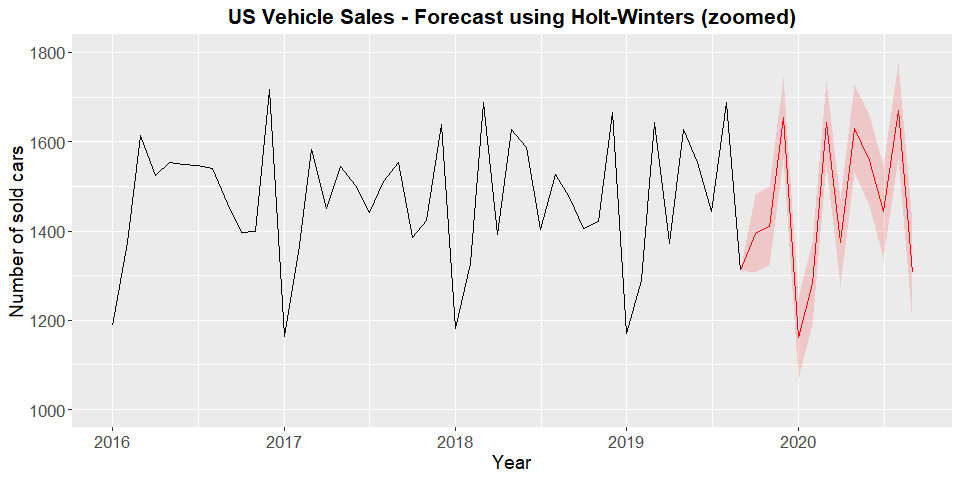

<style>
pre {
  font-size: 14px;
}
</style>
# Introduction
In this project I am going to forecast the number of vehicles sold in the US for the next 12 months. This forecast is based on the USVSales dataset, which is availaible by default in the R enviroment. 
This dataset is a monthly time series object starting in January 1976 and ending in september 2019.
In order to achieve the desired forecast I am going to compare various models (mainly Holt-Winters Model and SARIMA).

## **1. Loading the necessary libraries**

```r
library(forecast)
library(TSstudio)
library(plotly)
library(tidyverse)
library(TSstudio)
library(plotly)
library(stats)
library(forecast)
library(tidyverse)
library(dplyr)
library(ggplot2)
library(dygraphs)
library(lubridate)
library(datasets)
library(base)
library(h2o)
library(ggfortify)
library(knitr)
library(gridExtra)
library(formattable)
```

## **2. Loading the data into R**
As previously mentioned, this dataset is included in the R enviroment, so we simply have to use the data() command. After that we use the formattable function, to plot the time series in a table (here I am plotting the last ten observations of the dataset).


```r
data("USVSales")
formattable(ts_to_prophet(tail(USVSales, 10)), align = c("c", "c"), list("ds" = formatter(
              "span", style = ~ style(color = "grey",font.weight = "bold")), "y" = formatter("span", style = ~ style(color = "grey", font.weight = "bold"))))
```


<table class="table table-condensed">
 <thead>
  <tr>
   <th style="text-align:center;"> ds </th>
   <th style="text-align:center;"> y </th>
  </tr>
 </thead>
<tbody>
  <tr>
   <td style="text-align:center;"> <span style="color: grey; font-weight: bold">2018-12-01</span> </td>
   <td style="text-align:center;"> <span style="color: grey; font-weight: bold">1665.906</span> </td>
  </tr>
  <tr>
   <td style="text-align:center;"> <span style="color: grey; font-weight: bold">2019-01-01</span> </td>
   <td style="text-align:center;"> <span style="color: grey; font-weight: bold">1171.515</span> </td>
  </tr>
  <tr>
   <td style="text-align:center;"> <span style="color: grey; font-weight: bold">2019-02-01</span> </td>
   <td style="text-align:center;"> <span style="color: grey; font-weight: bold">1288.302</span> </td>
  </tr>
  <tr>
   <td style="text-align:center;"> <span style="color: grey; font-weight: bold">2019-03-01</span> </td>
   <td style="text-align:center;"> <span style="color: grey; font-weight: bold">1642.796</span> </td>
  </tr>
  <tr>
   <td style="text-align:center;"> <span style="color: grey; font-weight: bold">2019-04-01</span> </td>
   <td style="text-align:center;"> <span style="color: grey; font-weight: bold">1372.696</span> </td>
  </tr>
  <tr>
   <td style="text-align:center;"> <span style="color: grey; font-weight: bold">2019-05-01</span> </td>
   <td style="text-align:center;"> <span style="color: grey; font-weight: bold">1628.073</span> </td>
  </tr>
  <tr>
   <td style="text-align:center;"> <span style="color: grey; font-weight: bold">2019-06-01</span> </td>
   <td style="text-align:center;"> <span style="color: grey; font-weight: bold">1554.625</span> </td>
  </tr>
  <tr>
   <td style="text-align:center;"> <span style="color: grey; font-weight: bold">2019-07-01</span> </td>
   <td style="text-align:center;"> <span style="color: grey; font-weight: bold">1443.862</span> </td>
  </tr>
  <tr>
   <td style="text-align:center;"> <span style="color: grey; font-weight: bold">2019-08-01</span> </td>
   <td style="text-align:center;"> <span style="color: grey; font-weight: bold">1688.154</span> </td>
  </tr>
  <tr>
   <td style="text-align:center;"> <span style="color: grey; font-weight: bold">2019-09-01</span> </td>
   <td style="text-align:center;"> <span style="color: grey; font-weight: bold">1312.337</span> </td>
  </tr>
</tbody>
</table>

## **3. Exploratory data analysis**

```r
autoplot(USVSales, fill = "red") + ggtitle("US Monthly Vehicle Sales") +  theme(plot.title = element_text(hjust = 0.5, size = 16, face = "bold"), 
axis.text = element_text(size = 13), axis.title = element_text(size = 14)) + 
xlab("Year") + ylab("Number of sold cars") 
```


### **3.1 Filtering the most recent observations**

We can see that the model has a very clear seasonal component, as well as a non-linear trend, and various cycles.
Snce we want to forecast the following 12 months, it makes no sense to use all the dataset, since it may introduce noise into our model.
We filter the data of the last cycle (the actual cycle)


```r
USVSales10 <- window(USVSales, start = c(2010, 1), frequency = 12)
autoplot(USVSales10, fill = "red") + ggtitle("US Monthly Vehicle Sales (2010-2019)") +  theme(plot.title = element_text(hjust = 0.5, size = 16, face = "bold"), 
axis.text = element_text(size = 13), axis.title = element_text(size = 14)) + 
xlab("Year") + ylab("Number of sold cars") 
```


```r
decompose(USVSales10) %>% plot()
```


### **3.2 Exploratory analysis conclusions**

- It is an additive series
- We can appreciate the clearly monthly seasonality, and we can see that the model has trend (which doesn't seem linear).
- This trend has stabilized from 2016 until nowadays.


## 4 **Seasonality analysis**
In order to analyze the seasonal patterns in the data we create a dataframe with year and month columns in order to be able to create some ggplots.
Here we can see the last 10 observationsof the dataframe we have created.

```r
USVSales10_df <- ts_to_prophet(USVSales10)
USVSales10_df$year <- lubridate::year(USVSales10_df$ds)
USVSales10_df$month <- lubridate::month(USVSales10_df$ds)
formattable(tail(USVSales10_df, 10), align = c("c", "c", "c", "c"), list("ds" = formatter(
              "span", style = ~ style(color = "grey",font.weight = "bold")), 
              "y" = formatter("span", style = ~ style(color = "grey", font.weight = "bold")),
              "year" = formatter("span", style = ~ style(color = "grey", font.weight = "bold")),
              "month" = formatter("span", style = ~ style(color = "grey", font.weight = "bold"))))
```


<table class="table table-condensed">
 <thead>
  <tr>
   <th style="text-align:left;">   </th>
   <th style="text-align:center;"> ds </th>
   <th style="text-align:center;"> y </th>
   <th style="text-align:center;"> year </th>
   <th style="text-align:center;"> month </th>
  </tr>
 </thead>
<tbody>
  <tr>
   <td style="text-align:left;"> 108 </td>
   <td style="text-align:center;"> <span style="color: grey; font-weight: bold">2018-12-01</span> </td>
   <td style="text-align:center;"> <span style="color: grey; font-weight: bold">1665.906</span> </td>
   <td style="text-align:center;"> <span style="color: grey; font-weight: bold">2018</span> </td>
   <td style="text-align:center;"> <span style="color: grey; font-weight: bold">12</span> </td>
  </tr>
  <tr>
   <td style="text-align:left;"> 109 </td>
   <td style="text-align:center;"> <span style="color: grey; font-weight: bold">2019-01-01</span> </td>
   <td style="text-align:center;"> <span style="color: grey; font-weight: bold">1171.515</span> </td>
   <td style="text-align:center;"> <span style="color: grey; font-weight: bold">2019</span> </td>
   <td style="text-align:center;"> <span style="color: grey; font-weight: bold">1</span> </td>
  </tr>
  <tr>
   <td style="text-align:left;"> 110 </td>
   <td style="text-align:center;"> <span style="color: grey; font-weight: bold">2019-02-01</span> </td>
   <td style="text-align:center;"> <span style="color: grey; font-weight: bold">1288.302</span> </td>
   <td style="text-align:center;"> <span style="color: grey; font-weight: bold">2019</span> </td>
   <td style="text-align:center;"> <span style="color: grey; font-weight: bold">2</span> </td>
  </tr>
  <tr>
   <td style="text-align:left;"> 111 </td>
   <td style="text-align:center;"> <span style="color: grey; font-weight: bold">2019-03-01</span> </td>
   <td style="text-align:center;"> <span style="color: grey; font-weight: bold">1642.796</span> </td>
   <td style="text-align:center;"> <span style="color: grey; font-weight: bold">2019</span> </td>
   <td style="text-align:center;"> <span style="color: grey; font-weight: bold">3</span> </td>
  </tr>
  <tr>
   <td style="text-align:left;"> 112 </td>
   <td style="text-align:center;"> <span style="color: grey; font-weight: bold">2019-04-01</span> </td>
   <td style="text-align:center;"> <span style="color: grey; font-weight: bold">1372.696</span> </td>
   <td style="text-align:center;"> <span style="color: grey; font-weight: bold">2019</span> </td>
   <td style="text-align:center;"> <span style="color: grey; font-weight: bold">4</span> </td>
  </tr>
  <tr>
   <td style="text-align:left;"> 113 </td>
   <td style="text-align:center;"> <span style="color: grey; font-weight: bold">2019-05-01</span> </td>
   <td style="text-align:center;"> <span style="color: grey; font-weight: bold">1628.073</span> </td>
   <td style="text-align:center;"> <span style="color: grey; font-weight: bold">2019</span> </td>
   <td style="text-align:center;"> <span style="color: grey; font-weight: bold">5</span> </td>
  </tr>
  <tr>
   <td style="text-align:left;"> 114 </td>
   <td style="text-align:center;"> <span style="color: grey; font-weight: bold">2019-06-01</span> </td>
   <td style="text-align:center;"> <span style="color: grey; font-weight: bold">1554.625</span> </td>
   <td style="text-align:center;"> <span style="color: grey; font-weight: bold">2019</span> </td>
   <td style="text-align:center;"> <span style="color: grey; font-weight: bold">6</span> </td>
  </tr>
  <tr>
   <td style="text-align:left;"> 115 </td>
   <td style="text-align:center;"> <span style="color: grey; font-weight: bold">2019-07-01</span> </td>
   <td style="text-align:center;"> <span style="color: grey; font-weight: bold">1443.862</span> </td>
   <td style="text-align:center;"> <span style="color: grey; font-weight: bold">2019</span> </td>
   <td style="text-align:center;"> <span style="color: grey; font-weight: bold">7</span> </td>
  </tr>
  <tr>
   <td style="text-align:left;"> 116 </td>
   <td style="text-align:center;"> <span style="color: grey; font-weight: bold">2019-08-01</span> </td>
   <td style="text-align:center;"> <span style="color: grey; font-weight: bold">1688.154</span> </td>
   <td style="text-align:center;"> <span style="color: grey; font-weight: bold">2019</span> </td>
   <td style="text-align:center;"> <span style="color: grey; font-weight: bold">8</span> </td>
  </tr>
  <tr>
   <td style="text-align:left;"> 117 </td>
   <td style="text-align:center;"> <span style="color: grey; font-weight: bold">2019-09-01</span> </td>
   <td style="text-align:center;"> <span style="color: grey; font-weight: bold">1312.337</span> </td>
   <td style="text-align:center;"> <span style="color: grey; font-weight: bold">2019</span> </td>
   <td style="text-align:center;"> <span style="color: grey; font-weight: bold">9</span> </td>
  </tr>
</tbody>
</table>

### **4.1 Visualizing yearly density plots**

```r
ggplot(data = USVSales10_df, aes(x = y)) + geom_density(data = USVSales10_df, aes(fill = as.factor(year))) + 
        facet_grid(year~.) + labs(fill = "Year") + ggtitle("US Vehicle Sales density plots - by year") + 
        theme(plot.title = element_text(hjust = 0.5, size = 16, face = "bold"), 
        axis.text = element_text(size = 13), axis.title = element_text(size = 14))
```


We can observe that there is a clear trend, the number of cars sold has increased between 2010 and 2012, and seems to have stabilized between 2013 and 2019.

### **4.2 Visualizing monthly density plots**

```r
ggplot(data = USVSales10_df, aes(x = y)) + geom_density(data = USVSales10_df, aes(fill = as.factor(month))) + 
        facet_grid(month~.) + labs(fill = "Month (number)") + ggtitle("US Vehicle Sales Density plots - by month") +
        theme(plot.title = element_text(hjust = 0.5, size = 16, face = "bold"), 
        axis.text = element_text(size = 13), axis.title = element_text(size = 14))
```


Apparently we can't derive a lot of insights from this plot, because it is very affected by the trend, and therefore it's not showing the real seasonal pattern.
We **detrend** the series and plot again the same chart, in order to visualize the real pattern.


```r
USVSales10_detrended <- USVSales10 - decompose(USVSales10)$trend
USVSales10_detrended_df <- ts_to_prophet(USVSales10_detrended)
USVSales10_detrended_df$year <- lubridate::year(USVSales10_detrended_df$ds)
USVSales10_detrended_df$month <- lubridate::month(USVSales10_detrended_df$ds)
USVSales10_detrended_df <- USVSales10_detrended_df %>% filter(!is.na(y))
ggplot(data = USVSales10_detrended_df, aes(x = y)) + geom_density(data = USVSales10_detrended_df, aes(fill = as.factor(month))) + 
        facet_grid(month~.) + labs(fill = "Month (number)") + ggtitle("US Vehicle Sales Density plots - by Year (Detrended series)") +
        theme(plot.title = element_text(hjust = 0.5, size = 16, face = "bold"), 
        axis.text = element_text(size = 13), axis.title = element_text(size = 14))
```


We can see there's some monthly seasonality: sales increase between January and March and then decrease between April and November. Finally there's another increase in December.

### **4.3 Monthly seasonality visualization using box plots**

```r
ggplot(data = USVSales10_detrended_df, aes(x = as.factor(month), y = y)) + 
       geom_jitter(aes(x = as.factor(month), y = y, colour = as.factor(month)), 
                     size = 2) + 
        geom_boxplot(aes(fill = as.factor(month)), alpha = 0.5) + 
        ggtitle("Number of Sold Vehicles - Boxplot") + 
        theme(plot.title = element_text(hjust = 0.5, size = 16, face = "bold"), 
        axis.text = element_text(size = 13), axis.title = element_text(size = 14),
        legend.position = "none") + 
        xlab("Month (number)") + ylab("Number of sold vehicles") 
```


### **4.4 Seasonality conclusions**
- There is a clear monthly seasonal component: sales increase between January and March and then decrease between April and November. Finally there's another increase in December.


## **5. Correlation analysis**
Now we are going to analyze the correlation of the series with its previous lags.


```r
par(mfrow = c(1,2))
acf(USVSales10, lag.max = 60)
pacf(USVSales10, lag.max = 60)
```


- There is a very notorious linear decay in the autocorrelation function chart, indicating that the series is not stationary (due to its trend), so if we use an ARIMA model we will have to differenciate.
- There is a lot of correlation with the first non-seasonal lag and the first seasonal lag.


```r
ts_lags(USVSales10)
```

<!--html_preserve--><div id="htmlwidget-9c60d5ecff2c43da3084" style="width:960px;height:576px;" class="plotly html-widget"></div>
<script type="application/json" data-for="htmlwidget-9c60d5ecff2c43da3084">{"x":{"data":[{"x":[712.469,793.362,1083.953,997.334,1117.57,1000.455,1065.748,1011.564,973.954,965.135,888.085,1162.897,836.366,1007.082,1276.843,1173.52,1081.272,1071.229,1086.064,1094.479,1076.037,1048.258,1028.774,1268.462,938.17,1175.82,1434.004,1204.471,1369.493,1310.158,1171.809,1305.342,1206.182,1119.148,1169.803,1375.084,1065.798,1217.858,1479.427,1313.768,1473.275,1425.802,1335.833,1527.483,1152.814,1235.532,1271.446,1383.676,1043.019,1221.37,1562.748,1408.232,1644.367,1451.814,1473.962,1607.315,1272.036,1312.329,1324.117,1538.534,1177.91,1285.147,1579.627,1479.335,1668.452,1518.66,1546.818,1598.265,1474.925,1486.42,1358.777,1671.288,1188.775,1374.272,1614.069,1524.1,1552.659,1548.86,1546.818,1539.79,1462.065,1397.057,1399.375,1717.933,1164.323,1352.076,1582.674,1449.717,1543.862,1502.804,1441.011,1512.07,1553.133,1385.649,1424.527,1639.555,1181.715,1328.14,1687.609,1391.226,1626.484,1586.664,1403.118,1527.416,1474.997,1405.908,1422.219,1665.906,1171.515,1288.302,1642.796,1372.696,1628.073,1554.625,1443.862,1688.154],"y":[793.362,1083.953,997.334,1117.57,1000.455,1065.748,1011.564,973.954,965.135,888.085,1162.897,836.366,1007.082,1276.843,1173.52,1081.272,1071.229,1086.064,1094.479,1076.037,1048.258,1028.774,1268.462,938.17,1175.82,1434.004,1204.471,1369.493,1310.158,1171.809,1305.342,1206.182,1119.148,1169.803,1375.084,1065.798,1217.858,1479.427,1313.768,1473.275,1425.802,1335.833,1527.483,1152.814,1235.532,1271.446,1383.676,1043.019,1221.37,1562.748,1408.232,1644.367,1451.814,1473.962,1607.315,1272.036,1312.329,1324.117,1538.534,1177.91,1285.147,1579.627,1479.335,1668.452,1518.66,1546.818,1598.265,1474.925,1486.42,1358.777,1671.288,1188.775,1374.272,1614.069,1524.1,1552.659,1548.86,1546.818,1539.79,1462.065,1397.057,1399.375,1717.933,1164.323,1352.076,1582.674,1449.717,1543.862,1502.804,1441.011,1512.07,1553.133,1385.649,1424.527,1639.555,1181.715,1328.14,1687.609,1391.226,1626.484,1586.664,1403.118,1527.416,1474.997,1405.908,1422.219,1665.906,1171.515,1288.302,1642.796,1372.696,1628.073,1554.625,1443.862,1688.154,1312.337],"mode":"markers","type":"scatter","marker":{"color":"rgba(31,119,180,1)","line":{"color":"rgba(31,119,180,1)"}},"error_y":{"color":"rgba(31,119,180,1)"},"error_x":{"color":"rgba(31,119,180,1)"},"line":{"color":"rgba(31,119,180,1)"},"xaxis":"x","yaxis":"y","frame":null},{"x":[712.469,793.362,1083.953,997.334,1117.57,1000.455,1065.748,1011.564,973.954,965.135,888.085,1162.897,836.366,1007.082,1276.843,1173.52,1081.272,1071.229,1086.064,1094.479,1076.037,1048.258,1028.774,1268.462,938.17,1175.82,1434.004,1204.471,1369.493,1310.158,1171.809,1305.342,1206.182,1119.148,1169.803,1375.084,1065.798,1217.858,1479.427,1313.768,1473.275,1425.802,1335.833,1527.483,1152.814,1235.532,1271.446,1383.676,1043.019,1221.37,1562.748,1408.232,1644.367,1451.814,1473.962,1607.315,1272.036,1312.329,1324.117,1538.534,1177.91,1285.147,1579.627,1479.335,1668.452,1518.66,1546.818,1598.265,1474.925,1486.42,1358.777,1671.288,1188.775,1374.272,1614.069,1524.1,1552.659,1548.86,1546.818,1539.79,1462.065,1397.057,1399.375,1717.933,1164.323,1352.076,1582.674,1449.717,1543.862,1502.804,1441.011,1512.07,1553.133,1385.649,1424.527,1639.555,1181.715,1328.14,1687.609,1391.226,1626.484,1586.664,1403.118,1527.416,1474.997,1405.908,1422.219,1665.906,1171.515,1288.302,1642.796,1372.696,1628.073,1554.625,1443.862],"y":[1083.953,997.334,1117.57,1000.455,1065.748,1011.564,973.954,965.135,888.085,1162.897,836.366,1007.082,1276.843,1173.52,1081.272,1071.229,1086.064,1094.479,1076.037,1048.258,1028.774,1268.462,938.17,1175.82,1434.004,1204.471,1369.493,1310.158,1171.809,1305.342,1206.182,1119.148,1169.803,1375.084,1065.798,1217.858,1479.427,1313.768,1473.275,1425.802,1335.833,1527.483,1152.814,1235.532,1271.446,1383.676,1043.019,1221.37,1562.748,1408.232,1644.367,1451.814,1473.962,1607.315,1272.036,1312.329,1324.117,1538.534,1177.91,1285.147,1579.627,1479.335,1668.452,1518.66,1546.818,1598.265,1474.925,1486.42,1358.777,1671.288,1188.775,1374.272,1614.069,1524.1,1552.659,1548.86,1546.818,1539.79,1462.065,1397.057,1399.375,1717.933,1164.323,1352.076,1582.674,1449.717,1543.862,1502.804,1441.011,1512.07,1553.133,1385.649,1424.527,1639.555,1181.715,1328.14,1687.609,1391.226,1626.484,1586.664,1403.118,1527.416,1474.997,1405.908,1422.219,1665.906,1171.515,1288.302,1642.796,1372.696,1628.073,1554.625,1443.862,1688.154,1312.337],"mode":"markers","type":"scatter","marker":{"color":"rgba(255,127,14,1)","line":{"color":"rgba(255,127,14,1)"}},"error_y":{"color":"rgba(255,127,14,1)"},"error_x":{"color":"rgba(255,127,14,1)"},"line":{"color":"rgba(255,127,14,1)"},"xaxis":"x2","yaxis":"y","frame":null},{"x":[712.469,793.362,1083.953,997.334,1117.57,1000.455,1065.748,1011.564,973.954,965.135,888.085,1162.897,836.366,1007.082,1276.843,1173.52,1081.272,1071.229,1086.064,1094.479,1076.037,1048.258,1028.774,1268.462,938.17,1175.82,1434.004,1204.471,1369.493,1310.158,1171.809,1305.342,1206.182,1119.148,1169.803,1375.084,1065.798,1217.858,1479.427,1313.768,1473.275,1425.802,1335.833,1527.483,1152.814,1235.532,1271.446,1383.676,1043.019,1221.37,1562.748,1408.232,1644.367,1451.814,1473.962,1607.315,1272.036,1312.329,1324.117,1538.534,1177.91,1285.147,1579.627,1479.335,1668.452,1518.66,1546.818,1598.265,1474.925,1486.42,1358.777,1671.288,1188.775,1374.272,1614.069,1524.1,1552.659,1548.86,1546.818,1539.79,1462.065,1397.057,1399.375,1717.933,1164.323,1352.076,1582.674,1449.717,1543.862,1502.804,1441.011,1512.07,1553.133,1385.649,1424.527,1639.555,1181.715,1328.14,1687.609,1391.226,1626.484,1586.664,1403.118,1527.416,1474.997,1405.908,1422.219,1665.906,1171.515,1288.302,1642.796,1372.696,1628.073,1554.625],"y":[997.334,1117.57,1000.455,1065.748,1011.564,973.954,965.135,888.085,1162.897,836.366,1007.082,1276.843,1173.52,1081.272,1071.229,1086.064,1094.479,1076.037,1048.258,1028.774,1268.462,938.17,1175.82,1434.004,1204.471,1369.493,1310.158,1171.809,1305.342,1206.182,1119.148,1169.803,1375.084,1065.798,1217.858,1479.427,1313.768,1473.275,1425.802,1335.833,1527.483,1152.814,1235.532,1271.446,1383.676,1043.019,1221.37,1562.748,1408.232,1644.367,1451.814,1473.962,1607.315,1272.036,1312.329,1324.117,1538.534,1177.91,1285.147,1579.627,1479.335,1668.452,1518.66,1546.818,1598.265,1474.925,1486.42,1358.777,1671.288,1188.775,1374.272,1614.069,1524.1,1552.659,1548.86,1546.818,1539.79,1462.065,1397.057,1399.375,1717.933,1164.323,1352.076,1582.674,1449.717,1543.862,1502.804,1441.011,1512.07,1553.133,1385.649,1424.527,1639.555,1181.715,1328.14,1687.609,1391.226,1626.484,1586.664,1403.118,1527.416,1474.997,1405.908,1422.219,1665.906,1171.515,1288.302,1642.796,1372.696,1628.073,1554.625,1443.862,1688.154,1312.337],"mode":"markers","type":"scatter","marker":{"color":"rgba(44,160,44,1)","line":{"color":"rgba(44,160,44,1)"}},"error_y":{"color":"rgba(44,160,44,1)"},"error_x":{"color":"rgba(44,160,44,1)"},"line":{"color":"rgba(44,160,44,1)"},"xaxis":"x3","yaxis":"y","frame":null},{"x":[712.469,793.362,1083.953,997.334,1117.57,1000.455,1065.748,1011.564,973.954,965.135,888.085,1162.897,836.366,1007.082,1276.843,1173.52,1081.272,1071.229,1086.064,1094.479,1076.037,1048.258,1028.774,1268.462,938.17,1175.82,1434.004,1204.471,1369.493,1310.158,1171.809,1305.342,1206.182,1119.148,1169.803,1375.084,1065.798,1217.858,1479.427,1313.768,1473.275,1425.802,1335.833,1527.483,1152.814,1235.532,1271.446,1383.676,1043.019,1221.37,1562.748,1408.232,1644.367,1451.814,1473.962,1607.315,1272.036,1312.329,1324.117,1538.534,1177.91,1285.147,1579.627,1479.335,1668.452,1518.66,1546.818,1598.265,1474.925,1486.42,1358.777,1671.288,1188.775,1374.272,1614.069,1524.1,1552.659,1548.86,1546.818,1539.79,1462.065,1397.057,1399.375,1717.933,1164.323,1352.076,1582.674,1449.717,1543.862,1502.804,1441.011,1512.07,1553.133,1385.649,1424.527,1639.555,1181.715,1328.14,1687.609,1391.226,1626.484,1586.664,1403.118,1527.416,1474.997,1405.908,1422.219,1665.906,1171.515,1288.302,1642.796,1372.696,1628.073],"y":[1117.57,1000.455,1065.748,1011.564,973.954,965.135,888.085,1162.897,836.366,1007.082,1276.843,1173.52,1081.272,1071.229,1086.064,1094.479,1076.037,1048.258,1028.774,1268.462,938.17,1175.82,1434.004,1204.471,1369.493,1310.158,1171.809,1305.342,1206.182,1119.148,1169.803,1375.084,1065.798,1217.858,1479.427,1313.768,1473.275,1425.802,1335.833,1527.483,1152.814,1235.532,1271.446,1383.676,1043.019,1221.37,1562.748,1408.232,1644.367,1451.814,1473.962,1607.315,1272.036,1312.329,1324.117,1538.534,1177.91,1285.147,1579.627,1479.335,1668.452,1518.66,1546.818,1598.265,1474.925,1486.42,1358.777,1671.288,1188.775,1374.272,1614.069,1524.1,1552.659,1548.86,1546.818,1539.79,1462.065,1397.057,1399.375,1717.933,1164.323,1352.076,1582.674,1449.717,1543.862,1502.804,1441.011,1512.07,1553.133,1385.649,1424.527,1639.555,1181.715,1328.14,1687.609,1391.226,1626.484,1586.664,1403.118,1527.416,1474.997,1405.908,1422.219,1665.906,1171.515,1288.302,1642.796,1372.696,1628.073,1554.625,1443.862,1688.154,1312.337],"mode":"markers","type":"scatter","marker":{"color":"rgba(214,39,40,1)","line":{"color":"rgba(214,39,40,1)"}},"error_y":{"color":"rgba(214,39,40,1)"},"error_x":{"color":"rgba(214,39,40,1)"},"line":{"color":"rgba(214,39,40,1)"},"xaxis":"x","yaxis":"y2","frame":null},{"x":[712.469,793.362,1083.953,997.334,1117.57,1000.455,1065.748,1011.564,973.954,965.135,888.085,1162.897,836.366,1007.082,1276.843,1173.52,1081.272,1071.229,1086.064,1094.479,1076.037,1048.258,1028.774,1268.462,938.17,1175.82,1434.004,1204.471,1369.493,1310.158,1171.809,1305.342,1206.182,1119.148,1169.803,1375.084,1065.798,1217.858,1479.427,1313.768,1473.275,1425.802,1335.833,1527.483,1152.814,1235.532,1271.446,1383.676,1043.019,1221.37,1562.748,1408.232,1644.367,1451.814,1473.962,1607.315,1272.036,1312.329,1324.117,1538.534,1177.91,1285.147,1579.627,1479.335,1668.452,1518.66,1546.818,1598.265,1474.925,1486.42,1358.777,1671.288,1188.775,1374.272,1614.069,1524.1,1552.659,1548.86,1546.818,1539.79,1462.065,1397.057,1399.375,1717.933,1164.323,1352.076,1582.674,1449.717,1543.862,1502.804,1441.011,1512.07,1553.133,1385.649,1424.527,1639.555,1181.715,1328.14,1687.609,1391.226,1626.484,1586.664,1403.118,1527.416,1474.997,1405.908,1422.219,1665.906,1171.515,1288.302,1642.796,1372.696],"y":[1000.455,1065.748,1011.564,973.954,965.135,888.085,1162.897,836.366,1007.082,1276.843,1173.52,1081.272,1071.229,1086.064,1094.479,1076.037,1048.258,1028.774,1268.462,938.17,1175.82,1434.004,1204.471,1369.493,1310.158,1171.809,1305.342,1206.182,1119.148,1169.803,1375.084,1065.798,1217.858,1479.427,1313.768,1473.275,1425.802,1335.833,1527.483,1152.814,1235.532,1271.446,1383.676,1043.019,1221.37,1562.748,1408.232,1644.367,1451.814,1473.962,1607.315,1272.036,1312.329,1324.117,1538.534,1177.91,1285.147,1579.627,1479.335,1668.452,1518.66,1546.818,1598.265,1474.925,1486.42,1358.777,1671.288,1188.775,1374.272,1614.069,1524.1,1552.659,1548.86,1546.818,1539.79,1462.065,1397.057,1399.375,1717.933,1164.323,1352.076,1582.674,1449.717,1543.862,1502.804,1441.011,1512.07,1553.133,1385.649,1424.527,1639.555,1181.715,1328.14,1687.609,1391.226,1626.484,1586.664,1403.118,1527.416,1474.997,1405.908,1422.219,1665.906,1171.515,1288.302,1642.796,1372.696,1628.073,1554.625,1443.862,1688.154,1312.337],"mode":"markers","type":"scatter","marker":{"color":"rgba(148,103,189,1)","line":{"color":"rgba(148,103,189,1)"}},"error_y":{"color":"rgba(148,103,189,1)"},"error_x":{"color":"rgba(148,103,189,1)"},"line":{"color":"rgba(148,103,189,1)"},"xaxis":"x2","yaxis":"y2","frame":null},{"x":[712.469,793.362,1083.953,997.334,1117.57,1000.455,1065.748,1011.564,973.954,965.135,888.085,1162.897,836.366,1007.082,1276.843,1173.52,1081.272,1071.229,1086.064,1094.479,1076.037,1048.258,1028.774,1268.462,938.17,1175.82,1434.004,1204.471,1369.493,1310.158,1171.809,1305.342,1206.182,1119.148,1169.803,1375.084,1065.798,1217.858,1479.427,1313.768,1473.275,1425.802,1335.833,1527.483,1152.814,1235.532,1271.446,1383.676,1043.019,1221.37,1562.748,1408.232,1644.367,1451.814,1473.962,1607.315,1272.036,1312.329,1324.117,1538.534,1177.91,1285.147,1579.627,1479.335,1668.452,1518.66,1546.818,1598.265,1474.925,1486.42,1358.777,1671.288,1188.775,1374.272,1614.069,1524.1,1552.659,1548.86,1546.818,1539.79,1462.065,1397.057,1399.375,1717.933,1164.323,1352.076,1582.674,1449.717,1543.862,1502.804,1441.011,1512.07,1553.133,1385.649,1424.527,1639.555,1181.715,1328.14,1687.609,1391.226,1626.484,1586.664,1403.118,1527.416,1474.997,1405.908,1422.219,1665.906,1171.515,1288.302,1642.796],"y":[1065.748,1011.564,973.954,965.135,888.085,1162.897,836.366,1007.082,1276.843,1173.52,1081.272,1071.229,1086.064,1094.479,1076.037,1048.258,1028.774,1268.462,938.17,1175.82,1434.004,1204.471,1369.493,1310.158,1171.809,1305.342,1206.182,1119.148,1169.803,1375.084,1065.798,1217.858,1479.427,1313.768,1473.275,1425.802,1335.833,1527.483,1152.814,1235.532,1271.446,1383.676,1043.019,1221.37,1562.748,1408.232,1644.367,1451.814,1473.962,1607.315,1272.036,1312.329,1324.117,1538.534,1177.91,1285.147,1579.627,1479.335,1668.452,1518.66,1546.818,1598.265,1474.925,1486.42,1358.777,1671.288,1188.775,1374.272,1614.069,1524.1,1552.659,1548.86,1546.818,1539.79,1462.065,1397.057,1399.375,1717.933,1164.323,1352.076,1582.674,1449.717,1543.862,1502.804,1441.011,1512.07,1553.133,1385.649,1424.527,1639.555,1181.715,1328.14,1687.609,1391.226,1626.484,1586.664,1403.118,1527.416,1474.997,1405.908,1422.219,1665.906,1171.515,1288.302,1642.796,1372.696,1628.073,1554.625,1443.862,1688.154,1312.337],"mode":"markers","type":"scatter","marker":{"color":"rgba(140,86,75,1)","line":{"color":"rgba(140,86,75,1)"}},"error_y":{"color":"rgba(140,86,75,1)"},"error_x":{"color":"rgba(140,86,75,1)"},"line":{"color":"rgba(140,86,75,1)"},"xaxis":"x3","yaxis":"y2","frame":null},{"x":[712.469,793.362,1083.953,997.334,1117.57,1000.455,1065.748,1011.564,973.954,965.135,888.085,1162.897,836.366,1007.082,1276.843,1173.52,1081.272,1071.229,1086.064,1094.479,1076.037,1048.258,1028.774,1268.462,938.17,1175.82,1434.004,1204.471,1369.493,1310.158,1171.809,1305.342,1206.182,1119.148,1169.803,1375.084,1065.798,1217.858,1479.427,1313.768,1473.275,1425.802,1335.833,1527.483,1152.814,1235.532,1271.446,1383.676,1043.019,1221.37,1562.748,1408.232,1644.367,1451.814,1473.962,1607.315,1272.036,1312.329,1324.117,1538.534,1177.91,1285.147,1579.627,1479.335,1668.452,1518.66,1546.818,1598.265,1474.925,1486.42,1358.777,1671.288,1188.775,1374.272,1614.069,1524.1,1552.659,1548.86,1546.818,1539.79,1462.065,1397.057,1399.375,1717.933,1164.323,1352.076,1582.674,1449.717,1543.862,1502.804,1441.011,1512.07,1553.133,1385.649,1424.527,1639.555,1181.715,1328.14,1687.609,1391.226,1626.484,1586.664,1403.118,1527.416,1474.997,1405.908,1422.219,1665.906,1171.515,1288.302],"y":[1011.564,973.954,965.135,888.085,1162.897,836.366,1007.082,1276.843,1173.52,1081.272,1071.229,1086.064,1094.479,1076.037,1048.258,1028.774,1268.462,938.17,1175.82,1434.004,1204.471,1369.493,1310.158,1171.809,1305.342,1206.182,1119.148,1169.803,1375.084,1065.798,1217.858,1479.427,1313.768,1473.275,1425.802,1335.833,1527.483,1152.814,1235.532,1271.446,1383.676,1043.019,1221.37,1562.748,1408.232,1644.367,1451.814,1473.962,1607.315,1272.036,1312.329,1324.117,1538.534,1177.91,1285.147,1579.627,1479.335,1668.452,1518.66,1546.818,1598.265,1474.925,1486.42,1358.777,1671.288,1188.775,1374.272,1614.069,1524.1,1552.659,1548.86,1546.818,1539.79,1462.065,1397.057,1399.375,1717.933,1164.323,1352.076,1582.674,1449.717,1543.862,1502.804,1441.011,1512.07,1553.133,1385.649,1424.527,1639.555,1181.715,1328.14,1687.609,1391.226,1626.484,1586.664,1403.118,1527.416,1474.997,1405.908,1422.219,1665.906,1171.515,1288.302,1642.796,1372.696,1628.073,1554.625,1443.862,1688.154,1312.337],"mode":"markers","type":"scatter","marker":{"color":"rgba(227,119,194,1)","line":{"color":"rgba(227,119,194,1)"}},"error_y":{"color":"rgba(227,119,194,1)"},"error_x":{"color":"rgba(227,119,194,1)"},"line":{"color":"rgba(227,119,194,1)"},"xaxis":"x","yaxis":"y3","frame":null},{"x":[712.469,793.362,1083.953,997.334,1117.57,1000.455,1065.748,1011.564,973.954,965.135,888.085,1162.897,836.366,1007.082,1276.843,1173.52,1081.272,1071.229,1086.064,1094.479,1076.037,1048.258,1028.774,1268.462,938.17,1175.82,1434.004,1204.471,1369.493,1310.158,1171.809,1305.342,1206.182,1119.148,1169.803,1375.084,1065.798,1217.858,1479.427,1313.768,1473.275,1425.802,1335.833,1527.483,1152.814,1235.532,1271.446,1383.676,1043.019,1221.37,1562.748,1408.232,1644.367,1451.814,1473.962,1607.315,1272.036,1312.329,1324.117,1538.534,1177.91,1285.147,1579.627,1479.335,1668.452,1518.66,1546.818,1598.265,1474.925,1486.42,1358.777,1671.288,1188.775,1374.272,1614.069,1524.1,1552.659,1548.86,1546.818,1539.79,1462.065,1397.057,1399.375,1717.933,1164.323,1352.076,1582.674,1449.717,1543.862,1502.804,1441.011,1512.07,1553.133,1385.649,1424.527,1639.555,1181.715,1328.14,1687.609,1391.226,1626.484,1586.664,1403.118,1527.416,1474.997,1405.908,1422.219,1665.906,1171.515],"y":[973.954,965.135,888.085,1162.897,836.366,1007.082,1276.843,1173.52,1081.272,1071.229,1086.064,1094.479,1076.037,1048.258,1028.774,1268.462,938.17,1175.82,1434.004,1204.471,1369.493,1310.158,1171.809,1305.342,1206.182,1119.148,1169.803,1375.084,1065.798,1217.858,1479.427,1313.768,1473.275,1425.802,1335.833,1527.483,1152.814,1235.532,1271.446,1383.676,1043.019,1221.37,1562.748,1408.232,1644.367,1451.814,1473.962,1607.315,1272.036,1312.329,1324.117,1538.534,1177.91,1285.147,1579.627,1479.335,1668.452,1518.66,1546.818,1598.265,1474.925,1486.42,1358.777,1671.288,1188.775,1374.272,1614.069,1524.1,1552.659,1548.86,1546.818,1539.79,1462.065,1397.057,1399.375,1717.933,1164.323,1352.076,1582.674,1449.717,1543.862,1502.804,1441.011,1512.07,1553.133,1385.649,1424.527,1639.555,1181.715,1328.14,1687.609,1391.226,1626.484,1586.664,1403.118,1527.416,1474.997,1405.908,1422.219,1665.906,1171.515,1288.302,1642.796,1372.696,1628.073,1554.625,1443.862,1688.154,1312.337],"mode":"markers","type":"scatter","marker":{"color":"rgba(127,127,127,1)","line":{"color":"rgba(127,127,127,1)"}},"error_y":{"color":"rgba(127,127,127,1)"},"error_x":{"color":"rgba(127,127,127,1)"},"line":{"color":"rgba(127,127,127,1)"},"xaxis":"x2","yaxis":"y3","frame":null},{"x":[712.469,793.362,1083.953,997.334,1117.57,1000.455,1065.748,1011.564,973.954,965.135,888.085,1162.897,836.366,1007.082,1276.843,1173.52,1081.272,1071.229,1086.064,1094.479,1076.037,1048.258,1028.774,1268.462,938.17,1175.82,1434.004,1204.471,1369.493,1310.158,1171.809,1305.342,1206.182,1119.148,1169.803,1375.084,1065.798,1217.858,1479.427,1313.768,1473.275,1425.802,1335.833,1527.483,1152.814,1235.532,1271.446,1383.676,1043.019,1221.37,1562.748,1408.232,1644.367,1451.814,1473.962,1607.315,1272.036,1312.329,1324.117,1538.534,1177.91,1285.147,1579.627,1479.335,1668.452,1518.66,1546.818,1598.265,1474.925,1486.42,1358.777,1671.288,1188.775,1374.272,1614.069,1524.1,1552.659,1548.86,1546.818,1539.79,1462.065,1397.057,1399.375,1717.933,1164.323,1352.076,1582.674,1449.717,1543.862,1502.804,1441.011,1512.07,1553.133,1385.649,1424.527,1639.555,1181.715,1328.14,1687.609,1391.226,1626.484,1586.664,1403.118,1527.416,1474.997,1405.908,1422.219,1665.906],"y":[965.135,888.085,1162.897,836.366,1007.082,1276.843,1173.52,1081.272,1071.229,1086.064,1094.479,1076.037,1048.258,1028.774,1268.462,938.17,1175.82,1434.004,1204.471,1369.493,1310.158,1171.809,1305.342,1206.182,1119.148,1169.803,1375.084,1065.798,1217.858,1479.427,1313.768,1473.275,1425.802,1335.833,1527.483,1152.814,1235.532,1271.446,1383.676,1043.019,1221.37,1562.748,1408.232,1644.367,1451.814,1473.962,1607.315,1272.036,1312.329,1324.117,1538.534,1177.91,1285.147,1579.627,1479.335,1668.452,1518.66,1546.818,1598.265,1474.925,1486.42,1358.777,1671.288,1188.775,1374.272,1614.069,1524.1,1552.659,1548.86,1546.818,1539.79,1462.065,1397.057,1399.375,1717.933,1164.323,1352.076,1582.674,1449.717,1543.862,1502.804,1441.011,1512.07,1553.133,1385.649,1424.527,1639.555,1181.715,1328.14,1687.609,1391.226,1626.484,1586.664,1403.118,1527.416,1474.997,1405.908,1422.219,1665.906,1171.515,1288.302,1642.796,1372.696,1628.073,1554.625,1443.862,1688.154,1312.337],"mode":"markers","type":"scatter","marker":{"color":"rgba(188,189,34,1)","line":{"color":"rgba(188,189,34,1)"}},"error_y":{"color":"rgba(188,189,34,1)"},"error_x":{"color":"rgba(188,189,34,1)"},"line":{"color":"rgba(188,189,34,1)"},"xaxis":"x3","yaxis":"y3","frame":null},{"x":[712.469,793.362,1083.953,997.334,1117.57,1000.455,1065.748,1011.564,973.954,965.135,888.085,1162.897,836.366,1007.082,1276.843,1173.52,1081.272,1071.229,1086.064,1094.479,1076.037,1048.258,1028.774,1268.462,938.17,1175.82,1434.004,1204.471,1369.493,1310.158,1171.809,1305.342,1206.182,1119.148,1169.803,1375.084,1065.798,1217.858,1479.427,1313.768,1473.275,1425.802,1335.833,1527.483,1152.814,1235.532,1271.446,1383.676,1043.019,1221.37,1562.748,1408.232,1644.367,1451.814,1473.962,1607.315,1272.036,1312.329,1324.117,1538.534,1177.91,1285.147,1579.627,1479.335,1668.452,1518.66,1546.818,1598.265,1474.925,1486.42,1358.777,1671.288,1188.775,1374.272,1614.069,1524.1,1552.659,1548.86,1546.818,1539.79,1462.065,1397.057,1399.375,1717.933,1164.323,1352.076,1582.674,1449.717,1543.862,1502.804,1441.011,1512.07,1553.133,1385.649,1424.527,1639.555,1181.715,1328.14,1687.609,1391.226,1626.484,1586.664,1403.118,1527.416,1474.997,1405.908,1422.219],"y":[888.085,1162.897,836.366,1007.082,1276.843,1173.52,1081.272,1071.229,1086.064,1094.479,1076.037,1048.258,1028.774,1268.462,938.17,1175.82,1434.004,1204.471,1369.493,1310.158,1171.809,1305.342,1206.182,1119.148,1169.803,1375.084,1065.798,1217.858,1479.427,1313.768,1473.275,1425.802,1335.833,1527.483,1152.814,1235.532,1271.446,1383.676,1043.019,1221.37,1562.748,1408.232,1644.367,1451.814,1473.962,1607.315,1272.036,1312.329,1324.117,1538.534,1177.91,1285.147,1579.627,1479.335,1668.452,1518.66,1546.818,1598.265,1474.925,1486.42,1358.777,1671.288,1188.775,1374.272,1614.069,1524.1,1552.659,1548.86,1546.818,1539.79,1462.065,1397.057,1399.375,1717.933,1164.323,1352.076,1582.674,1449.717,1543.862,1502.804,1441.011,1512.07,1553.133,1385.649,1424.527,1639.555,1181.715,1328.14,1687.609,1391.226,1626.484,1586.664,1403.118,1527.416,1474.997,1405.908,1422.219,1665.906,1171.515,1288.302,1642.796,1372.696,1628.073,1554.625,1443.862,1688.154,1312.337],"mode":"markers","type":"scatter","marker":{"color":"rgba(23,190,207,1)","line":{"color":"rgba(23,190,207,1)"}},"error_y":{"color":"rgba(23,190,207,1)"},"error_x":{"color":"rgba(23,190,207,1)"},"line":{"color":"rgba(23,190,207,1)"},"xaxis":"x","yaxis":"y4","frame":null},{"x":[712.469,793.362,1083.953,997.334,1117.57,1000.455,1065.748,1011.564,973.954,965.135,888.085,1162.897,836.366,1007.082,1276.843,1173.52,1081.272,1071.229,1086.064,1094.479,1076.037,1048.258,1028.774,1268.462,938.17,1175.82,1434.004,1204.471,1369.493,1310.158,1171.809,1305.342,1206.182,1119.148,1169.803,1375.084,1065.798,1217.858,1479.427,1313.768,1473.275,1425.802,1335.833,1527.483,1152.814,1235.532,1271.446,1383.676,1043.019,1221.37,1562.748,1408.232,1644.367,1451.814,1473.962,1607.315,1272.036,1312.329,1324.117,1538.534,1177.91,1285.147,1579.627,1479.335,1668.452,1518.66,1546.818,1598.265,1474.925,1486.42,1358.777,1671.288,1188.775,1374.272,1614.069,1524.1,1552.659,1548.86,1546.818,1539.79,1462.065,1397.057,1399.375,1717.933,1164.323,1352.076,1582.674,1449.717,1543.862,1502.804,1441.011,1512.07,1553.133,1385.649,1424.527,1639.555,1181.715,1328.14,1687.609,1391.226,1626.484,1586.664,1403.118,1527.416,1474.997,1405.908],"y":[1162.897,836.366,1007.082,1276.843,1173.52,1081.272,1071.229,1086.064,1094.479,1076.037,1048.258,1028.774,1268.462,938.17,1175.82,1434.004,1204.471,1369.493,1310.158,1171.809,1305.342,1206.182,1119.148,1169.803,1375.084,1065.798,1217.858,1479.427,1313.768,1473.275,1425.802,1335.833,1527.483,1152.814,1235.532,1271.446,1383.676,1043.019,1221.37,1562.748,1408.232,1644.367,1451.814,1473.962,1607.315,1272.036,1312.329,1324.117,1538.534,1177.91,1285.147,1579.627,1479.335,1668.452,1518.66,1546.818,1598.265,1474.925,1486.42,1358.777,1671.288,1188.775,1374.272,1614.069,1524.1,1552.659,1548.86,1546.818,1539.79,1462.065,1397.057,1399.375,1717.933,1164.323,1352.076,1582.674,1449.717,1543.862,1502.804,1441.011,1512.07,1553.133,1385.649,1424.527,1639.555,1181.715,1328.14,1687.609,1391.226,1626.484,1586.664,1403.118,1527.416,1474.997,1405.908,1422.219,1665.906,1171.515,1288.302,1642.796,1372.696,1628.073,1554.625,1443.862,1688.154,1312.337],"mode":"markers","type":"scatter","marker":{"color":"rgba(31,119,180,1)","line":{"color":"rgba(31,119,180,1)"}},"error_y":{"color":"rgba(31,119,180,1)"},"error_x":{"color":"rgba(31,119,180,1)"},"line":{"color":"rgba(31,119,180,1)"},"xaxis":"x2","yaxis":"y4","frame":null},{"x":[712.469,793.362,1083.953,997.334,1117.57,1000.455,1065.748,1011.564,973.954,965.135,888.085,1162.897,836.366,1007.082,1276.843,1173.52,1081.272,1071.229,1086.064,1094.479,1076.037,1048.258,1028.774,1268.462,938.17,1175.82,1434.004,1204.471,1369.493,1310.158,1171.809,1305.342,1206.182,1119.148,1169.803,1375.084,1065.798,1217.858,1479.427,1313.768,1473.275,1425.802,1335.833,1527.483,1152.814,1235.532,1271.446,1383.676,1043.019,1221.37,1562.748,1408.232,1644.367,1451.814,1473.962,1607.315,1272.036,1312.329,1324.117,1538.534,1177.91,1285.147,1579.627,1479.335,1668.452,1518.66,1546.818,1598.265,1474.925,1486.42,1358.777,1671.288,1188.775,1374.272,1614.069,1524.1,1552.659,1548.86,1546.818,1539.79,1462.065,1397.057,1399.375,1717.933,1164.323,1352.076,1582.674,1449.717,1543.862,1502.804,1441.011,1512.07,1553.133,1385.649,1424.527,1639.555,1181.715,1328.14,1687.609,1391.226,1626.484,1586.664,1403.118,1527.416,1474.997],"y":[836.366,1007.082,1276.843,1173.52,1081.272,1071.229,1086.064,1094.479,1076.037,1048.258,1028.774,1268.462,938.17,1175.82,1434.004,1204.471,1369.493,1310.158,1171.809,1305.342,1206.182,1119.148,1169.803,1375.084,1065.798,1217.858,1479.427,1313.768,1473.275,1425.802,1335.833,1527.483,1152.814,1235.532,1271.446,1383.676,1043.019,1221.37,1562.748,1408.232,1644.367,1451.814,1473.962,1607.315,1272.036,1312.329,1324.117,1538.534,1177.91,1285.147,1579.627,1479.335,1668.452,1518.66,1546.818,1598.265,1474.925,1486.42,1358.777,1671.288,1188.775,1374.272,1614.069,1524.1,1552.659,1548.86,1546.818,1539.79,1462.065,1397.057,1399.375,1717.933,1164.323,1352.076,1582.674,1449.717,1543.862,1502.804,1441.011,1512.07,1553.133,1385.649,1424.527,1639.555,1181.715,1328.14,1687.609,1391.226,1626.484,1586.664,1403.118,1527.416,1474.997,1405.908,1422.219,1665.906,1171.515,1288.302,1642.796,1372.696,1628.073,1554.625,1443.862,1688.154,1312.337],"mode":"markers","type":"scatter","marker":{"color":"rgba(255,127,14,1)","line":{"color":"rgba(255,127,14,1)"}},"error_y":{"color":"rgba(255,127,14,1)"},"error_x":{"color":"rgba(255,127,14,1)"},"line":{"color":"rgba(255,127,14,1)"},"xaxis":"x3","yaxis":"y4","frame":null}],"layout":{"xaxis":{"domain":[0,0.313333333333333],"automargin":true,"title":"","range":[712.469,1717.933],"anchor":"y4"},"xaxis2":{"domain":[0.353333333333333,0.646666666666667],"automargin":true,"title":"","range":[712.469,1717.933],"anchor":"y4"},"xaxis3":{"domain":[0.686666666666667,1],"automargin":true,"title":"","range":[712.469,1717.933],"anchor":"y4"},"yaxis4":{"domain":[0,0.23],"automargin":true,"range":[712.469,1717.933],"title":[],"anchor":"x"},"yaxis3":{"domain":[0.27,0.48],"automargin":true,"range":[712.469,1717.933],"title":[],"anchor":"x"},"yaxis2":{"domain":[0.52,0.73],"automargin":true,"range":[712.469,1717.933],"title":[],"anchor":"x"},"yaxis":{"domain":[0.77,1],"automargin":true,"range":[712.469,1717.933],"title":[],"anchor":"x"},"annotations":[{"text":"Lag 1","xref":"paper","yref":"paper","yanchor":"bottom","xanchor":"center","align":"center","x":0.156666666666667,"y":0.977,"showarrow":false},{"text":"Lag 2","xref":"paper","yref":"paper","yanchor":"bottom","xanchor":"center","align":"center","x":0.5,"y":0.977,"showarrow":false},{"text":"Lag 3","xref":"paper","yref":"paper","yanchor":"bottom","xanchor":"center","align":"center","x":0.843333333333333,"y":0.977,"showarrow":false},{"text":"Lag 4","xref":"paper","yref":"paper","yanchor":"bottom","xanchor":"center","align":"center","x":0.156666666666667,"y":0.709,"showarrow":false},{"text":"Lag 5","xref":"paper","yref":"paper","yanchor":"bottom","xanchor":"center","align":"center","x":0.5,"y":0.709,"showarrow":false},{"text":"Lag 6","xref":"paper","yref":"paper","yanchor":"bottom","xanchor":"center","align":"center","x":0.843333333333333,"y":0.709,"showarrow":false},{"text":"Lag 7","xref":"paper","yref":"paper","yanchor":"bottom","xanchor":"center","align":"center","x":0.156666666666667,"y":0.459,"showarrow":false},{"text":"Lag 8","xref":"paper","yref":"paper","yanchor":"bottom","xanchor":"center","align":"center","x":0.5,"y":0.459,"showarrow":false},{"text":"Lag 9","xref":"paper","yref":"paper","yanchor":"bottom","xanchor":"center","align":"center","x":0.843333333333333,"y":0.459,"showarrow":false},{"text":"Lag 10","xref":"paper","yref":"paper","yanchor":"bottom","xanchor":"center","align":"center","x":0.156666666666667,"y":0.207,"showarrow":false},{"text":"Lag 11","xref":"paper","yref":"paper","yanchor":"bottom","xanchor":"center","align":"center","x":0.5,"y":0.207,"showarrow":false},{"text":"Lag 12","xref":"paper","yref":"paper","yanchor":"bottom","xanchor":"center","align":"center","x":0.843333333333333,"y":0.207,"showarrow":false}],"shapes":[],"images":[],"margin":{"b":40,"l":60,"t":25,"r":10},"hovermode":"closest","showlegend":false,"title":"USVSales10 - Series (Y axis) vs. Lags (X axis)"},"attrs":{"3a5460b41195":{"x":[null,712.469,793.362,1083.953,997.334,1117.57,1000.455,1065.748,1011.564,973.954,965.135,888.085,1162.897,836.366,1007.082,1276.843,1173.52,1081.272,1071.229,1086.064,1094.479,1076.037,1048.258,1028.774,1268.462,938.17,1175.82,1434.004,1204.471,1369.493,1310.158,1171.809,1305.342,1206.182,1119.148,1169.803,1375.084,1065.798,1217.858,1479.427,1313.768,1473.275,1425.802,1335.833,1527.483,1152.814,1235.532,1271.446,1383.676,1043.019,1221.37,1562.748,1408.232,1644.367,1451.814,1473.962,1607.315,1272.036,1312.329,1324.117,1538.534,1177.91,1285.147,1579.627,1479.335,1668.452,1518.66,1546.818,1598.265,1474.925,1486.42,1358.777,1671.288,1188.775,1374.272,1614.069,1524.1,1552.659,1548.86,1546.818,1539.79,1462.065,1397.057,1399.375,1717.933,1164.323,1352.076,1582.674,1449.717,1543.862,1502.804,1441.011,1512.07,1553.133,1385.649,1424.527,1639.555,1181.715,1328.14,1687.609,1391.226,1626.484,1586.664,1403.118,1527.416,1474.997,1405.908,1422.219,1665.906,1171.515,1288.302,1642.796,1372.696,1628.073,1554.625,1443.862,1688.154],"y":[712.469,793.362,1083.953,997.334,1117.57,1000.455,1065.748,1011.564,973.954,965.135,888.085,1162.897,836.366,1007.082,1276.843,1173.52,1081.272,1071.229,1086.064,1094.479,1076.037,1048.258,1028.774,1268.462,938.17,1175.82,1434.004,1204.471,1369.493,1310.158,1171.809,1305.342,1206.182,1119.148,1169.803,1375.084,1065.798,1217.858,1479.427,1313.768,1473.275,1425.802,1335.833,1527.483,1152.814,1235.532,1271.446,1383.676,1043.019,1221.37,1562.748,1408.232,1644.367,1451.814,1473.962,1607.315,1272.036,1312.329,1324.117,1538.534,1177.91,1285.147,1579.627,1479.335,1668.452,1518.66,1546.818,1598.265,1474.925,1486.42,1358.777,1671.288,1188.775,1374.272,1614.069,1524.1,1552.659,1548.86,1546.818,1539.79,1462.065,1397.057,1399.375,1717.933,1164.323,1352.076,1582.674,1449.717,1543.862,1502.804,1441.011,1512.07,1553.133,1385.649,1424.527,1639.555,1181.715,1328.14,1687.609,1391.226,1626.484,1586.664,1403.118,1527.416,1474.997,1405.908,1422.219,1665.906,1171.515,1288.302,1642.796,1372.696,1628.073,1554.625,1443.862,1688.154,1312.337],"mode":"markers","alpha_stroke":1,"sizes":[10,100],"spans":[1,20],"type":"scatter"},"3a547221e63":{"x":[null,null,712.469,793.362,1083.953,997.334,1117.57,1000.455,1065.748,1011.564,973.954,965.135,888.085,1162.897,836.366,1007.082,1276.843,1173.52,1081.272,1071.229,1086.064,1094.479,1076.037,1048.258,1028.774,1268.462,938.17,1175.82,1434.004,1204.471,1369.493,1310.158,1171.809,1305.342,1206.182,1119.148,1169.803,1375.084,1065.798,1217.858,1479.427,1313.768,1473.275,1425.802,1335.833,1527.483,1152.814,1235.532,1271.446,1383.676,1043.019,1221.37,1562.748,1408.232,1644.367,1451.814,1473.962,1607.315,1272.036,1312.329,1324.117,1538.534,1177.91,1285.147,1579.627,1479.335,1668.452,1518.66,1546.818,1598.265,1474.925,1486.42,1358.777,1671.288,1188.775,1374.272,1614.069,1524.1,1552.659,1548.86,1546.818,1539.79,1462.065,1397.057,1399.375,1717.933,1164.323,1352.076,1582.674,1449.717,1543.862,1502.804,1441.011,1512.07,1553.133,1385.649,1424.527,1639.555,1181.715,1328.14,1687.609,1391.226,1626.484,1586.664,1403.118,1527.416,1474.997,1405.908,1422.219,1665.906,1171.515,1288.302,1642.796,1372.696,1628.073,1554.625,1443.862],"y":[712.469,793.362,1083.953,997.334,1117.57,1000.455,1065.748,1011.564,973.954,965.135,888.085,1162.897,836.366,1007.082,1276.843,1173.52,1081.272,1071.229,1086.064,1094.479,1076.037,1048.258,1028.774,1268.462,938.17,1175.82,1434.004,1204.471,1369.493,1310.158,1171.809,1305.342,1206.182,1119.148,1169.803,1375.084,1065.798,1217.858,1479.427,1313.768,1473.275,1425.802,1335.833,1527.483,1152.814,1235.532,1271.446,1383.676,1043.019,1221.37,1562.748,1408.232,1644.367,1451.814,1473.962,1607.315,1272.036,1312.329,1324.117,1538.534,1177.91,1285.147,1579.627,1479.335,1668.452,1518.66,1546.818,1598.265,1474.925,1486.42,1358.777,1671.288,1188.775,1374.272,1614.069,1524.1,1552.659,1548.86,1546.818,1539.79,1462.065,1397.057,1399.375,1717.933,1164.323,1352.076,1582.674,1449.717,1543.862,1502.804,1441.011,1512.07,1553.133,1385.649,1424.527,1639.555,1181.715,1328.14,1687.609,1391.226,1626.484,1586.664,1403.118,1527.416,1474.997,1405.908,1422.219,1665.906,1171.515,1288.302,1642.796,1372.696,1628.073,1554.625,1443.862,1688.154,1312.337],"mode":"markers","alpha_stroke":1,"sizes":[10,100],"spans":[1,20],"type":"scatter"},"3a547d103eb1":{"x":[null,null,null,712.469,793.362,1083.953,997.334,1117.57,1000.455,1065.748,1011.564,973.954,965.135,888.085,1162.897,836.366,1007.082,1276.843,1173.52,1081.272,1071.229,1086.064,1094.479,1076.037,1048.258,1028.774,1268.462,938.17,1175.82,1434.004,1204.471,1369.493,1310.158,1171.809,1305.342,1206.182,1119.148,1169.803,1375.084,1065.798,1217.858,1479.427,1313.768,1473.275,1425.802,1335.833,1527.483,1152.814,1235.532,1271.446,1383.676,1043.019,1221.37,1562.748,1408.232,1644.367,1451.814,1473.962,1607.315,1272.036,1312.329,1324.117,1538.534,1177.91,1285.147,1579.627,1479.335,1668.452,1518.66,1546.818,1598.265,1474.925,1486.42,1358.777,1671.288,1188.775,1374.272,1614.069,1524.1,1552.659,1548.86,1546.818,1539.79,1462.065,1397.057,1399.375,1717.933,1164.323,1352.076,1582.674,1449.717,1543.862,1502.804,1441.011,1512.07,1553.133,1385.649,1424.527,1639.555,1181.715,1328.14,1687.609,1391.226,1626.484,1586.664,1403.118,1527.416,1474.997,1405.908,1422.219,1665.906,1171.515,1288.302,1642.796,1372.696,1628.073,1554.625],"y":[712.469,793.362,1083.953,997.334,1117.57,1000.455,1065.748,1011.564,973.954,965.135,888.085,1162.897,836.366,1007.082,1276.843,1173.52,1081.272,1071.229,1086.064,1094.479,1076.037,1048.258,1028.774,1268.462,938.17,1175.82,1434.004,1204.471,1369.493,1310.158,1171.809,1305.342,1206.182,1119.148,1169.803,1375.084,1065.798,1217.858,1479.427,1313.768,1473.275,1425.802,1335.833,1527.483,1152.814,1235.532,1271.446,1383.676,1043.019,1221.37,1562.748,1408.232,1644.367,1451.814,1473.962,1607.315,1272.036,1312.329,1324.117,1538.534,1177.91,1285.147,1579.627,1479.335,1668.452,1518.66,1546.818,1598.265,1474.925,1486.42,1358.777,1671.288,1188.775,1374.272,1614.069,1524.1,1552.659,1548.86,1546.818,1539.79,1462.065,1397.057,1399.375,1717.933,1164.323,1352.076,1582.674,1449.717,1543.862,1502.804,1441.011,1512.07,1553.133,1385.649,1424.527,1639.555,1181.715,1328.14,1687.609,1391.226,1626.484,1586.664,1403.118,1527.416,1474.997,1405.908,1422.219,1665.906,1171.515,1288.302,1642.796,1372.696,1628.073,1554.625,1443.862,1688.154,1312.337],"mode":"markers","alpha_stroke":1,"sizes":[10,100],"spans":[1,20],"type":"scatter"},"3a541985237e":{"x":[null,null,null,null,712.469,793.362,1083.953,997.334,1117.57,1000.455,1065.748,1011.564,973.954,965.135,888.085,1162.897,836.366,1007.082,1276.843,1173.52,1081.272,1071.229,1086.064,1094.479,1076.037,1048.258,1028.774,1268.462,938.17,1175.82,1434.004,1204.471,1369.493,1310.158,1171.809,1305.342,1206.182,1119.148,1169.803,1375.084,1065.798,1217.858,1479.427,1313.768,1473.275,1425.802,1335.833,1527.483,1152.814,1235.532,1271.446,1383.676,1043.019,1221.37,1562.748,1408.232,1644.367,1451.814,1473.962,1607.315,1272.036,1312.329,1324.117,1538.534,1177.91,1285.147,1579.627,1479.335,1668.452,1518.66,1546.818,1598.265,1474.925,1486.42,1358.777,1671.288,1188.775,1374.272,1614.069,1524.1,1552.659,1548.86,1546.818,1539.79,1462.065,1397.057,1399.375,1717.933,1164.323,1352.076,1582.674,1449.717,1543.862,1502.804,1441.011,1512.07,1553.133,1385.649,1424.527,1639.555,1181.715,1328.14,1687.609,1391.226,1626.484,1586.664,1403.118,1527.416,1474.997,1405.908,1422.219,1665.906,1171.515,1288.302,1642.796,1372.696,1628.073],"y":[712.469,793.362,1083.953,997.334,1117.57,1000.455,1065.748,1011.564,973.954,965.135,888.085,1162.897,836.366,1007.082,1276.843,1173.52,1081.272,1071.229,1086.064,1094.479,1076.037,1048.258,1028.774,1268.462,938.17,1175.82,1434.004,1204.471,1369.493,1310.158,1171.809,1305.342,1206.182,1119.148,1169.803,1375.084,1065.798,1217.858,1479.427,1313.768,1473.275,1425.802,1335.833,1527.483,1152.814,1235.532,1271.446,1383.676,1043.019,1221.37,1562.748,1408.232,1644.367,1451.814,1473.962,1607.315,1272.036,1312.329,1324.117,1538.534,1177.91,1285.147,1579.627,1479.335,1668.452,1518.66,1546.818,1598.265,1474.925,1486.42,1358.777,1671.288,1188.775,1374.272,1614.069,1524.1,1552.659,1548.86,1546.818,1539.79,1462.065,1397.057,1399.375,1717.933,1164.323,1352.076,1582.674,1449.717,1543.862,1502.804,1441.011,1512.07,1553.133,1385.649,1424.527,1639.555,1181.715,1328.14,1687.609,1391.226,1626.484,1586.664,1403.118,1527.416,1474.997,1405.908,1422.219,1665.906,1171.515,1288.302,1642.796,1372.696,1628.073,1554.625,1443.862,1688.154,1312.337],"mode":"markers","alpha_stroke":1,"sizes":[10,100],"spans":[1,20],"type":"scatter"},"3a5417dc11b0":{"x":[null,null,null,null,null,712.469,793.362,1083.953,997.334,1117.57,1000.455,1065.748,1011.564,973.954,965.135,888.085,1162.897,836.366,1007.082,1276.843,1173.52,1081.272,1071.229,1086.064,1094.479,1076.037,1048.258,1028.774,1268.462,938.17,1175.82,1434.004,1204.471,1369.493,1310.158,1171.809,1305.342,1206.182,1119.148,1169.803,1375.084,1065.798,1217.858,1479.427,1313.768,1473.275,1425.802,1335.833,1527.483,1152.814,1235.532,1271.446,1383.676,1043.019,1221.37,1562.748,1408.232,1644.367,1451.814,1473.962,1607.315,1272.036,1312.329,1324.117,1538.534,1177.91,1285.147,1579.627,1479.335,1668.452,1518.66,1546.818,1598.265,1474.925,1486.42,1358.777,1671.288,1188.775,1374.272,1614.069,1524.1,1552.659,1548.86,1546.818,1539.79,1462.065,1397.057,1399.375,1717.933,1164.323,1352.076,1582.674,1449.717,1543.862,1502.804,1441.011,1512.07,1553.133,1385.649,1424.527,1639.555,1181.715,1328.14,1687.609,1391.226,1626.484,1586.664,1403.118,1527.416,1474.997,1405.908,1422.219,1665.906,1171.515,1288.302,1642.796,1372.696],"y":[712.469,793.362,1083.953,997.334,1117.57,1000.455,1065.748,1011.564,973.954,965.135,888.085,1162.897,836.366,1007.082,1276.843,1173.52,1081.272,1071.229,1086.064,1094.479,1076.037,1048.258,1028.774,1268.462,938.17,1175.82,1434.004,1204.471,1369.493,1310.158,1171.809,1305.342,1206.182,1119.148,1169.803,1375.084,1065.798,1217.858,1479.427,1313.768,1473.275,1425.802,1335.833,1527.483,1152.814,1235.532,1271.446,1383.676,1043.019,1221.37,1562.748,1408.232,1644.367,1451.814,1473.962,1607.315,1272.036,1312.329,1324.117,1538.534,1177.91,1285.147,1579.627,1479.335,1668.452,1518.66,1546.818,1598.265,1474.925,1486.42,1358.777,1671.288,1188.775,1374.272,1614.069,1524.1,1552.659,1548.86,1546.818,1539.79,1462.065,1397.057,1399.375,1717.933,1164.323,1352.076,1582.674,1449.717,1543.862,1502.804,1441.011,1512.07,1553.133,1385.649,1424.527,1639.555,1181.715,1328.14,1687.609,1391.226,1626.484,1586.664,1403.118,1527.416,1474.997,1405.908,1422.219,1665.906,1171.515,1288.302,1642.796,1372.696,1628.073,1554.625,1443.862,1688.154,1312.337],"mode":"markers","alpha_stroke":1,"sizes":[10,100],"spans":[1,20],"type":"scatter"},"3a543b94ff":{"x":[null,null,null,null,null,null,712.469,793.362,1083.953,997.334,1117.57,1000.455,1065.748,1011.564,973.954,965.135,888.085,1162.897,836.366,1007.082,1276.843,1173.52,1081.272,1071.229,1086.064,1094.479,1076.037,1048.258,1028.774,1268.462,938.17,1175.82,1434.004,1204.471,1369.493,1310.158,1171.809,1305.342,1206.182,1119.148,1169.803,1375.084,1065.798,1217.858,1479.427,1313.768,1473.275,1425.802,1335.833,1527.483,1152.814,1235.532,1271.446,1383.676,1043.019,1221.37,1562.748,1408.232,1644.367,1451.814,1473.962,1607.315,1272.036,1312.329,1324.117,1538.534,1177.91,1285.147,1579.627,1479.335,1668.452,1518.66,1546.818,1598.265,1474.925,1486.42,1358.777,1671.288,1188.775,1374.272,1614.069,1524.1,1552.659,1548.86,1546.818,1539.79,1462.065,1397.057,1399.375,1717.933,1164.323,1352.076,1582.674,1449.717,1543.862,1502.804,1441.011,1512.07,1553.133,1385.649,1424.527,1639.555,1181.715,1328.14,1687.609,1391.226,1626.484,1586.664,1403.118,1527.416,1474.997,1405.908,1422.219,1665.906,1171.515,1288.302,1642.796],"y":[712.469,793.362,1083.953,997.334,1117.57,1000.455,1065.748,1011.564,973.954,965.135,888.085,1162.897,836.366,1007.082,1276.843,1173.52,1081.272,1071.229,1086.064,1094.479,1076.037,1048.258,1028.774,1268.462,938.17,1175.82,1434.004,1204.471,1369.493,1310.158,1171.809,1305.342,1206.182,1119.148,1169.803,1375.084,1065.798,1217.858,1479.427,1313.768,1473.275,1425.802,1335.833,1527.483,1152.814,1235.532,1271.446,1383.676,1043.019,1221.37,1562.748,1408.232,1644.367,1451.814,1473.962,1607.315,1272.036,1312.329,1324.117,1538.534,1177.91,1285.147,1579.627,1479.335,1668.452,1518.66,1546.818,1598.265,1474.925,1486.42,1358.777,1671.288,1188.775,1374.272,1614.069,1524.1,1552.659,1548.86,1546.818,1539.79,1462.065,1397.057,1399.375,1717.933,1164.323,1352.076,1582.674,1449.717,1543.862,1502.804,1441.011,1512.07,1553.133,1385.649,1424.527,1639.555,1181.715,1328.14,1687.609,1391.226,1626.484,1586.664,1403.118,1527.416,1474.997,1405.908,1422.219,1665.906,1171.515,1288.302,1642.796,1372.696,1628.073,1554.625,1443.862,1688.154,1312.337],"mode":"markers","alpha_stroke":1,"sizes":[10,100],"spans":[1,20],"type":"scatter"},"3a541b8b2f06":{"x":[null,null,null,null,null,null,null,712.469,793.362,1083.953,997.334,1117.57,1000.455,1065.748,1011.564,973.954,965.135,888.085,1162.897,836.366,1007.082,1276.843,1173.52,1081.272,1071.229,1086.064,1094.479,1076.037,1048.258,1028.774,1268.462,938.17,1175.82,1434.004,1204.471,1369.493,1310.158,1171.809,1305.342,1206.182,1119.148,1169.803,1375.084,1065.798,1217.858,1479.427,1313.768,1473.275,1425.802,1335.833,1527.483,1152.814,1235.532,1271.446,1383.676,1043.019,1221.37,1562.748,1408.232,1644.367,1451.814,1473.962,1607.315,1272.036,1312.329,1324.117,1538.534,1177.91,1285.147,1579.627,1479.335,1668.452,1518.66,1546.818,1598.265,1474.925,1486.42,1358.777,1671.288,1188.775,1374.272,1614.069,1524.1,1552.659,1548.86,1546.818,1539.79,1462.065,1397.057,1399.375,1717.933,1164.323,1352.076,1582.674,1449.717,1543.862,1502.804,1441.011,1512.07,1553.133,1385.649,1424.527,1639.555,1181.715,1328.14,1687.609,1391.226,1626.484,1586.664,1403.118,1527.416,1474.997,1405.908,1422.219,1665.906,1171.515,1288.302],"y":[712.469,793.362,1083.953,997.334,1117.57,1000.455,1065.748,1011.564,973.954,965.135,888.085,1162.897,836.366,1007.082,1276.843,1173.52,1081.272,1071.229,1086.064,1094.479,1076.037,1048.258,1028.774,1268.462,938.17,1175.82,1434.004,1204.471,1369.493,1310.158,1171.809,1305.342,1206.182,1119.148,1169.803,1375.084,1065.798,1217.858,1479.427,1313.768,1473.275,1425.802,1335.833,1527.483,1152.814,1235.532,1271.446,1383.676,1043.019,1221.37,1562.748,1408.232,1644.367,1451.814,1473.962,1607.315,1272.036,1312.329,1324.117,1538.534,1177.91,1285.147,1579.627,1479.335,1668.452,1518.66,1546.818,1598.265,1474.925,1486.42,1358.777,1671.288,1188.775,1374.272,1614.069,1524.1,1552.659,1548.86,1546.818,1539.79,1462.065,1397.057,1399.375,1717.933,1164.323,1352.076,1582.674,1449.717,1543.862,1502.804,1441.011,1512.07,1553.133,1385.649,1424.527,1639.555,1181.715,1328.14,1687.609,1391.226,1626.484,1586.664,1403.118,1527.416,1474.997,1405.908,1422.219,1665.906,1171.515,1288.302,1642.796,1372.696,1628.073,1554.625,1443.862,1688.154,1312.337],"mode":"markers","alpha_stroke":1,"sizes":[10,100],"spans":[1,20],"type":"scatter"},"3a54180c3019":{"x":[null,null,null,null,null,null,null,null,712.469,793.362,1083.953,997.334,1117.57,1000.455,1065.748,1011.564,973.954,965.135,888.085,1162.897,836.366,1007.082,1276.843,1173.52,1081.272,1071.229,1086.064,1094.479,1076.037,1048.258,1028.774,1268.462,938.17,1175.82,1434.004,1204.471,1369.493,1310.158,1171.809,1305.342,1206.182,1119.148,1169.803,1375.084,1065.798,1217.858,1479.427,1313.768,1473.275,1425.802,1335.833,1527.483,1152.814,1235.532,1271.446,1383.676,1043.019,1221.37,1562.748,1408.232,1644.367,1451.814,1473.962,1607.315,1272.036,1312.329,1324.117,1538.534,1177.91,1285.147,1579.627,1479.335,1668.452,1518.66,1546.818,1598.265,1474.925,1486.42,1358.777,1671.288,1188.775,1374.272,1614.069,1524.1,1552.659,1548.86,1546.818,1539.79,1462.065,1397.057,1399.375,1717.933,1164.323,1352.076,1582.674,1449.717,1543.862,1502.804,1441.011,1512.07,1553.133,1385.649,1424.527,1639.555,1181.715,1328.14,1687.609,1391.226,1626.484,1586.664,1403.118,1527.416,1474.997,1405.908,1422.219,1665.906,1171.515],"y":[712.469,793.362,1083.953,997.334,1117.57,1000.455,1065.748,1011.564,973.954,965.135,888.085,1162.897,836.366,1007.082,1276.843,1173.52,1081.272,1071.229,1086.064,1094.479,1076.037,1048.258,1028.774,1268.462,938.17,1175.82,1434.004,1204.471,1369.493,1310.158,1171.809,1305.342,1206.182,1119.148,1169.803,1375.084,1065.798,1217.858,1479.427,1313.768,1473.275,1425.802,1335.833,1527.483,1152.814,1235.532,1271.446,1383.676,1043.019,1221.37,1562.748,1408.232,1644.367,1451.814,1473.962,1607.315,1272.036,1312.329,1324.117,1538.534,1177.91,1285.147,1579.627,1479.335,1668.452,1518.66,1546.818,1598.265,1474.925,1486.42,1358.777,1671.288,1188.775,1374.272,1614.069,1524.1,1552.659,1548.86,1546.818,1539.79,1462.065,1397.057,1399.375,1717.933,1164.323,1352.076,1582.674,1449.717,1543.862,1502.804,1441.011,1512.07,1553.133,1385.649,1424.527,1639.555,1181.715,1328.14,1687.609,1391.226,1626.484,1586.664,1403.118,1527.416,1474.997,1405.908,1422.219,1665.906,1171.515,1288.302,1642.796,1372.696,1628.073,1554.625,1443.862,1688.154,1312.337],"mode":"markers","alpha_stroke":1,"sizes":[10,100],"spans":[1,20],"type":"scatter"},"3a545a5c138f":{"x":[null,null,null,null,null,null,null,null,null,712.469,793.362,1083.953,997.334,1117.57,1000.455,1065.748,1011.564,973.954,965.135,888.085,1162.897,836.366,1007.082,1276.843,1173.52,1081.272,1071.229,1086.064,1094.479,1076.037,1048.258,1028.774,1268.462,938.17,1175.82,1434.004,1204.471,1369.493,1310.158,1171.809,1305.342,1206.182,1119.148,1169.803,1375.084,1065.798,1217.858,1479.427,1313.768,1473.275,1425.802,1335.833,1527.483,1152.814,1235.532,1271.446,1383.676,1043.019,1221.37,1562.748,1408.232,1644.367,1451.814,1473.962,1607.315,1272.036,1312.329,1324.117,1538.534,1177.91,1285.147,1579.627,1479.335,1668.452,1518.66,1546.818,1598.265,1474.925,1486.42,1358.777,1671.288,1188.775,1374.272,1614.069,1524.1,1552.659,1548.86,1546.818,1539.79,1462.065,1397.057,1399.375,1717.933,1164.323,1352.076,1582.674,1449.717,1543.862,1502.804,1441.011,1512.07,1553.133,1385.649,1424.527,1639.555,1181.715,1328.14,1687.609,1391.226,1626.484,1586.664,1403.118,1527.416,1474.997,1405.908,1422.219,1665.906],"y":[712.469,793.362,1083.953,997.334,1117.57,1000.455,1065.748,1011.564,973.954,965.135,888.085,1162.897,836.366,1007.082,1276.843,1173.52,1081.272,1071.229,1086.064,1094.479,1076.037,1048.258,1028.774,1268.462,938.17,1175.82,1434.004,1204.471,1369.493,1310.158,1171.809,1305.342,1206.182,1119.148,1169.803,1375.084,1065.798,1217.858,1479.427,1313.768,1473.275,1425.802,1335.833,1527.483,1152.814,1235.532,1271.446,1383.676,1043.019,1221.37,1562.748,1408.232,1644.367,1451.814,1473.962,1607.315,1272.036,1312.329,1324.117,1538.534,1177.91,1285.147,1579.627,1479.335,1668.452,1518.66,1546.818,1598.265,1474.925,1486.42,1358.777,1671.288,1188.775,1374.272,1614.069,1524.1,1552.659,1548.86,1546.818,1539.79,1462.065,1397.057,1399.375,1717.933,1164.323,1352.076,1582.674,1449.717,1543.862,1502.804,1441.011,1512.07,1553.133,1385.649,1424.527,1639.555,1181.715,1328.14,1687.609,1391.226,1626.484,1586.664,1403.118,1527.416,1474.997,1405.908,1422.219,1665.906,1171.515,1288.302,1642.796,1372.696,1628.073,1554.625,1443.862,1688.154,1312.337],"mode":"markers","alpha_stroke":1,"sizes":[10,100],"spans":[1,20],"type":"scatter"},"3a5471aa1fa6":{"x":[null,null,null,null,null,null,null,null,null,null,712.469,793.362,1083.953,997.334,1117.57,1000.455,1065.748,1011.564,973.954,965.135,888.085,1162.897,836.366,1007.082,1276.843,1173.52,1081.272,1071.229,1086.064,1094.479,1076.037,1048.258,1028.774,1268.462,938.17,1175.82,1434.004,1204.471,1369.493,1310.158,1171.809,1305.342,1206.182,1119.148,1169.803,1375.084,1065.798,1217.858,1479.427,1313.768,1473.275,1425.802,1335.833,1527.483,1152.814,1235.532,1271.446,1383.676,1043.019,1221.37,1562.748,1408.232,1644.367,1451.814,1473.962,1607.315,1272.036,1312.329,1324.117,1538.534,1177.91,1285.147,1579.627,1479.335,1668.452,1518.66,1546.818,1598.265,1474.925,1486.42,1358.777,1671.288,1188.775,1374.272,1614.069,1524.1,1552.659,1548.86,1546.818,1539.79,1462.065,1397.057,1399.375,1717.933,1164.323,1352.076,1582.674,1449.717,1543.862,1502.804,1441.011,1512.07,1553.133,1385.649,1424.527,1639.555,1181.715,1328.14,1687.609,1391.226,1626.484,1586.664,1403.118,1527.416,1474.997,1405.908,1422.219],"y":[712.469,793.362,1083.953,997.334,1117.57,1000.455,1065.748,1011.564,973.954,965.135,888.085,1162.897,836.366,1007.082,1276.843,1173.52,1081.272,1071.229,1086.064,1094.479,1076.037,1048.258,1028.774,1268.462,938.17,1175.82,1434.004,1204.471,1369.493,1310.158,1171.809,1305.342,1206.182,1119.148,1169.803,1375.084,1065.798,1217.858,1479.427,1313.768,1473.275,1425.802,1335.833,1527.483,1152.814,1235.532,1271.446,1383.676,1043.019,1221.37,1562.748,1408.232,1644.367,1451.814,1473.962,1607.315,1272.036,1312.329,1324.117,1538.534,1177.91,1285.147,1579.627,1479.335,1668.452,1518.66,1546.818,1598.265,1474.925,1486.42,1358.777,1671.288,1188.775,1374.272,1614.069,1524.1,1552.659,1548.86,1546.818,1539.79,1462.065,1397.057,1399.375,1717.933,1164.323,1352.076,1582.674,1449.717,1543.862,1502.804,1441.011,1512.07,1553.133,1385.649,1424.527,1639.555,1181.715,1328.14,1687.609,1391.226,1626.484,1586.664,1403.118,1527.416,1474.997,1405.908,1422.219,1665.906,1171.515,1288.302,1642.796,1372.696,1628.073,1554.625,1443.862,1688.154,1312.337],"mode":"markers","alpha_stroke":1,"sizes":[10,100],"spans":[1,20],"type":"scatter"},"3a5494924":{"x":[null,null,null,null,null,null,null,null,null,null,null,712.469,793.362,1083.953,997.334,1117.57,1000.455,1065.748,1011.564,973.954,965.135,888.085,1162.897,836.366,1007.082,1276.843,1173.52,1081.272,1071.229,1086.064,1094.479,1076.037,1048.258,1028.774,1268.462,938.17,1175.82,1434.004,1204.471,1369.493,1310.158,1171.809,1305.342,1206.182,1119.148,1169.803,1375.084,1065.798,1217.858,1479.427,1313.768,1473.275,1425.802,1335.833,1527.483,1152.814,1235.532,1271.446,1383.676,1043.019,1221.37,1562.748,1408.232,1644.367,1451.814,1473.962,1607.315,1272.036,1312.329,1324.117,1538.534,1177.91,1285.147,1579.627,1479.335,1668.452,1518.66,1546.818,1598.265,1474.925,1486.42,1358.777,1671.288,1188.775,1374.272,1614.069,1524.1,1552.659,1548.86,1546.818,1539.79,1462.065,1397.057,1399.375,1717.933,1164.323,1352.076,1582.674,1449.717,1543.862,1502.804,1441.011,1512.07,1553.133,1385.649,1424.527,1639.555,1181.715,1328.14,1687.609,1391.226,1626.484,1586.664,1403.118,1527.416,1474.997,1405.908],"y":[712.469,793.362,1083.953,997.334,1117.57,1000.455,1065.748,1011.564,973.954,965.135,888.085,1162.897,836.366,1007.082,1276.843,1173.52,1081.272,1071.229,1086.064,1094.479,1076.037,1048.258,1028.774,1268.462,938.17,1175.82,1434.004,1204.471,1369.493,1310.158,1171.809,1305.342,1206.182,1119.148,1169.803,1375.084,1065.798,1217.858,1479.427,1313.768,1473.275,1425.802,1335.833,1527.483,1152.814,1235.532,1271.446,1383.676,1043.019,1221.37,1562.748,1408.232,1644.367,1451.814,1473.962,1607.315,1272.036,1312.329,1324.117,1538.534,1177.91,1285.147,1579.627,1479.335,1668.452,1518.66,1546.818,1598.265,1474.925,1486.42,1358.777,1671.288,1188.775,1374.272,1614.069,1524.1,1552.659,1548.86,1546.818,1539.79,1462.065,1397.057,1399.375,1717.933,1164.323,1352.076,1582.674,1449.717,1543.862,1502.804,1441.011,1512.07,1553.133,1385.649,1424.527,1639.555,1181.715,1328.14,1687.609,1391.226,1626.484,1586.664,1403.118,1527.416,1474.997,1405.908,1422.219,1665.906,1171.515,1288.302,1642.796,1372.696,1628.073,1554.625,1443.862,1688.154,1312.337],"mode":"markers","alpha_stroke":1,"sizes":[10,100],"spans":[1,20],"type":"scatter"},"3a5447916d61":{"x":[null,null,null,null,null,null,null,null,null,null,null,null,712.469,793.362,1083.953,997.334,1117.57,1000.455,1065.748,1011.564,973.954,965.135,888.085,1162.897,836.366,1007.082,1276.843,1173.52,1081.272,1071.229,1086.064,1094.479,1076.037,1048.258,1028.774,1268.462,938.17,1175.82,1434.004,1204.471,1369.493,1310.158,1171.809,1305.342,1206.182,1119.148,1169.803,1375.084,1065.798,1217.858,1479.427,1313.768,1473.275,1425.802,1335.833,1527.483,1152.814,1235.532,1271.446,1383.676,1043.019,1221.37,1562.748,1408.232,1644.367,1451.814,1473.962,1607.315,1272.036,1312.329,1324.117,1538.534,1177.91,1285.147,1579.627,1479.335,1668.452,1518.66,1546.818,1598.265,1474.925,1486.42,1358.777,1671.288,1188.775,1374.272,1614.069,1524.1,1552.659,1548.86,1546.818,1539.79,1462.065,1397.057,1399.375,1717.933,1164.323,1352.076,1582.674,1449.717,1543.862,1502.804,1441.011,1512.07,1553.133,1385.649,1424.527,1639.555,1181.715,1328.14,1687.609,1391.226,1626.484,1586.664,1403.118,1527.416,1474.997],"y":[712.469,793.362,1083.953,997.334,1117.57,1000.455,1065.748,1011.564,973.954,965.135,888.085,1162.897,836.366,1007.082,1276.843,1173.52,1081.272,1071.229,1086.064,1094.479,1076.037,1048.258,1028.774,1268.462,938.17,1175.82,1434.004,1204.471,1369.493,1310.158,1171.809,1305.342,1206.182,1119.148,1169.803,1375.084,1065.798,1217.858,1479.427,1313.768,1473.275,1425.802,1335.833,1527.483,1152.814,1235.532,1271.446,1383.676,1043.019,1221.37,1562.748,1408.232,1644.367,1451.814,1473.962,1607.315,1272.036,1312.329,1324.117,1538.534,1177.91,1285.147,1579.627,1479.335,1668.452,1518.66,1546.818,1598.265,1474.925,1486.42,1358.777,1671.288,1188.775,1374.272,1614.069,1524.1,1552.659,1548.86,1546.818,1539.79,1462.065,1397.057,1399.375,1717.933,1164.323,1352.076,1582.674,1449.717,1543.862,1502.804,1441.011,1512.07,1553.133,1385.649,1424.527,1639.555,1181.715,1328.14,1687.609,1391.226,1626.484,1586.664,1403.118,1527.416,1474.997,1405.908,1422.219,1665.906,1171.515,1288.302,1642.796,1372.696,1628.073,1554.625,1443.862,1688.154,1312.337],"mode":"markers","alpha_stroke":1,"sizes":[10,100],"spans":[1,20],"type":"scatter"}},"source":"A","config":{"showSendToCloud":false},"highlight":{"on":"plotly_click","persistent":false,"dynamic":false,"selectize":false,"opacityDim":0.2,"selected":{"opacity":1},"debounce":0},"subplot":true,".hideLegend":true,"shinyEvents":["plotly_hover","plotly_click","plotly_selected","plotly_relayout","plotly_brushed","plotly_brushing","plotly_clickannotation","plotly_doubleclick","plotly_deselect","plotly_afterplot","plotly_sunburstclick"],"base_url":"https://plot.ly"},"evals":[],"jsHooks":[]}</script><!--/html_preserve-->

- We can see there's a fairly **strong correlation** of the series with its **first seasonal and non-seasonal lags** (lag 1 and 12).

## 6. **Training and testing partitions.**
Since we want to forecast the following 12 observations, we divide our time series into a training partition with n-12 observations (n is the total number of observations), and our testing partition with 12 observations.

```r
USVSales10_division <- ts_split(USVSales10, sample.out = 12)
train <- USVSales10_division$train
test <- USVSales10_division$test
```

## 7. **First approach: Forecasting with a Holt-Winters model**
### **7.1 Tuning the hyperparameters**
Holt-Winters is a forecasting model that depends of three parameters (alpha, beta and gamma), which are kind of the weights of an advanced moving average technique.
In order to find the best parameters we use a grid search approach: this consists on training the Holt-Winters model with different combinations of parameters (in our case iterating with values from 0 to 1, by = 0.1) in different training partitions (six in our case), and testing them (in our case we test them in 12 observations). Finally we obtain an error metric from the testing partition, which tells us how well is the model fitting the data (in our case we will rely on the MAPE, Mean Absolute Percentage Error) and we select the combination of parameters that gives us the minimum error rate among all.
To do this, we use the ts_grid() function, which performs the grid search almost automatically. 


```r
shallow_grid <- ts_grid(train,
                        model = "HoltWinters",
                        periods = 6,
                        window_space = 6,
                        window_test = 12,
                        hyper_params = list(alpha = seq(0, 1, 0.1),
                                            beta = seq(0, 1, 0.1),
                                            gamma = seq(0, 1, 0.1)),
                        parallel = TRUE)
grid_df_2 <- shallow_grid$grid_df[,-4:-9]
names(grid_df_2) <- c("alpha", "beta", "gamma", "MAPE")
formattable(head(grid_df_2, 10), align = c("c", "c", "c", "c", "c", "c", "c", "c", "c", "c"), list("alpha" = formatter(
              "betta", style = ~ style(color = "grey",font.weight = "bold")), 
              "gamma" = formatter("span", style = ~ style(color = "grey", font.weight = "bold")),
              "MAPE" = formatter("span", style = ~ style(color = "grey", font.weight = "bold"))))
```


<table class="table table-condensed">
 <thead>
  <tr>
   <th style="text-align:center;"> alpha </th>
   <th style="text-align:center;"> beta </th>
   <th style="text-align:center;"> gamma </th>
   <th style="text-align:center;"> MAPE </th>
  </tr>
 </thead>
<tbody>
  <tr>
   <td style="text-align:center;"> <betta style="color: grey; font-weight: bold">0.1</betta> </td>
   <td style="text-align:center;"> 0.2 </td>
   <td style="text-align:center;"> <span style="color: grey; font-weight: bold">1.0</span> </td>
   <td style="text-align:center;"> <span style="color: grey; font-weight: bold">4.049828</span> </td>
  </tr>
  <tr>
   <td style="text-align:center;"> <betta style="color: grey; font-weight: bold">0.1</betta> </td>
   <td style="text-align:center;"> 0.2 </td>
   <td style="text-align:center;"> <span style="color: grey; font-weight: bold">0.9</span> </td>
   <td style="text-align:center;"> <span style="color: grey; font-weight: bold">4.063146</span> </td>
  </tr>
  <tr>
   <td style="text-align:center;"> <betta style="color: grey; font-weight: bold">0.1</betta> </td>
   <td style="text-align:center;"> 0.3 </td>
   <td style="text-align:center;"> <span style="color: grey; font-weight: bold">0.6</span> </td>
   <td style="text-align:center;"> <span style="color: grey; font-weight: bold">4.104964</span> </td>
  </tr>
  <tr>
   <td style="text-align:center;"> <betta style="color: grey; font-weight: bold">0.1</betta> </td>
   <td style="text-align:center;"> 0.2 </td>
   <td style="text-align:center;"> <span style="color: grey; font-weight: bold">0.8</span> </td>
   <td style="text-align:center;"> <span style="color: grey; font-weight: bold">4.110752</span> </td>
  </tr>
  <tr>
   <td style="text-align:center;"> <betta style="color: grey; font-weight: bold">0.1</betta> </td>
   <td style="text-align:center;"> 0.3 </td>
   <td style="text-align:center;"> <span style="color: grey; font-weight: bold">0.7</span> </td>
   <td style="text-align:center;"> <span style="color: grey; font-weight: bold">4.115662</span> </td>
  </tr>
  <tr>
   <td style="text-align:center;"> <betta style="color: grey; font-weight: bold">0.1</betta> </td>
   <td style="text-align:center;"> 0.3 </td>
   <td style="text-align:center;"> <span style="color: grey; font-weight: bold">0.8</span> </td>
   <td style="text-align:center;"> <span style="color: grey; font-weight: bold">4.139951</span> </td>
  </tr>
  <tr>
   <td style="text-align:center;"> <betta style="color: grey; font-weight: bold">0.1</betta> </td>
   <td style="text-align:center;"> 0.4 </td>
   <td style="text-align:center;"> <span style="color: grey; font-weight: bold">0.4</span> </td>
   <td style="text-align:center;"> <span style="color: grey; font-weight: bold">4.147130</span> </td>
  </tr>
  <tr>
   <td style="text-align:center;"> <betta style="color: grey; font-weight: bold">0.1</betta> </td>
   <td style="text-align:center;"> 0.3 </td>
   <td style="text-align:center;"> <span style="color: grey; font-weight: bold">0.9</span> </td>
   <td style="text-align:center;"> <span style="color: grey; font-weight: bold">4.162940</span> </td>
  </tr>
  <tr>
   <td style="text-align:center;"> <betta style="color: grey; font-weight: bold">0.1</betta> </td>
   <td style="text-align:center;"> 0.4 </td>
   <td style="text-align:center;"> <span style="color: grey; font-weight: bold">0.5</span> </td>
   <td style="text-align:center;"> <span style="color: grey; font-weight: bold">4.166999</span> </td>
  </tr>
  <tr>
   <td style="text-align:center;"> <betta style="color: grey; font-weight: bold">0.1</betta> </td>
   <td style="text-align:center;"> 0.2 </td>
   <td style="text-align:center;"> <span style="color: grey; font-weight: bold">0.7</span> </td>
   <td style="text-align:center;"> <span style="color: grey; font-weight: bold">4.170236</span> </td>
  </tr>
</tbody>
</table>

The best model seems to be the Holt-Winters with alpha = 0.1, beta = 0.2, and gamma = 1, because it gives the lowest MAPE (mean column in he table)

We can also see the results by a 3D plot, with 3 axis, alpha, beta and gamma, and the colour representing the MAPE score of each combination. 

```r
plot_grid(shallow_grid, type = "3D")
```

<!--html_preserve--><div id="htmlwidget-8c82bcc6b577330b46d7" style="width:960px;height:576px;" class="plotly html-widget"></div>
<script type="application/json" data-for="htmlwidget-8c82bcc6b577330b46d7">{"x":{"visdat":{"3a544e7113f6":["function () ","plotlyVisDat"]},"cur_data":"3a544e7113f6","attrs":{"3a544e7113f6":{"mode":"markers","x":{},"y":{},"z":{},"hoverinfo":"text","text":["Avg. MAPE: 4.05<br>alpha: 0.1<br>beta: 0.2<br>gamma: 1","Avg. MAPE: 4.06<br>alpha: 0.1<br>beta: 0.2<br>gamma: 0.9","Avg. MAPE: 4.1<br>alpha: 0.1<br>beta: 0.3<br>gamma: 0.6","Avg. MAPE: 4.11<br>alpha: 0.1<br>beta: 0.2<br>gamma: 0.8","Avg. MAPE: 4.12<br>alpha: 0.1<br>beta: 0.3<br>gamma: 0.7","Avg. MAPE: 4.14<br>alpha: 0.1<br>beta: 0.3<br>gamma: 0.8","Avg. MAPE: 4.15<br>alpha: 0.1<br>beta: 0.4<br>gamma: 0.4","Avg. MAPE: 4.16<br>alpha: 0.1<br>beta: 0.3<br>gamma: 0.9","Avg. MAPE: 4.17<br>alpha: 0.1<br>beta: 0.4<br>gamma: 0.5","Avg. MAPE: 4.17<br>alpha: 0.1<br>beta: 0.2<br>gamma: 0.7","Avg. MAPE: 4.17<br>alpha: 0.1<br>beta: 0.3<br>gamma: 1","Avg. MAPE: 4.2<br>alpha: 0.1<br>beta: 0.3<br>gamma: 0.5","Avg. MAPE: 4.22<br>alpha: 0.1<br>beta: 0.4<br>gamma: 0.6","Avg. MAPE: 4.24<br>alpha: 0.1<br>beta: 0.4<br>gamma: 0.3","Avg. MAPE: 4.25<br>alpha: 0.1<br>beta: 0.5<br>gamma: 0.3","Avg. MAPE: 4.26<br>alpha: 0.1<br>beta: 0.2<br>gamma: 0.6","Avg. MAPE: 4.29<br>alpha: 0.1<br>beta: 0.4<br>gamma: 0.7","Avg. MAPE: 4.29<br>alpha: 0.1<br>beta: 0.5<br>gamma: 0.4","Avg. MAPE: 4.34<br>alpha: 0.1<br>beta: 0.1<br>gamma: 1","Avg. MAPE: 4.35<br>alpha: 0.1<br>beta: 0.3<br>gamma: 0.4","Avg. MAPE: 4.37<br>alpha: 0.1<br>beta: 0.4<br>gamma: 0.8","Avg. MAPE: 4.38<br>alpha: 0.1<br>beta: 0.2<br>gamma: 0.5","Avg. MAPE: 4.38<br>alpha: 0.1<br>beta: 0.5<br>gamma: 0.2","Avg. MAPE: 4.39<br>alpha: 0.1<br>beta: 0.5<br>gamma: 0.5","Avg. MAPE: 4.41<br>alpha: 0.1<br>beta: 0.1<br>gamma: 0.9","Avg. MAPE: 4.43<br>alpha: 0.1<br>beta: 0.4<br>gamma: 0.9","Avg. MAPE: 4.46<br>alpha: 0.1<br>beta: 0.1<br>gamma: 0.8","Avg. MAPE: 4.47<br>alpha: 0.1<br>beta: 0.4<br>gamma: 0.2","Avg. MAPE: 4.5<br>alpha: 0.1<br>beta: 0.4<br>gamma: 1","Avg. MAPE: 4.51<br>alpha: 0.1<br>beta: 0.1<br>gamma: 0.7","Avg. MAPE: 4.52<br>alpha: 0.1<br>beta: 0.2<br>gamma: 0.4","Avg. MAPE: 4.52<br>alpha: 0.1<br>beta: 0.3<br>gamma: 0.3","Avg. MAPE: 4.54<br>alpha: 0.1<br>beta: 0.5<br>gamma: 0.6","Avg. MAPE: 4.57<br>alpha: 0.1<br>beta: 0.1<br>gamma: 0.6","Avg. MAPE: 4.59<br>alpha: 0.2<br>beta: 0.1<br>gamma: 0.6","Avg. MAPE: 4.6<br>alpha: 0.1<br>beta: 0.1<br>gamma: 0.5","Avg. MAPE: 4.6<br>alpha: 0.1<br>beta: 0.6<br>gamma: 0.2","Avg. MAPE: 4.63<br>alpha: 0.2<br>beta: 0.1<br>gamma: 0.7","Avg. MAPE: 4.63<br>alpha: 0.2<br>beta: 0.1<br>gamma: 0.5","Avg. MAPE: 4.66<br>alpha: 0.1<br>beta: 0.6<br>gamma: 0.3","Avg. MAPE: 4.67<br>alpha: 0.2<br>beta: 0.1<br>gamma: 0.8","Avg. MAPE: 4.68<br>alpha: 0.1<br>beta: 0.1<br>gamma: 0.4","Avg. MAPE: 4.68<br>alpha: 0.1<br>beta: 0.5<br>gamma: 0.7","Avg. MAPE: 4.69<br>alpha: 0.1<br>beta: 0.2<br>gamma: 0.3","Avg. MAPE: 4.71<br>alpha: 0.2<br>beta: 0.1<br>gamma: 0.4","Avg. MAPE: 4.72<br>alpha: 0.2<br>beta: 0.1<br>gamma: 0.9","Avg. MAPE: 4.75<br>alpha: 0.1<br>beta: 0.6<br>gamma: 0.4","Avg. MAPE: 4.76<br>alpha: 0.1<br>beta: 0.3<br>gamma: 0.2","Avg. MAPE: 4.76<br>alpha: 0.2<br>beta: 0.1<br>gamma: 1","Avg. MAPE: 4.77<br>alpha: 0.1<br>beta: 0.1<br>gamma: 0.3","Avg. MAPE: 4.78<br>alpha: 0.2<br>beta: 0.1<br>gamma: 0.3","Avg. MAPE: 4.78<br>alpha: 0.1<br>beta: 0.5<br>gamma: 0.8","Avg. MAPE: 4.85<br>alpha: 0.1<br>beta: 0.2<br>gamma: 0.2","Avg. MAPE: 4.87<br>alpha: 0.1<br>beta: 0.6<br>gamma: 0.5","Avg. MAPE: 4.88<br>alpha: 0.2<br>beta: 0.2<br>gamma: 0.5","Avg. MAPE: 4.88<br>alpha: 0.1<br>beta: 0.5<br>gamma: 0.1","Avg. MAPE: 4.88<br>alpha: 0.1<br>beta: 0.5<br>gamma: 0.9","Avg. MAPE: 4.89<br>alpha: 0.2<br>beta: 0.2<br>gamma: 0.4","Avg. MAPE: 4.9<br>alpha: 0.2<br>beta: 0.1<br>gamma: 0.2","Avg. MAPE: 4.9<br>alpha: 0.1<br>beta: 0.1<br>gamma: 0.2","Avg. MAPE: 4.93<br>alpha: 0.2<br>beta: 0.2<br>gamma: 0.3","Avg. MAPE: 4.94<br>alpha: 0.1<br>beta: 0.5<br>gamma: 1","Avg. MAPE: 4.96<br>alpha: 0.2<br>beta: 0.2<br>gamma: 0.6","Avg. MAPE: 5.01<br>alpha: 0.1<br>beta: 0.4<br>gamma: 0.1","Avg. MAPE: 5.05<br>alpha: 0.1<br>beta: 0.6<br>gamma: 0.1","Avg. MAPE: 5.06<br>alpha: 0.2<br>beta: 0.2<br>gamma: 0.2","Avg. MAPE: 5.07<br>alpha: 0.1<br>beta: 0.7<br>gamma: 1","Avg. MAPE: 5.09<br>alpha: 0.1<br>beta: 0.2<br>gamma: 0.1","Avg. MAPE: 5.1<br>alpha: 0.1<br>beta: 0.1<br>gamma: 0.1","Avg. MAPE: 5.11<br>alpha: 0.1<br>beta: 0.6<br>gamma: 0.6","Avg. MAPE: 5.13<br>alpha: 0.1<br>beta: 0.3<br>gamma: 0.1","Avg. MAPE: 5.16<br>alpha: 0.2<br>beta: 0.1<br>gamma: 0.1","Avg. MAPE: 5.16<br>alpha: 0.2<br>beta: 0.2<br>gamma: 0.7","Avg. MAPE: 5.17<br>alpha: 0.1<br>beta: 0.7<br>gamma: 0.2","Avg. MAPE: 5.25<br>alpha: 0.1<br>beta: 0.6<br>gamma: 1","Avg. MAPE: 5.28<br>alpha: 0.1<br>beta: 0.6<br>gamma: 0.7","Avg. MAPE: 5.35<br>alpha: 0.2<br>beta: 0.2<br>gamma: 0.8","Avg. MAPE: 5.36<br>alpha: 0.1<br>beta: 0.7<br>gamma: 0.3","Avg. MAPE: 5.37<br>alpha: 0.2<br>beta: 1e-05<br>gamma: 1","Avg. MAPE: 5.37<br>alpha: 0.1<br>beta: 0.7<br>gamma: 0.1","Avg. MAPE: 5.4<br>alpha: 0.1<br>beta: 0.6<br>gamma: 0.9","Avg. MAPE: 5.41<br>alpha: 0.1<br>beta: 0.6<br>gamma: 0.8","Avg. MAPE: 5.42<br>alpha: 0.2<br>beta: 1e-05<br>gamma: 0.9","Avg. MAPE: 5.44<br>alpha: 0.3<br>beta: 0.1<br>gamma: 0.5","Avg. MAPE: 5.46<br>alpha: 0.1<br>beta: 1e-05<br>gamma: 1","Avg. MAPE: 5.46<br>alpha: 0.3<br>beta: 0.1<br>gamma: 0.4","Avg. MAPE: 5.47<br>alpha: 0.2<br>beta: 0.2<br>gamma: 0.1","Avg. MAPE: 5.48<br>alpha: 0.2<br>beta: 1e-05<br>gamma: 0.8","Avg. MAPE: 5.5<br>alpha: 0.3<br>beta: 0.1<br>gamma: 0.3","Avg. MAPE: 5.5<br>alpha: 0.1<br>beta: 0.7<br>gamma: 0.4","Avg. MAPE: 5.51<br>alpha: 0.3<br>beta: 0.1<br>gamma: 0.6","Avg. MAPE: 5.52<br>alpha: 0.2<br>beta: 0.3<br>gamma: 0.3","Avg. MAPE: 5.52<br>alpha: 0.2<br>beta: 0.2<br>gamma: 0.9","Avg. MAPE: 5.56<br>alpha: 0.1<br>beta: 1e-05<br>gamma: 0.9","Avg. MAPE: 5.56<br>alpha: 0.2<br>beta: 1e-05<br>gamma: 0.7","Avg. MAPE: 5.6<br>alpha: 0.1<br>beta: 0.8<br>gamma: 1","Avg. MAPE: 5.61<br>alpha: 0.3<br>beta: 1e-05<br>gamma: 0.9","Avg. MAPE: 5.62<br>alpha: 0.3<br>beta: 0.1<br>gamma: 0.2","Avg. MAPE: 5.62<br>alpha: 0.3<br>beta: 0.1<br>gamma: 0.7","Avg. MAPE: 5.63<br>alpha: 0.3<br>beta: 1e-05<br>gamma: 0.8"],"marker":{"color":{},"colorscale":"Jet","showscale":true,"reversescale":false,"colorbar":{"title":"Avg. MAPE"}},"alpha_stroke":1,"sizes":[10,100],"spans":[1,20],"type":"scatter3d"}},"layout":{"margin":{"b":40,"l":60,"t":25,"r":10},"title":"HoltWinters Parameters Grid Search Results (Avg. MAPE) for Top 100 Models","xaxis":{"title":"Testing Over 6 Periods"},"scene":{"xaxis":{"title":"alpha"},"yaxis":{"title":"beta"},"zaxis":{"title":"gamma"}},"hovermode":"closest","showlegend":false},"source":"A","config":{"showSendToCloud":false},"data":[{"mode":"markers","x":[0.1,0.1,0.1,0.1,0.1,0.1,0.1,0.1,0.1,0.1,0.1,0.1,0.1,0.1,0.1,0.1,0.1,0.1,0.1,0.1,0.1,0.1,0.1,0.1,0.1,0.1,0.1,0.1,0.1,0.1,0.1,0.1,0.1,0.1,0.2,0.1,0.1,0.2,0.2,0.1,0.2,0.1,0.1,0.1,0.2,0.2,0.1,0.1,0.2,0.1,0.2,0.1,0.1,0.1,0.2,0.1,0.1,0.2,0.2,0.1,0.2,0.1,0.2,0.1,0.1,0.2,0.1,0.1,0.1,0.1,0.1,0.2,0.2,0.1,0.1,0.1,0.2,0.1,0.2,0.1,0.1,0.1,0.2,0.3,0.1,0.3,0.2,0.2,0.3,0.1,0.3,0.2,0.2,0.1,0.2,0.1,0.3,0.3,0.3,0.3],"y":[0.2,0.2,0.3,0.2,0.3,0.3,0.4,0.3,0.4,0.2,0.3,0.3,0.4,0.4,0.5,0.2,0.4,0.5,0.1,0.3,0.4,0.2,0.5,0.5,0.1,0.4,0.1,0.4,0.4,0.1,0.2,0.3,0.5,0.1,0.1,0.1,0.6,0.1,0.1,0.6,0.1,0.1,0.5,0.2,0.1,0.1,0.6,0.3,0.1,0.1,0.1,0.5,0.2,0.6,0.2,0.5,0.5,0.2,0.1,0.1,0.2,0.5,0.2,0.4,0.6,0.2,0.7,0.2,0.1,0.6,0.3,0.1,0.2,0.7,0.6,0.6,0.2,0.7,1e-005,0.7,0.6,0.6,1e-005,0.1,1e-005,0.1,0.2,1e-005,0.1,0.7,0.1,0.3,0.2,1e-005,1e-005,0.8,1e-005,0.1,0.1,1e-005],"z":[1,0.9,0.6,0.8,0.7,0.8,0.4,0.9,0.5,0.7,1,0.5,0.6,0.3,0.3,0.6,0.7,0.4,1,0.4,0.8,0.5,0.2,0.5,0.9,0.9,0.8,0.2,1,0.7,0.4,0.3,0.6,0.6,0.6,0.5,0.2,0.7,0.5,0.3,0.8,0.4,0.7,0.3,0.4,0.9,0.4,0.2,1,0.3,0.3,0.8,0.2,0.5,0.5,0.1,0.9,0.4,0.2,0.2,0.3,1,0.6,0.1,0.1,0.2,1,0.1,0.1,0.6,0.1,0.1,0.7,0.2,1,0.7,0.8,0.3,1,0.1,0.9,0.8,0.9,0.5,1,0.4,0.1,0.8,0.3,0.4,0.6,0.3,0.9,0.9,0.7,1,0.9,0.2,0.7,0.8],"hoverinfo":["text","text","text","text","text","text","text","text","text","text","text","text","text","text","text","text","text","text","text","text","text","text","text","text","text","text","text","text","text","text","text","text","text","text","text","text","text","text","text","text","text","text","text","text","text","text","text","text","text","text","text","text","text","text","text","text","text","text","text","text","text","text","text","text","text","text","text","text","text","text","text","text","text","text","text","text","text","text","text","text","text","text","text","text","text","text","text","text","text","text","text","text","text","text","text","text","text","text","text","text"],"text":["Avg. MAPE: 4.05<br>alpha: 0.1<br>beta: 0.2<br>gamma: 1","Avg. MAPE: 4.06<br>alpha: 0.1<br>beta: 0.2<br>gamma: 0.9","Avg. MAPE: 4.1<br>alpha: 0.1<br>beta: 0.3<br>gamma: 0.6","Avg. MAPE: 4.11<br>alpha: 0.1<br>beta: 0.2<br>gamma: 0.8","Avg. MAPE: 4.12<br>alpha: 0.1<br>beta: 0.3<br>gamma: 0.7","Avg. MAPE: 4.14<br>alpha: 0.1<br>beta: 0.3<br>gamma: 0.8","Avg. MAPE: 4.15<br>alpha: 0.1<br>beta: 0.4<br>gamma: 0.4","Avg. MAPE: 4.16<br>alpha: 0.1<br>beta: 0.3<br>gamma: 0.9","Avg. MAPE: 4.17<br>alpha: 0.1<br>beta: 0.4<br>gamma: 0.5","Avg. MAPE: 4.17<br>alpha: 0.1<br>beta: 0.2<br>gamma: 0.7","Avg. MAPE: 4.17<br>alpha: 0.1<br>beta: 0.3<br>gamma: 1","Avg. MAPE: 4.2<br>alpha: 0.1<br>beta: 0.3<br>gamma: 0.5","Avg. MAPE: 4.22<br>alpha: 0.1<br>beta: 0.4<br>gamma: 0.6","Avg. MAPE: 4.24<br>alpha: 0.1<br>beta: 0.4<br>gamma: 0.3","Avg. MAPE: 4.25<br>alpha: 0.1<br>beta: 0.5<br>gamma: 0.3","Avg. MAPE: 4.26<br>alpha: 0.1<br>beta: 0.2<br>gamma: 0.6","Avg. MAPE: 4.29<br>alpha: 0.1<br>beta: 0.4<br>gamma: 0.7","Avg. MAPE: 4.29<br>alpha: 0.1<br>beta: 0.5<br>gamma: 0.4","Avg. MAPE: 4.34<br>alpha: 0.1<br>beta: 0.1<br>gamma: 1","Avg. MAPE: 4.35<br>alpha: 0.1<br>beta: 0.3<br>gamma: 0.4","Avg. MAPE: 4.37<br>alpha: 0.1<br>beta: 0.4<br>gamma: 0.8","Avg. MAPE: 4.38<br>alpha: 0.1<br>beta: 0.2<br>gamma: 0.5","Avg. MAPE: 4.38<br>alpha: 0.1<br>beta: 0.5<br>gamma: 0.2","Avg. MAPE: 4.39<br>alpha: 0.1<br>beta: 0.5<br>gamma: 0.5","Avg. MAPE: 4.41<br>alpha: 0.1<br>beta: 0.1<br>gamma: 0.9","Avg. MAPE: 4.43<br>alpha: 0.1<br>beta: 0.4<br>gamma: 0.9","Avg. MAPE: 4.46<br>alpha: 0.1<br>beta: 0.1<br>gamma: 0.8","Avg. MAPE: 4.47<br>alpha: 0.1<br>beta: 0.4<br>gamma: 0.2","Avg. MAPE: 4.5<br>alpha: 0.1<br>beta: 0.4<br>gamma: 1","Avg. MAPE: 4.51<br>alpha: 0.1<br>beta: 0.1<br>gamma: 0.7","Avg. MAPE: 4.52<br>alpha: 0.1<br>beta: 0.2<br>gamma: 0.4","Avg. MAPE: 4.52<br>alpha: 0.1<br>beta: 0.3<br>gamma: 0.3","Avg. MAPE: 4.54<br>alpha: 0.1<br>beta: 0.5<br>gamma: 0.6","Avg. MAPE: 4.57<br>alpha: 0.1<br>beta: 0.1<br>gamma: 0.6","Avg. MAPE: 4.59<br>alpha: 0.2<br>beta: 0.1<br>gamma: 0.6","Avg. MAPE: 4.6<br>alpha: 0.1<br>beta: 0.1<br>gamma: 0.5","Avg. MAPE: 4.6<br>alpha: 0.1<br>beta: 0.6<br>gamma: 0.2","Avg. MAPE: 4.63<br>alpha: 0.2<br>beta: 0.1<br>gamma: 0.7","Avg. MAPE: 4.63<br>alpha: 0.2<br>beta: 0.1<br>gamma: 0.5","Avg. MAPE: 4.66<br>alpha: 0.1<br>beta: 0.6<br>gamma: 0.3","Avg. MAPE: 4.67<br>alpha: 0.2<br>beta: 0.1<br>gamma: 0.8","Avg. MAPE: 4.68<br>alpha: 0.1<br>beta: 0.1<br>gamma: 0.4","Avg. MAPE: 4.68<br>alpha: 0.1<br>beta: 0.5<br>gamma: 0.7","Avg. MAPE: 4.69<br>alpha: 0.1<br>beta: 0.2<br>gamma: 0.3","Avg. MAPE: 4.71<br>alpha: 0.2<br>beta: 0.1<br>gamma: 0.4","Avg. MAPE: 4.72<br>alpha: 0.2<br>beta: 0.1<br>gamma: 0.9","Avg. MAPE: 4.75<br>alpha: 0.1<br>beta: 0.6<br>gamma: 0.4","Avg. MAPE: 4.76<br>alpha: 0.1<br>beta: 0.3<br>gamma: 0.2","Avg. MAPE: 4.76<br>alpha: 0.2<br>beta: 0.1<br>gamma: 1","Avg. MAPE: 4.77<br>alpha: 0.1<br>beta: 0.1<br>gamma: 0.3","Avg. MAPE: 4.78<br>alpha: 0.2<br>beta: 0.1<br>gamma: 0.3","Avg. MAPE: 4.78<br>alpha: 0.1<br>beta: 0.5<br>gamma: 0.8","Avg. MAPE: 4.85<br>alpha: 0.1<br>beta: 0.2<br>gamma: 0.2","Avg. MAPE: 4.87<br>alpha: 0.1<br>beta: 0.6<br>gamma: 0.5","Avg. MAPE: 4.88<br>alpha: 0.2<br>beta: 0.2<br>gamma: 0.5","Avg. MAPE: 4.88<br>alpha: 0.1<br>beta: 0.5<br>gamma: 0.1","Avg. MAPE: 4.88<br>alpha: 0.1<br>beta: 0.5<br>gamma: 0.9","Avg. MAPE: 4.89<br>alpha: 0.2<br>beta: 0.2<br>gamma: 0.4","Avg. MAPE: 4.9<br>alpha: 0.2<br>beta: 0.1<br>gamma: 0.2","Avg. MAPE: 4.9<br>alpha: 0.1<br>beta: 0.1<br>gamma: 0.2","Avg. MAPE: 4.93<br>alpha: 0.2<br>beta: 0.2<br>gamma: 0.3","Avg. MAPE: 4.94<br>alpha: 0.1<br>beta: 0.5<br>gamma: 1","Avg. MAPE: 4.96<br>alpha: 0.2<br>beta: 0.2<br>gamma: 0.6","Avg. MAPE: 5.01<br>alpha: 0.1<br>beta: 0.4<br>gamma: 0.1","Avg. MAPE: 5.05<br>alpha: 0.1<br>beta: 0.6<br>gamma: 0.1","Avg. MAPE: 5.06<br>alpha: 0.2<br>beta: 0.2<br>gamma: 0.2","Avg. MAPE: 5.07<br>alpha: 0.1<br>beta: 0.7<br>gamma: 1","Avg. MAPE: 5.09<br>alpha: 0.1<br>beta: 0.2<br>gamma: 0.1","Avg. MAPE: 5.1<br>alpha: 0.1<br>beta: 0.1<br>gamma: 0.1","Avg. MAPE: 5.11<br>alpha: 0.1<br>beta: 0.6<br>gamma: 0.6","Avg. MAPE: 5.13<br>alpha: 0.1<br>beta: 0.3<br>gamma: 0.1","Avg. MAPE: 5.16<br>alpha: 0.2<br>beta: 0.1<br>gamma: 0.1","Avg. MAPE: 5.16<br>alpha: 0.2<br>beta: 0.2<br>gamma: 0.7","Avg. MAPE: 5.17<br>alpha: 0.1<br>beta: 0.7<br>gamma: 0.2","Avg. MAPE: 5.25<br>alpha: 0.1<br>beta: 0.6<br>gamma: 1","Avg. MAPE: 5.28<br>alpha: 0.1<br>beta: 0.6<br>gamma: 0.7","Avg. MAPE: 5.35<br>alpha: 0.2<br>beta: 0.2<br>gamma: 0.8","Avg. MAPE: 5.36<br>alpha: 0.1<br>beta: 0.7<br>gamma: 0.3","Avg. MAPE: 5.37<br>alpha: 0.2<br>beta: 1e-05<br>gamma: 1","Avg. MAPE: 5.37<br>alpha: 0.1<br>beta: 0.7<br>gamma: 0.1","Avg. MAPE: 5.4<br>alpha: 0.1<br>beta: 0.6<br>gamma: 0.9","Avg. MAPE: 5.41<br>alpha: 0.1<br>beta: 0.6<br>gamma: 0.8","Avg. MAPE: 5.42<br>alpha: 0.2<br>beta: 1e-05<br>gamma: 0.9","Avg. MAPE: 5.44<br>alpha: 0.3<br>beta: 0.1<br>gamma: 0.5","Avg. MAPE: 5.46<br>alpha: 0.1<br>beta: 1e-05<br>gamma: 1","Avg. MAPE: 5.46<br>alpha: 0.3<br>beta: 0.1<br>gamma: 0.4","Avg. MAPE: 5.47<br>alpha: 0.2<br>beta: 0.2<br>gamma: 0.1","Avg. MAPE: 5.48<br>alpha: 0.2<br>beta: 1e-05<br>gamma: 0.8","Avg. MAPE: 5.5<br>alpha: 0.3<br>beta: 0.1<br>gamma: 0.3","Avg. MAPE: 5.5<br>alpha: 0.1<br>beta: 0.7<br>gamma: 0.4","Avg. MAPE: 5.51<br>alpha: 0.3<br>beta: 0.1<br>gamma: 0.6","Avg. MAPE: 5.52<br>alpha: 0.2<br>beta: 0.3<br>gamma: 0.3","Avg. MAPE: 5.52<br>alpha: 0.2<br>beta: 0.2<br>gamma: 0.9","Avg. MAPE: 5.56<br>alpha: 0.1<br>beta: 1e-05<br>gamma: 0.9","Avg. MAPE: 5.56<br>alpha: 0.2<br>beta: 1e-05<br>gamma: 0.7","Avg. MAPE: 5.6<br>alpha: 0.1<br>beta: 0.8<br>gamma: 1","Avg. MAPE: 5.61<br>alpha: 0.3<br>beta: 1e-05<br>gamma: 0.9","Avg. MAPE: 5.62<br>alpha: 0.3<br>beta: 0.1<br>gamma: 0.2","Avg. MAPE: 5.62<br>alpha: 0.3<br>beta: 0.1<br>gamma: 0.7","Avg. MAPE: 5.63<br>alpha: 0.3<br>beta: 1e-05<br>gamma: 0.8"],"marker":{"color":[4.04982844015816,4.06314588803897,4.10496411470208,4.11075201585468,4.11566179489093,4.1399510454265,4.14712963064487,4.16293965270697,4.16699926257247,4.17023616414519,4.17357304511339,4.19995249896167,4.21611371075619,4.2407656386206,4.24630328693979,4.25875568681841,4.28613531556848,4.29445962384125,4.33712280572073,4.34695614033602,4.36524915672895,4.38002030739629,4.38184258734403,4.38516687892452,4.40849230076499,4.42691854421526,4.45846327698663,4.47169432389647,4.49805950799672,4.50864071685574,4.51839207056376,4.52277191888349,4.53713405456307,4.56741024011834,4.58873610534798,4.59983771586437,4.60033220528438,4.62591246999815,4.62688780173304,4.65837718629838,4.67495099556769,4.67795438957426,4.68223115052205,4.69078003539735,4.7120464966394,4.72267625930528,4.75364904315054,4.7596793906248,4.76315960132996,4.76563353673131,4.78177050049034,4.78183173018763,4.85441194346296,4.87292288310442,4.87866880399119,4.88075305196296,4.88131523498225,4.88668677837008,4.89725205077295,4.89750952893503,4.92808104511512,4.9433004328352,4.95787998061395,5.00630732084387,5.04513193224176,5.05911259353677,5.07161492412367,5.09101575921913,5.09835321015581,5.1090931015408,5.12835030944228,5.16087343052464,5.16274325632024,5.16960986143884,5.251766434101,5.28414994598977,5.3526948707117,5.35793029226543,5.36624670749928,5.3721570633678,5.39677283402073,5.40580736398634,5.41936661193953,5.43589984593355,5.45526216907426,5.45888639593805,5.46683976111057,5.48444019438218,5.50012836035441,5.50263793820339,5.51177227720325,5.51660403991246,5.52394682217713,5.55584263365154,5.56225188352796,5.60417391272266,5.60706037727328,5.61528596033987,5.62217665096664,5.62698643796737],"colorscale":"Jet","showscale":true,"reversescale":false,"colorbar":{"title":"Avg. MAPE"},"line":{"color":"rgba(31,119,180,1)"}},"type":"scatter3d","error_y":{"color":"rgba(31,119,180,1)"},"error_x":{"color":"rgba(31,119,180,1)"},"line":{"color":"rgba(31,119,180,1)"},"frame":null}],"highlight":{"on":"plotly_click","persistent":false,"dynamic":false,"selectize":false,"opacityDim":0.2,"selected":{"opacity":1},"debounce":0},"shinyEvents":["plotly_hover","plotly_click","plotly_selected","plotly_relayout","plotly_brushed","plotly_brushing","plotly_clickannotation","plotly_doubleclick","plotly_deselect","plotly_afterplot","plotly_sunburstclick"],"base_url":"https://plot.ly"},"evals":[],"jsHooks":[]}</script><!--/html_preserve-->

### **7.2 Training the model**

```r
md_hw <- HoltWinters(train, 
                     alpha = shallow_grid$alpha,
                     beta = shallow_grid$beta,
                     gamma = shallow_grid$gamma)
fc_hw <- forecast(md_hw, h = 12)
accuracy(fc_hw, test)
```

```
##                     ME     RMSE      MAE        MPE     MAPE      MASE
## Training set -4.149397 67.39791 53.76542 -0.3759086 3.947348 0.6298539
## Test set     -8.447457 73.25790 48.82061 -0.8642598 3.358505 0.5719261
##                     ACF1 Theil's U
## Training set  0.02499219        NA
## Test set     -0.24310794 0.2835323
```

```r
test_forecast(USVSales10,
              forecast.obj = fc_hw,
              test = test)
```

<!--html_preserve--><div id="htmlwidget-16769cd068aed2a4ca36" style="width:960px;height:576px;" class="plotly html-widget"></div>
<script type="application/json" data-for="htmlwidget-16769cd068aed2a4ca36">{"x":{"visdat":{"3a54263e1636":["function () ","plotlyVisDat"]},"cur_data":"3a54263e1636","attrs":{"3a54263e1636":{"alpha_stroke":1,"sizes":[10,100],"spans":[1,20],"x":[2010,2010.08333333333,2010.16666666667,2010.25,2010.33333333333,2010.41666666667,2010.5,2010.58333333333,2010.66666666667,2010.75,2010.83333333333,2010.91666666667,2011,2011.08333333333,2011.16666666667,2011.25,2011.33333333333,2011.41666666667,2011.5,2011.58333333333,2011.66666666667,2011.75,2011.83333333333,2011.91666666667,2012,2012.08333333333,2012.16666666667,2012.25,2012.33333333333,2012.41666666667,2012.5,2012.58333333333,2012.66666666667,2012.75,2012.83333333333,2012.91666666667,2013,2013.08333333333,2013.16666666667,2013.25,2013.33333333333,2013.41666666667,2013.5,2013.58333333333,2013.66666666667,2013.75,2013.83333333333,2013.91666666667,2014,2014.08333333333,2014.16666666667,2014.25,2014.33333333333,2014.41666666667,2014.5,2014.58333333333,2014.66666666667,2014.75,2014.83333333333,2014.91666666667,2015,2015.08333333333,2015.16666666667,2015.25,2015.33333333333,2015.41666666667,2015.5,2015.58333333333,2015.66666666667,2015.75,2015.83333333333,2015.91666666667,2016,2016.08333333333,2016.16666666667,2016.25,2016.33333333333,2016.41666666667,2016.5,2016.58333333333,2016.66666666667,2016.75,2016.83333333333,2016.91666666667,2017,2017.08333333333,2017.16666666667,2017.25,2017.33333333333,2017.41666666667,2017.5,2017.58333333333,2017.66666666667,2017.75,2017.83333333333,2017.91666666667,2018,2018.08333333333,2018.16666666667,2018.25,2018.33333333333,2018.41666666667,2018.5,2018.58333333333,2018.66666666667,2018.75,2018.83333333333,2018.91666666667,2019,2019.08333333333,2019.16666666667,2019.25,2019.33333333333,2019.41666666667,2019.5,2019.58333333333,2019.66666666667],"y":[712.469,793.362,1083.953,997.334,1117.57,1000.455,1065.748,1011.564,973.954,965.135,888.085,1162.897,836.366,1007.082,1276.843,1173.52,1081.272,1071.229,1086.064,1094.479,1076.037,1048.258,1028.774,1268.462,938.17,1175.82,1434.004,1204.471,1369.493,1310.158,1171.809,1305.342,1206.182,1119.148,1169.803,1375.084,1065.798,1217.858,1479.427,1313.768,1473.275,1425.802,1335.833,1527.483,1152.814,1235.532,1271.446,1383.676,1043.019,1221.37,1562.748,1408.232,1644.367,1451.814,1473.962,1607.315,1272.036,1312.329,1324.117,1538.534,1177.91,1285.147,1579.627,1479.335,1668.452,1518.66,1546.818,1598.265,1474.925,1486.42,1358.777,1671.288,1188.775,1374.272,1614.069,1524.1,1552.659,1548.86,1546.818,1539.79,1462.065,1397.057,1399.375,1717.933,1164.323,1352.076,1582.674,1449.717,1543.862,1502.804,1441.011,1512.07,1553.133,1385.649,1424.527,1639.555,1181.715,1328.14,1687.609,1391.226,1626.484,1586.664,1403.118,1527.416,1474.997,1405.908,1422.219,1665.906,1171.515,1288.302,1642.796,1372.696,1628.073,1554.625,1443.862,1688.154,1312.337],"mode":"lines+markers","name":"Actual","type":"scatter","hoverinfo":"y","line":{"color":"#00526d"},"marker":{"color":"#00526d"},"inherit":true},"3a54263e1636.1":{"alpha_stroke":1,"sizes":[10,100],"spans":[1,20],"x":[2010,2010.08333333333,2010.16666666667,2010.25,2010.33333333333,2010.41666666667,2010.5,2010.58333333333,2010.66666666667,2010.75,2010.83333333333,2010.91666666667,2011,2011.08333333333,2011.16666666667,2011.25,2011.33333333333,2011.41666666667,2011.5,2011.58333333333,2011.66666666667,2011.75,2011.83333333333,2011.91666666667,2012,2012.08333333333,2012.16666666667,2012.25,2012.33333333333,2012.41666666667,2012.5,2012.58333333333,2012.66666666667,2012.75,2012.83333333333,2012.91666666667,2013,2013.08333333333,2013.16666666667,2013.25,2013.33333333333,2013.41666666667,2013.5,2013.58333333333,2013.66666666667,2013.75,2013.83333333333,2013.91666666667,2014,2014.08333333333,2014.16666666667,2014.25,2014.33333333333,2014.41666666667,2014.5,2014.58333333333,2014.66666666667,2014.75,2014.83333333333,2014.91666666667,2015,2015.08333333333,2015.16666666667,2015.25,2015.33333333333,2015.41666666667,2015.5,2015.58333333333,2015.66666666667,2015.75,2015.83333333333,2015.91666666667,2016,2016.08333333333,2016.16666666667,2016.25,2016.33333333333,2016.41666666667,2016.5,2016.58333333333,2016.66666666667,2016.75,2016.83333333333,2016.91666666667,2017,2017.08333333333,2017.16666666667,2017.25,2017.33333333333,2017.41666666667,2017.5,2017.58333333333,2017.66666666667,2017.75,2017.83333333333,2017.91666666667,2018,2018.08333333333,2018.16666666667,2018.25,2018.33333333333,2018.41666666667,2018.5,2018.58333333333,2018.66666666667,2018.75,2018.83333333333,2018.91666666667,2019,2019.08333333333,2019.16666666667,2019.25,2019.33333333333,2019.41666666667,2019.5,2019.58333333333,2019.66666666667],"y":[null,null,null,null,null,null,null,null,null,null,null,null,787.992638888889,967.859582373738,1243.23392152929,1145.62644167204,1057.47169763374,1050.65355071326,1155.5077608039,1090.44004966939,1046.50068032162,1036.05669096885,965.441726731988,1257.46067105084,984.300655850117,1149.4740799161,1421.2439655402,1318.72583373594,1212.147572867,1217.92772588825,1252.50938111293,1255.80456729551,1243.62676757253,1213.80762714156,1179.31168560654,1416.27911347942,1084.76716819637,1316.7153896013,1560.06331123444,1328.34990060995,1472.63036362354,1397.45397982276,1262.04935484584,1393.13619151022,1307.98075205156,1209.36700280609,1260.47682681837,1468.27126839248,1148.85166818261,1294.9058801345,1552.38309324384,1386.23696833962,1545.62874087258,1504.90637022719,1400.33256634056,1583.99054227913,1223.0299296626,1307.97475983096,1342.73377424321,1460.47641242315,1140.3762838835,1334.86941707898,1675.75012752696,1512.80399375406,1737.99067010345,1542.69990316875,1554.56888188003,1682.67465400324,1329.759705418,1381.76261919301,1405.5129058445,1606.52304501682,1247.42880476606,1350.65555144227,1655.4591718084,1553.81937587499,1746.43761952745,1576.70626313271,1599.81311304929,1650.45507056315,1497.0604291359,1486.51532875452,1342.6429528852,1644.46288757923,1165.44860792753,1339.90829484539,1576.26900024001,1482.0762589332,1518.88821846116,1516.85729441817,1515.47140714542,1508.39649846942,1433.15778796017,1390.81195128721,1390.34516824397,1707.92805266728,1147.71015738132,1338.46632932668,1567.76077392733,1452.66296446349,1540.22377778823,1512.47974618965,1470.59857998822,1539.72913608248,1572.43053276413,null,null,null,null,null,null,null,null,null,null,null,null],"mode":"lines+markers","name":"Fitted","type":"scatter","line":{"color":"red"},"marker":{"color":"red"},"hoverinfo":"text","text":["Model:  HoltWinters <br> Actual:  712.47 <br> Fitted Value:  NA <br> Training Set <br> MAPE:  3.95 <br> RMSE:  67.4 <br> Testing Set <br> MAPE:  3.36 <br> RMSE:  73.26","Model:  HoltWinters <br> Actual:  793.36 <br> Fitted Value:  NA <br> Training Set <br> MAPE:  3.95 <br> RMSE:  67.4 <br> Testing Set <br> MAPE:  3.36 <br> RMSE:  73.26","Model:  HoltWinters <br> Actual:  1083.95 <br> Fitted Value:  NA <br> Training Set <br> MAPE:  3.95 <br> RMSE:  67.4 <br> Testing Set <br> MAPE:  3.36 <br> RMSE:  73.26","Model:  HoltWinters <br> Actual:  997.33 <br> Fitted Value:  NA <br> Training Set <br> MAPE:  3.95 <br> RMSE:  67.4 <br> Testing Set <br> MAPE:  3.36 <br> RMSE:  73.26","Model:  HoltWinters <br> Actual:  1117.57 <br> Fitted Value:  NA <br> Training Set <br> MAPE:  3.95 <br> RMSE:  67.4 <br> Testing Set <br> MAPE:  3.36 <br> RMSE:  73.26","Model:  HoltWinters <br> Actual:  1000.46 <br> Fitted Value:  NA <br> Training Set <br> MAPE:  3.95 <br> RMSE:  67.4 <br> Testing Set <br> MAPE:  3.36 <br> RMSE:  73.26","Model:  HoltWinters <br> Actual:  1065.75 <br> Fitted Value:  NA <br> Training Set <br> MAPE:  3.95 <br> RMSE:  67.4 <br> Testing Set <br> MAPE:  3.36 <br> RMSE:  73.26","Model:  HoltWinters <br> Actual:  1011.56 <br> Fitted Value:  NA <br> Training Set <br> MAPE:  3.95 <br> RMSE:  67.4 <br> Testing Set <br> MAPE:  3.36 <br> RMSE:  73.26","Model:  HoltWinters <br> Actual:  973.95 <br> Fitted Value:  NA <br> Training Set <br> MAPE:  3.95 <br> RMSE:  67.4 <br> Testing Set <br> MAPE:  3.36 <br> RMSE:  73.26","Model:  HoltWinters <br> Actual:  965.13 <br> Fitted Value:  NA <br> Training Set <br> MAPE:  3.95 <br> RMSE:  67.4 <br> Testing Set <br> MAPE:  3.36 <br> RMSE:  73.26","Model:  HoltWinters <br> Actual:  888.09 <br> Fitted Value:  NA <br> Training Set <br> MAPE:  3.95 <br> RMSE:  67.4 <br> Testing Set <br> MAPE:  3.36 <br> RMSE:  73.26","Model:  HoltWinters <br> Actual:  1162.9 <br> Fitted Value:  NA <br> Training Set <br> MAPE:  3.95 <br> RMSE:  67.4 <br> Testing Set <br> MAPE:  3.36 <br> RMSE:  73.26","Model:  HoltWinters <br> Actual:  836.37 <br> Fitted Value:  787.99 <br> Training Set <br> MAPE:  3.95 <br> RMSE:  67.4 <br> Testing Set <br> MAPE:  3.36 <br> RMSE:  73.26","Model:  HoltWinters <br> Actual:  1007.08 <br> Fitted Value:  967.86 <br> Training Set <br> MAPE:  3.95 <br> RMSE:  67.4 <br> Testing Set <br> MAPE:  3.36 <br> RMSE:  73.26","Model:  HoltWinters <br> Actual:  1276.84 <br> Fitted Value:  1243.23 <br> Training Set <br> MAPE:  3.95 <br> RMSE:  67.4 <br> Testing Set <br> MAPE:  3.36 <br> RMSE:  73.26","Model:  HoltWinters <br> Actual:  1173.52 <br> Fitted Value:  1145.63 <br> Training Set <br> MAPE:  3.95 <br> RMSE:  67.4 <br> Testing Set <br> MAPE:  3.36 <br> RMSE:  73.26","Model:  HoltWinters <br> Actual:  1081.27 <br> Fitted Value:  1057.47 <br> Training Set <br> MAPE:  3.95 <br> RMSE:  67.4 <br> Testing Set <br> MAPE:  3.36 <br> RMSE:  73.26","Model:  HoltWinters <br> Actual:  1071.23 <br> Fitted Value:  1050.65 <br> Training Set <br> MAPE:  3.95 <br> RMSE:  67.4 <br> Testing Set <br> MAPE:  3.36 <br> RMSE:  73.26","Model:  HoltWinters <br> Actual:  1086.06 <br> Fitted Value:  1155.51 <br> Training Set <br> MAPE:  3.95 <br> RMSE:  67.4 <br> Testing Set <br> MAPE:  3.36 <br> RMSE:  73.26","Model:  HoltWinters <br> Actual:  1094.48 <br> Fitted Value:  1090.44 <br> Training Set <br> MAPE:  3.95 <br> RMSE:  67.4 <br> Testing Set <br> MAPE:  3.36 <br> RMSE:  73.26","Model:  HoltWinters <br> Actual:  1076.04 <br> Fitted Value:  1046.5 <br> Training Set <br> MAPE:  3.95 <br> RMSE:  67.4 <br> Testing Set <br> MAPE:  3.36 <br> RMSE:  73.26","Model:  HoltWinters <br> Actual:  1048.26 <br> Fitted Value:  1036.06 <br> Training Set <br> MAPE:  3.95 <br> RMSE:  67.4 <br> Testing Set <br> MAPE:  3.36 <br> RMSE:  73.26","Model:  HoltWinters <br> Actual:  1028.77 <br> Fitted Value:  965.44 <br> Training Set <br> MAPE:  3.95 <br> RMSE:  67.4 <br> Testing Set <br> MAPE:  3.36 <br> RMSE:  73.26","Model:  HoltWinters <br> Actual:  1268.46 <br> Fitted Value:  1257.46 <br> Training Set <br> MAPE:  3.95 <br> RMSE:  67.4 <br> Testing Set <br> MAPE:  3.36 <br> RMSE:  73.26","Model:  HoltWinters <br> Actual:  938.17 <br> Fitted Value:  984.3 <br> Training Set <br> MAPE:  3.95 <br> RMSE:  67.4 <br> Testing Set <br> MAPE:  3.36 <br> RMSE:  73.26","Model:  HoltWinters <br> Actual:  1175.82 <br> Fitted Value:  1149.47 <br> Training Set <br> MAPE:  3.95 <br> RMSE:  67.4 <br> Testing Set <br> MAPE:  3.36 <br> RMSE:  73.26","Model:  HoltWinters <br> Actual:  1434 <br> Fitted Value:  1421.24 <br> Training Set <br> MAPE:  3.95 <br> RMSE:  67.4 <br> Testing Set <br> MAPE:  3.36 <br> RMSE:  73.26","Model:  HoltWinters <br> Actual:  1204.47 <br> Fitted Value:  1318.73 <br> Training Set <br> MAPE:  3.95 <br> RMSE:  67.4 <br> Testing Set <br> MAPE:  3.36 <br> RMSE:  73.26","Model:  HoltWinters <br> Actual:  1369.49 <br> Fitted Value:  1212.15 <br> Training Set <br> MAPE:  3.95 <br> RMSE:  67.4 <br> Testing Set <br> MAPE:  3.36 <br> RMSE:  73.26","Model:  HoltWinters <br> Actual:  1310.16 <br> Fitted Value:  1217.93 <br> Training Set <br> MAPE:  3.95 <br> RMSE:  67.4 <br> Testing Set <br> MAPE:  3.36 <br> RMSE:  73.26","Model:  HoltWinters <br> Actual:  1171.81 <br> Fitted Value:  1252.51 <br> Training Set <br> MAPE:  3.95 <br> RMSE:  67.4 <br> Testing Set <br> MAPE:  3.36 <br> RMSE:  73.26","Model:  HoltWinters <br> Actual:  1305.34 <br> Fitted Value:  1255.8 <br> Training Set <br> MAPE:  3.95 <br> RMSE:  67.4 <br> Testing Set <br> MAPE:  3.36 <br> RMSE:  73.26","Model:  HoltWinters <br> Actual:  1206.18 <br> Fitted Value:  1243.63 <br> Training Set <br> MAPE:  3.95 <br> RMSE:  67.4 <br> Testing Set <br> MAPE:  3.36 <br> RMSE:  73.26","Model:  HoltWinters <br> Actual:  1119.15 <br> Fitted Value:  1213.81 <br> Training Set <br> MAPE:  3.95 <br> RMSE:  67.4 <br> Testing Set <br> MAPE:  3.36 <br> RMSE:  73.26","Model:  HoltWinters <br> Actual:  1169.8 <br> Fitted Value:  1179.31 <br> Training Set <br> MAPE:  3.95 <br> RMSE:  67.4 <br> Testing Set <br> MAPE:  3.36 <br> RMSE:  73.26","Model:  HoltWinters <br> Actual:  1375.08 <br> Fitted Value:  1416.28 <br> Training Set <br> MAPE:  3.95 <br> RMSE:  67.4 <br> Testing Set <br> MAPE:  3.36 <br> RMSE:  73.26","Model:  HoltWinters <br> Actual:  1065.8 <br> Fitted Value:  1084.77 <br> Training Set <br> MAPE:  3.95 <br> RMSE:  67.4 <br> Testing Set <br> MAPE:  3.36 <br> RMSE:  73.26","Model:  HoltWinters <br> Actual:  1217.86 <br> Fitted Value:  1316.72 <br> Training Set <br> MAPE:  3.95 <br> RMSE:  67.4 <br> Testing Set <br> MAPE:  3.36 <br> RMSE:  73.26","Model:  HoltWinters <br> Actual:  1479.43 <br> Fitted Value:  1560.06 <br> Training Set <br> MAPE:  3.95 <br> RMSE:  67.4 <br> Testing Set <br> MAPE:  3.36 <br> RMSE:  73.26","Model:  HoltWinters <br> Actual:  1313.77 <br> Fitted Value:  1328.35 <br> Training Set <br> MAPE:  3.95 <br> RMSE:  67.4 <br> Testing Set <br> MAPE:  3.36 <br> RMSE:  73.26","Model:  HoltWinters <br> Actual:  1473.28 <br> Fitted Value:  1472.63 <br> Training Set <br> MAPE:  3.95 <br> RMSE:  67.4 <br> Testing Set <br> MAPE:  3.36 <br> RMSE:  73.26","Model:  HoltWinters <br> Actual:  1425.8 <br> Fitted Value:  1397.45 <br> Training Set <br> MAPE:  3.95 <br> RMSE:  67.4 <br> Testing Set <br> MAPE:  3.36 <br> RMSE:  73.26","Model:  HoltWinters <br> Actual:  1335.83 <br> Fitted Value:  1262.05 <br> Training Set <br> MAPE:  3.95 <br> RMSE:  67.4 <br> Testing Set <br> MAPE:  3.36 <br> RMSE:  73.26","Model:  HoltWinters <br> Actual:  1527.48 <br> Fitted Value:  1393.14 <br> Training Set <br> MAPE:  3.95 <br> RMSE:  67.4 <br> Testing Set <br> MAPE:  3.36 <br> RMSE:  73.26","Model:  HoltWinters <br> Actual:  1152.81 <br> Fitted Value:  1307.98 <br> Training Set <br> MAPE:  3.95 <br> RMSE:  67.4 <br> Testing Set <br> MAPE:  3.36 <br> RMSE:  73.26","Model:  HoltWinters <br> Actual:  1235.53 <br> Fitted Value:  1209.37 <br> Training Set <br> MAPE:  3.95 <br> RMSE:  67.4 <br> Testing Set <br> MAPE:  3.36 <br> RMSE:  73.26","Model:  HoltWinters <br> Actual:  1271.45 <br> Fitted Value:  1260.48 <br> Training Set <br> MAPE:  3.95 <br> RMSE:  67.4 <br> Testing Set <br> MAPE:  3.36 <br> RMSE:  73.26","Model:  HoltWinters <br> Actual:  1383.68 <br> Fitted Value:  1468.27 <br> Training Set <br> MAPE:  3.95 <br> RMSE:  67.4 <br> Testing Set <br> MAPE:  3.36 <br> RMSE:  73.26","Model:  HoltWinters <br> Actual:  1043.02 <br> Fitted Value:  1148.85 <br> Training Set <br> MAPE:  3.95 <br> RMSE:  67.4 <br> Testing Set <br> MAPE:  3.36 <br> RMSE:  73.26","Model:  HoltWinters <br> Actual:  1221.37 <br> Fitted Value:  1294.91 <br> Training Set <br> MAPE:  3.95 <br> RMSE:  67.4 <br> Testing Set <br> MAPE:  3.36 <br> RMSE:  73.26","Model:  HoltWinters <br> Actual:  1562.75 <br> Fitted Value:  1552.38 <br> Training Set <br> MAPE:  3.95 <br> RMSE:  67.4 <br> Testing Set <br> MAPE:  3.36 <br> RMSE:  73.26","Model:  HoltWinters <br> Actual:  1408.23 <br> Fitted Value:  1386.24 <br> Training Set <br> MAPE:  3.95 <br> RMSE:  67.4 <br> Testing Set <br> MAPE:  3.36 <br> RMSE:  73.26","Model:  HoltWinters <br> Actual:  1644.37 <br> Fitted Value:  1545.63 <br> Training Set <br> MAPE:  3.95 <br> RMSE:  67.4 <br> Testing Set <br> MAPE:  3.36 <br> RMSE:  73.26","Model:  HoltWinters <br> Actual:  1451.81 <br> Fitted Value:  1504.91 <br> Training Set <br> MAPE:  3.95 <br> RMSE:  67.4 <br> Testing Set <br> MAPE:  3.36 <br> RMSE:  73.26","Model:  HoltWinters <br> Actual:  1473.96 <br> Fitted Value:  1400.33 <br> Training Set <br> MAPE:  3.95 <br> RMSE:  67.4 <br> Testing Set <br> MAPE:  3.36 <br> RMSE:  73.26","Model:  HoltWinters <br> Actual:  1607.32 <br> Fitted Value:  1583.99 <br> Training Set <br> MAPE:  3.95 <br> RMSE:  67.4 <br> Testing Set <br> MAPE:  3.36 <br> RMSE:  73.26","Model:  HoltWinters <br> Actual:  1272.04 <br> Fitted Value:  1223.03 <br> Training Set <br> MAPE:  3.95 <br> RMSE:  67.4 <br> Testing Set <br> MAPE:  3.36 <br> RMSE:  73.26","Model:  HoltWinters <br> Actual:  1312.33 <br> Fitted Value:  1307.97 <br> Training Set <br> MAPE:  3.95 <br> RMSE:  67.4 <br> Testing Set <br> MAPE:  3.36 <br> RMSE:  73.26","Model:  HoltWinters <br> Actual:  1324.12 <br> Fitted Value:  1342.73 <br> Training Set <br> MAPE:  3.95 <br> RMSE:  67.4 <br> Testing Set <br> MAPE:  3.36 <br> RMSE:  73.26","Model:  HoltWinters <br> Actual:  1538.53 <br> Fitted Value:  1460.48 <br> Training Set <br> MAPE:  3.95 <br> RMSE:  67.4 <br> Testing Set <br> MAPE:  3.36 <br> RMSE:  73.26","Model:  HoltWinters <br> Actual:  1177.91 <br> Fitted Value:  1140.38 <br> Training Set <br> MAPE:  3.95 <br> RMSE:  67.4 <br> Testing Set <br> MAPE:  3.36 <br> RMSE:  73.26","Model:  HoltWinters <br> Actual:  1285.15 <br> Fitted Value:  1334.87 <br> Training Set <br> MAPE:  3.95 <br> RMSE:  67.4 <br> Testing Set <br> MAPE:  3.36 <br> RMSE:  73.26","Model:  HoltWinters <br> Actual:  1579.63 <br> Fitted Value:  1675.75 <br> Training Set <br> MAPE:  3.95 <br> RMSE:  67.4 <br> Testing Set <br> MAPE:  3.36 <br> RMSE:  73.26","Model:  HoltWinters <br> Actual:  1479.34 <br> Fitted Value:  1512.8 <br> Training Set <br> MAPE:  3.95 <br> RMSE:  67.4 <br> Testing Set <br> MAPE:  3.36 <br> RMSE:  73.26","Model:  HoltWinters <br> Actual:  1668.45 <br> Fitted Value:  1737.99 <br> Training Set <br> MAPE:  3.95 <br> RMSE:  67.4 <br> Testing Set <br> MAPE:  3.36 <br> RMSE:  73.26","Model:  HoltWinters <br> Actual:  1518.66 <br> Fitted Value:  1542.7 <br> Training Set <br> MAPE:  3.95 <br> RMSE:  67.4 <br> Testing Set <br> MAPE:  3.36 <br> RMSE:  73.26","Model:  HoltWinters <br> Actual:  1546.82 <br> Fitted Value:  1554.57 <br> Training Set <br> MAPE:  3.95 <br> RMSE:  67.4 <br> Testing Set <br> MAPE:  3.36 <br> RMSE:  73.26","Model:  HoltWinters <br> Actual:  1598.27 <br> Fitted Value:  1682.67 <br> Training Set <br> MAPE:  3.95 <br> RMSE:  67.4 <br> Testing Set <br> MAPE:  3.36 <br> RMSE:  73.26","Model:  HoltWinters <br> Actual:  1474.92 <br> Fitted Value:  1329.76 <br> Training Set <br> MAPE:  3.95 <br> RMSE:  67.4 <br> Testing Set <br> MAPE:  3.36 <br> RMSE:  73.26","Model:  HoltWinters <br> Actual:  1486.42 <br> Fitted Value:  1381.76 <br> Training Set <br> MAPE:  3.95 <br> RMSE:  67.4 <br> Testing Set <br> MAPE:  3.36 <br> RMSE:  73.26","Model:  HoltWinters <br> Actual:  1358.78 <br> Fitted Value:  1405.51 <br> Training Set <br> MAPE:  3.95 <br> RMSE:  67.4 <br> Testing Set <br> MAPE:  3.36 <br> RMSE:  73.26","Model:  HoltWinters <br> Actual:  1671.29 <br> Fitted Value:  1606.52 <br> Training Set <br> MAPE:  3.95 <br> RMSE:  67.4 <br> Testing Set <br> MAPE:  3.36 <br> RMSE:  73.26","Model:  HoltWinters <br> Actual:  1188.78 <br> Fitted Value:  1247.43 <br> Training Set <br> MAPE:  3.95 <br> RMSE:  67.4 <br> Testing Set <br> MAPE:  3.36 <br> RMSE:  73.26","Model:  HoltWinters <br> Actual:  1374.27 <br> Fitted Value:  1350.66 <br> Training Set <br> MAPE:  3.95 <br> RMSE:  67.4 <br> Testing Set <br> MAPE:  3.36 <br> RMSE:  73.26","Model:  HoltWinters <br> Actual:  1614.07 <br> Fitted Value:  1655.46 <br> Training Set <br> MAPE:  3.95 <br> RMSE:  67.4 <br> Testing Set <br> MAPE:  3.36 <br> RMSE:  73.26","Model:  HoltWinters <br> Actual:  1524.1 <br> Fitted Value:  1553.82 <br> Training Set <br> MAPE:  3.95 <br> RMSE:  67.4 <br> Testing Set <br> MAPE:  3.36 <br> RMSE:  73.26","Model:  HoltWinters <br> Actual:  1552.66 <br> Fitted Value:  1746.44 <br> Training Set <br> MAPE:  3.95 <br> RMSE:  67.4 <br> Testing Set <br> MAPE:  3.36 <br> RMSE:  73.26","Model:  HoltWinters <br> Actual:  1548.86 <br> Fitted Value:  1576.71 <br> Training Set <br> MAPE:  3.95 <br> RMSE:  67.4 <br> Testing Set <br> MAPE:  3.36 <br> RMSE:  73.26","Model:  HoltWinters <br> Actual:  1546.82 <br> Fitted Value:  1599.81 <br> Training Set <br> MAPE:  3.95 <br> RMSE:  67.4 <br> Testing Set <br> MAPE:  3.36 <br> RMSE:  73.26","Model:  HoltWinters <br> Actual:  1539.79 <br> Fitted Value:  1650.46 <br> Training Set <br> MAPE:  3.95 <br> RMSE:  67.4 <br> Testing Set <br> MAPE:  3.36 <br> RMSE:  73.26","Model:  HoltWinters <br> Actual:  1462.07 <br> Fitted Value:  1497.06 <br> Training Set <br> MAPE:  3.95 <br> RMSE:  67.4 <br> Testing Set <br> MAPE:  3.36 <br> RMSE:  73.26","Model:  HoltWinters <br> Actual:  1397.06 <br> Fitted Value:  1486.52 <br> Training Set <br> MAPE:  3.95 <br> RMSE:  67.4 <br> Testing Set <br> MAPE:  3.36 <br> RMSE:  73.26","Model:  HoltWinters <br> Actual:  1399.38 <br> Fitted Value:  1342.64 <br> Training Set <br> MAPE:  3.95 <br> RMSE:  67.4 <br> Testing Set <br> MAPE:  3.36 <br> RMSE:  73.26","Model:  HoltWinters <br> Actual:  1717.93 <br> Fitted Value:  1644.46 <br> Training Set <br> MAPE:  3.95 <br> RMSE:  67.4 <br> Testing Set <br> MAPE:  3.36 <br> RMSE:  73.26","Model:  HoltWinters <br> Actual:  1164.32 <br> Fitted Value:  1165.45 <br> Training Set <br> MAPE:  3.95 <br> RMSE:  67.4 <br> Testing Set <br> MAPE:  3.36 <br> RMSE:  73.26","Model:  HoltWinters <br> Actual:  1352.08 <br> Fitted Value:  1339.91 <br> Training Set <br> MAPE:  3.95 <br> RMSE:  67.4 <br> Testing Set <br> MAPE:  3.36 <br> RMSE:  73.26","Model:  HoltWinters <br> Actual:  1582.67 <br> Fitted Value:  1576.27 <br> Training Set <br> MAPE:  3.95 <br> RMSE:  67.4 <br> Testing Set <br> MAPE:  3.36 <br> RMSE:  73.26","Model:  HoltWinters <br> Actual:  1449.72 <br> Fitted Value:  1482.08 <br> Training Set <br> MAPE:  3.95 <br> RMSE:  67.4 <br> Testing Set <br> MAPE:  3.36 <br> RMSE:  73.26","Model:  HoltWinters <br> Actual:  1543.86 <br> Fitted Value:  1518.89 <br> Training Set <br> MAPE:  3.95 <br> RMSE:  67.4 <br> Testing Set <br> MAPE:  3.36 <br> RMSE:  73.26","Model:  HoltWinters <br> Actual:  1502.8 <br> Fitted Value:  1516.86 <br> Training Set <br> MAPE:  3.95 <br> RMSE:  67.4 <br> Testing Set <br> MAPE:  3.36 <br> RMSE:  73.26","Model:  HoltWinters <br> Actual:  1441.01 <br> Fitted Value:  1515.47 <br> Training Set <br> MAPE:  3.95 <br> RMSE:  67.4 <br> Testing Set <br> MAPE:  3.36 <br> RMSE:  73.26","Model:  HoltWinters <br> Actual:  1512.07 <br> Fitted Value:  1508.4 <br> Training Set <br> MAPE:  3.95 <br> RMSE:  67.4 <br> Testing Set <br> MAPE:  3.36 <br> RMSE:  73.26","Model:  HoltWinters <br> Actual:  1553.13 <br> Fitted Value:  1433.16 <br> Training Set <br> MAPE:  3.95 <br> RMSE:  67.4 <br> Testing Set <br> MAPE:  3.36 <br> RMSE:  73.26","Model:  HoltWinters <br> Actual:  1385.65 <br> Fitted Value:  1390.81 <br> Training Set <br> MAPE:  3.95 <br> RMSE:  67.4 <br> Testing Set <br> MAPE:  3.36 <br> RMSE:  73.26","Model:  HoltWinters <br> Actual:  1424.53 <br> Fitted Value:  1390.35 <br> Training Set <br> MAPE:  3.95 <br> RMSE:  67.4 <br> Testing Set <br> MAPE:  3.36 <br> RMSE:  73.26","Model:  HoltWinters <br> Actual:  1639.56 <br> Fitted Value:  1707.93 <br> Training Set <br> MAPE:  3.95 <br> RMSE:  67.4 <br> Testing Set <br> MAPE:  3.36 <br> RMSE:  73.26","Model:  HoltWinters <br> Actual:  1181.71 <br> Fitted Value:  1147.71 <br> Training Set <br> MAPE:  3.95 <br> RMSE:  67.4 <br> Testing Set <br> MAPE:  3.36 <br> RMSE:  73.26","Model:  HoltWinters <br> Actual:  1328.14 <br> Fitted Value:  1338.47 <br> Training Set <br> MAPE:  3.95 <br> RMSE:  67.4 <br> Testing Set <br> MAPE:  3.36 <br> RMSE:  73.26","Model:  HoltWinters <br> Actual:  1687.61 <br> Fitted Value:  1567.76 <br> Training Set <br> MAPE:  3.95 <br> RMSE:  67.4 <br> Testing Set <br> MAPE:  3.36 <br> RMSE:  73.26","Model:  HoltWinters <br> Actual:  1391.23 <br> Fitted Value:  1452.66 <br> Training Set <br> MAPE:  3.95 <br> RMSE:  67.4 <br> Testing Set <br> MAPE:  3.36 <br> RMSE:  73.26","Model:  HoltWinters <br> Actual:  1626.48 <br> Fitted Value:  1540.22 <br> Training Set <br> MAPE:  3.95 <br> RMSE:  67.4 <br> Testing Set <br> MAPE:  3.36 <br> RMSE:  73.26","Model:  HoltWinters <br> Actual:  1586.66 <br> Fitted Value:  1512.48 <br> Training Set <br> MAPE:  3.95 <br> RMSE:  67.4 <br> Testing Set <br> MAPE:  3.36 <br> RMSE:  73.26","Model:  HoltWinters <br> Actual:  1403.12 <br> Fitted Value:  1470.6 <br> Training Set <br> MAPE:  3.95 <br> RMSE:  67.4 <br> Testing Set <br> MAPE:  3.36 <br> RMSE:  73.26","Model:  HoltWinters <br> Actual:  1527.42 <br> Fitted Value:  1539.73 <br> Training Set <br> MAPE:  3.95 <br> RMSE:  67.4 <br> Testing Set <br> MAPE:  3.36 <br> RMSE:  73.26","Model:  HoltWinters <br> Actual:  1475 <br> Fitted Value:  1572.43 <br> Training Set <br> MAPE:  3.95 <br> RMSE:  67.4 <br> Testing Set <br> MAPE:  3.36 <br> RMSE:  73.26","Model:  HoltWinters <br> Actual:  1405.91 <br> Fitted Value:  NA <br> Training Set <br> MAPE:  3.95 <br> RMSE:  67.4 <br> Testing Set <br> MAPE:  3.36 <br> RMSE:  73.26","Model:  HoltWinters <br> Actual:  1422.22 <br> Fitted Value:  NA <br> Training Set <br> MAPE:  3.95 <br> RMSE:  67.4 <br> Testing Set <br> MAPE:  3.36 <br> RMSE:  73.26","Model:  HoltWinters <br> Actual:  1665.91 <br> Fitted Value:  NA <br> Training Set <br> MAPE:  3.95 <br> RMSE:  67.4 <br> Testing Set <br> MAPE:  3.36 <br> RMSE:  73.26","Model:  HoltWinters <br> Actual:  1171.52 <br> Fitted Value:  NA <br> Training Set <br> MAPE:  3.95 <br> RMSE:  67.4 <br> Testing Set <br> MAPE:  3.36 <br> RMSE:  73.26","Model:  HoltWinters <br> Actual:  1288.3 <br> Fitted Value:  NA <br> Training Set <br> MAPE:  3.95 <br> RMSE:  67.4 <br> Testing Set <br> MAPE:  3.36 <br> RMSE:  73.26","Model:  HoltWinters <br> Actual:  1642.8 <br> Fitted Value:  NA <br> Training Set <br> MAPE:  3.95 <br> RMSE:  67.4 <br> Testing Set <br> MAPE:  3.36 <br> RMSE:  73.26","Model:  HoltWinters <br> Actual:  1372.7 <br> Fitted Value:  NA <br> Training Set <br> MAPE:  3.95 <br> RMSE:  67.4 <br> Testing Set <br> MAPE:  3.36 <br> RMSE:  73.26","Model:  HoltWinters <br> Actual:  1628.07 <br> Fitted Value:  NA <br> Training Set <br> MAPE:  3.95 <br> RMSE:  67.4 <br> Testing Set <br> MAPE:  3.36 <br> RMSE:  73.26","Model:  HoltWinters <br> Actual:  1554.62 <br> Fitted Value:  NA <br> Training Set <br> MAPE:  3.95 <br> RMSE:  67.4 <br> Testing Set <br> MAPE:  3.36 <br> RMSE:  73.26","Model:  HoltWinters <br> Actual:  1443.86 <br> Fitted Value:  NA <br> Training Set <br> MAPE:  3.95 <br> RMSE:  67.4 <br> Testing Set <br> MAPE:  3.36 <br> RMSE:  73.26","Model:  HoltWinters <br> Actual:  1688.15 <br> Fitted Value:  NA <br> Training Set <br> MAPE:  3.95 <br> RMSE:  67.4 <br> Testing Set <br> MAPE:  3.36 <br> RMSE:  73.26","Model:  HoltWinters <br> Actual:  1312.34 <br> Fitted Value:  NA <br> Training Set <br> MAPE:  3.95 <br> RMSE:  67.4 <br> Testing Set <br> MAPE:  3.36 <br> RMSE:  73.26"],"inherit":true},"3a54263e1636.2":{"alpha_stroke":1,"sizes":[10,100],"spans":[1,20],"x":[2010,2010.08333333333,2010.16666666667,2010.25,2010.33333333333,2010.41666666667,2010.5,2010.58333333333,2010.66666666667,2010.75,2010.83333333333,2010.91666666667,2011,2011.08333333333,2011.16666666667,2011.25,2011.33333333333,2011.41666666667,2011.5,2011.58333333333,2011.66666666667,2011.75,2011.83333333333,2011.91666666667,2012,2012.08333333333,2012.16666666667,2012.25,2012.33333333333,2012.41666666667,2012.5,2012.58333333333,2012.66666666667,2012.75,2012.83333333333,2012.91666666667,2013,2013.08333333333,2013.16666666667,2013.25,2013.33333333333,2013.41666666667,2013.5,2013.58333333333,2013.66666666667,2013.75,2013.83333333333,2013.91666666667,2014,2014.08333333333,2014.16666666667,2014.25,2014.33333333333,2014.41666666667,2014.5,2014.58333333333,2014.66666666667,2014.75,2014.83333333333,2014.91666666667,2015,2015.08333333333,2015.16666666667,2015.25,2015.33333333333,2015.41666666667,2015.5,2015.58333333333,2015.66666666667,2015.75,2015.83333333333,2015.91666666667,2016,2016.08333333333,2016.16666666667,2016.25,2016.33333333333,2016.41666666667,2016.5,2016.58333333333,2016.66666666667,2016.75,2016.83333333333,2016.91666666667,2017,2017.08333333333,2017.16666666667,2017.25,2017.33333333333,2017.41666666667,2017.5,2017.58333333333,2017.66666666667,2017.75,2017.83333333333,2017.91666666667,2018,2018.08333333333,2018.16666666667,2018.25,2018.33333333333,2018.41666666667,2018.5,2018.58333333333,2018.66666666667,2018.75,2018.83333333333,2018.91666666667,2019,2019.08333333333,2019.16666666667,2019.25,2019.33333333333,2019.41666666667,2019.5,2019.58333333333,2019.66666666667],"y":[null,null,null,null,null,null,null,null,null,null,null,null,null,null,null,null,null,null,null,null,null,null,null,null,null,null,null,null,null,null,null,null,null,null,null,null,null,null,null,null,null,null,null,null,null,null,null,null,null,null,null,null,null,null,null,null,null,null,null,null,null,null,null,null,null,null,null,null,null,null,null,null,null,null,null,null,null,null,null,null,null,null,null,null,null,null,null,null,null,null,null,null,null,null,null,null,null,null,null,null,null,null,null,null,null,1396.23853121424,1432.32066366218,1654.12464791733,1194.19030369723,1342.2739798193,1690.59072698796,1398.78702868879,1625.08335101135,1575.78406572983,1395.44157875195,1518.77595898327,1474.1516416044],"mode":"lines+markers","name":"Forecasted","type":"scatter","hoverinfo":"text","text":["Model:  HoltWinters <br> Actual:  712.47 <br> Forecasted Value:  NA <br> Training Set <br> MAPE:  3.95 <br> RMSE:  67.4 <br> Testing Set <br> MAPE:  3.36 <br> RMSE:  73.26","Model:  HoltWinters <br> Actual:  793.36 <br> Forecasted Value:  NA <br> Training Set <br> MAPE:  3.95 <br> RMSE:  67.4 <br> Testing Set <br> MAPE:  3.36 <br> RMSE:  73.26","Model:  HoltWinters <br> Actual:  1083.95 <br> Forecasted Value:  NA <br> Training Set <br> MAPE:  3.95 <br> RMSE:  67.4 <br> Testing Set <br> MAPE:  3.36 <br> RMSE:  73.26","Model:  HoltWinters <br> Actual:  997.33 <br> Forecasted Value:  NA <br> Training Set <br> MAPE:  3.95 <br> RMSE:  67.4 <br> Testing Set <br> MAPE:  3.36 <br> RMSE:  73.26","Model:  HoltWinters <br> Actual:  1117.57 <br> Forecasted Value:  NA <br> Training Set <br> MAPE:  3.95 <br> RMSE:  67.4 <br> Testing Set <br> MAPE:  3.36 <br> RMSE:  73.26","Model:  HoltWinters <br> Actual:  1000.46 <br> Forecasted Value:  NA <br> Training Set <br> MAPE:  3.95 <br> RMSE:  67.4 <br> Testing Set <br> MAPE:  3.36 <br> RMSE:  73.26","Model:  HoltWinters <br> Actual:  1065.75 <br> Forecasted Value:  NA <br> Training Set <br> MAPE:  3.95 <br> RMSE:  67.4 <br> Testing Set <br> MAPE:  3.36 <br> RMSE:  73.26","Model:  HoltWinters <br> Actual:  1011.56 <br> Forecasted Value:  NA <br> Training Set <br> MAPE:  3.95 <br> RMSE:  67.4 <br> Testing Set <br> MAPE:  3.36 <br> RMSE:  73.26","Model:  HoltWinters <br> Actual:  973.95 <br> Forecasted Value:  NA <br> Training Set <br> MAPE:  3.95 <br> RMSE:  67.4 <br> Testing Set <br> MAPE:  3.36 <br> RMSE:  73.26","Model:  HoltWinters <br> Actual:  965.13 <br> Forecasted Value:  NA <br> Training Set <br> MAPE:  3.95 <br> RMSE:  67.4 <br> Testing Set <br> MAPE:  3.36 <br> RMSE:  73.26","Model:  HoltWinters <br> Actual:  888.09 <br> Forecasted Value:  NA <br> Training Set <br> MAPE:  3.95 <br> RMSE:  67.4 <br> Testing Set <br> MAPE:  3.36 <br> RMSE:  73.26","Model:  HoltWinters <br> Actual:  1162.9 <br> Forecasted Value:  NA <br> Training Set <br> MAPE:  3.95 <br> RMSE:  67.4 <br> Testing Set <br> MAPE:  3.36 <br> RMSE:  73.26","Model:  HoltWinters <br> Actual:  836.37 <br> Forecasted Value:  NA <br> Training Set <br> MAPE:  3.95 <br> RMSE:  67.4 <br> Testing Set <br> MAPE:  3.36 <br> RMSE:  73.26","Model:  HoltWinters <br> Actual:  1007.08 <br> Forecasted Value:  NA <br> Training Set <br> MAPE:  3.95 <br> RMSE:  67.4 <br> Testing Set <br> MAPE:  3.36 <br> RMSE:  73.26","Model:  HoltWinters <br> Actual:  1276.84 <br> Forecasted Value:  NA <br> Training Set <br> MAPE:  3.95 <br> RMSE:  67.4 <br> Testing Set <br> MAPE:  3.36 <br> RMSE:  73.26","Model:  HoltWinters <br> Actual:  1173.52 <br> Forecasted Value:  NA <br> Training Set <br> MAPE:  3.95 <br> RMSE:  67.4 <br> Testing Set <br> MAPE:  3.36 <br> RMSE:  73.26","Model:  HoltWinters <br> Actual:  1081.27 <br> Forecasted Value:  NA <br> Training Set <br> MAPE:  3.95 <br> RMSE:  67.4 <br> Testing Set <br> MAPE:  3.36 <br> RMSE:  73.26","Model:  HoltWinters <br> Actual:  1071.23 <br> Forecasted Value:  NA <br> Training Set <br> MAPE:  3.95 <br> RMSE:  67.4 <br> Testing Set <br> MAPE:  3.36 <br> RMSE:  73.26","Model:  HoltWinters <br> Actual:  1086.06 <br> Forecasted Value:  NA <br> Training Set <br> MAPE:  3.95 <br> RMSE:  67.4 <br> Testing Set <br> MAPE:  3.36 <br> RMSE:  73.26","Model:  HoltWinters <br> Actual:  1094.48 <br> Forecasted Value:  NA <br> Training Set <br> MAPE:  3.95 <br> RMSE:  67.4 <br> Testing Set <br> MAPE:  3.36 <br> RMSE:  73.26","Model:  HoltWinters <br> Actual:  1076.04 <br> Forecasted Value:  NA <br> Training Set <br> MAPE:  3.95 <br> RMSE:  67.4 <br> Testing Set <br> MAPE:  3.36 <br> RMSE:  73.26","Model:  HoltWinters <br> Actual:  1048.26 <br> Forecasted Value:  NA <br> Training Set <br> MAPE:  3.95 <br> RMSE:  67.4 <br> Testing Set <br> MAPE:  3.36 <br> RMSE:  73.26","Model:  HoltWinters <br> Actual:  1028.77 <br> Forecasted Value:  NA <br> Training Set <br> MAPE:  3.95 <br> RMSE:  67.4 <br> Testing Set <br> MAPE:  3.36 <br> RMSE:  73.26","Model:  HoltWinters <br> Actual:  1268.46 <br> Forecasted Value:  NA <br> Training Set <br> MAPE:  3.95 <br> RMSE:  67.4 <br> Testing Set <br> MAPE:  3.36 <br> RMSE:  73.26","Model:  HoltWinters <br> Actual:  938.17 <br> Forecasted Value:  NA <br> Training Set <br> MAPE:  3.95 <br> RMSE:  67.4 <br> Testing Set <br> MAPE:  3.36 <br> RMSE:  73.26","Model:  HoltWinters <br> Actual:  1175.82 <br> Forecasted Value:  NA <br> Training Set <br> MAPE:  3.95 <br> RMSE:  67.4 <br> Testing Set <br> MAPE:  3.36 <br> RMSE:  73.26","Model:  HoltWinters <br> Actual:  1434 <br> Forecasted Value:  NA <br> Training Set <br> MAPE:  3.95 <br> RMSE:  67.4 <br> Testing Set <br> MAPE:  3.36 <br> RMSE:  73.26","Model:  HoltWinters <br> Actual:  1204.47 <br> Forecasted Value:  NA <br> Training Set <br> MAPE:  3.95 <br> RMSE:  67.4 <br> Testing Set <br> MAPE:  3.36 <br> RMSE:  73.26","Model:  HoltWinters <br> Actual:  1369.49 <br> Forecasted Value:  NA <br> Training Set <br> MAPE:  3.95 <br> RMSE:  67.4 <br> Testing Set <br> MAPE:  3.36 <br> RMSE:  73.26","Model:  HoltWinters <br> Actual:  1310.16 <br> Forecasted Value:  NA <br> Training Set <br> MAPE:  3.95 <br> RMSE:  67.4 <br> Testing Set <br> MAPE:  3.36 <br> RMSE:  73.26","Model:  HoltWinters <br> Actual:  1171.81 <br> Forecasted Value:  NA <br> Training Set <br> MAPE:  3.95 <br> RMSE:  67.4 <br> Testing Set <br> MAPE:  3.36 <br> RMSE:  73.26","Model:  HoltWinters <br> Actual:  1305.34 <br> Forecasted Value:  NA <br> Training Set <br> MAPE:  3.95 <br> RMSE:  67.4 <br> Testing Set <br> MAPE:  3.36 <br> RMSE:  73.26","Model:  HoltWinters <br> Actual:  1206.18 <br> Forecasted Value:  NA <br> Training Set <br> MAPE:  3.95 <br> RMSE:  67.4 <br> Testing Set <br> MAPE:  3.36 <br> RMSE:  73.26","Model:  HoltWinters <br> Actual:  1119.15 <br> Forecasted Value:  NA <br> Training Set <br> MAPE:  3.95 <br> RMSE:  67.4 <br> Testing Set <br> MAPE:  3.36 <br> RMSE:  73.26","Model:  HoltWinters <br> Actual:  1169.8 <br> Forecasted Value:  NA <br> Training Set <br> MAPE:  3.95 <br> RMSE:  67.4 <br> Testing Set <br> MAPE:  3.36 <br> RMSE:  73.26","Model:  HoltWinters <br> Actual:  1375.08 <br> Forecasted Value:  NA <br> Training Set <br> MAPE:  3.95 <br> RMSE:  67.4 <br> Testing Set <br> MAPE:  3.36 <br> RMSE:  73.26","Model:  HoltWinters <br> Actual:  1065.8 <br> Forecasted Value:  NA <br> Training Set <br> MAPE:  3.95 <br> RMSE:  67.4 <br> Testing Set <br> MAPE:  3.36 <br> RMSE:  73.26","Model:  HoltWinters <br> Actual:  1217.86 <br> Forecasted Value:  NA <br> Training Set <br> MAPE:  3.95 <br> RMSE:  67.4 <br> Testing Set <br> MAPE:  3.36 <br> RMSE:  73.26","Model:  HoltWinters <br> Actual:  1479.43 <br> Forecasted Value:  NA <br> Training Set <br> MAPE:  3.95 <br> RMSE:  67.4 <br> Testing Set <br> MAPE:  3.36 <br> RMSE:  73.26","Model:  HoltWinters <br> Actual:  1313.77 <br> Forecasted Value:  NA <br> Training Set <br> MAPE:  3.95 <br> RMSE:  67.4 <br> Testing Set <br> MAPE:  3.36 <br> RMSE:  73.26","Model:  HoltWinters <br> Actual:  1473.28 <br> Forecasted Value:  NA <br> Training Set <br> MAPE:  3.95 <br> RMSE:  67.4 <br> Testing Set <br> MAPE:  3.36 <br> RMSE:  73.26","Model:  HoltWinters <br> Actual:  1425.8 <br> Forecasted Value:  NA <br> Training Set <br> MAPE:  3.95 <br> RMSE:  67.4 <br> Testing Set <br> MAPE:  3.36 <br> RMSE:  73.26","Model:  HoltWinters <br> Actual:  1335.83 <br> Forecasted Value:  NA <br> Training Set <br> MAPE:  3.95 <br> RMSE:  67.4 <br> Testing Set <br> MAPE:  3.36 <br> RMSE:  73.26","Model:  HoltWinters <br> Actual:  1527.48 <br> Forecasted Value:  NA <br> Training Set <br> MAPE:  3.95 <br> RMSE:  67.4 <br> Testing Set <br> MAPE:  3.36 <br> RMSE:  73.26","Model:  HoltWinters <br> Actual:  1152.81 <br> Forecasted Value:  NA <br> Training Set <br> MAPE:  3.95 <br> RMSE:  67.4 <br> Testing Set <br> MAPE:  3.36 <br> RMSE:  73.26","Model:  HoltWinters <br> Actual:  1235.53 <br> Forecasted Value:  NA <br> Training Set <br> MAPE:  3.95 <br> RMSE:  67.4 <br> Testing Set <br> MAPE:  3.36 <br> RMSE:  73.26","Model:  HoltWinters <br> Actual:  1271.45 <br> Forecasted Value:  NA <br> Training Set <br> MAPE:  3.95 <br> RMSE:  67.4 <br> Testing Set <br> MAPE:  3.36 <br> RMSE:  73.26","Model:  HoltWinters <br> Actual:  1383.68 <br> Forecasted Value:  NA <br> Training Set <br> MAPE:  3.95 <br> RMSE:  67.4 <br> Testing Set <br> MAPE:  3.36 <br> RMSE:  73.26","Model:  HoltWinters <br> Actual:  1043.02 <br> Forecasted Value:  NA <br> Training Set <br> MAPE:  3.95 <br> RMSE:  67.4 <br> Testing Set <br> MAPE:  3.36 <br> RMSE:  73.26","Model:  HoltWinters <br> Actual:  1221.37 <br> Forecasted Value:  NA <br> Training Set <br> MAPE:  3.95 <br> RMSE:  67.4 <br> Testing Set <br> MAPE:  3.36 <br> RMSE:  73.26","Model:  HoltWinters <br> Actual:  1562.75 <br> Forecasted Value:  NA <br> Training Set <br> MAPE:  3.95 <br> RMSE:  67.4 <br> Testing Set <br> MAPE:  3.36 <br> RMSE:  73.26","Model:  HoltWinters <br> Actual:  1408.23 <br> Forecasted Value:  NA <br> Training Set <br> MAPE:  3.95 <br> RMSE:  67.4 <br> Testing Set <br> MAPE:  3.36 <br> RMSE:  73.26","Model:  HoltWinters <br> Actual:  1644.37 <br> Forecasted Value:  NA <br> Training Set <br> MAPE:  3.95 <br> RMSE:  67.4 <br> Testing Set <br> MAPE:  3.36 <br> RMSE:  73.26","Model:  HoltWinters <br> Actual:  1451.81 <br> Forecasted Value:  NA <br> Training Set <br> MAPE:  3.95 <br> RMSE:  67.4 <br> Testing Set <br> MAPE:  3.36 <br> RMSE:  73.26","Model:  HoltWinters <br> Actual:  1473.96 <br> Forecasted Value:  NA <br> Training Set <br> MAPE:  3.95 <br> RMSE:  67.4 <br> Testing Set <br> MAPE:  3.36 <br> RMSE:  73.26","Model:  HoltWinters <br> Actual:  1607.32 <br> Forecasted Value:  NA <br> Training Set <br> MAPE:  3.95 <br> RMSE:  67.4 <br> Testing Set <br> MAPE:  3.36 <br> RMSE:  73.26","Model:  HoltWinters <br> Actual:  1272.04 <br> Forecasted Value:  NA <br> Training Set <br> MAPE:  3.95 <br> RMSE:  67.4 <br> Testing Set <br> MAPE:  3.36 <br> RMSE:  73.26","Model:  HoltWinters <br> Actual:  1312.33 <br> Forecasted Value:  NA <br> Training Set <br> MAPE:  3.95 <br> RMSE:  67.4 <br> Testing Set <br> MAPE:  3.36 <br> RMSE:  73.26","Model:  HoltWinters <br> Actual:  1324.12 <br> Forecasted Value:  NA <br> Training Set <br> MAPE:  3.95 <br> RMSE:  67.4 <br> Testing Set <br> MAPE:  3.36 <br> RMSE:  73.26","Model:  HoltWinters <br> Actual:  1538.53 <br> Forecasted Value:  NA <br> Training Set <br> MAPE:  3.95 <br> RMSE:  67.4 <br> Testing Set <br> MAPE:  3.36 <br> RMSE:  73.26","Model:  HoltWinters <br> Actual:  1177.91 <br> Forecasted Value:  NA <br> Training Set <br> MAPE:  3.95 <br> RMSE:  67.4 <br> Testing Set <br> MAPE:  3.36 <br> RMSE:  73.26","Model:  HoltWinters <br> Actual:  1285.15 <br> Forecasted Value:  NA <br> Training Set <br> MAPE:  3.95 <br> RMSE:  67.4 <br> Testing Set <br> MAPE:  3.36 <br> RMSE:  73.26","Model:  HoltWinters <br> Actual:  1579.63 <br> Forecasted Value:  NA <br> Training Set <br> MAPE:  3.95 <br> RMSE:  67.4 <br> Testing Set <br> MAPE:  3.36 <br> RMSE:  73.26","Model:  HoltWinters <br> Actual:  1479.34 <br> Forecasted Value:  NA <br> Training Set <br> MAPE:  3.95 <br> RMSE:  67.4 <br> Testing Set <br> MAPE:  3.36 <br> RMSE:  73.26","Model:  HoltWinters <br> Actual:  1668.45 <br> Forecasted Value:  NA <br> Training Set <br> MAPE:  3.95 <br> RMSE:  67.4 <br> Testing Set <br> MAPE:  3.36 <br> RMSE:  73.26","Model:  HoltWinters <br> Actual:  1518.66 <br> Forecasted Value:  NA <br> Training Set <br> MAPE:  3.95 <br> RMSE:  67.4 <br> Testing Set <br> MAPE:  3.36 <br> RMSE:  73.26","Model:  HoltWinters <br> Actual:  1546.82 <br> Forecasted Value:  NA <br> Training Set <br> MAPE:  3.95 <br> RMSE:  67.4 <br> Testing Set <br> MAPE:  3.36 <br> RMSE:  73.26","Model:  HoltWinters <br> Actual:  1598.27 <br> Forecasted Value:  NA <br> Training Set <br> MAPE:  3.95 <br> RMSE:  67.4 <br> Testing Set <br> MAPE:  3.36 <br> RMSE:  73.26","Model:  HoltWinters <br> Actual:  1474.92 <br> Forecasted Value:  NA <br> Training Set <br> MAPE:  3.95 <br> RMSE:  67.4 <br> Testing Set <br> MAPE:  3.36 <br> RMSE:  73.26","Model:  HoltWinters <br> Actual:  1486.42 <br> Forecasted Value:  NA <br> Training Set <br> MAPE:  3.95 <br> RMSE:  67.4 <br> Testing Set <br> MAPE:  3.36 <br> RMSE:  73.26","Model:  HoltWinters <br> Actual:  1358.78 <br> Forecasted Value:  NA <br> Training Set <br> MAPE:  3.95 <br> RMSE:  67.4 <br> Testing Set <br> MAPE:  3.36 <br> RMSE:  73.26","Model:  HoltWinters <br> Actual:  1671.29 <br> Forecasted Value:  NA <br> Training Set <br> MAPE:  3.95 <br> RMSE:  67.4 <br> Testing Set <br> MAPE:  3.36 <br> RMSE:  73.26","Model:  HoltWinters <br> Actual:  1188.78 <br> Forecasted Value:  NA <br> Training Set <br> MAPE:  3.95 <br> RMSE:  67.4 <br> Testing Set <br> MAPE:  3.36 <br> RMSE:  73.26","Model:  HoltWinters <br> Actual:  1374.27 <br> Forecasted Value:  NA <br> Training Set <br> MAPE:  3.95 <br> RMSE:  67.4 <br> Testing Set <br> MAPE:  3.36 <br> RMSE:  73.26","Model:  HoltWinters <br> Actual:  1614.07 <br> Forecasted Value:  NA <br> Training Set <br> MAPE:  3.95 <br> RMSE:  67.4 <br> Testing Set <br> MAPE:  3.36 <br> RMSE:  73.26","Model:  HoltWinters <br> Actual:  1524.1 <br> Forecasted Value:  NA <br> Training Set <br> MAPE:  3.95 <br> RMSE:  67.4 <br> Testing Set <br> MAPE:  3.36 <br> RMSE:  73.26","Model:  HoltWinters <br> Actual:  1552.66 <br> Forecasted Value:  NA <br> Training Set <br> MAPE:  3.95 <br> RMSE:  67.4 <br> Testing Set <br> MAPE:  3.36 <br> RMSE:  73.26","Model:  HoltWinters <br> Actual:  1548.86 <br> Forecasted Value:  NA <br> Training Set <br> MAPE:  3.95 <br> RMSE:  67.4 <br> Testing Set <br> MAPE:  3.36 <br> RMSE:  73.26","Model:  HoltWinters <br> Actual:  1546.82 <br> Forecasted Value:  NA <br> Training Set <br> MAPE:  3.95 <br> RMSE:  67.4 <br> Testing Set <br> MAPE:  3.36 <br> RMSE:  73.26","Model:  HoltWinters <br> Actual:  1539.79 <br> Forecasted Value:  NA <br> Training Set <br> MAPE:  3.95 <br> RMSE:  67.4 <br> Testing Set <br> MAPE:  3.36 <br> RMSE:  73.26","Model:  HoltWinters <br> Actual:  1462.07 <br> Forecasted Value:  NA <br> Training Set <br> MAPE:  3.95 <br> RMSE:  67.4 <br> Testing Set <br> MAPE:  3.36 <br> RMSE:  73.26","Model:  HoltWinters <br> Actual:  1397.06 <br> Forecasted Value:  NA <br> Training Set <br> MAPE:  3.95 <br> RMSE:  67.4 <br> Testing Set <br> MAPE:  3.36 <br> RMSE:  73.26","Model:  HoltWinters <br> Actual:  1399.38 <br> Forecasted Value:  NA <br> Training Set <br> MAPE:  3.95 <br> RMSE:  67.4 <br> Testing Set <br> MAPE:  3.36 <br> RMSE:  73.26","Model:  HoltWinters <br> Actual:  1717.93 <br> Forecasted Value:  NA <br> Training Set <br> MAPE:  3.95 <br> RMSE:  67.4 <br> Testing Set <br> MAPE:  3.36 <br> RMSE:  73.26","Model:  HoltWinters <br> Actual:  1164.32 <br> Forecasted Value:  NA <br> Training Set <br> MAPE:  3.95 <br> RMSE:  67.4 <br> Testing Set <br> MAPE:  3.36 <br> RMSE:  73.26","Model:  HoltWinters <br> Actual:  1352.08 <br> Forecasted Value:  NA <br> Training Set <br> MAPE:  3.95 <br> RMSE:  67.4 <br> Testing Set <br> MAPE:  3.36 <br> RMSE:  73.26","Model:  HoltWinters <br> Actual:  1582.67 <br> Forecasted Value:  NA <br> Training Set <br> MAPE:  3.95 <br> RMSE:  67.4 <br> Testing Set <br> MAPE:  3.36 <br> RMSE:  73.26","Model:  HoltWinters <br> Actual:  1449.72 <br> Forecasted Value:  NA <br> Training Set <br> MAPE:  3.95 <br> RMSE:  67.4 <br> Testing Set <br> MAPE:  3.36 <br> RMSE:  73.26","Model:  HoltWinters <br> Actual:  1543.86 <br> Forecasted Value:  NA <br> Training Set <br> MAPE:  3.95 <br> RMSE:  67.4 <br> Testing Set <br> MAPE:  3.36 <br> RMSE:  73.26","Model:  HoltWinters <br> Actual:  1502.8 <br> Forecasted Value:  NA <br> Training Set <br> MAPE:  3.95 <br> RMSE:  67.4 <br> Testing Set <br> MAPE:  3.36 <br> RMSE:  73.26","Model:  HoltWinters <br> Actual:  1441.01 <br> Forecasted Value:  NA <br> Training Set <br> MAPE:  3.95 <br> RMSE:  67.4 <br> Testing Set <br> MAPE:  3.36 <br> RMSE:  73.26","Model:  HoltWinters <br> Actual:  1512.07 <br> Forecasted Value:  NA <br> Training Set <br> MAPE:  3.95 <br> RMSE:  67.4 <br> Testing Set <br> MAPE:  3.36 <br> RMSE:  73.26","Model:  HoltWinters <br> Actual:  1553.13 <br> Forecasted Value:  NA <br> Training Set <br> MAPE:  3.95 <br> RMSE:  67.4 <br> Testing Set <br> MAPE:  3.36 <br> RMSE:  73.26","Model:  HoltWinters <br> Actual:  1385.65 <br> Forecasted Value:  NA <br> Training Set <br> MAPE:  3.95 <br> RMSE:  67.4 <br> Testing Set <br> MAPE:  3.36 <br> RMSE:  73.26","Model:  HoltWinters <br> Actual:  1424.53 <br> Forecasted Value:  NA <br> Training Set <br> MAPE:  3.95 <br> RMSE:  67.4 <br> Testing Set <br> MAPE:  3.36 <br> RMSE:  73.26","Model:  HoltWinters <br> Actual:  1639.56 <br> Forecasted Value:  NA <br> Training Set <br> MAPE:  3.95 <br> RMSE:  67.4 <br> Testing Set <br> MAPE:  3.36 <br> RMSE:  73.26","Model:  HoltWinters <br> Actual:  1181.71 <br> Forecasted Value:  NA <br> Training Set <br> MAPE:  3.95 <br> RMSE:  67.4 <br> Testing Set <br> MAPE:  3.36 <br> RMSE:  73.26","Model:  HoltWinters <br> Actual:  1328.14 <br> Forecasted Value:  NA <br> Training Set <br> MAPE:  3.95 <br> RMSE:  67.4 <br> Testing Set <br> MAPE:  3.36 <br> RMSE:  73.26","Model:  HoltWinters <br> Actual:  1687.61 <br> Forecasted Value:  NA <br> Training Set <br> MAPE:  3.95 <br> RMSE:  67.4 <br> Testing Set <br> MAPE:  3.36 <br> RMSE:  73.26","Model:  HoltWinters <br> Actual:  1391.23 <br> Forecasted Value:  NA <br> Training Set <br> MAPE:  3.95 <br> RMSE:  67.4 <br> Testing Set <br> MAPE:  3.36 <br> RMSE:  73.26","Model:  HoltWinters <br> Actual:  1626.48 <br> Forecasted Value:  NA <br> Training Set <br> MAPE:  3.95 <br> RMSE:  67.4 <br> Testing Set <br> MAPE:  3.36 <br> RMSE:  73.26","Model:  HoltWinters <br> Actual:  1586.66 <br> Forecasted Value:  NA <br> Training Set <br> MAPE:  3.95 <br> RMSE:  67.4 <br> Testing Set <br> MAPE:  3.36 <br> RMSE:  73.26","Model:  HoltWinters <br> Actual:  1403.12 <br> Forecasted Value:  NA <br> Training Set <br> MAPE:  3.95 <br> RMSE:  67.4 <br> Testing Set <br> MAPE:  3.36 <br> RMSE:  73.26","Model:  HoltWinters <br> Actual:  1527.42 <br> Forecasted Value:  NA <br> Training Set <br> MAPE:  3.95 <br> RMSE:  67.4 <br> Testing Set <br> MAPE:  3.36 <br> RMSE:  73.26","Model:  HoltWinters <br> Actual:  1475 <br> Forecasted Value:  NA <br> Training Set <br> MAPE:  3.95 <br> RMSE:  67.4 <br> Testing Set <br> MAPE:  3.36 <br> RMSE:  73.26","Model:  HoltWinters <br> Actual:  1405.91 <br> Forecasted Value:  1396.24 <br> Training Set <br> MAPE:  3.95 <br> RMSE:  67.4 <br> Testing Set <br> MAPE:  3.36 <br> RMSE:  73.26","Model:  HoltWinters <br> Actual:  1422.22 <br> Forecasted Value:  1432.32 <br> Training Set <br> MAPE:  3.95 <br> RMSE:  67.4 <br> Testing Set <br> MAPE:  3.36 <br> RMSE:  73.26","Model:  HoltWinters <br> Actual:  1665.91 <br> Forecasted Value:  1654.12 <br> Training Set <br> MAPE:  3.95 <br> RMSE:  67.4 <br> Testing Set <br> MAPE:  3.36 <br> RMSE:  73.26","Model:  HoltWinters <br> Actual:  1171.52 <br> Forecasted Value:  1194.19 <br> Training Set <br> MAPE:  3.95 <br> RMSE:  67.4 <br> Testing Set <br> MAPE:  3.36 <br> RMSE:  73.26","Model:  HoltWinters <br> Actual:  1288.3 <br> Forecasted Value:  1342.27 <br> Training Set <br> MAPE:  3.95 <br> RMSE:  67.4 <br> Testing Set <br> MAPE:  3.36 <br> RMSE:  73.26","Model:  HoltWinters <br> Actual:  1642.8 <br> Forecasted Value:  1690.59 <br> Training Set <br> MAPE:  3.95 <br> RMSE:  67.4 <br> Testing Set <br> MAPE:  3.36 <br> RMSE:  73.26","Model:  HoltWinters <br> Actual:  1372.7 <br> Forecasted Value:  1398.79 <br> Training Set <br> MAPE:  3.95 <br> RMSE:  67.4 <br> Testing Set <br> MAPE:  3.36 <br> RMSE:  73.26","Model:  HoltWinters <br> Actual:  1628.07 <br> Forecasted Value:  1625.08 <br> Training Set <br> MAPE:  3.95 <br> RMSE:  67.4 <br> Testing Set <br> MAPE:  3.36 <br> RMSE:  73.26","Model:  HoltWinters <br> Actual:  1554.62 <br> Forecasted Value:  1575.78 <br> Training Set <br> MAPE:  3.95 <br> RMSE:  67.4 <br> Testing Set <br> MAPE:  3.36 <br> RMSE:  73.26","Model:  HoltWinters <br> Actual:  1443.86 <br> Forecasted Value:  1395.44 <br> Training Set <br> MAPE:  3.95 <br> RMSE:  67.4 <br> Testing Set <br> MAPE:  3.36 <br> RMSE:  73.26","Model:  HoltWinters <br> Actual:  1688.15 <br> Forecasted Value:  1518.78 <br> Training Set <br> MAPE:  3.95 <br> RMSE:  67.4 <br> Testing Set <br> MAPE:  3.36 <br> RMSE:  73.26","Model:  HoltWinters <br> Actual:  1312.34 <br> Forecasted Value:  1474.15 <br> Training Set <br> MAPE:  3.95 <br> RMSE:  67.4 <br> Testing Set <br> MAPE:  3.36 <br> RMSE:  73.26"],"marker":{"color":"green"},"line":{"color":"green"},"inherit":true}},"layout":{"margin":{"b":40,"l":60,"t":25,"r":10},"title":"USVSales10 - Actual vs Forecasted and Fitted","xaxis":{"domain":[0,1],"automargin":true,"title":"HoltWinters","showgrid":false},"yaxis":{"domain":[0,1],"automargin":true,"title":"USVSales10","showgrid":false},"hovermode":"closest","showlegend":true},"source":"A","config":{"showSendToCloud":false},"data":[{"x":[2010,2010.08333333333,2010.16666666667,2010.25,2010.33333333333,2010.41666666667,2010.5,2010.58333333333,2010.66666666667,2010.75,2010.83333333333,2010.91666666667,2011,2011.08333333333,2011.16666666667,2011.25,2011.33333333333,2011.41666666667,2011.5,2011.58333333333,2011.66666666667,2011.75,2011.83333333333,2011.91666666667,2012,2012.08333333333,2012.16666666667,2012.25,2012.33333333333,2012.41666666667,2012.5,2012.58333333333,2012.66666666667,2012.75,2012.83333333333,2012.91666666667,2013,2013.08333333333,2013.16666666667,2013.25,2013.33333333333,2013.41666666667,2013.5,2013.58333333333,2013.66666666667,2013.75,2013.83333333333,2013.91666666667,2014,2014.08333333333,2014.16666666667,2014.25,2014.33333333333,2014.41666666667,2014.5,2014.58333333333,2014.66666666667,2014.75,2014.83333333333,2014.91666666667,2015,2015.08333333333,2015.16666666667,2015.25,2015.33333333333,2015.41666666667,2015.5,2015.58333333333,2015.66666666667,2015.75,2015.83333333333,2015.91666666667,2016,2016.08333333333,2016.16666666667,2016.25,2016.33333333333,2016.41666666667,2016.5,2016.58333333333,2016.66666666667,2016.75,2016.83333333333,2016.91666666667,2017,2017.08333333333,2017.16666666667,2017.25,2017.33333333333,2017.41666666667,2017.5,2017.58333333333,2017.66666666667,2017.75,2017.83333333333,2017.91666666667,2018,2018.08333333333,2018.16666666667,2018.25,2018.33333333333,2018.41666666667,2018.5,2018.58333333333,2018.66666666667,2018.75,2018.83333333333,2018.91666666667,2019,2019.08333333333,2019.16666666667,2019.25,2019.33333333333,2019.41666666667,2019.5,2019.58333333333,2019.66666666667],"y":[712.469,793.362,1083.953,997.334,1117.57,1000.455,1065.748,1011.564,973.954,965.135,888.085,1162.897,836.366,1007.082,1276.843,1173.52,1081.272,1071.229,1086.064,1094.479,1076.037,1048.258,1028.774,1268.462,938.17,1175.82,1434.004,1204.471,1369.493,1310.158,1171.809,1305.342,1206.182,1119.148,1169.803,1375.084,1065.798,1217.858,1479.427,1313.768,1473.275,1425.802,1335.833,1527.483,1152.814,1235.532,1271.446,1383.676,1043.019,1221.37,1562.748,1408.232,1644.367,1451.814,1473.962,1607.315,1272.036,1312.329,1324.117,1538.534,1177.91,1285.147,1579.627,1479.335,1668.452,1518.66,1546.818,1598.265,1474.925,1486.42,1358.777,1671.288,1188.775,1374.272,1614.069,1524.1,1552.659,1548.86,1546.818,1539.79,1462.065,1397.057,1399.375,1717.933,1164.323,1352.076,1582.674,1449.717,1543.862,1502.804,1441.011,1512.07,1553.133,1385.649,1424.527,1639.555,1181.715,1328.14,1687.609,1391.226,1626.484,1586.664,1403.118,1527.416,1474.997,1405.908,1422.219,1665.906,1171.515,1288.302,1642.796,1372.696,1628.073,1554.625,1443.862,1688.154,1312.337],"mode":"lines+markers","name":"Actual","type":"scatter","hoverinfo":["y","y","y","y","y","y","y","y","y","y","y","y","y","y","y","y","y","y","y","y","y","y","y","y","y","y","y","y","y","y","y","y","y","y","y","y","y","y","y","y","y","y","y","y","y","y","y","y","y","y","y","y","y","y","y","y","y","y","y","y","y","y","y","y","y","y","y","y","y","y","y","y","y","y","y","y","y","y","y","y","y","y","y","y","y","y","y","y","y","y","y","y","y","y","y","y","y","y","y","y","y","y","y","y","y","y","y","y","y","y","y","y","y","y","y","y","y"],"line":{"color":"#00526d"},"marker":{"color":"#00526d","line":{"color":"rgba(31,119,180,1)"}},"error_y":{"color":"rgba(31,119,180,1)"},"error_x":{"color":"rgba(31,119,180,1)"},"xaxis":"x","yaxis":"y","frame":null},{"x":[2011,2011.08333333333,2011.16666666667,2011.25,2011.33333333333,2011.41666666667,2011.5,2011.58333333333,2011.66666666667,2011.75,2011.83333333333,2011.91666666667,2012,2012.08333333333,2012.16666666667,2012.25,2012.33333333333,2012.41666666667,2012.5,2012.58333333333,2012.66666666667,2012.75,2012.83333333333,2012.91666666667,2013,2013.08333333333,2013.16666666667,2013.25,2013.33333333333,2013.41666666667,2013.5,2013.58333333333,2013.66666666667,2013.75,2013.83333333333,2013.91666666667,2014,2014.08333333333,2014.16666666667,2014.25,2014.33333333333,2014.41666666667,2014.5,2014.58333333333,2014.66666666667,2014.75,2014.83333333333,2014.91666666667,2015,2015.08333333333,2015.16666666667,2015.25,2015.33333333333,2015.41666666667,2015.5,2015.58333333333,2015.66666666667,2015.75,2015.83333333333,2015.91666666667,2016,2016.08333333333,2016.16666666667,2016.25,2016.33333333333,2016.41666666667,2016.5,2016.58333333333,2016.66666666667,2016.75,2016.83333333333,2016.91666666667,2017,2017.08333333333,2017.16666666667,2017.25,2017.33333333333,2017.41666666667,2017.5,2017.58333333333,2017.66666666667,2017.75,2017.83333333333,2017.91666666667,2018,2018.08333333333,2018.16666666667,2018.25,2018.33333333333,2018.41666666667,2018.5,2018.58333333333,2018.66666666667],"y":[787.992638888889,967.859582373738,1243.23392152929,1145.62644167204,1057.47169763374,1050.65355071326,1155.5077608039,1090.44004966939,1046.50068032162,1036.05669096885,965.441726731988,1257.46067105084,984.300655850117,1149.4740799161,1421.2439655402,1318.72583373594,1212.147572867,1217.92772588825,1252.50938111293,1255.80456729551,1243.62676757253,1213.80762714156,1179.31168560654,1416.27911347942,1084.76716819637,1316.7153896013,1560.06331123444,1328.34990060995,1472.63036362354,1397.45397982276,1262.04935484584,1393.13619151022,1307.98075205156,1209.36700280609,1260.47682681837,1468.27126839248,1148.85166818261,1294.9058801345,1552.38309324384,1386.23696833962,1545.62874087258,1504.90637022719,1400.33256634056,1583.99054227913,1223.0299296626,1307.97475983096,1342.73377424321,1460.47641242315,1140.3762838835,1334.86941707898,1675.75012752696,1512.80399375406,1737.99067010345,1542.69990316875,1554.56888188003,1682.67465400324,1329.759705418,1381.76261919301,1405.5129058445,1606.52304501682,1247.42880476606,1350.65555144227,1655.4591718084,1553.81937587499,1746.43761952745,1576.70626313271,1599.81311304929,1650.45507056315,1497.0604291359,1486.51532875452,1342.6429528852,1644.46288757923,1165.44860792753,1339.90829484539,1576.26900024001,1482.0762589332,1518.88821846116,1516.85729441817,1515.47140714542,1508.39649846942,1433.15778796017,1390.81195128721,1390.34516824397,1707.92805266728,1147.71015738132,1338.46632932668,1567.76077392733,1452.66296446349,1540.22377778823,1512.47974618965,1470.59857998822,1539.72913608248,1572.43053276413],"mode":"lines+markers","name":"Fitted","type":"scatter","line":{"color":"red"},"marker":{"color":"red","line":{"color":"rgba(255,127,14,1)"}},"hoverinfo":["text","text","text","text","text","text","text","text","text","text","text","text","text","text","text","text","text","text","text","text","text","text","text","text","text","text","text","text","text","text","text","text","text","text","text","text","text","text","text","text","text","text","text","text","text","text","text","text","text","text","text","text","text","text","text","text","text","text","text","text","text","text","text","text","text","text","text","text","text","text","text","text","text","text","text","text","text","text","text","text","text","text","text","text","text","text","text","text","text","text","text","text","text"],"text":["Model:  HoltWinters <br> Actual:  836.37 <br> Fitted Value:  787.99 <br> Training Set <br> MAPE:  3.95 <br> RMSE:  67.4 <br> Testing Set <br> MAPE:  3.36 <br> RMSE:  73.26","Model:  HoltWinters <br> Actual:  1007.08 <br> Fitted Value:  967.86 <br> Training Set <br> MAPE:  3.95 <br> RMSE:  67.4 <br> Testing Set <br> MAPE:  3.36 <br> RMSE:  73.26","Model:  HoltWinters <br> Actual:  1276.84 <br> Fitted Value:  1243.23 <br> Training Set <br> MAPE:  3.95 <br> RMSE:  67.4 <br> Testing Set <br> MAPE:  3.36 <br> RMSE:  73.26","Model:  HoltWinters <br> Actual:  1173.52 <br> Fitted Value:  1145.63 <br> Training Set <br> MAPE:  3.95 <br> RMSE:  67.4 <br> Testing Set <br> MAPE:  3.36 <br> RMSE:  73.26","Model:  HoltWinters <br> Actual:  1081.27 <br> Fitted Value:  1057.47 <br> Training Set <br> MAPE:  3.95 <br> RMSE:  67.4 <br> Testing Set <br> MAPE:  3.36 <br> RMSE:  73.26","Model:  HoltWinters <br> Actual:  1071.23 <br> Fitted Value:  1050.65 <br> Training Set <br> MAPE:  3.95 <br> RMSE:  67.4 <br> Testing Set <br> MAPE:  3.36 <br> RMSE:  73.26","Model:  HoltWinters <br> Actual:  1086.06 <br> Fitted Value:  1155.51 <br> Training Set <br> MAPE:  3.95 <br> RMSE:  67.4 <br> Testing Set <br> MAPE:  3.36 <br> RMSE:  73.26","Model:  HoltWinters <br> Actual:  1094.48 <br> Fitted Value:  1090.44 <br> Training Set <br> MAPE:  3.95 <br> RMSE:  67.4 <br> Testing Set <br> MAPE:  3.36 <br> RMSE:  73.26","Model:  HoltWinters <br> Actual:  1076.04 <br> Fitted Value:  1046.5 <br> Training Set <br> MAPE:  3.95 <br> RMSE:  67.4 <br> Testing Set <br> MAPE:  3.36 <br> RMSE:  73.26","Model:  HoltWinters <br> Actual:  1048.26 <br> Fitted Value:  1036.06 <br> Training Set <br> MAPE:  3.95 <br> RMSE:  67.4 <br> Testing Set <br> MAPE:  3.36 <br> RMSE:  73.26","Model:  HoltWinters <br> Actual:  1028.77 <br> Fitted Value:  965.44 <br> Training Set <br> MAPE:  3.95 <br> RMSE:  67.4 <br> Testing Set <br> MAPE:  3.36 <br> RMSE:  73.26","Model:  HoltWinters <br> Actual:  1268.46 <br> Fitted Value:  1257.46 <br> Training Set <br> MAPE:  3.95 <br> RMSE:  67.4 <br> Testing Set <br> MAPE:  3.36 <br> RMSE:  73.26","Model:  HoltWinters <br> Actual:  938.17 <br> Fitted Value:  984.3 <br> Training Set <br> MAPE:  3.95 <br> RMSE:  67.4 <br> Testing Set <br> MAPE:  3.36 <br> RMSE:  73.26","Model:  HoltWinters <br> Actual:  1175.82 <br> Fitted Value:  1149.47 <br> Training Set <br> MAPE:  3.95 <br> RMSE:  67.4 <br> Testing Set <br> MAPE:  3.36 <br> RMSE:  73.26","Model:  HoltWinters <br> Actual:  1434 <br> Fitted Value:  1421.24 <br> Training Set <br> MAPE:  3.95 <br> RMSE:  67.4 <br> Testing Set <br> MAPE:  3.36 <br> RMSE:  73.26","Model:  HoltWinters <br> Actual:  1204.47 <br> Fitted Value:  1318.73 <br> Training Set <br> MAPE:  3.95 <br> RMSE:  67.4 <br> Testing Set <br> MAPE:  3.36 <br> RMSE:  73.26","Model:  HoltWinters <br> Actual:  1369.49 <br> Fitted Value:  1212.15 <br> Training Set <br> MAPE:  3.95 <br> RMSE:  67.4 <br> Testing Set <br> MAPE:  3.36 <br> RMSE:  73.26","Model:  HoltWinters <br> Actual:  1310.16 <br> Fitted Value:  1217.93 <br> Training Set <br> MAPE:  3.95 <br> RMSE:  67.4 <br> Testing Set <br> MAPE:  3.36 <br> RMSE:  73.26","Model:  HoltWinters <br> Actual:  1171.81 <br> Fitted Value:  1252.51 <br> Training Set <br> MAPE:  3.95 <br> RMSE:  67.4 <br> Testing Set <br> MAPE:  3.36 <br> RMSE:  73.26","Model:  HoltWinters <br> Actual:  1305.34 <br> Fitted Value:  1255.8 <br> Training Set <br> MAPE:  3.95 <br> RMSE:  67.4 <br> Testing Set <br> MAPE:  3.36 <br> RMSE:  73.26","Model:  HoltWinters <br> Actual:  1206.18 <br> Fitted Value:  1243.63 <br> Training Set <br> MAPE:  3.95 <br> RMSE:  67.4 <br> Testing Set <br> MAPE:  3.36 <br> RMSE:  73.26","Model:  HoltWinters <br> Actual:  1119.15 <br> Fitted Value:  1213.81 <br> Training Set <br> MAPE:  3.95 <br> RMSE:  67.4 <br> Testing Set <br> MAPE:  3.36 <br> RMSE:  73.26","Model:  HoltWinters <br> Actual:  1169.8 <br> Fitted Value:  1179.31 <br> Training Set <br> MAPE:  3.95 <br> RMSE:  67.4 <br> Testing Set <br> MAPE:  3.36 <br> RMSE:  73.26","Model:  HoltWinters <br> Actual:  1375.08 <br> Fitted Value:  1416.28 <br> Training Set <br> MAPE:  3.95 <br> RMSE:  67.4 <br> Testing Set <br> MAPE:  3.36 <br> RMSE:  73.26","Model:  HoltWinters <br> Actual:  1065.8 <br> Fitted Value:  1084.77 <br> Training Set <br> MAPE:  3.95 <br> RMSE:  67.4 <br> Testing Set <br> MAPE:  3.36 <br> RMSE:  73.26","Model:  HoltWinters <br> Actual:  1217.86 <br> Fitted Value:  1316.72 <br> Training Set <br> MAPE:  3.95 <br> RMSE:  67.4 <br> Testing Set <br> MAPE:  3.36 <br> RMSE:  73.26","Model:  HoltWinters <br> Actual:  1479.43 <br> Fitted Value:  1560.06 <br> Training Set <br> MAPE:  3.95 <br> RMSE:  67.4 <br> Testing Set <br> MAPE:  3.36 <br> RMSE:  73.26","Model:  HoltWinters <br> Actual:  1313.77 <br> Fitted Value:  1328.35 <br> Training Set <br> MAPE:  3.95 <br> RMSE:  67.4 <br> Testing Set <br> MAPE:  3.36 <br> RMSE:  73.26","Model:  HoltWinters <br> Actual:  1473.28 <br> Fitted Value:  1472.63 <br> Training Set <br> MAPE:  3.95 <br> RMSE:  67.4 <br> Testing Set <br> MAPE:  3.36 <br> RMSE:  73.26","Model:  HoltWinters <br> Actual:  1425.8 <br> Fitted Value:  1397.45 <br> Training Set <br> MAPE:  3.95 <br> RMSE:  67.4 <br> Testing Set <br> MAPE:  3.36 <br> RMSE:  73.26","Model:  HoltWinters <br> Actual:  1335.83 <br> Fitted Value:  1262.05 <br> Training Set <br> MAPE:  3.95 <br> RMSE:  67.4 <br> Testing Set <br> MAPE:  3.36 <br> RMSE:  73.26","Model:  HoltWinters <br> Actual:  1527.48 <br> Fitted Value:  1393.14 <br> Training Set <br> MAPE:  3.95 <br> RMSE:  67.4 <br> Testing Set <br> MAPE:  3.36 <br> RMSE:  73.26","Model:  HoltWinters <br> Actual:  1152.81 <br> Fitted Value:  1307.98 <br> Training Set <br> MAPE:  3.95 <br> RMSE:  67.4 <br> Testing Set <br> MAPE:  3.36 <br> RMSE:  73.26","Model:  HoltWinters <br> Actual:  1235.53 <br> Fitted Value:  1209.37 <br> Training Set <br> MAPE:  3.95 <br> RMSE:  67.4 <br> Testing Set <br> MAPE:  3.36 <br> RMSE:  73.26","Model:  HoltWinters <br> Actual:  1271.45 <br> Fitted Value:  1260.48 <br> Training Set <br> MAPE:  3.95 <br> RMSE:  67.4 <br> Testing Set <br> MAPE:  3.36 <br> RMSE:  73.26","Model:  HoltWinters <br> Actual:  1383.68 <br> Fitted Value:  1468.27 <br> Training Set <br> MAPE:  3.95 <br> RMSE:  67.4 <br> Testing Set <br> MAPE:  3.36 <br> RMSE:  73.26","Model:  HoltWinters <br> Actual:  1043.02 <br> Fitted Value:  1148.85 <br> Training Set <br> MAPE:  3.95 <br> RMSE:  67.4 <br> Testing Set <br> MAPE:  3.36 <br> RMSE:  73.26","Model:  HoltWinters <br> Actual:  1221.37 <br> Fitted Value:  1294.91 <br> Training Set <br> MAPE:  3.95 <br> RMSE:  67.4 <br> Testing Set <br> MAPE:  3.36 <br> RMSE:  73.26","Model:  HoltWinters <br> Actual:  1562.75 <br> Fitted Value:  1552.38 <br> Training Set <br> MAPE:  3.95 <br> RMSE:  67.4 <br> Testing Set <br> MAPE:  3.36 <br> RMSE:  73.26","Model:  HoltWinters <br> Actual:  1408.23 <br> Fitted Value:  1386.24 <br> Training Set <br> MAPE:  3.95 <br> RMSE:  67.4 <br> Testing Set <br> MAPE:  3.36 <br> RMSE:  73.26","Model:  HoltWinters <br> Actual:  1644.37 <br> Fitted Value:  1545.63 <br> Training Set <br> MAPE:  3.95 <br> RMSE:  67.4 <br> Testing Set <br> MAPE:  3.36 <br> RMSE:  73.26","Model:  HoltWinters <br> Actual:  1451.81 <br> Fitted Value:  1504.91 <br> Training Set <br> MAPE:  3.95 <br> RMSE:  67.4 <br> Testing Set <br> MAPE:  3.36 <br> RMSE:  73.26","Model:  HoltWinters <br> Actual:  1473.96 <br> Fitted Value:  1400.33 <br> Training Set <br> MAPE:  3.95 <br> RMSE:  67.4 <br> Testing Set <br> MAPE:  3.36 <br> RMSE:  73.26","Model:  HoltWinters <br> Actual:  1607.32 <br> Fitted Value:  1583.99 <br> Training Set <br> MAPE:  3.95 <br> RMSE:  67.4 <br> Testing Set <br> MAPE:  3.36 <br> RMSE:  73.26","Model:  HoltWinters <br> Actual:  1272.04 <br> Fitted Value:  1223.03 <br> Training Set <br> MAPE:  3.95 <br> RMSE:  67.4 <br> Testing Set <br> MAPE:  3.36 <br> RMSE:  73.26","Model:  HoltWinters <br> Actual:  1312.33 <br> Fitted Value:  1307.97 <br> Training Set <br> MAPE:  3.95 <br> RMSE:  67.4 <br> Testing Set <br> MAPE:  3.36 <br> RMSE:  73.26","Model:  HoltWinters <br> Actual:  1324.12 <br> Fitted Value:  1342.73 <br> Training Set <br> MAPE:  3.95 <br> RMSE:  67.4 <br> Testing Set <br> MAPE:  3.36 <br> RMSE:  73.26","Model:  HoltWinters <br> Actual:  1538.53 <br> Fitted Value:  1460.48 <br> Training Set <br> MAPE:  3.95 <br> RMSE:  67.4 <br> Testing Set <br> MAPE:  3.36 <br> RMSE:  73.26","Model:  HoltWinters <br> Actual:  1177.91 <br> Fitted Value:  1140.38 <br> Training Set <br> MAPE:  3.95 <br> RMSE:  67.4 <br> Testing Set <br> MAPE:  3.36 <br> RMSE:  73.26","Model:  HoltWinters <br> Actual:  1285.15 <br> Fitted Value:  1334.87 <br> Training Set <br> MAPE:  3.95 <br> RMSE:  67.4 <br> Testing Set <br> MAPE:  3.36 <br> RMSE:  73.26","Model:  HoltWinters <br> Actual:  1579.63 <br> Fitted Value:  1675.75 <br> Training Set <br> MAPE:  3.95 <br> RMSE:  67.4 <br> Testing Set <br> MAPE:  3.36 <br> RMSE:  73.26","Model:  HoltWinters <br> Actual:  1479.34 <br> Fitted Value:  1512.8 <br> Training Set <br> MAPE:  3.95 <br> RMSE:  67.4 <br> Testing Set <br> MAPE:  3.36 <br> RMSE:  73.26","Model:  HoltWinters <br> Actual:  1668.45 <br> Fitted Value:  1737.99 <br> Training Set <br> MAPE:  3.95 <br> RMSE:  67.4 <br> Testing Set <br> MAPE:  3.36 <br> RMSE:  73.26","Model:  HoltWinters <br> Actual:  1518.66 <br> Fitted Value:  1542.7 <br> Training Set <br> MAPE:  3.95 <br> RMSE:  67.4 <br> Testing Set <br> MAPE:  3.36 <br> RMSE:  73.26","Model:  HoltWinters <br> Actual:  1546.82 <br> Fitted Value:  1554.57 <br> Training Set <br> MAPE:  3.95 <br> RMSE:  67.4 <br> Testing Set <br> MAPE:  3.36 <br> RMSE:  73.26","Model:  HoltWinters <br> Actual:  1598.27 <br> Fitted Value:  1682.67 <br> Training Set <br> MAPE:  3.95 <br> RMSE:  67.4 <br> Testing Set <br> MAPE:  3.36 <br> RMSE:  73.26","Model:  HoltWinters <br> Actual:  1474.92 <br> Fitted Value:  1329.76 <br> Training Set <br> MAPE:  3.95 <br> RMSE:  67.4 <br> Testing Set <br> MAPE:  3.36 <br> RMSE:  73.26","Model:  HoltWinters <br> Actual:  1486.42 <br> Fitted Value:  1381.76 <br> Training Set <br> MAPE:  3.95 <br> RMSE:  67.4 <br> Testing Set <br> MAPE:  3.36 <br> RMSE:  73.26","Model:  HoltWinters <br> Actual:  1358.78 <br> Fitted Value:  1405.51 <br> Training Set <br> MAPE:  3.95 <br> RMSE:  67.4 <br> Testing Set <br> MAPE:  3.36 <br> RMSE:  73.26","Model:  HoltWinters <br> Actual:  1671.29 <br> Fitted Value:  1606.52 <br> Training Set <br> MAPE:  3.95 <br> RMSE:  67.4 <br> Testing Set <br> MAPE:  3.36 <br> RMSE:  73.26","Model:  HoltWinters <br> Actual:  1188.78 <br> Fitted Value:  1247.43 <br> Training Set <br> MAPE:  3.95 <br> RMSE:  67.4 <br> Testing Set <br> MAPE:  3.36 <br> RMSE:  73.26","Model:  HoltWinters <br> Actual:  1374.27 <br> Fitted Value:  1350.66 <br> Training Set <br> MAPE:  3.95 <br> RMSE:  67.4 <br> Testing Set <br> MAPE:  3.36 <br> RMSE:  73.26","Model:  HoltWinters <br> Actual:  1614.07 <br> Fitted Value:  1655.46 <br> Training Set <br> MAPE:  3.95 <br> RMSE:  67.4 <br> Testing Set <br> MAPE:  3.36 <br> RMSE:  73.26","Model:  HoltWinters <br> Actual:  1524.1 <br> Fitted Value:  1553.82 <br> Training Set <br> MAPE:  3.95 <br> RMSE:  67.4 <br> Testing Set <br> MAPE:  3.36 <br> RMSE:  73.26","Model:  HoltWinters <br> Actual:  1552.66 <br> Fitted Value:  1746.44 <br> Training Set <br> MAPE:  3.95 <br> RMSE:  67.4 <br> Testing Set <br> MAPE:  3.36 <br> RMSE:  73.26","Model:  HoltWinters <br> Actual:  1548.86 <br> Fitted Value:  1576.71 <br> Training Set <br> MAPE:  3.95 <br> RMSE:  67.4 <br> Testing Set <br> MAPE:  3.36 <br> RMSE:  73.26","Model:  HoltWinters <br> Actual:  1546.82 <br> Fitted Value:  1599.81 <br> Training Set <br> MAPE:  3.95 <br> RMSE:  67.4 <br> Testing Set <br> MAPE:  3.36 <br> RMSE:  73.26","Model:  HoltWinters <br> Actual:  1539.79 <br> Fitted Value:  1650.46 <br> Training Set <br> MAPE:  3.95 <br> RMSE:  67.4 <br> Testing Set <br> MAPE:  3.36 <br> RMSE:  73.26","Model:  HoltWinters <br> Actual:  1462.07 <br> Fitted Value:  1497.06 <br> Training Set <br> MAPE:  3.95 <br> RMSE:  67.4 <br> Testing Set <br> MAPE:  3.36 <br> RMSE:  73.26","Model:  HoltWinters <br> Actual:  1397.06 <br> Fitted Value:  1486.52 <br> Training Set <br> MAPE:  3.95 <br> RMSE:  67.4 <br> Testing Set <br> MAPE:  3.36 <br> RMSE:  73.26","Model:  HoltWinters <br> Actual:  1399.38 <br> Fitted Value:  1342.64 <br> Training Set <br> MAPE:  3.95 <br> RMSE:  67.4 <br> Testing Set <br> MAPE:  3.36 <br> RMSE:  73.26","Model:  HoltWinters <br> Actual:  1717.93 <br> Fitted Value:  1644.46 <br> Training Set <br> MAPE:  3.95 <br> RMSE:  67.4 <br> Testing Set <br> MAPE:  3.36 <br> RMSE:  73.26","Model:  HoltWinters <br> Actual:  1164.32 <br> Fitted Value:  1165.45 <br> Training Set <br> MAPE:  3.95 <br> RMSE:  67.4 <br> Testing Set <br> MAPE:  3.36 <br> RMSE:  73.26","Model:  HoltWinters <br> Actual:  1352.08 <br> Fitted Value:  1339.91 <br> Training Set <br> MAPE:  3.95 <br> RMSE:  67.4 <br> Testing Set <br> MAPE:  3.36 <br> RMSE:  73.26","Model:  HoltWinters <br> Actual:  1582.67 <br> Fitted Value:  1576.27 <br> Training Set <br> MAPE:  3.95 <br> RMSE:  67.4 <br> Testing Set <br> MAPE:  3.36 <br> RMSE:  73.26","Model:  HoltWinters <br> Actual:  1449.72 <br> Fitted Value:  1482.08 <br> Training Set <br> MAPE:  3.95 <br> RMSE:  67.4 <br> Testing Set <br> MAPE:  3.36 <br> RMSE:  73.26","Model:  HoltWinters <br> Actual:  1543.86 <br> Fitted Value:  1518.89 <br> Training Set <br> MAPE:  3.95 <br> RMSE:  67.4 <br> Testing Set <br> MAPE:  3.36 <br> RMSE:  73.26","Model:  HoltWinters <br> Actual:  1502.8 <br> Fitted Value:  1516.86 <br> Training Set <br> MAPE:  3.95 <br> RMSE:  67.4 <br> Testing Set <br> MAPE:  3.36 <br> RMSE:  73.26","Model:  HoltWinters <br> Actual:  1441.01 <br> Fitted Value:  1515.47 <br> Training Set <br> MAPE:  3.95 <br> RMSE:  67.4 <br> Testing Set <br> MAPE:  3.36 <br> RMSE:  73.26","Model:  HoltWinters <br> Actual:  1512.07 <br> Fitted Value:  1508.4 <br> Training Set <br> MAPE:  3.95 <br> RMSE:  67.4 <br> Testing Set <br> MAPE:  3.36 <br> RMSE:  73.26","Model:  HoltWinters <br> Actual:  1553.13 <br> Fitted Value:  1433.16 <br> Training Set <br> MAPE:  3.95 <br> RMSE:  67.4 <br> Testing Set <br> MAPE:  3.36 <br> RMSE:  73.26","Model:  HoltWinters <br> Actual:  1385.65 <br> Fitted Value:  1390.81 <br> Training Set <br> MAPE:  3.95 <br> RMSE:  67.4 <br> Testing Set <br> MAPE:  3.36 <br> RMSE:  73.26","Model:  HoltWinters <br> Actual:  1424.53 <br> Fitted Value:  1390.35 <br> Training Set <br> MAPE:  3.95 <br> RMSE:  67.4 <br> Testing Set <br> MAPE:  3.36 <br> RMSE:  73.26","Model:  HoltWinters <br> Actual:  1639.56 <br> Fitted Value:  1707.93 <br> Training Set <br> MAPE:  3.95 <br> RMSE:  67.4 <br> Testing Set <br> MAPE:  3.36 <br> RMSE:  73.26","Model:  HoltWinters <br> Actual:  1181.71 <br> Fitted Value:  1147.71 <br> Training Set <br> MAPE:  3.95 <br> RMSE:  67.4 <br> Testing Set <br> MAPE:  3.36 <br> RMSE:  73.26","Model:  HoltWinters <br> Actual:  1328.14 <br> Fitted Value:  1338.47 <br> Training Set <br> MAPE:  3.95 <br> RMSE:  67.4 <br> Testing Set <br> MAPE:  3.36 <br> RMSE:  73.26","Model:  HoltWinters <br> Actual:  1687.61 <br> Fitted Value:  1567.76 <br> Training Set <br> MAPE:  3.95 <br> RMSE:  67.4 <br> Testing Set <br> MAPE:  3.36 <br> RMSE:  73.26","Model:  HoltWinters <br> Actual:  1391.23 <br> Fitted Value:  1452.66 <br> Training Set <br> MAPE:  3.95 <br> RMSE:  67.4 <br> Testing Set <br> MAPE:  3.36 <br> RMSE:  73.26","Model:  HoltWinters <br> Actual:  1626.48 <br> Fitted Value:  1540.22 <br> Training Set <br> MAPE:  3.95 <br> RMSE:  67.4 <br> Testing Set <br> MAPE:  3.36 <br> RMSE:  73.26","Model:  HoltWinters <br> Actual:  1586.66 <br> Fitted Value:  1512.48 <br> Training Set <br> MAPE:  3.95 <br> RMSE:  67.4 <br> Testing Set <br> MAPE:  3.36 <br> RMSE:  73.26","Model:  HoltWinters <br> Actual:  1403.12 <br> Fitted Value:  1470.6 <br> Training Set <br> MAPE:  3.95 <br> RMSE:  67.4 <br> Testing Set <br> MAPE:  3.36 <br> RMSE:  73.26","Model:  HoltWinters <br> Actual:  1527.42 <br> Fitted Value:  1539.73 <br> Training Set <br> MAPE:  3.95 <br> RMSE:  67.4 <br> Testing Set <br> MAPE:  3.36 <br> RMSE:  73.26","Model:  HoltWinters <br> Actual:  1475 <br> Fitted Value:  1572.43 <br> Training Set <br> MAPE:  3.95 <br> RMSE:  67.4 <br> Testing Set <br> MAPE:  3.36 <br> RMSE:  73.26"],"error_y":{"color":"rgba(255,127,14,1)"},"error_x":{"color":"rgba(255,127,14,1)"},"xaxis":"x","yaxis":"y","frame":null},{"x":[2018.75,2018.83333333333,2018.91666666667,2019,2019.08333333333,2019.16666666667,2019.25,2019.33333333333,2019.41666666667,2019.5,2019.58333333333,2019.66666666667],"y":[1396.23853121424,1432.32066366218,1654.12464791733,1194.19030369723,1342.2739798193,1690.59072698796,1398.78702868879,1625.08335101135,1575.78406572983,1395.44157875195,1518.77595898327,1474.1516416044],"mode":"lines+markers","name":"Forecasted","type":"scatter","hoverinfo":["text","text","text","text","text","text","text","text","text","text","text","text"],"text":["Model:  HoltWinters <br> Actual:  1405.91 <br> Forecasted Value:  1396.24 <br> Training Set <br> MAPE:  3.95 <br> RMSE:  67.4 <br> Testing Set <br> MAPE:  3.36 <br> RMSE:  73.26","Model:  HoltWinters <br> Actual:  1422.22 <br> Forecasted Value:  1432.32 <br> Training Set <br> MAPE:  3.95 <br> RMSE:  67.4 <br> Testing Set <br> MAPE:  3.36 <br> RMSE:  73.26","Model:  HoltWinters <br> Actual:  1665.91 <br> Forecasted Value:  1654.12 <br> Training Set <br> MAPE:  3.95 <br> RMSE:  67.4 <br> Testing Set <br> MAPE:  3.36 <br> RMSE:  73.26","Model:  HoltWinters <br> Actual:  1171.52 <br> Forecasted Value:  1194.19 <br> Training Set <br> MAPE:  3.95 <br> RMSE:  67.4 <br> Testing Set <br> MAPE:  3.36 <br> RMSE:  73.26","Model:  HoltWinters <br> Actual:  1288.3 <br> Forecasted Value:  1342.27 <br> Training Set <br> MAPE:  3.95 <br> RMSE:  67.4 <br> Testing Set <br> MAPE:  3.36 <br> RMSE:  73.26","Model:  HoltWinters <br> Actual:  1642.8 <br> Forecasted Value:  1690.59 <br> Training Set <br> MAPE:  3.95 <br> RMSE:  67.4 <br> Testing Set <br> MAPE:  3.36 <br> RMSE:  73.26","Model:  HoltWinters <br> Actual:  1372.7 <br> Forecasted Value:  1398.79 <br> Training Set <br> MAPE:  3.95 <br> RMSE:  67.4 <br> Testing Set <br> MAPE:  3.36 <br> RMSE:  73.26","Model:  HoltWinters <br> Actual:  1628.07 <br> Forecasted Value:  1625.08 <br> Training Set <br> MAPE:  3.95 <br> RMSE:  67.4 <br> Testing Set <br> MAPE:  3.36 <br> RMSE:  73.26","Model:  HoltWinters <br> Actual:  1554.62 <br> Forecasted Value:  1575.78 <br> Training Set <br> MAPE:  3.95 <br> RMSE:  67.4 <br> Testing Set <br> MAPE:  3.36 <br> RMSE:  73.26","Model:  HoltWinters <br> Actual:  1443.86 <br> Forecasted Value:  1395.44 <br> Training Set <br> MAPE:  3.95 <br> RMSE:  67.4 <br> Testing Set <br> MAPE:  3.36 <br> RMSE:  73.26","Model:  HoltWinters <br> Actual:  1688.15 <br> Forecasted Value:  1518.78 <br> Training Set <br> MAPE:  3.95 <br> RMSE:  67.4 <br> Testing Set <br> MAPE:  3.36 <br> RMSE:  73.26","Model:  HoltWinters <br> Actual:  1312.34 <br> Forecasted Value:  1474.15 <br> Training Set <br> MAPE:  3.95 <br> RMSE:  67.4 <br> Testing Set <br> MAPE:  3.36 <br> RMSE:  73.26"],"marker":{"color":"green","line":{"color":"rgba(44,160,44,1)"}},"line":{"color":"green"},"error_y":{"color":"rgba(44,160,44,1)"},"error_x":{"color":"rgba(44,160,44,1)"},"xaxis":"x","yaxis":"y","frame":null}],"highlight":{"on":"plotly_click","persistent":false,"dynamic":false,"selectize":false,"opacityDim":0.2,"selected":{"opacity":1},"debounce":0},"shinyEvents":["plotly_hover","plotly_click","plotly_selected","plotly_relayout","plotly_brushed","plotly_brushing","plotly_clickannotation","plotly_doubleclick","plotly_deselect","plotly_afterplot","plotly_sunburstclick"],"base_url":"https://plot.ly"},"evals":[],"jsHooks":[]}</script><!--/html_preserve-->

- The model **doesn't seem to be overfitting** since the error metrics are very similar in the training and testing partitions. Also we can see that the values of error are pretty low.
- On the other hand, the visualization of the fitting shows us that the model is capturing pretty well the patterns in the data.


```r
checkresiduals(md_hw)
```


- The residuals are pretty independent, and the correlation between the residuals and their 14th and 23th lag, seems to be caused by chance. -
- They are fairly normally distributed and pretty similar to white noise, but with some patterns (this indicates that the model may have not captured all the patterns in the data).

## **8. Second approach: Forecasting with SARIMA (Seasonal Arima) models.**
### **8.1 Autocorrelation and partial autocorrelation functions (without differencing)**

```r
par(mfrow = c(1,2))
acf(USVSales10, lag.max = 60)
pacf(USVSales10, lag.max = 60)
```


- There is a very notorious linear decay in the autocorrelation function chart, indicating that the series is not stationary (due to its trend), so we will have to differenciate to make the series stationary (since it is a requisite of the ARIMA model).
- There is a lot of correlation with the first non-seasonal lag and the first seasonal lag (see the pacf plot)

If we take a look to the series, we will see that it is not stationary (its mean and variance are not stable):


```r
autoplot(USVSales10, fill = "red") + ggtitle("US Monthly Vehicle Sales") +  theme(plot.title = element_text(hjust = 0.5, size = 16, face = "bold"), 
axis.text = element_text(size = 13), axis.title = element_text(size = 14)) + 
xlab("Year") + ylab("Number of sold cars")  + xlim(as.Date(c("2010-01-01", "2019-09-01")))
```


### **8.2 Autocorrelation and partial autocorrelation functions (first orders non-seasonal differencing)**
In order to stabilize the mean and variance, we difference the series respect to its first non-seasonal lag (lag 1).

```r
USVSales10_d1 <- diff(USVSales10, 1)
par(mfrow = c(1,2))
acf(USVSales10_d1, lag.max = 60)
pacf(USVSales10_d1, lag.max = 60)
```


- There's still a lot of linear decay in the acf, indicating that the trend hasn't been removed.
- A lot of correlation with its first non-seasonal and seasonal lag.

If we take a look to the series, we will see that it has stabilized its mean, but its variance is still not stable.

```r
autoplot(USVSales10_d1, fill = "red") + ggtitle("US Monthly Vehicle Sales - First order non-seasonal difference") +  theme(plot.title = element_text(hjust = 0.5, size = 16, face = "bold"), 
axis.text = element_text(size = 13), axis.title = element_text(size = 14)) + 
xlab("Year") + ylab("Number of sold cars")  + xlim(as.Date(c("2010-01-01", "2019-09-01")))
```


- Since the variance it still is not stable we will have to differenciate again.

### **8.3 Autocorrelation and partial autocorrelation functions (first order non-seasonal and seasonal differencing)**
Since the series is very correlated with its first seasonal lag, we differenciate it respecting the 12th lag.

```r
USVSales10_d1_d12 <- diff(USVSales10_d1, 12)
par(mfrow = c(1,2))
acf(USVSales10_d1_d12, lag.max = 60)
pacf(USVSales10_d1_d12, lag.max = 60)
```


- We can see that the linear decay is not visible in the acf and that there's a lot of correlation with its first seasonal and non-seasonal lags (lag 1, lag 12 in the pacf).
- We can see that both the acf and pacf tail off, so **it will be an ARMA process**.

If we take a look to the series, we will see that the mean and variance are pretty constant over time, and **we have converted the series into a stationary process**:

```r
autoplot(USVSales10_d1_d12, fill = "red") + ggtitle("US Monthly Vehicle Sales - First order seasonal and non-seasonal difference") +  
theme(plot.title = element_text(hjust = 0.5, size = 16, face = "bold"), 
axis.text = element_text(size = 13), axis.title = element_text(size = 14)) + 
xlab("Year") + ylab("Number of sold cars")  
```


- Now that the series is stationary with acf and pacf both tailing off, and that we have had to differenciate respect to the first seasonal and non-seaonal lags, 
we know that the most suitable model will be an **SARIMA(p, d = 1, q)(P, D = 1, Q).**

### **8.4 Tuning the hyperparameters**
We create a function that trains SARIMA models in the training partition using all the possible combinations of p,d,q,P,D,Q (knowing that p=1 and P=1), returns us its AIC (Akaike's Information Criteria) and finds the models which provide less AIC (the models that perform better). 

```r
p <- 0:2
q <- 0:2
P <- 0:2
Q <- 0:2
d <- D <- 1
arima_grid <- expand.grid(p,d,q,P,D,Q)
names(arima_grid) <- c("p", "d", "q", "P", "D", "Q")
arima_grid$k <- rowSums(arima_grid) 
arima_grid <- filter(arima_grid, k <= 6)
arima_search2 <- function(x){
        for(i in 1:nrow(x)){
                md <- NULL
                md <- arima(train, order = c(x$p[i], 1, x$q[i]), 
                            seasonal = list(order = c(x$P[i], 1, x$Q[i])))
                x$AIC[i] <- md$aic
                x <- x %>% arrange(AIC)
        }
        x
}
best_arimas <- arima_search2(arima_grid)
best_arimas <- best_arimas[,-7]

formattable(head(best_arimas, 10), align = c("c", "c", "c", "c", "c", "c", "c", "c", "c", "c"), list("p" = formatter(
              "d", style = ~ style(color = "grey",font.weight = "bold")), 
              "q" = formatter("span", style = ~ style(color = "grey", font.weight = "bold")),
              "P" = formatter("span", style = ~ style(color = "grey", font.weight = "bold")),
              "D" = formatter("span", style = ~ style(color = "grey", font.weight = "bold")),
              "Q" = formatter("span", style = ~ style(color = "grey", font.weight = "bold")),
              "AIC" = formatter("span", style = ~ style(color = "grey", font.weight = "bold"))))
```


<table class="table table-condensed">
 <thead>
  <tr>
   <th style="text-align:center;"> p </th>
   <th style="text-align:center;"> d </th>
   <th style="text-align:center;"> q </th>
   <th style="text-align:center;"> P </th>
   <th style="text-align:center;"> D </th>
   <th style="text-align:center;"> Q </th>
   <th style="text-align:center;"> AIC </th>
  </tr>
 </thead>
<tbody>
  <tr>
   <td style="text-align:center;"> <d style="color: grey; font-weight: bold">0</d> </td>
   <td style="text-align:center;"> 1 </td>
   <td style="text-align:center;"> <span style="color: grey; font-weight: bold">1</span> </td>
   <td style="text-align:center;"> <span style="color: grey; font-weight: bold">2</span> </td>
   <td style="text-align:center;"> <span style="color: grey; font-weight: bold">1</span> </td>
   <td style="text-align:center;"> <span style="color: grey; font-weight: bold">1</span> </td>
   <td style="text-align:center;"> <span style="color: grey; font-weight: bold">1040.113</span> </td>
  </tr>
  <tr>
   <td style="text-align:center;"> <d style="color: grey; font-weight: bold">0</d> </td>
   <td style="text-align:center;"> 1 </td>
   <td style="text-align:center;"> <span style="color: grey; font-weight: bold">1</span> </td>
   <td style="text-align:center;"> <span style="color: grey; font-weight: bold">0</span> </td>
   <td style="text-align:center;"> <span style="color: grey; font-weight: bold">1</span> </td>
   <td style="text-align:center;"> <span style="color: grey; font-weight: bold">2</span> </td>
   <td style="text-align:center;"> <span style="color: grey; font-weight: bold">1042.495</span> </td>
  </tr>
  <tr>
   <td style="text-align:center;"> <d style="color: grey; font-weight: bold">0</d> </td>
   <td style="text-align:center;"> 1 </td>
   <td style="text-align:center;"> <span style="color: grey; font-weight: bold">1</span> </td>
   <td style="text-align:center;"> <span style="color: grey; font-weight: bold">1</span> </td>
   <td style="text-align:center;"> <span style="color: grey; font-weight: bold">1</span> </td>
   <td style="text-align:center;"> <span style="color: grey; font-weight: bold">2</span> </td>
   <td style="text-align:center;"> <span style="color: grey; font-weight: bold">1042.743</span> </td>
  </tr>
  <tr>
   <td style="text-align:center;"> <d style="color: grey; font-weight: bold">0</d> </td>
   <td style="text-align:center;"> 1 </td>
   <td style="text-align:center;"> <span style="color: grey; font-weight: bold">1</span> </td>
   <td style="text-align:center;"> <span style="color: grey; font-weight: bold">1</span> </td>
   <td style="text-align:center;"> <span style="color: grey; font-weight: bold">1</span> </td>
   <td style="text-align:center;"> <span style="color: grey; font-weight: bold">1</span> </td>
   <td style="text-align:center;"> <span style="color: grey; font-weight: bold">1043.544</span> </td>
  </tr>
  <tr>
   <td style="text-align:center;"> <d style="color: grey; font-weight: bold">1</d> </td>
   <td style="text-align:center;"> 1 </td>
   <td style="text-align:center;"> <span style="color: grey; font-weight: bold">1</span> </td>
   <td style="text-align:center;"> <span style="color: grey; font-weight: bold">0</span> </td>
   <td style="text-align:center;"> <span style="color: grey; font-weight: bold">1</span> </td>
   <td style="text-align:center;"> <span style="color: grey; font-weight: bold">2</span> </td>
   <td style="text-align:center;"> <span style="color: grey; font-weight: bold">1044.493</span> </td>
  </tr>
  <tr>
   <td style="text-align:center;"> <d style="color: grey; font-weight: bold">0</d> </td>
   <td style="text-align:center;"> 1 </td>
   <td style="text-align:center;"> <span style="color: grey; font-weight: bold">2</span> </td>
   <td style="text-align:center;"> <span style="color: grey; font-weight: bold">0</span> </td>
   <td style="text-align:center;"> <span style="color: grey; font-weight: bold">1</span> </td>
   <td style="text-align:center;"> <span style="color: grey; font-weight: bold">2</span> </td>
   <td style="text-align:center;"> <span style="color: grey; font-weight: bold">1044.493</span> </td>
  </tr>
  <tr>
   <td style="text-align:center;"> <d style="color: grey; font-weight: bold">0</d> </td>
   <td style="text-align:center;"> 1 </td>
   <td style="text-align:center;"> <span style="color: grey; font-weight: bold">2</span> </td>
   <td style="text-align:center;"> <span style="color: grey; font-weight: bold">1</span> </td>
   <td style="text-align:center;"> <span style="color: grey; font-weight: bold">1</span> </td>
   <td style="text-align:center;"> <span style="color: grey; font-weight: bold">1</span> </td>
   <td style="text-align:center;"> <span style="color: grey; font-weight: bold">1045.382</span> </td>
  </tr>
  <tr>
   <td style="text-align:center;"> <d style="color: grey; font-weight: bold">2</d> </td>
   <td style="text-align:center;"> 1 </td>
   <td style="text-align:center;"> <span style="color: grey; font-weight: bold">0</span> </td>
   <td style="text-align:center;"> <span style="color: grey; font-weight: bold">0</span> </td>
   <td style="text-align:center;"> <span style="color: grey; font-weight: bold">1</span> </td>
   <td style="text-align:center;"> <span style="color: grey; font-weight: bold">2</span> </td>
   <td style="text-align:center;"> <span style="color: grey; font-weight: bold">1046.596</span> </td>
  </tr>
  <tr>
   <td style="text-align:center;"> <d style="color: grey; font-weight: bold">2</d> </td>
   <td style="text-align:center;"> 1 </td>
   <td style="text-align:center;"> <span style="color: grey; font-weight: bold">0</span> </td>
   <td style="text-align:center;"> <span style="color: grey; font-weight: bold">1</span> </td>
   <td style="text-align:center;"> <span style="color: grey; font-weight: bold">1</span> </td>
   <td style="text-align:center;"> <span style="color: grey; font-weight: bold">1</span> </td>
   <td style="text-align:center;"> <span style="color: grey; font-weight: bold">1046.840</span> </td>
  </tr>
  <tr>
   <td style="text-align:center;"> <d style="color: grey; font-weight: bold">0</d> </td>
   <td style="text-align:center;"> 1 </td>
   <td style="text-align:center;"> <span style="color: grey; font-weight: bold">1</span> </td>
   <td style="text-align:center;"> <span style="color: grey; font-weight: bold">0</span> </td>
   <td style="text-align:center;"> <span style="color: grey; font-weight: bold">1</span> </td>
   <td style="text-align:center;"> <span style="color: grey; font-weight: bold">0</span> </td>
   <td style="text-align:center;"> <span style="color: grey; font-weight: bold">1049.633</span> </td>
  </tr>
</tbody>
</table>

We can see that the best model seems to be an SARIMA(0,1,1)(2,1,1) with an AIC of 1040.113.

### **8.5 Training the model**
#### **SARIMA(0,1,1)(2,1,1)**

```r
md_arima1 <- arima(train, order = c(0,1,1), seasonal = list(order = c(2,1,1)))
fc_arima1 <- forecast(md_arima1, h = 12)
accuracy(fc_arima1, test) 
```

```
##                      ME     RMSE      MAE       MPE     MAPE      MASE
## Training set  -9.397901 53.64805 38.08999 -0.822473 2.847185 0.4462185
## Test set     -44.087594 78.97211 68.62879 -3.306884 4.787310 0.8039760
##                     ACF1 Theil's U
## Training set -0.02532106        NA
## Test set     -0.08888482 0.3079181
```

```r
test_forecast(USVSales10, 
              forecast.obj = fc_arima1,
              test = test)
```

<!--html_preserve--><div id="htmlwidget-81c2eee33f1f85f172d8" style="width:960px;height:480px;" class="plotly html-widget"></div>
<script type="application/json" data-for="htmlwidget-81c2eee33f1f85f172d8">{"x":{"visdat":{"3a545eae1bc1":["function () ","plotlyVisDat"]},"cur_data":"3a545eae1bc1","attrs":{"3a545eae1bc1":{"alpha_stroke":1,"sizes":[10,100],"spans":[1,20],"x":[2010,2010.08333333333,2010.16666666667,2010.25,2010.33333333333,2010.41666666667,2010.5,2010.58333333333,2010.66666666667,2010.75,2010.83333333333,2010.91666666667,2011,2011.08333333333,2011.16666666667,2011.25,2011.33333333333,2011.41666666667,2011.5,2011.58333333333,2011.66666666667,2011.75,2011.83333333333,2011.91666666667,2012,2012.08333333333,2012.16666666667,2012.25,2012.33333333333,2012.41666666667,2012.5,2012.58333333333,2012.66666666667,2012.75,2012.83333333333,2012.91666666667,2013,2013.08333333333,2013.16666666667,2013.25,2013.33333333333,2013.41666666667,2013.5,2013.58333333333,2013.66666666667,2013.75,2013.83333333333,2013.91666666667,2014,2014.08333333333,2014.16666666667,2014.25,2014.33333333333,2014.41666666667,2014.5,2014.58333333333,2014.66666666667,2014.75,2014.83333333333,2014.91666666667,2015,2015.08333333333,2015.16666666667,2015.25,2015.33333333333,2015.41666666667,2015.5,2015.58333333333,2015.66666666667,2015.75,2015.83333333333,2015.91666666667,2016,2016.08333333333,2016.16666666667,2016.25,2016.33333333333,2016.41666666667,2016.5,2016.58333333333,2016.66666666667,2016.75,2016.83333333333,2016.91666666667,2017,2017.08333333333,2017.16666666667,2017.25,2017.33333333333,2017.41666666667,2017.5,2017.58333333333,2017.66666666667,2017.75,2017.83333333333,2017.91666666667,2018,2018.08333333333,2018.16666666667,2018.25,2018.33333333333,2018.41666666667,2018.5,2018.58333333333,2018.66666666667,2018.75,2018.83333333333,2018.91666666667,2019,2019.08333333333,2019.16666666667,2019.25,2019.33333333333,2019.41666666667,2019.5,2019.58333333333,2019.66666666667],"y":[712.469,793.362,1083.953,997.334,1117.57,1000.455,1065.748,1011.564,973.954,965.135,888.085,1162.897,836.366,1007.082,1276.843,1173.52,1081.272,1071.229,1086.064,1094.479,1076.037,1048.258,1028.774,1268.462,938.17,1175.82,1434.004,1204.471,1369.493,1310.158,1171.809,1305.342,1206.182,1119.148,1169.803,1375.084,1065.798,1217.858,1479.427,1313.768,1473.275,1425.802,1335.833,1527.483,1152.814,1235.532,1271.446,1383.676,1043.019,1221.37,1562.748,1408.232,1644.367,1451.814,1473.962,1607.315,1272.036,1312.329,1324.117,1538.534,1177.91,1285.147,1579.627,1479.335,1668.452,1518.66,1546.818,1598.265,1474.925,1486.42,1358.777,1671.288,1188.775,1374.272,1614.069,1524.1,1552.659,1548.86,1546.818,1539.79,1462.065,1397.057,1399.375,1717.933,1164.323,1352.076,1582.674,1449.717,1543.862,1502.804,1441.011,1512.07,1553.133,1385.649,1424.527,1639.555,1181.715,1328.14,1687.609,1391.226,1626.484,1586.664,1403.118,1527.416,1474.997,1405.908,1422.219,1665.906,1171.515,1288.302,1642.796,1372.696,1628.073,1554.625,1443.862,1688.154,1312.337],"mode":"lines+markers","name":"Actual","type":"scatter","hoverinfo":"y","line":{"color":"#00526d"},"marker":{"color":"#00526d"},"inherit":true},"3a545eae1bc1.1":{"alpha_stroke":1,"sizes":[10,100],"spans":[1,20],"x":[2010,2010.08333333333,2010.16666666667,2010.25,2010.33333333333,2010.41666666667,2010.5,2010.58333333333,2010.66666666667,2010.75,2010.83333333333,2010.91666666667,2011,2011.08333333333,2011.16666666667,2011.25,2011.33333333333,2011.41666666667,2011.5,2011.58333333333,2011.66666666667,2011.75,2011.83333333333,2011.91666666667,2012,2012.08333333333,2012.16666666667,2012.25,2012.33333333333,2012.41666666667,2012.5,2012.58333333333,2012.66666666667,2012.75,2012.83333333333,2012.91666666667,2013,2013.08333333333,2013.16666666667,2013.25,2013.33333333333,2013.41666666667,2013.5,2013.58333333333,2013.66666666667,2013.75,2013.83333333333,2013.91666666667,2014,2014.08333333333,2014.16666666667,2014.25,2014.33333333333,2014.41666666667,2014.5,2014.58333333333,2014.66666666667,2014.75,2014.83333333333,2014.91666666667,2015,2015.08333333333,2015.16666666667,2015.25,2015.33333333333,2015.41666666667,2015.5,2015.58333333333,2015.66666666667,2015.75,2015.83333333333,2015.91666666667,2016,2016.08333333333,2016.16666666667,2016.25,2016.33333333333,2016.41666666667,2016.5,2016.58333333333,2016.66666666667,2016.75,2016.83333333333,2016.91666666667,2017,2017.08333333333,2017.16666666667,2017.25,2017.33333333333,2017.41666666667,2017.5,2017.58333333333,2017.66666666667,2017.75,2017.83333333333,2017.91666666667,2018,2018.08333333333,2018.16666666667,2018.25,2018.33333333333,2018.41666666667,2018.5,2018.58333333333,2018.66666666667,2018.75,2018.83333333333,2018.91666666667,2019,2019.08333333333,2019.16666666667,2019.25,2019.33333333333,2019.41666666667,2019.5,2019.58333333333,2019.66666666667],"y":[712.057655996969,793.115381922213,1083.54595650291,997.106998442905,1117.28015793979,1000.32156692455,1065.57295032836,1011.46182050569,973.898786632219,965.093711127709,888.121096603317,1163.1619301962,839.394952510727,949.350276088855,1260.38415054164,1175.54230619111,1249.89928252049,1109.13656290506,1154.65256290389,1095.64230448253,1061.47871174774,1052.52421777934,985.568555798653,1264.01316486426,938.112064945675,1118.03240491676,1400.35357922196,1281.60685438213,1228.84511333041,1238.74074036086,1243.44227601743,1256.06603687764,1233.20174245143,1188.36860430981,1163.35019339133,1399.43660890559,1070.60102136783,1263.66346820621,1517.34881117265,1299.77435905232,1515.68709410646,1418.63128859063,1312.81296656678,1433.88227978295,1318.15786133717,1224.00619665956,1254.05912531139,1463.18783269577,1131.68379047763,1233.75495627209,1509.23409361798,1393.74971336119,1531.19317892568,1485.08445542495,1453.80000016355,1580.79735444283,1277.31105355132,1353.92868121547,1343.30727710511,1494.2970108925,1164.18763332678,1334.11428094333,1649.43874509492,1491.54093179782,1679.7845251587,1504.40079460038,1539.53449900106,1610.57732444219,1411.54234879646,1423.90675101578,1419.59069217652,1661.39079820449,1306.43913941821,1394.72743081451,1659.33195917446,1540.71043468702,1667.76313622061,1547.2168912609,1547.21623621151,1581.8013532999,1493.75325521491,1476.53096023792,1362.40995342178,1660.40007213026,1231.78901277043,1405.48283021796,1641.31767231001,1508.80614843748,1542.04782143246,1526.58438157906,1498.06989332535,1510.52072774886,1403.53319443544,1382.20188678113,1415.54708135104,1678.61850233275,1214.4853992026,1372.14717108238,1626.78764421258,1485.13171321615,1607.34982476419,1529.44086458816,1484.67514818114,1560.0163905019,1509.19899779261,null,null,null,null,null,null,null,null,null,null,null,null],"mode":"lines+markers","name":"Fitted","type":"scatter","line":{"color":"red"},"marker":{"color":"red"},"hoverinfo":"text","text":["Model:  ARIMA(0,1,1)(2,1,1)[12] <br> Actual:  712.47 <br> Fitted Value:  712.06 <br> Training Set <br> MAPE:  2.85 <br> RMSE:  53.65 <br> Testing Set <br> MAPE:  4.79 <br> RMSE:  78.97","Model:  ARIMA(0,1,1)(2,1,1)[12] <br> Actual:  793.36 <br> Fitted Value:  793.12 <br> Training Set <br> MAPE:  2.85 <br> RMSE:  53.65 <br> Testing Set <br> MAPE:  4.79 <br> RMSE:  78.97","Model:  ARIMA(0,1,1)(2,1,1)[12] <br> Actual:  1083.95 <br> Fitted Value:  1083.55 <br> Training Set <br> MAPE:  2.85 <br> RMSE:  53.65 <br> Testing Set <br> MAPE:  4.79 <br> RMSE:  78.97","Model:  ARIMA(0,1,1)(2,1,1)[12] <br> Actual:  997.33 <br> Fitted Value:  997.11 <br> Training Set <br> MAPE:  2.85 <br> RMSE:  53.65 <br> Testing Set <br> MAPE:  4.79 <br> RMSE:  78.97","Model:  ARIMA(0,1,1)(2,1,1)[12] <br> Actual:  1117.57 <br> Fitted Value:  1117.28 <br> Training Set <br> MAPE:  2.85 <br> RMSE:  53.65 <br> Testing Set <br> MAPE:  4.79 <br> RMSE:  78.97","Model:  ARIMA(0,1,1)(2,1,1)[12] <br> Actual:  1000.46 <br> Fitted Value:  1000.32 <br> Training Set <br> MAPE:  2.85 <br> RMSE:  53.65 <br> Testing Set <br> MAPE:  4.79 <br> RMSE:  78.97","Model:  ARIMA(0,1,1)(2,1,1)[12] <br> Actual:  1065.75 <br> Fitted Value:  1065.57 <br> Training Set <br> MAPE:  2.85 <br> RMSE:  53.65 <br> Testing Set <br> MAPE:  4.79 <br> RMSE:  78.97","Model:  ARIMA(0,1,1)(2,1,1)[12] <br> Actual:  1011.56 <br> Fitted Value:  1011.46 <br> Training Set <br> MAPE:  2.85 <br> RMSE:  53.65 <br> Testing Set <br> MAPE:  4.79 <br> RMSE:  78.97","Model:  ARIMA(0,1,1)(2,1,1)[12] <br> Actual:  973.95 <br> Fitted Value:  973.9 <br> Training Set <br> MAPE:  2.85 <br> RMSE:  53.65 <br> Testing Set <br> MAPE:  4.79 <br> RMSE:  78.97","Model:  ARIMA(0,1,1)(2,1,1)[12] <br> Actual:  965.13 <br> Fitted Value:  965.09 <br> Training Set <br> MAPE:  2.85 <br> RMSE:  53.65 <br> Testing Set <br> MAPE:  4.79 <br> RMSE:  78.97","Model:  ARIMA(0,1,1)(2,1,1)[12] <br> Actual:  888.09 <br> Fitted Value:  888.12 <br> Training Set <br> MAPE:  2.85 <br> RMSE:  53.65 <br> Testing Set <br> MAPE:  4.79 <br> RMSE:  78.97","Model:  ARIMA(0,1,1)(2,1,1)[12] <br> Actual:  1162.9 <br> Fitted Value:  1163.16 <br> Training Set <br> MAPE:  2.85 <br> RMSE:  53.65 <br> Testing Set <br> MAPE:  4.79 <br> RMSE:  78.97","Model:  ARIMA(0,1,1)(2,1,1)[12] <br> Actual:  836.37 <br> Fitted Value:  839.39 <br> Training Set <br> MAPE:  2.85 <br> RMSE:  53.65 <br> Testing Set <br> MAPE:  4.79 <br> RMSE:  78.97","Model:  ARIMA(0,1,1)(2,1,1)[12] <br> Actual:  1007.08 <br> Fitted Value:  949.35 <br> Training Set <br> MAPE:  2.85 <br> RMSE:  53.65 <br> Testing Set <br> MAPE:  4.79 <br> RMSE:  78.97","Model:  ARIMA(0,1,1)(2,1,1)[12] <br> Actual:  1276.84 <br> Fitted Value:  1260.38 <br> Training Set <br> MAPE:  2.85 <br> RMSE:  53.65 <br> Testing Set <br> MAPE:  4.79 <br> RMSE:  78.97","Model:  ARIMA(0,1,1)(2,1,1)[12] <br> Actual:  1173.52 <br> Fitted Value:  1175.54 <br> Training Set <br> MAPE:  2.85 <br> RMSE:  53.65 <br> Testing Set <br> MAPE:  4.79 <br> RMSE:  78.97","Model:  ARIMA(0,1,1)(2,1,1)[12] <br> Actual:  1081.27 <br> Fitted Value:  1249.9 <br> Training Set <br> MAPE:  2.85 <br> RMSE:  53.65 <br> Testing Set <br> MAPE:  4.79 <br> RMSE:  78.97","Model:  ARIMA(0,1,1)(2,1,1)[12] <br> Actual:  1071.23 <br> Fitted Value:  1109.14 <br> Training Set <br> MAPE:  2.85 <br> RMSE:  53.65 <br> Testing Set <br> MAPE:  4.79 <br> RMSE:  78.97","Model:  ARIMA(0,1,1)(2,1,1)[12] <br> Actual:  1086.06 <br> Fitted Value:  1154.65 <br> Training Set <br> MAPE:  2.85 <br> RMSE:  53.65 <br> Testing Set <br> MAPE:  4.79 <br> RMSE:  78.97","Model:  ARIMA(0,1,1)(2,1,1)[12] <br> Actual:  1094.48 <br> Fitted Value:  1095.64 <br> Training Set <br> MAPE:  2.85 <br> RMSE:  53.65 <br> Testing Set <br> MAPE:  4.79 <br> RMSE:  78.97","Model:  ARIMA(0,1,1)(2,1,1)[12] <br> Actual:  1076.04 <br> Fitted Value:  1061.48 <br> Training Set <br> MAPE:  2.85 <br> RMSE:  53.65 <br> Testing Set <br> MAPE:  4.79 <br> RMSE:  78.97","Model:  ARIMA(0,1,1)(2,1,1)[12] <br> Actual:  1048.26 <br> Fitted Value:  1052.52 <br> Training Set <br> MAPE:  2.85 <br> RMSE:  53.65 <br> Testing Set <br> MAPE:  4.79 <br> RMSE:  78.97","Model:  ARIMA(0,1,1)(2,1,1)[12] <br> Actual:  1028.77 <br> Fitted Value:  985.57 <br> Training Set <br> MAPE:  2.85 <br> RMSE:  53.65 <br> Testing Set <br> MAPE:  4.79 <br> RMSE:  78.97","Model:  ARIMA(0,1,1)(2,1,1)[12] <br> Actual:  1268.46 <br> Fitted Value:  1264.01 <br> Training Set <br> MAPE:  2.85 <br> RMSE:  53.65 <br> Testing Set <br> MAPE:  4.79 <br> RMSE:  78.97","Model:  ARIMA(0,1,1)(2,1,1)[12] <br> Actual:  938.17 <br> Fitted Value:  938.11 <br> Training Set <br> MAPE:  2.85 <br> RMSE:  53.65 <br> Testing Set <br> MAPE:  4.79 <br> RMSE:  78.97","Model:  ARIMA(0,1,1)(2,1,1)[12] <br> Actual:  1175.82 <br> Fitted Value:  1118.03 <br> Training Set <br> MAPE:  2.85 <br> RMSE:  53.65 <br> Testing Set <br> MAPE:  4.79 <br> RMSE:  78.97","Model:  ARIMA(0,1,1)(2,1,1)[12] <br> Actual:  1434 <br> Fitted Value:  1400.35 <br> Training Set <br> MAPE:  2.85 <br> RMSE:  53.65 <br> Testing Set <br> MAPE:  4.79 <br> RMSE:  78.97","Model:  ARIMA(0,1,1)(2,1,1)[12] <br> Actual:  1204.47 <br> Fitted Value:  1281.61 <br> Training Set <br> MAPE:  2.85 <br> RMSE:  53.65 <br> Testing Set <br> MAPE:  4.79 <br> RMSE:  78.97","Model:  ARIMA(0,1,1)(2,1,1)[12] <br> Actual:  1369.49 <br> Fitted Value:  1228.85 <br> Training Set <br> MAPE:  2.85 <br> RMSE:  53.65 <br> Testing Set <br> MAPE:  4.79 <br> RMSE:  78.97","Model:  ARIMA(0,1,1)(2,1,1)[12] <br> Actual:  1310.16 <br> Fitted Value:  1238.74 <br> Training Set <br> MAPE:  2.85 <br> RMSE:  53.65 <br> Testing Set <br> MAPE:  4.79 <br> RMSE:  78.97","Model:  ARIMA(0,1,1)(2,1,1)[12] <br> Actual:  1171.81 <br> Fitted Value:  1243.44 <br> Training Set <br> MAPE:  2.85 <br> RMSE:  53.65 <br> Testing Set <br> MAPE:  4.79 <br> RMSE:  78.97","Model:  ARIMA(0,1,1)(2,1,1)[12] <br> Actual:  1305.34 <br> Fitted Value:  1256.07 <br> Training Set <br> MAPE:  2.85 <br> RMSE:  53.65 <br> Testing Set <br> MAPE:  4.79 <br> RMSE:  78.97","Model:  ARIMA(0,1,1)(2,1,1)[12] <br> Actual:  1206.18 <br> Fitted Value:  1233.2 <br> Training Set <br> MAPE:  2.85 <br> RMSE:  53.65 <br> Testing Set <br> MAPE:  4.79 <br> RMSE:  78.97","Model:  ARIMA(0,1,1)(2,1,1)[12] <br> Actual:  1119.15 <br> Fitted Value:  1188.37 <br> Training Set <br> MAPE:  2.85 <br> RMSE:  53.65 <br> Testing Set <br> MAPE:  4.79 <br> RMSE:  78.97","Model:  ARIMA(0,1,1)(2,1,1)[12] <br> Actual:  1169.8 <br> Fitted Value:  1163.35 <br> Training Set <br> MAPE:  2.85 <br> RMSE:  53.65 <br> Testing Set <br> MAPE:  4.79 <br> RMSE:  78.97","Model:  ARIMA(0,1,1)(2,1,1)[12] <br> Actual:  1375.08 <br> Fitted Value:  1399.44 <br> Training Set <br> MAPE:  2.85 <br> RMSE:  53.65 <br> Testing Set <br> MAPE:  4.79 <br> RMSE:  78.97","Model:  ARIMA(0,1,1)(2,1,1)[12] <br> Actual:  1065.8 <br> Fitted Value:  1070.6 <br> Training Set <br> MAPE:  2.85 <br> RMSE:  53.65 <br> Testing Set <br> MAPE:  4.79 <br> RMSE:  78.97","Model:  ARIMA(0,1,1)(2,1,1)[12] <br> Actual:  1217.86 <br> Fitted Value:  1263.66 <br> Training Set <br> MAPE:  2.85 <br> RMSE:  53.65 <br> Testing Set <br> MAPE:  4.79 <br> RMSE:  78.97","Model:  ARIMA(0,1,1)(2,1,1)[12] <br> Actual:  1479.43 <br> Fitted Value:  1517.35 <br> Training Set <br> MAPE:  2.85 <br> RMSE:  53.65 <br> Testing Set <br> MAPE:  4.79 <br> RMSE:  78.97","Model:  ARIMA(0,1,1)(2,1,1)[12] <br> Actual:  1313.77 <br> Fitted Value:  1299.77 <br> Training Set <br> MAPE:  2.85 <br> RMSE:  53.65 <br> Testing Set <br> MAPE:  4.79 <br> RMSE:  78.97","Model:  ARIMA(0,1,1)(2,1,1)[12] <br> Actual:  1473.28 <br> Fitted Value:  1515.69 <br> Training Set <br> MAPE:  2.85 <br> RMSE:  53.65 <br> Testing Set <br> MAPE:  4.79 <br> RMSE:  78.97","Model:  ARIMA(0,1,1)(2,1,1)[12] <br> Actual:  1425.8 <br> Fitted Value:  1418.63 <br> Training Set <br> MAPE:  2.85 <br> RMSE:  53.65 <br> Testing Set <br> MAPE:  4.79 <br> RMSE:  78.97","Model:  ARIMA(0,1,1)(2,1,1)[12] <br> Actual:  1335.83 <br> Fitted Value:  1312.81 <br> Training Set <br> MAPE:  2.85 <br> RMSE:  53.65 <br> Testing Set <br> MAPE:  4.79 <br> RMSE:  78.97","Model:  ARIMA(0,1,1)(2,1,1)[12] <br> Actual:  1527.48 <br> Fitted Value:  1433.88 <br> Training Set <br> MAPE:  2.85 <br> RMSE:  53.65 <br> Testing Set <br> MAPE:  4.79 <br> RMSE:  78.97","Model:  ARIMA(0,1,1)(2,1,1)[12] <br> Actual:  1152.81 <br> Fitted Value:  1318.16 <br> Training Set <br> MAPE:  2.85 <br> RMSE:  53.65 <br> Testing Set <br> MAPE:  4.79 <br> RMSE:  78.97","Model:  ARIMA(0,1,1)(2,1,1)[12] <br> Actual:  1235.53 <br> Fitted Value:  1224.01 <br> Training Set <br> MAPE:  2.85 <br> RMSE:  53.65 <br> Testing Set <br> MAPE:  4.79 <br> RMSE:  78.97","Model:  ARIMA(0,1,1)(2,1,1)[12] <br> Actual:  1271.45 <br> Fitted Value:  1254.06 <br> Training Set <br> MAPE:  2.85 <br> RMSE:  53.65 <br> Testing Set <br> MAPE:  4.79 <br> RMSE:  78.97","Model:  ARIMA(0,1,1)(2,1,1)[12] <br> Actual:  1383.68 <br> Fitted Value:  1463.19 <br> Training Set <br> MAPE:  2.85 <br> RMSE:  53.65 <br> Testing Set <br> MAPE:  4.79 <br> RMSE:  78.97","Model:  ARIMA(0,1,1)(2,1,1)[12] <br> Actual:  1043.02 <br> Fitted Value:  1131.68 <br> Training Set <br> MAPE:  2.85 <br> RMSE:  53.65 <br> Testing Set <br> MAPE:  4.79 <br> RMSE:  78.97","Model:  ARIMA(0,1,1)(2,1,1)[12] <br> Actual:  1221.37 <br> Fitted Value:  1233.75 <br> Training Set <br> MAPE:  2.85 <br> RMSE:  53.65 <br> Testing Set <br> MAPE:  4.79 <br> RMSE:  78.97","Model:  ARIMA(0,1,1)(2,1,1)[12] <br> Actual:  1562.75 <br> Fitted Value:  1509.23 <br> Training Set <br> MAPE:  2.85 <br> RMSE:  53.65 <br> Testing Set <br> MAPE:  4.79 <br> RMSE:  78.97","Model:  ARIMA(0,1,1)(2,1,1)[12] <br> Actual:  1408.23 <br> Fitted Value:  1393.75 <br> Training Set <br> MAPE:  2.85 <br> RMSE:  53.65 <br> Testing Set <br> MAPE:  4.79 <br> RMSE:  78.97","Model:  ARIMA(0,1,1)(2,1,1)[12] <br> Actual:  1644.37 <br> Fitted Value:  1531.19 <br> Training Set <br> MAPE:  2.85 <br> RMSE:  53.65 <br> Testing Set <br> MAPE:  4.79 <br> RMSE:  78.97","Model:  ARIMA(0,1,1)(2,1,1)[12] <br> Actual:  1451.81 <br> Fitted Value:  1485.08 <br> Training Set <br> MAPE:  2.85 <br> RMSE:  53.65 <br> Testing Set <br> MAPE:  4.79 <br> RMSE:  78.97","Model:  ARIMA(0,1,1)(2,1,1)[12] <br> Actual:  1473.96 <br> Fitted Value:  1453.8 <br> Training Set <br> MAPE:  2.85 <br> RMSE:  53.65 <br> Testing Set <br> MAPE:  4.79 <br> RMSE:  78.97","Model:  ARIMA(0,1,1)(2,1,1)[12] <br> Actual:  1607.32 <br> Fitted Value:  1580.8 <br> Training Set <br> MAPE:  2.85 <br> RMSE:  53.65 <br> Testing Set <br> MAPE:  4.79 <br> RMSE:  78.97","Model:  ARIMA(0,1,1)(2,1,1)[12] <br> Actual:  1272.04 <br> Fitted Value:  1277.31 <br> Training Set <br> MAPE:  2.85 <br> RMSE:  53.65 <br> Testing Set <br> MAPE:  4.79 <br> RMSE:  78.97","Model:  ARIMA(0,1,1)(2,1,1)[12] <br> Actual:  1312.33 <br> Fitted Value:  1353.93 <br> Training Set <br> MAPE:  2.85 <br> RMSE:  53.65 <br> Testing Set <br> MAPE:  4.79 <br> RMSE:  78.97","Model:  ARIMA(0,1,1)(2,1,1)[12] <br> Actual:  1324.12 <br> Fitted Value:  1343.31 <br> Training Set <br> MAPE:  2.85 <br> RMSE:  53.65 <br> Testing Set <br> MAPE:  4.79 <br> RMSE:  78.97","Model:  ARIMA(0,1,1)(2,1,1)[12] <br> Actual:  1538.53 <br> Fitted Value:  1494.3 <br> Training Set <br> MAPE:  2.85 <br> RMSE:  53.65 <br> Testing Set <br> MAPE:  4.79 <br> RMSE:  78.97","Model:  ARIMA(0,1,1)(2,1,1)[12] <br> Actual:  1177.91 <br> Fitted Value:  1164.19 <br> Training Set <br> MAPE:  2.85 <br> RMSE:  53.65 <br> Testing Set <br> MAPE:  4.79 <br> RMSE:  78.97","Model:  ARIMA(0,1,1)(2,1,1)[12] <br> Actual:  1285.15 <br> Fitted Value:  1334.11 <br> Training Set <br> MAPE:  2.85 <br> RMSE:  53.65 <br> Testing Set <br> MAPE:  4.79 <br> RMSE:  78.97","Model:  ARIMA(0,1,1)(2,1,1)[12] <br> Actual:  1579.63 <br> Fitted Value:  1649.44 <br> Training Set <br> MAPE:  2.85 <br> RMSE:  53.65 <br> Testing Set <br> MAPE:  4.79 <br> RMSE:  78.97","Model:  ARIMA(0,1,1)(2,1,1)[12] <br> Actual:  1479.34 <br> Fitted Value:  1491.54 <br> Training Set <br> MAPE:  2.85 <br> RMSE:  53.65 <br> Testing Set <br> MAPE:  4.79 <br> RMSE:  78.97","Model:  ARIMA(0,1,1)(2,1,1)[12] <br> Actual:  1668.45 <br> Fitted Value:  1679.78 <br> Training Set <br> MAPE:  2.85 <br> RMSE:  53.65 <br> Testing Set <br> MAPE:  4.79 <br> RMSE:  78.97","Model:  ARIMA(0,1,1)(2,1,1)[12] <br> Actual:  1518.66 <br> Fitted Value:  1504.4 <br> Training Set <br> MAPE:  2.85 <br> RMSE:  53.65 <br> Testing Set <br> MAPE:  4.79 <br> RMSE:  78.97","Model:  ARIMA(0,1,1)(2,1,1)[12] <br> Actual:  1546.82 <br> Fitted Value:  1539.53 <br> Training Set <br> MAPE:  2.85 <br> RMSE:  53.65 <br> Testing Set <br> MAPE:  4.79 <br> RMSE:  78.97","Model:  ARIMA(0,1,1)(2,1,1)[12] <br> Actual:  1598.27 <br> Fitted Value:  1610.58 <br> Training Set <br> MAPE:  2.85 <br> RMSE:  53.65 <br> Testing Set <br> MAPE:  4.79 <br> RMSE:  78.97","Model:  ARIMA(0,1,1)(2,1,1)[12] <br> Actual:  1474.92 <br> Fitted Value:  1411.54 <br> Training Set <br> MAPE:  2.85 <br> RMSE:  53.65 <br> Testing Set <br> MAPE:  4.79 <br> RMSE:  78.97","Model:  ARIMA(0,1,1)(2,1,1)[12] <br> Actual:  1486.42 <br> Fitted Value:  1423.91 <br> Training Set <br> MAPE:  2.85 <br> RMSE:  53.65 <br> Testing Set <br> MAPE:  4.79 <br> RMSE:  78.97","Model:  ARIMA(0,1,1)(2,1,1)[12] <br> Actual:  1358.78 <br> Fitted Value:  1419.59 <br> Training Set <br> MAPE:  2.85 <br> RMSE:  53.65 <br> Testing Set <br> MAPE:  4.79 <br> RMSE:  78.97","Model:  ARIMA(0,1,1)(2,1,1)[12] <br> Actual:  1671.29 <br> Fitted Value:  1661.39 <br> Training Set <br> MAPE:  2.85 <br> RMSE:  53.65 <br> Testing Set <br> MAPE:  4.79 <br> RMSE:  78.97","Model:  ARIMA(0,1,1)(2,1,1)[12] <br> Actual:  1188.78 <br> Fitted Value:  1306.44 <br> Training Set <br> MAPE:  2.85 <br> RMSE:  53.65 <br> Testing Set <br> MAPE:  4.79 <br> RMSE:  78.97","Model:  ARIMA(0,1,1)(2,1,1)[12] <br> Actual:  1374.27 <br> Fitted Value:  1394.73 <br> Training Set <br> MAPE:  2.85 <br> RMSE:  53.65 <br> Testing Set <br> MAPE:  4.79 <br> RMSE:  78.97","Model:  ARIMA(0,1,1)(2,1,1)[12] <br> Actual:  1614.07 <br> Fitted Value:  1659.33 <br> Training Set <br> MAPE:  2.85 <br> RMSE:  53.65 <br> Testing Set <br> MAPE:  4.79 <br> RMSE:  78.97","Model:  ARIMA(0,1,1)(2,1,1)[12] <br> Actual:  1524.1 <br> Fitted Value:  1540.71 <br> Training Set <br> MAPE:  2.85 <br> RMSE:  53.65 <br> Testing Set <br> MAPE:  4.79 <br> RMSE:  78.97","Model:  ARIMA(0,1,1)(2,1,1)[12] <br> Actual:  1552.66 <br> Fitted Value:  1667.76 <br> Training Set <br> MAPE:  2.85 <br> RMSE:  53.65 <br> Testing Set <br> MAPE:  4.79 <br> RMSE:  78.97","Model:  ARIMA(0,1,1)(2,1,1)[12] <br> Actual:  1548.86 <br> Fitted Value:  1547.22 <br> Training Set <br> MAPE:  2.85 <br> RMSE:  53.65 <br> Testing Set <br> MAPE:  4.79 <br> RMSE:  78.97","Model:  ARIMA(0,1,1)(2,1,1)[12] <br> Actual:  1546.82 <br> Fitted Value:  1547.22 <br> Training Set <br> MAPE:  2.85 <br> RMSE:  53.65 <br> Testing Set <br> MAPE:  4.79 <br> RMSE:  78.97","Model:  ARIMA(0,1,1)(2,1,1)[12] <br> Actual:  1539.79 <br> Fitted Value:  1581.8 <br> Training Set <br> MAPE:  2.85 <br> RMSE:  53.65 <br> Testing Set <br> MAPE:  4.79 <br> RMSE:  78.97","Model:  ARIMA(0,1,1)(2,1,1)[12] <br> Actual:  1462.07 <br> Fitted Value:  1493.75 <br> Training Set <br> MAPE:  2.85 <br> RMSE:  53.65 <br> Testing Set <br> MAPE:  4.79 <br> RMSE:  78.97","Model:  ARIMA(0,1,1)(2,1,1)[12] <br> Actual:  1397.06 <br> Fitted Value:  1476.53 <br> Training Set <br> MAPE:  2.85 <br> RMSE:  53.65 <br> Testing Set <br> MAPE:  4.79 <br> RMSE:  78.97","Model:  ARIMA(0,1,1)(2,1,1)[12] <br> Actual:  1399.38 <br> Fitted Value:  1362.41 <br> Training Set <br> MAPE:  2.85 <br> RMSE:  53.65 <br> Testing Set <br> MAPE:  4.79 <br> RMSE:  78.97","Model:  ARIMA(0,1,1)(2,1,1)[12] <br> Actual:  1717.93 <br> Fitted Value:  1660.4 <br> Training Set <br> MAPE:  2.85 <br> RMSE:  53.65 <br> Testing Set <br> MAPE:  4.79 <br> RMSE:  78.97","Model:  ARIMA(0,1,1)(2,1,1)[12] <br> Actual:  1164.32 <br> Fitted Value:  1231.79 <br> Training Set <br> MAPE:  2.85 <br> RMSE:  53.65 <br> Testing Set <br> MAPE:  4.79 <br> RMSE:  78.97","Model:  ARIMA(0,1,1)(2,1,1)[12] <br> Actual:  1352.08 <br> Fitted Value:  1405.48 <br> Training Set <br> MAPE:  2.85 <br> RMSE:  53.65 <br> Testing Set <br> MAPE:  4.79 <br> RMSE:  78.97","Model:  ARIMA(0,1,1)(2,1,1)[12] <br> Actual:  1582.67 <br> Fitted Value:  1641.32 <br> Training Set <br> MAPE:  2.85 <br> RMSE:  53.65 <br> Testing Set <br> MAPE:  4.79 <br> RMSE:  78.97","Model:  ARIMA(0,1,1)(2,1,1)[12] <br> Actual:  1449.72 <br> Fitted Value:  1508.81 <br> Training Set <br> MAPE:  2.85 <br> RMSE:  53.65 <br> Testing Set <br> MAPE:  4.79 <br> RMSE:  78.97","Model:  ARIMA(0,1,1)(2,1,1)[12] <br> Actual:  1543.86 <br> Fitted Value:  1542.05 <br> Training Set <br> MAPE:  2.85 <br> RMSE:  53.65 <br> Testing Set <br> MAPE:  4.79 <br> RMSE:  78.97","Model:  ARIMA(0,1,1)(2,1,1)[12] <br> Actual:  1502.8 <br> Fitted Value:  1526.58 <br> Training Set <br> MAPE:  2.85 <br> RMSE:  53.65 <br> Testing Set <br> MAPE:  4.79 <br> RMSE:  78.97","Model:  ARIMA(0,1,1)(2,1,1)[12] <br> Actual:  1441.01 <br> Fitted Value:  1498.07 <br> Training Set <br> MAPE:  2.85 <br> RMSE:  53.65 <br> Testing Set <br> MAPE:  4.79 <br> RMSE:  78.97","Model:  ARIMA(0,1,1)(2,1,1)[12] <br> Actual:  1512.07 <br> Fitted Value:  1510.52 <br> Training Set <br> MAPE:  2.85 <br> RMSE:  53.65 <br> Testing Set <br> MAPE:  4.79 <br> RMSE:  78.97","Model:  ARIMA(0,1,1)(2,1,1)[12] <br> Actual:  1553.13 <br> Fitted Value:  1403.53 <br> Training Set <br> MAPE:  2.85 <br> RMSE:  53.65 <br> Testing Set <br> MAPE:  4.79 <br> RMSE:  78.97","Model:  ARIMA(0,1,1)(2,1,1)[12] <br> Actual:  1385.65 <br> Fitted Value:  1382.2 <br> Training Set <br> MAPE:  2.85 <br> RMSE:  53.65 <br> Testing Set <br> MAPE:  4.79 <br> RMSE:  78.97","Model:  ARIMA(0,1,1)(2,1,1)[12] <br> Actual:  1424.53 <br> Fitted Value:  1415.55 <br> Training Set <br> MAPE:  2.85 <br> RMSE:  53.65 <br> Testing Set <br> MAPE:  4.79 <br> RMSE:  78.97","Model:  ARIMA(0,1,1)(2,1,1)[12] <br> Actual:  1639.56 <br> Fitted Value:  1678.62 <br> Training Set <br> MAPE:  2.85 <br> RMSE:  53.65 <br> Testing Set <br> MAPE:  4.79 <br> RMSE:  78.97","Model:  ARIMA(0,1,1)(2,1,1)[12] <br> Actual:  1181.71 <br> Fitted Value:  1214.49 <br> Training Set <br> MAPE:  2.85 <br> RMSE:  53.65 <br> Testing Set <br> MAPE:  4.79 <br> RMSE:  78.97","Model:  ARIMA(0,1,1)(2,1,1)[12] <br> Actual:  1328.14 <br> Fitted Value:  1372.15 <br> Training Set <br> MAPE:  2.85 <br> RMSE:  53.65 <br> Testing Set <br> MAPE:  4.79 <br> RMSE:  78.97","Model:  ARIMA(0,1,1)(2,1,1)[12] <br> Actual:  1687.61 <br> Fitted Value:  1626.79 <br> Training Set <br> MAPE:  2.85 <br> RMSE:  53.65 <br> Testing Set <br> MAPE:  4.79 <br> RMSE:  78.97","Model:  ARIMA(0,1,1)(2,1,1)[12] <br> Actual:  1391.23 <br> Fitted Value:  1485.13 <br> Training Set <br> MAPE:  2.85 <br> RMSE:  53.65 <br> Testing Set <br> MAPE:  4.79 <br> RMSE:  78.97","Model:  ARIMA(0,1,1)(2,1,1)[12] <br> Actual:  1626.48 <br> Fitted Value:  1607.35 <br> Training Set <br> MAPE:  2.85 <br> RMSE:  53.65 <br> Testing Set <br> MAPE:  4.79 <br> RMSE:  78.97","Model:  ARIMA(0,1,1)(2,1,1)[12] <br> Actual:  1586.66 <br> Fitted Value:  1529.44 <br> Training Set <br> MAPE:  2.85 <br> RMSE:  53.65 <br> Testing Set <br> MAPE:  4.79 <br> RMSE:  78.97","Model:  ARIMA(0,1,1)(2,1,1)[12] <br> Actual:  1403.12 <br> Fitted Value:  1484.68 <br> Training Set <br> MAPE:  2.85 <br> RMSE:  53.65 <br> Testing Set <br> MAPE:  4.79 <br> RMSE:  78.97","Model:  ARIMA(0,1,1)(2,1,1)[12] <br> Actual:  1527.42 <br> Fitted Value:  1560.02 <br> Training Set <br> MAPE:  2.85 <br> RMSE:  53.65 <br> Testing Set <br> MAPE:  4.79 <br> RMSE:  78.97","Model:  ARIMA(0,1,1)(2,1,1)[12] <br> Actual:  1475 <br> Fitted Value:  1509.2 <br> Training Set <br> MAPE:  2.85 <br> RMSE:  53.65 <br> Testing Set <br> MAPE:  4.79 <br> RMSE:  78.97","Model:  ARIMA(0,1,1)(2,1,1)[12] <br> Actual:  1405.91 <br> Fitted Value:  NA <br> Training Set <br> MAPE:  2.85 <br> RMSE:  53.65 <br> Testing Set <br> MAPE:  4.79 <br> RMSE:  78.97","Model:  ARIMA(0,1,1)(2,1,1)[12] <br> Actual:  1422.22 <br> Fitted Value:  NA <br> Training Set <br> MAPE:  2.85 <br> RMSE:  53.65 <br> Testing Set <br> MAPE:  4.79 <br> RMSE:  78.97","Model:  ARIMA(0,1,1)(2,1,1)[12] <br> Actual:  1665.91 <br> Fitted Value:  NA <br> Training Set <br> MAPE:  2.85 <br> RMSE:  53.65 <br> Testing Set <br> MAPE:  4.79 <br> RMSE:  78.97","Model:  ARIMA(0,1,1)(2,1,1)[12] <br> Actual:  1171.52 <br> Fitted Value:  NA <br> Training Set <br> MAPE:  2.85 <br> RMSE:  53.65 <br> Testing Set <br> MAPE:  4.79 <br> RMSE:  78.97","Model:  ARIMA(0,1,1)(2,1,1)[12] <br> Actual:  1288.3 <br> Fitted Value:  NA <br> Training Set <br> MAPE:  2.85 <br> RMSE:  53.65 <br> Testing Set <br> MAPE:  4.79 <br> RMSE:  78.97","Model:  ARIMA(0,1,1)(2,1,1)[12] <br> Actual:  1642.8 <br> Fitted Value:  NA <br> Training Set <br> MAPE:  2.85 <br> RMSE:  53.65 <br> Testing Set <br> MAPE:  4.79 <br> RMSE:  78.97","Model:  ARIMA(0,1,1)(2,1,1)[12] <br> Actual:  1372.7 <br> Fitted Value:  NA <br> Training Set <br> MAPE:  2.85 <br> RMSE:  53.65 <br> Testing Set <br> MAPE:  4.79 <br> RMSE:  78.97","Model:  ARIMA(0,1,1)(2,1,1)[12] <br> Actual:  1628.07 <br> Fitted Value:  NA <br> Training Set <br> MAPE:  2.85 <br> RMSE:  53.65 <br> Testing Set <br> MAPE:  4.79 <br> RMSE:  78.97","Model:  ARIMA(0,1,1)(2,1,1)[12] <br> Actual:  1554.62 <br> Fitted Value:  NA <br> Training Set <br> MAPE:  2.85 <br> RMSE:  53.65 <br> Testing Set <br> MAPE:  4.79 <br> RMSE:  78.97","Model:  ARIMA(0,1,1)(2,1,1)[12] <br> Actual:  1443.86 <br> Fitted Value:  NA <br> Training Set <br> MAPE:  2.85 <br> RMSE:  53.65 <br> Testing Set <br> MAPE:  4.79 <br> RMSE:  78.97","Model:  ARIMA(0,1,1)(2,1,1)[12] <br> Actual:  1688.15 <br> Fitted Value:  NA <br> Training Set <br> MAPE:  2.85 <br> RMSE:  53.65 <br> Testing Set <br> MAPE:  4.79 <br> RMSE:  78.97","Model:  ARIMA(0,1,1)(2,1,1)[12] <br> Actual:  1312.34 <br> Fitted Value:  NA <br> Training Set <br> MAPE:  2.85 <br> RMSE:  53.65 <br> Testing Set <br> MAPE:  4.79 <br> RMSE:  78.97"],"inherit":true},"3a545eae1bc1.2":{"alpha_stroke":1,"sizes":[10,100],"spans":[1,20],"x":[2010,2010.08333333333,2010.16666666667,2010.25,2010.33333333333,2010.41666666667,2010.5,2010.58333333333,2010.66666666667,2010.75,2010.83333333333,2010.91666666667,2011,2011.08333333333,2011.16666666667,2011.25,2011.33333333333,2011.41666666667,2011.5,2011.58333333333,2011.66666666667,2011.75,2011.83333333333,2011.91666666667,2012,2012.08333333333,2012.16666666667,2012.25,2012.33333333333,2012.41666666667,2012.5,2012.58333333333,2012.66666666667,2012.75,2012.83333333333,2012.91666666667,2013,2013.08333333333,2013.16666666667,2013.25,2013.33333333333,2013.41666666667,2013.5,2013.58333333333,2013.66666666667,2013.75,2013.83333333333,2013.91666666667,2014,2014.08333333333,2014.16666666667,2014.25,2014.33333333333,2014.41666666667,2014.5,2014.58333333333,2014.66666666667,2014.75,2014.83333333333,2014.91666666667,2015,2015.08333333333,2015.16666666667,2015.25,2015.33333333333,2015.41666666667,2015.5,2015.58333333333,2015.66666666667,2015.75,2015.83333333333,2015.91666666667,2016,2016.08333333333,2016.16666666667,2016.25,2016.33333333333,2016.41666666667,2016.5,2016.58333333333,2016.66666666667,2016.75,2016.83333333333,2016.91666666667,2017,2017.08333333333,2017.16666666667,2017.25,2017.33333333333,2017.41666666667,2017.5,2017.58333333333,2017.66666666667,2017.75,2017.83333333333,2017.91666666667,2018,2018.08333333333,2018.16666666667,2018.25,2018.33333333333,2018.41666666667,2018.5,2018.58333333333,2018.66666666667,2018.75,2018.83333333333,2018.91666666667,2019,2019.08333333333,2019.16666666667,2019.25,2019.33333333333,2019.41666666667,2019.5,2019.58333333333,2019.66666666667],"y":[null,null,null,null,null,null,null,null,null,null,null,null,null,null,null,null,null,null,null,null,null,null,null,null,null,null,null,null,null,null,null,null,null,null,null,null,null,null,null,null,null,null,null,null,null,null,null,null,null,null,null,null,null,null,null,null,null,null,null,null,null,null,null,null,null,null,null,null,null,null,null,null,null,null,null,null,null,null,null,null,null,null,null,null,null,null,null,null,null,null,null,null,null,null,null,null,null,null,null,null,null,null,null,null,null,1402.14605289494,1415.70744287836,1611.14816651964,1234.35648841078,1374.06323063298,1723.01550519783,1476.50345069194,1688.53469239091,1620.91315850426,1502.65799040462,1605.93816704261,1470.45978663341],"mode":"lines+markers","name":"Forecasted","type":"scatter","hoverinfo":"text","text":["Model:  ARIMA(0,1,1)(2,1,1)[12] <br> Actual:  712.47 <br> Forecasted Value:  NA <br> Training Set <br> MAPE:  2.85 <br> RMSE:  53.65 <br> Testing Set <br> MAPE:  4.79 <br> RMSE:  78.97","Model:  ARIMA(0,1,1)(2,1,1)[12] <br> Actual:  793.36 <br> Forecasted Value:  NA <br> Training Set <br> MAPE:  2.85 <br> RMSE:  53.65 <br> Testing Set <br> MAPE:  4.79 <br> RMSE:  78.97","Model:  ARIMA(0,1,1)(2,1,1)[12] <br> Actual:  1083.95 <br> Forecasted Value:  NA <br> Training Set <br> MAPE:  2.85 <br> RMSE:  53.65 <br> Testing Set <br> MAPE:  4.79 <br> RMSE:  78.97","Model:  ARIMA(0,1,1)(2,1,1)[12] <br> Actual:  997.33 <br> Forecasted Value:  NA <br> Training Set <br> MAPE:  2.85 <br> RMSE:  53.65 <br> Testing Set <br> MAPE:  4.79 <br> RMSE:  78.97","Model:  ARIMA(0,1,1)(2,1,1)[12] <br> Actual:  1117.57 <br> Forecasted Value:  NA <br> Training Set <br> MAPE:  2.85 <br> RMSE:  53.65 <br> Testing Set <br> MAPE:  4.79 <br> RMSE:  78.97","Model:  ARIMA(0,1,1)(2,1,1)[12] <br> Actual:  1000.46 <br> Forecasted Value:  NA <br> Training Set <br> MAPE:  2.85 <br> RMSE:  53.65 <br> Testing Set <br> MAPE:  4.79 <br> RMSE:  78.97","Model:  ARIMA(0,1,1)(2,1,1)[12] <br> Actual:  1065.75 <br> Forecasted Value:  NA <br> Training Set <br> MAPE:  2.85 <br> RMSE:  53.65 <br> Testing Set <br> MAPE:  4.79 <br> RMSE:  78.97","Model:  ARIMA(0,1,1)(2,1,1)[12] <br> Actual:  1011.56 <br> Forecasted Value:  NA <br> Training Set <br> MAPE:  2.85 <br> RMSE:  53.65 <br> Testing Set <br> MAPE:  4.79 <br> RMSE:  78.97","Model:  ARIMA(0,1,1)(2,1,1)[12] <br> Actual:  973.95 <br> Forecasted Value:  NA <br> Training Set <br> MAPE:  2.85 <br> RMSE:  53.65 <br> Testing Set <br> MAPE:  4.79 <br> RMSE:  78.97","Model:  ARIMA(0,1,1)(2,1,1)[12] <br> Actual:  965.13 <br> Forecasted Value:  NA <br> Training Set <br> MAPE:  2.85 <br> RMSE:  53.65 <br> Testing Set <br> MAPE:  4.79 <br> RMSE:  78.97","Model:  ARIMA(0,1,1)(2,1,1)[12] <br> Actual:  888.09 <br> Forecasted Value:  NA <br> Training Set <br> MAPE:  2.85 <br> RMSE:  53.65 <br> Testing Set <br> MAPE:  4.79 <br> RMSE:  78.97","Model:  ARIMA(0,1,1)(2,1,1)[12] <br> Actual:  1162.9 <br> Forecasted Value:  NA <br> Training Set <br> MAPE:  2.85 <br> RMSE:  53.65 <br> Testing Set <br> MAPE:  4.79 <br> RMSE:  78.97","Model:  ARIMA(0,1,1)(2,1,1)[12] <br> Actual:  836.37 <br> Forecasted Value:  NA <br> Training Set <br> MAPE:  2.85 <br> RMSE:  53.65 <br> Testing Set <br> MAPE:  4.79 <br> RMSE:  78.97","Model:  ARIMA(0,1,1)(2,1,1)[12] <br> Actual:  1007.08 <br> Forecasted Value:  NA <br> Training Set <br> MAPE:  2.85 <br> RMSE:  53.65 <br> Testing Set <br> MAPE:  4.79 <br> RMSE:  78.97","Model:  ARIMA(0,1,1)(2,1,1)[12] <br> Actual:  1276.84 <br> Forecasted Value:  NA <br> Training Set <br> MAPE:  2.85 <br> RMSE:  53.65 <br> Testing Set <br> MAPE:  4.79 <br> RMSE:  78.97","Model:  ARIMA(0,1,1)(2,1,1)[12] <br> Actual:  1173.52 <br> Forecasted Value:  NA <br> Training Set <br> MAPE:  2.85 <br> RMSE:  53.65 <br> Testing Set <br> MAPE:  4.79 <br> RMSE:  78.97","Model:  ARIMA(0,1,1)(2,1,1)[12] <br> Actual:  1081.27 <br> Forecasted Value:  NA <br> Training Set <br> MAPE:  2.85 <br> RMSE:  53.65 <br> Testing Set <br> MAPE:  4.79 <br> RMSE:  78.97","Model:  ARIMA(0,1,1)(2,1,1)[12] <br> Actual:  1071.23 <br> Forecasted Value:  NA <br> Training Set <br> MAPE:  2.85 <br> RMSE:  53.65 <br> Testing Set <br> MAPE:  4.79 <br> RMSE:  78.97","Model:  ARIMA(0,1,1)(2,1,1)[12] <br> Actual:  1086.06 <br> Forecasted Value:  NA <br> Training Set <br> MAPE:  2.85 <br> RMSE:  53.65 <br> Testing Set <br> MAPE:  4.79 <br> RMSE:  78.97","Model:  ARIMA(0,1,1)(2,1,1)[12] <br> Actual:  1094.48 <br> Forecasted Value:  NA <br> Training Set <br> MAPE:  2.85 <br> RMSE:  53.65 <br> Testing Set <br> MAPE:  4.79 <br> RMSE:  78.97","Model:  ARIMA(0,1,1)(2,1,1)[12] <br> Actual:  1076.04 <br> Forecasted Value:  NA <br> Training Set <br> MAPE:  2.85 <br> RMSE:  53.65 <br> Testing Set <br> MAPE:  4.79 <br> RMSE:  78.97","Model:  ARIMA(0,1,1)(2,1,1)[12] <br> Actual:  1048.26 <br> Forecasted Value:  NA <br> Training Set <br> MAPE:  2.85 <br> RMSE:  53.65 <br> Testing Set <br> MAPE:  4.79 <br> RMSE:  78.97","Model:  ARIMA(0,1,1)(2,1,1)[12] <br> Actual:  1028.77 <br> Forecasted Value:  NA <br> Training Set <br> MAPE:  2.85 <br> RMSE:  53.65 <br> Testing Set <br> MAPE:  4.79 <br> RMSE:  78.97","Model:  ARIMA(0,1,1)(2,1,1)[12] <br> Actual:  1268.46 <br> Forecasted Value:  NA <br> Training Set <br> MAPE:  2.85 <br> RMSE:  53.65 <br> Testing Set <br> MAPE:  4.79 <br> RMSE:  78.97","Model:  ARIMA(0,1,1)(2,1,1)[12] <br> Actual:  938.17 <br> Forecasted Value:  NA <br> Training Set <br> MAPE:  2.85 <br> RMSE:  53.65 <br> Testing Set <br> MAPE:  4.79 <br> RMSE:  78.97","Model:  ARIMA(0,1,1)(2,1,1)[12] <br> Actual:  1175.82 <br> Forecasted Value:  NA <br> Training Set <br> MAPE:  2.85 <br> RMSE:  53.65 <br> Testing Set <br> MAPE:  4.79 <br> RMSE:  78.97","Model:  ARIMA(0,1,1)(2,1,1)[12] <br> Actual:  1434 <br> Forecasted Value:  NA <br> Training Set <br> MAPE:  2.85 <br> RMSE:  53.65 <br> Testing Set <br> MAPE:  4.79 <br> RMSE:  78.97","Model:  ARIMA(0,1,1)(2,1,1)[12] <br> Actual:  1204.47 <br> Forecasted Value:  NA <br> Training Set <br> MAPE:  2.85 <br> RMSE:  53.65 <br> Testing Set <br> MAPE:  4.79 <br> RMSE:  78.97","Model:  ARIMA(0,1,1)(2,1,1)[12] <br> Actual:  1369.49 <br> Forecasted Value:  NA <br> Training Set <br> MAPE:  2.85 <br> RMSE:  53.65 <br> Testing Set <br> MAPE:  4.79 <br> RMSE:  78.97","Model:  ARIMA(0,1,1)(2,1,1)[12] <br> Actual:  1310.16 <br> Forecasted Value:  NA <br> Training Set <br> MAPE:  2.85 <br> RMSE:  53.65 <br> Testing Set <br> MAPE:  4.79 <br> RMSE:  78.97","Model:  ARIMA(0,1,1)(2,1,1)[12] <br> Actual:  1171.81 <br> Forecasted Value:  NA <br> Training Set <br> MAPE:  2.85 <br> RMSE:  53.65 <br> Testing Set <br> MAPE:  4.79 <br> RMSE:  78.97","Model:  ARIMA(0,1,1)(2,1,1)[12] <br> Actual:  1305.34 <br> Forecasted Value:  NA <br> Training Set <br> MAPE:  2.85 <br> RMSE:  53.65 <br> Testing Set <br> MAPE:  4.79 <br> RMSE:  78.97","Model:  ARIMA(0,1,1)(2,1,1)[12] <br> Actual:  1206.18 <br> Forecasted Value:  NA <br> Training Set <br> MAPE:  2.85 <br> RMSE:  53.65 <br> Testing Set <br> MAPE:  4.79 <br> RMSE:  78.97","Model:  ARIMA(0,1,1)(2,1,1)[12] <br> Actual:  1119.15 <br> Forecasted Value:  NA <br> Training Set <br> MAPE:  2.85 <br> RMSE:  53.65 <br> Testing Set <br> MAPE:  4.79 <br> RMSE:  78.97","Model:  ARIMA(0,1,1)(2,1,1)[12] <br> Actual:  1169.8 <br> Forecasted Value:  NA <br> Training Set <br> MAPE:  2.85 <br> RMSE:  53.65 <br> Testing Set <br> MAPE:  4.79 <br> RMSE:  78.97","Model:  ARIMA(0,1,1)(2,1,1)[12] <br> Actual:  1375.08 <br> Forecasted Value:  NA <br> Training Set <br> MAPE:  2.85 <br> RMSE:  53.65 <br> Testing Set <br> MAPE:  4.79 <br> RMSE:  78.97","Model:  ARIMA(0,1,1)(2,1,1)[12] <br> Actual:  1065.8 <br> Forecasted Value:  NA <br> Training Set <br> MAPE:  2.85 <br> RMSE:  53.65 <br> Testing Set <br> MAPE:  4.79 <br> RMSE:  78.97","Model:  ARIMA(0,1,1)(2,1,1)[12] <br> Actual:  1217.86 <br> Forecasted Value:  NA <br> Training Set <br> MAPE:  2.85 <br> RMSE:  53.65 <br> Testing Set <br> MAPE:  4.79 <br> RMSE:  78.97","Model:  ARIMA(0,1,1)(2,1,1)[12] <br> Actual:  1479.43 <br> Forecasted Value:  NA <br> Training Set <br> MAPE:  2.85 <br> RMSE:  53.65 <br> Testing Set <br> MAPE:  4.79 <br> RMSE:  78.97","Model:  ARIMA(0,1,1)(2,1,1)[12] <br> Actual:  1313.77 <br> Forecasted Value:  NA <br> Training Set <br> MAPE:  2.85 <br> RMSE:  53.65 <br> Testing Set <br> MAPE:  4.79 <br> RMSE:  78.97","Model:  ARIMA(0,1,1)(2,1,1)[12] <br> Actual:  1473.28 <br> Forecasted Value:  NA <br> Training Set <br> MAPE:  2.85 <br> RMSE:  53.65 <br> Testing Set <br> MAPE:  4.79 <br> RMSE:  78.97","Model:  ARIMA(0,1,1)(2,1,1)[12] <br> Actual:  1425.8 <br> Forecasted Value:  NA <br> Training Set <br> MAPE:  2.85 <br> RMSE:  53.65 <br> Testing Set <br> MAPE:  4.79 <br> RMSE:  78.97","Model:  ARIMA(0,1,1)(2,1,1)[12] <br> Actual:  1335.83 <br> Forecasted Value:  NA <br> Training Set <br> MAPE:  2.85 <br> RMSE:  53.65 <br> Testing Set <br> MAPE:  4.79 <br> RMSE:  78.97","Model:  ARIMA(0,1,1)(2,1,1)[12] <br> Actual:  1527.48 <br> Forecasted Value:  NA <br> Training Set <br> MAPE:  2.85 <br> RMSE:  53.65 <br> Testing Set <br> MAPE:  4.79 <br> RMSE:  78.97","Model:  ARIMA(0,1,1)(2,1,1)[12] <br> Actual:  1152.81 <br> Forecasted Value:  NA <br> Training Set <br> MAPE:  2.85 <br> RMSE:  53.65 <br> Testing Set <br> MAPE:  4.79 <br> RMSE:  78.97","Model:  ARIMA(0,1,1)(2,1,1)[12] <br> Actual:  1235.53 <br> Forecasted Value:  NA <br> Training Set <br> MAPE:  2.85 <br> RMSE:  53.65 <br> Testing Set <br> MAPE:  4.79 <br> RMSE:  78.97","Model:  ARIMA(0,1,1)(2,1,1)[12] <br> Actual:  1271.45 <br> Forecasted Value:  NA <br> Training Set <br> MAPE:  2.85 <br> RMSE:  53.65 <br> Testing Set <br> MAPE:  4.79 <br> RMSE:  78.97","Model:  ARIMA(0,1,1)(2,1,1)[12] <br> Actual:  1383.68 <br> Forecasted Value:  NA <br> Training Set <br> MAPE:  2.85 <br> RMSE:  53.65 <br> Testing Set <br> MAPE:  4.79 <br> RMSE:  78.97","Model:  ARIMA(0,1,1)(2,1,1)[12] <br> Actual:  1043.02 <br> Forecasted Value:  NA <br> Training Set <br> MAPE:  2.85 <br> RMSE:  53.65 <br> Testing Set <br> MAPE:  4.79 <br> RMSE:  78.97","Model:  ARIMA(0,1,1)(2,1,1)[12] <br> Actual:  1221.37 <br> Forecasted Value:  NA <br> Training Set <br> MAPE:  2.85 <br> RMSE:  53.65 <br> Testing Set <br> MAPE:  4.79 <br> RMSE:  78.97","Model:  ARIMA(0,1,1)(2,1,1)[12] <br> Actual:  1562.75 <br> Forecasted Value:  NA <br> Training Set <br> MAPE:  2.85 <br> RMSE:  53.65 <br> Testing Set <br> MAPE:  4.79 <br> RMSE:  78.97","Model:  ARIMA(0,1,1)(2,1,1)[12] <br> Actual:  1408.23 <br> Forecasted Value:  NA <br> Training Set <br> MAPE:  2.85 <br> RMSE:  53.65 <br> Testing Set <br> MAPE:  4.79 <br> RMSE:  78.97","Model:  ARIMA(0,1,1)(2,1,1)[12] <br> Actual:  1644.37 <br> Forecasted Value:  NA <br> Training Set <br> MAPE:  2.85 <br> RMSE:  53.65 <br> Testing Set <br> MAPE:  4.79 <br> RMSE:  78.97","Model:  ARIMA(0,1,1)(2,1,1)[12] <br> Actual:  1451.81 <br> Forecasted Value:  NA <br> Training Set <br> MAPE:  2.85 <br> RMSE:  53.65 <br> Testing Set <br> MAPE:  4.79 <br> RMSE:  78.97","Model:  ARIMA(0,1,1)(2,1,1)[12] <br> Actual:  1473.96 <br> Forecasted Value:  NA <br> Training Set <br> MAPE:  2.85 <br> RMSE:  53.65 <br> Testing Set <br> MAPE:  4.79 <br> RMSE:  78.97","Model:  ARIMA(0,1,1)(2,1,1)[12] <br> Actual:  1607.32 <br> Forecasted Value:  NA <br> Training Set <br> MAPE:  2.85 <br> RMSE:  53.65 <br> Testing Set <br> MAPE:  4.79 <br> RMSE:  78.97","Model:  ARIMA(0,1,1)(2,1,1)[12] <br> Actual:  1272.04 <br> Forecasted Value:  NA <br> Training Set <br> MAPE:  2.85 <br> RMSE:  53.65 <br> Testing Set <br> MAPE:  4.79 <br> RMSE:  78.97","Model:  ARIMA(0,1,1)(2,1,1)[12] <br> Actual:  1312.33 <br> Forecasted Value:  NA <br> Training Set <br> MAPE:  2.85 <br> RMSE:  53.65 <br> Testing Set <br> MAPE:  4.79 <br> RMSE:  78.97","Model:  ARIMA(0,1,1)(2,1,1)[12] <br> Actual:  1324.12 <br> Forecasted Value:  NA <br> Training Set <br> MAPE:  2.85 <br> RMSE:  53.65 <br> Testing Set <br> MAPE:  4.79 <br> RMSE:  78.97","Model:  ARIMA(0,1,1)(2,1,1)[12] <br> Actual:  1538.53 <br> Forecasted Value:  NA <br> Training Set <br> MAPE:  2.85 <br> RMSE:  53.65 <br> Testing Set <br> MAPE:  4.79 <br> RMSE:  78.97","Model:  ARIMA(0,1,1)(2,1,1)[12] <br> Actual:  1177.91 <br> Forecasted Value:  NA <br> Training Set <br> MAPE:  2.85 <br> RMSE:  53.65 <br> Testing Set <br> MAPE:  4.79 <br> RMSE:  78.97","Model:  ARIMA(0,1,1)(2,1,1)[12] <br> Actual:  1285.15 <br> Forecasted Value:  NA <br> Training Set <br> MAPE:  2.85 <br> RMSE:  53.65 <br> Testing Set <br> MAPE:  4.79 <br> RMSE:  78.97","Model:  ARIMA(0,1,1)(2,1,1)[12] <br> Actual:  1579.63 <br> Forecasted Value:  NA <br> Training Set <br> MAPE:  2.85 <br> RMSE:  53.65 <br> Testing Set <br> MAPE:  4.79 <br> RMSE:  78.97","Model:  ARIMA(0,1,1)(2,1,1)[12] <br> Actual:  1479.34 <br> Forecasted Value:  NA <br> Training Set <br> MAPE:  2.85 <br> RMSE:  53.65 <br> Testing Set <br> MAPE:  4.79 <br> RMSE:  78.97","Model:  ARIMA(0,1,1)(2,1,1)[12] <br> Actual:  1668.45 <br> Forecasted Value:  NA <br> Training Set <br> MAPE:  2.85 <br> RMSE:  53.65 <br> Testing Set <br> MAPE:  4.79 <br> RMSE:  78.97","Model:  ARIMA(0,1,1)(2,1,1)[12] <br> Actual:  1518.66 <br> Forecasted Value:  NA <br> Training Set <br> MAPE:  2.85 <br> RMSE:  53.65 <br> Testing Set <br> MAPE:  4.79 <br> RMSE:  78.97","Model:  ARIMA(0,1,1)(2,1,1)[12] <br> Actual:  1546.82 <br> Forecasted Value:  NA <br> Training Set <br> MAPE:  2.85 <br> RMSE:  53.65 <br> Testing Set <br> MAPE:  4.79 <br> RMSE:  78.97","Model:  ARIMA(0,1,1)(2,1,1)[12] <br> Actual:  1598.27 <br> Forecasted Value:  NA <br> Training Set <br> MAPE:  2.85 <br> RMSE:  53.65 <br> Testing Set <br> MAPE:  4.79 <br> RMSE:  78.97","Model:  ARIMA(0,1,1)(2,1,1)[12] <br> Actual:  1474.92 <br> Forecasted Value:  NA <br> Training Set <br> MAPE:  2.85 <br> RMSE:  53.65 <br> Testing Set <br> MAPE:  4.79 <br> RMSE:  78.97","Model:  ARIMA(0,1,1)(2,1,1)[12] <br> Actual:  1486.42 <br> Forecasted Value:  NA <br> Training Set <br> MAPE:  2.85 <br> RMSE:  53.65 <br> Testing Set <br> MAPE:  4.79 <br> RMSE:  78.97","Model:  ARIMA(0,1,1)(2,1,1)[12] <br> Actual:  1358.78 <br> Forecasted Value:  NA <br> Training Set <br> MAPE:  2.85 <br> RMSE:  53.65 <br> Testing Set <br> MAPE:  4.79 <br> RMSE:  78.97","Model:  ARIMA(0,1,1)(2,1,1)[12] <br> Actual:  1671.29 <br> Forecasted Value:  NA <br> Training Set <br> MAPE:  2.85 <br> RMSE:  53.65 <br> Testing Set <br> MAPE:  4.79 <br> RMSE:  78.97","Model:  ARIMA(0,1,1)(2,1,1)[12] <br> Actual:  1188.78 <br> Forecasted Value:  NA <br> Training Set <br> MAPE:  2.85 <br> RMSE:  53.65 <br> Testing Set <br> MAPE:  4.79 <br> RMSE:  78.97","Model:  ARIMA(0,1,1)(2,1,1)[12] <br> Actual:  1374.27 <br> Forecasted Value:  NA <br> Training Set <br> MAPE:  2.85 <br> RMSE:  53.65 <br> Testing Set <br> MAPE:  4.79 <br> RMSE:  78.97","Model:  ARIMA(0,1,1)(2,1,1)[12] <br> Actual:  1614.07 <br> Forecasted Value:  NA <br> Training Set <br> MAPE:  2.85 <br> RMSE:  53.65 <br> Testing Set <br> MAPE:  4.79 <br> RMSE:  78.97","Model:  ARIMA(0,1,1)(2,1,1)[12] <br> Actual:  1524.1 <br> Forecasted Value:  NA <br> Training Set <br> MAPE:  2.85 <br> RMSE:  53.65 <br> Testing Set <br> MAPE:  4.79 <br> RMSE:  78.97","Model:  ARIMA(0,1,1)(2,1,1)[12] <br> Actual:  1552.66 <br> Forecasted Value:  NA <br> Training Set <br> MAPE:  2.85 <br> RMSE:  53.65 <br> Testing Set <br> MAPE:  4.79 <br> RMSE:  78.97","Model:  ARIMA(0,1,1)(2,1,1)[12] <br> Actual:  1548.86 <br> Forecasted Value:  NA <br> Training Set <br> MAPE:  2.85 <br> RMSE:  53.65 <br> Testing Set <br> MAPE:  4.79 <br> RMSE:  78.97","Model:  ARIMA(0,1,1)(2,1,1)[12] <br> Actual:  1546.82 <br> Forecasted Value:  NA <br> Training Set <br> MAPE:  2.85 <br> RMSE:  53.65 <br> Testing Set <br> MAPE:  4.79 <br> RMSE:  78.97","Model:  ARIMA(0,1,1)(2,1,1)[12] <br> Actual:  1539.79 <br> Forecasted Value:  NA <br> Training Set <br> MAPE:  2.85 <br> RMSE:  53.65 <br> Testing Set <br> MAPE:  4.79 <br> RMSE:  78.97","Model:  ARIMA(0,1,1)(2,1,1)[12] <br> Actual:  1462.07 <br> Forecasted Value:  NA <br> Training Set <br> MAPE:  2.85 <br> RMSE:  53.65 <br> Testing Set <br> MAPE:  4.79 <br> RMSE:  78.97","Model:  ARIMA(0,1,1)(2,1,1)[12] <br> Actual:  1397.06 <br> Forecasted Value:  NA <br> Training Set <br> MAPE:  2.85 <br> RMSE:  53.65 <br> Testing Set <br> MAPE:  4.79 <br> RMSE:  78.97","Model:  ARIMA(0,1,1)(2,1,1)[12] <br> Actual:  1399.38 <br> Forecasted Value:  NA <br> Training Set <br> MAPE:  2.85 <br> RMSE:  53.65 <br> Testing Set <br> MAPE:  4.79 <br> RMSE:  78.97","Model:  ARIMA(0,1,1)(2,1,1)[12] <br> Actual:  1717.93 <br> Forecasted Value:  NA <br> Training Set <br> MAPE:  2.85 <br> RMSE:  53.65 <br> Testing Set <br> MAPE:  4.79 <br> RMSE:  78.97","Model:  ARIMA(0,1,1)(2,1,1)[12] <br> Actual:  1164.32 <br> Forecasted Value:  NA <br> Training Set <br> MAPE:  2.85 <br> RMSE:  53.65 <br> Testing Set <br> MAPE:  4.79 <br> RMSE:  78.97","Model:  ARIMA(0,1,1)(2,1,1)[12] <br> Actual:  1352.08 <br> Forecasted Value:  NA <br> Training Set <br> MAPE:  2.85 <br> RMSE:  53.65 <br> Testing Set <br> MAPE:  4.79 <br> RMSE:  78.97","Model:  ARIMA(0,1,1)(2,1,1)[12] <br> Actual:  1582.67 <br> Forecasted Value:  NA <br> Training Set <br> MAPE:  2.85 <br> RMSE:  53.65 <br> Testing Set <br> MAPE:  4.79 <br> RMSE:  78.97","Model:  ARIMA(0,1,1)(2,1,1)[12] <br> Actual:  1449.72 <br> Forecasted Value:  NA <br> Training Set <br> MAPE:  2.85 <br> RMSE:  53.65 <br> Testing Set <br> MAPE:  4.79 <br> RMSE:  78.97","Model:  ARIMA(0,1,1)(2,1,1)[12] <br> Actual:  1543.86 <br> Forecasted Value:  NA <br> Training Set <br> MAPE:  2.85 <br> RMSE:  53.65 <br> Testing Set <br> MAPE:  4.79 <br> RMSE:  78.97","Model:  ARIMA(0,1,1)(2,1,1)[12] <br> Actual:  1502.8 <br> Forecasted Value:  NA <br> Training Set <br> MAPE:  2.85 <br> RMSE:  53.65 <br> Testing Set <br> MAPE:  4.79 <br> RMSE:  78.97","Model:  ARIMA(0,1,1)(2,1,1)[12] <br> Actual:  1441.01 <br> Forecasted Value:  NA <br> Training Set <br> MAPE:  2.85 <br> RMSE:  53.65 <br> Testing Set <br> MAPE:  4.79 <br> RMSE:  78.97","Model:  ARIMA(0,1,1)(2,1,1)[12] <br> Actual:  1512.07 <br> Forecasted Value:  NA <br> Training Set <br> MAPE:  2.85 <br> RMSE:  53.65 <br> Testing Set <br> MAPE:  4.79 <br> RMSE:  78.97","Model:  ARIMA(0,1,1)(2,1,1)[12] <br> Actual:  1553.13 <br> Forecasted Value:  NA <br> Training Set <br> MAPE:  2.85 <br> RMSE:  53.65 <br> Testing Set <br> MAPE:  4.79 <br> RMSE:  78.97","Model:  ARIMA(0,1,1)(2,1,1)[12] <br> Actual:  1385.65 <br> Forecasted Value:  NA <br> Training Set <br> MAPE:  2.85 <br> RMSE:  53.65 <br> Testing Set <br> MAPE:  4.79 <br> RMSE:  78.97","Model:  ARIMA(0,1,1)(2,1,1)[12] <br> Actual:  1424.53 <br> Forecasted Value:  NA <br> Training Set <br> MAPE:  2.85 <br> RMSE:  53.65 <br> Testing Set <br> MAPE:  4.79 <br> RMSE:  78.97","Model:  ARIMA(0,1,1)(2,1,1)[12] <br> Actual:  1639.56 <br> Forecasted Value:  NA <br> Training Set <br> MAPE:  2.85 <br> RMSE:  53.65 <br> Testing Set <br> MAPE:  4.79 <br> RMSE:  78.97","Model:  ARIMA(0,1,1)(2,1,1)[12] <br> Actual:  1181.71 <br> Forecasted Value:  NA <br> Training Set <br> MAPE:  2.85 <br> RMSE:  53.65 <br> Testing Set <br> MAPE:  4.79 <br> RMSE:  78.97","Model:  ARIMA(0,1,1)(2,1,1)[12] <br> Actual:  1328.14 <br> Forecasted Value:  NA <br> Training Set <br> MAPE:  2.85 <br> RMSE:  53.65 <br> Testing Set <br> MAPE:  4.79 <br> RMSE:  78.97","Model:  ARIMA(0,1,1)(2,1,1)[12] <br> Actual:  1687.61 <br> Forecasted Value:  NA <br> Training Set <br> MAPE:  2.85 <br> RMSE:  53.65 <br> Testing Set <br> MAPE:  4.79 <br> RMSE:  78.97","Model:  ARIMA(0,1,1)(2,1,1)[12] <br> Actual:  1391.23 <br> Forecasted Value:  NA <br> Training Set <br> MAPE:  2.85 <br> RMSE:  53.65 <br> Testing Set <br> MAPE:  4.79 <br> RMSE:  78.97","Model:  ARIMA(0,1,1)(2,1,1)[12] <br> Actual:  1626.48 <br> Forecasted Value:  NA <br> Training Set <br> MAPE:  2.85 <br> RMSE:  53.65 <br> Testing Set <br> MAPE:  4.79 <br> RMSE:  78.97","Model:  ARIMA(0,1,1)(2,1,1)[12] <br> Actual:  1586.66 <br> Forecasted Value:  NA <br> Training Set <br> MAPE:  2.85 <br> RMSE:  53.65 <br> Testing Set <br> MAPE:  4.79 <br> RMSE:  78.97","Model:  ARIMA(0,1,1)(2,1,1)[12] <br> Actual:  1403.12 <br> Forecasted Value:  NA <br> Training Set <br> MAPE:  2.85 <br> RMSE:  53.65 <br> Testing Set <br> MAPE:  4.79 <br> RMSE:  78.97","Model:  ARIMA(0,1,1)(2,1,1)[12] <br> Actual:  1527.42 <br> Forecasted Value:  NA <br> Training Set <br> MAPE:  2.85 <br> RMSE:  53.65 <br> Testing Set <br> MAPE:  4.79 <br> RMSE:  78.97","Model:  ARIMA(0,1,1)(2,1,1)[12] <br> Actual:  1475 <br> Forecasted Value:  NA <br> Training Set <br> MAPE:  2.85 <br> RMSE:  53.65 <br> Testing Set <br> MAPE:  4.79 <br> RMSE:  78.97","Model:  ARIMA(0,1,1)(2,1,1)[12] <br> Actual:  1405.91 <br> Forecasted Value:  1402.15 <br> Training Set <br> MAPE:  2.85 <br> RMSE:  53.65 <br> Testing Set <br> MAPE:  4.79 <br> RMSE:  78.97","Model:  ARIMA(0,1,1)(2,1,1)[12] <br> Actual:  1422.22 <br> Forecasted Value:  1415.71 <br> Training Set <br> MAPE:  2.85 <br> RMSE:  53.65 <br> Testing Set <br> MAPE:  4.79 <br> RMSE:  78.97","Model:  ARIMA(0,1,1)(2,1,1)[12] <br> Actual:  1665.91 <br> Forecasted Value:  1611.15 <br> Training Set <br> MAPE:  2.85 <br> RMSE:  53.65 <br> Testing Set <br> MAPE:  4.79 <br> RMSE:  78.97","Model:  ARIMA(0,1,1)(2,1,1)[12] <br> Actual:  1171.52 <br> Forecasted Value:  1234.36 <br> Training Set <br> MAPE:  2.85 <br> RMSE:  53.65 <br> Testing Set <br> MAPE:  4.79 <br> RMSE:  78.97","Model:  ARIMA(0,1,1)(2,1,1)[12] <br> Actual:  1288.3 <br> Forecasted Value:  1374.06 <br> Training Set <br> MAPE:  2.85 <br> RMSE:  53.65 <br> Testing Set <br> MAPE:  4.79 <br> RMSE:  78.97","Model:  ARIMA(0,1,1)(2,1,1)[12] <br> Actual:  1642.8 <br> Forecasted Value:  1723.02 <br> Training Set <br> MAPE:  2.85 <br> RMSE:  53.65 <br> Testing Set <br> MAPE:  4.79 <br> RMSE:  78.97","Model:  ARIMA(0,1,1)(2,1,1)[12] <br> Actual:  1372.7 <br> Forecasted Value:  1476.5 <br> Training Set <br> MAPE:  2.85 <br> RMSE:  53.65 <br> Testing Set <br> MAPE:  4.79 <br> RMSE:  78.97","Model:  ARIMA(0,1,1)(2,1,1)[12] <br> Actual:  1628.07 <br> Forecasted Value:  1688.53 <br> Training Set <br> MAPE:  2.85 <br> RMSE:  53.65 <br> Testing Set <br> MAPE:  4.79 <br> RMSE:  78.97","Model:  ARIMA(0,1,1)(2,1,1)[12] <br> Actual:  1554.62 <br> Forecasted Value:  1620.91 <br> Training Set <br> MAPE:  2.85 <br> RMSE:  53.65 <br> Testing Set <br> MAPE:  4.79 <br> RMSE:  78.97","Model:  ARIMA(0,1,1)(2,1,1)[12] <br> Actual:  1443.86 <br> Forecasted Value:  1502.66 <br> Training Set <br> MAPE:  2.85 <br> RMSE:  53.65 <br> Testing Set <br> MAPE:  4.79 <br> RMSE:  78.97","Model:  ARIMA(0,1,1)(2,1,1)[12] <br> Actual:  1688.15 <br> Forecasted Value:  1605.94 <br> Training Set <br> MAPE:  2.85 <br> RMSE:  53.65 <br> Testing Set <br> MAPE:  4.79 <br> RMSE:  78.97","Model:  ARIMA(0,1,1)(2,1,1)[12] <br> Actual:  1312.34 <br> Forecasted Value:  1470.46 <br> Training Set <br> MAPE:  2.85 <br> RMSE:  53.65 <br> Testing Set <br> MAPE:  4.79 <br> RMSE:  78.97"],"marker":{"color":"green"},"line":{"color":"green"},"inherit":true}},"layout":{"margin":{"b":40,"l":60,"t":25,"r":10},"title":"USVSales10 - Actual vs Forecasted and Fitted","xaxis":{"domain":[0,1],"automargin":true,"title":"ARIMA(0,1,1)(2,1,1)[12]","showgrid":false},"yaxis":{"domain":[0,1],"automargin":true,"title":"USVSales10","showgrid":false},"hovermode":"closest","showlegend":true},"source":"A","config":{"showSendToCloud":false},"data":[{"x":[2010,2010.08333333333,2010.16666666667,2010.25,2010.33333333333,2010.41666666667,2010.5,2010.58333333333,2010.66666666667,2010.75,2010.83333333333,2010.91666666667,2011,2011.08333333333,2011.16666666667,2011.25,2011.33333333333,2011.41666666667,2011.5,2011.58333333333,2011.66666666667,2011.75,2011.83333333333,2011.91666666667,2012,2012.08333333333,2012.16666666667,2012.25,2012.33333333333,2012.41666666667,2012.5,2012.58333333333,2012.66666666667,2012.75,2012.83333333333,2012.91666666667,2013,2013.08333333333,2013.16666666667,2013.25,2013.33333333333,2013.41666666667,2013.5,2013.58333333333,2013.66666666667,2013.75,2013.83333333333,2013.91666666667,2014,2014.08333333333,2014.16666666667,2014.25,2014.33333333333,2014.41666666667,2014.5,2014.58333333333,2014.66666666667,2014.75,2014.83333333333,2014.91666666667,2015,2015.08333333333,2015.16666666667,2015.25,2015.33333333333,2015.41666666667,2015.5,2015.58333333333,2015.66666666667,2015.75,2015.83333333333,2015.91666666667,2016,2016.08333333333,2016.16666666667,2016.25,2016.33333333333,2016.41666666667,2016.5,2016.58333333333,2016.66666666667,2016.75,2016.83333333333,2016.91666666667,2017,2017.08333333333,2017.16666666667,2017.25,2017.33333333333,2017.41666666667,2017.5,2017.58333333333,2017.66666666667,2017.75,2017.83333333333,2017.91666666667,2018,2018.08333333333,2018.16666666667,2018.25,2018.33333333333,2018.41666666667,2018.5,2018.58333333333,2018.66666666667,2018.75,2018.83333333333,2018.91666666667,2019,2019.08333333333,2019.16666666667,2019.25,2019.33333333333,2019.41666666667,2019.5,2019.58333333333,2019.66666666667],"y":[712.469,793.362,1083.953,997.334,1117.57,1000.455,1065.748,1011.564,973.954,965.135,888.085,1162.897,836.366,1007.082,1276.843,1173.52,1081.272,1071.229,1086.064,1094.479,1076.037,1048.258,1028.774,1268.462,938.17,1175.82,1434.004,1204.471,1369.493,1310.158,1171.809,1305.342,1206.182,1119.148,1169.803,1375.084,1065.798,1217.858,1479.427,1313.768,1473.275,1425.802,1335.833,1527.483,1152.814,1235.532,1271.446,1383.676,1043.019,1221.37,1562.748,1408.232,1644.367,1451.814,1473.962,1607.315,1272.036,1312.329,1324.117,1538.534,1177.91,1285.147,1579.627,1479.335,1668.452,1518.66,1546.818,1598.265,1474.925,1486.42,1358.777,1671.288,1188.775,1374.272,1614.069,1524.1,1552.659,1548.86,1546.818,1539.79,1462.065,1397.057,1399.375,1717.933,1164.323,1352.076,1582.674,1449.717,1543.862,1502.804,1441.011,1512.07,1553.133,1385.649,1424.527,1639.555,1181.715,1328.14,1687.609,1391.226,1626.484,1586.664,1403.118,1527.416,1474.997,1405.908,1422.219,1665.906,1171.515,1288.302,1642.796,1372.696,1628.073,1554.625,1443.862,1688.154,1312.337],"mode":"lines+markers","name":"Actual","type":"scatter","hoverinfo":["y","y","y","y","y","y","y","y","y","y","y","y","y","y","y","y","y","y","y","y","y","y","y","y","y","y","y","y","y","y","y","y","y","y","y","y","y","y","y","y","y","y","y","y","y","y","y","y","y","y","y","y","y","y","y","y","y","y","y","y","y","y","y","y","y","y","y","y","y","y","y","y","y","y","y","y","y","y","y","y","y","y","y","y","y","y","y","y","y","y","y","y","y","y","y","y","y","y","y","y","y","y","y","y","y","y","y","y","y","y","y","y","y","y","y","y","y"],"line":{"color":"#00526d"},"marker":{"color":"#00526d","line":{"color":"rgba(31,119,180,1)"}},"error_y":{"color":"rgba(31,119,180,1)"},"error_x":{"color":"rgba(31,119,180,1)"},"xaxis":"x","yaxis":"y","frame":null},{"x":[2010,2010.08333333333,2010.16666666667,2010.25,2010.33333333333,2010.41666666667,2010.5,2010.58333333333,2010.66666666667,2010.75,2010.83333333333,2010.91666666667,2011,2011.08333333333,2011.16666666667,2011.25,2011.33333333333,2011.41666666667,2011.5,2011.58333333333,2011.66666666667,2011.75,2011.83333333333,2011.91666666667,2012,2012.08333333333,2012.16666666667,2012.25,2012.33333333333,2012.41666666667,2012.5,2012.58333333333,2012.66666666667,2012.75,2012.83333333333,2012.91666666667,2013,2013.08333333333,2013.16666666667,2013.25,2013.33333333333,2013.41666666667,2013.5,2013.58333333333,2013.66666666667,2013.75,2013.83333333333,2013.91666666667,2014,2014.08333333333,2014.16666666667,2014.25,2014.33333333333,2014.41666666667,2014.5,2014.58333333333,2014.66666666667,2014.75,2014.83333333333,2014.91666666667,2015,2015.08333333333,2015.16666666667,2015.25,2015.33333333333,2015.41666666667,2015.5,2015.58333333333,2015.66666666667,2015.75,2015.83333333333,2015.91666666667,2016,2016.08333333333,2016.16666666667,2016.25,2016.33333333333,2016.41666666667,2016.5,2016.58333333333,2016.66666666667,2016.75,2016.83333333333,2016.91666666667,2017,2017.08333333333,2017.16666666667,2017.25,2017.33333333333,2017.41666666667,2017.5,2017.58333333333,2017.66666666667,2017.75,2017.83333333333,2017.91666666667,2018,2018.08333333333,2018.16666666667,2018.25,2018.33333333333,2018.41666666667,2018.5,2018.58333333333,2018.66666666667],"y":[712.057655996969,793.115381922213,1083.54595650291,997.106998442905,1117.28015793979,1000.32156692455,1065.57295032836,1011.46182050569,973.898786632219,965.093711127709,888.121096603317,1163.1619301962,839.394952510727,949.350276088855,1260.38415054164,1175.54230619111,1249.89928252049,1109.13656290506,1154.65256290389,1095.64230448253,1061.47871174774,1052.52421777934,985.568555798653,1264.01316486426,938.112064945675,1118.03240491676,1400.35357922196,1281.60685438213,1228.84511333041,1238.74074036086,1243.44227601743,1256.06603687764,1233.20174245143,1188.36860430981,1163.35019339133,1399.43660890559,1070.60102136783,1263.66346820621,1517.34881117265,1299.77435905232,1515.68709410646,1418.63128859063,1312.81296656678,1433.88227978295,1318.15786133717,1224.00619665956,1254.05912531139,1463.18783269577,1131.68379047763,1233.75495627209,1509.23409361798,1393.74971336119,1531.19317892568,1485.08445542495,1453.80000016355,1580.79735444283,1277.31105355132,1353.92868121547,1343.30727710511,1494.2970108925,1164.18763332678,1334.11428094333,1649.43874509492,1491.54093179782,1679.7845251587,1504.40079460038,1539.53449900106,1610.57732444219,1411.54234879646,1423.90675101578,1419.59069217652,1661.39079820449,1306.43913941821,1394.72743081451,1659.33195917446,1540.71043468702,1667.76313622061,1547.2168912609,1547.21623621151,1581.8013532999,1493.75325521491,1476.53096023792,1362.40995342178,1660.40007213026,1231.78901277043,1405.48283021796,1641.31767231001,1508.80614843748,1542.04782143246,1526.58438157906,1498.06989332535,1510.52072774886,1403.53319443544,1382.20188678113,1415.54708135104,1678.61850233275,1214.4853992026,1372.14717108238,1626.78764421258,1485.13171321615,1607.34982476419,1529.44086458816,1484.67514818114,1560.0163905019,1509.19899779261],"mode":"lines+markers","name":"Fitted","type":"scatter","line":{"color":"red"},"marker":{"color":"red","line":{"color":"rgba(255,127,14,1)"}},"hoverinfo":["text","text","text","text","text","text","text","text","text","text","text","text","text","text","text","text","text","text","text","text","text","text","text","text","text","text","text","text","text","text","text","text","text","text","text","text","text","text","text","text","text","text","text","text","text","text","text","text","text","text","text","text","text","text","text","text","text","text","text","text","text","text","text","text","text","text","text","text","text","text","text","text","text","text","text","text","text","text","text","text","text","text","text","text","text","text","text","text","text","text","text","text","text","text","text","text","text","text","text","text","text","text","text","text","text"],"text":["Model:  ARIMA(0,1,1)(2,1,1)[12] <br> Actual:  712.47 <br> Fitted Value:  712.06 <br> Training Set <br> MAPE:  2.85 <br> RMSE:  53.65 <br> Testing Set <br> MAPE:  4.79 <br> RMSE:  78.97","Model:  ARIMA(0,1,1)(2,1,1)[12] <br> Actual:  793.36 <br> Fitted Value:  793.12 <br> Training Set <br> MAPE:  2.85 <br> RMSE:  53.65 <br> Testing Set <br> MAPE:  4.79 <br> RMSE:  78.97","Model:  ARIMA(0,1,1)(2,1,1)[12] <br> Actual:  1083.95 <br> Fitted Value:  1083.55 <br> Training Set <br> MAPE:  2.85 <br> RMSE:  53.65 <br> Testing Set <br> MAPE:  4.79 <br> RMSE:  78.97","Model:  ARIMA(0,1,1)(2,1,1)[12] <br> Actual:  997.33 <br> Fitted Value:  997.11 <br> Training Set <br> MAPE:  2.85 <br> RMSE:  53.65 <br> Testing Set <br> MAPE:  4.79 <br> RMSE:  78.97","Model:  ARIMA(0,1,1)(2,1,1)[12] <br> Actual:  1117.57 <br> Fitted Value:  1117.28 <br> Training Set <br> MAPE:  2.85 <br> RMSE:  53.65 <br> Testing Set <br> MAPE:  4.79 <br> RMSE:  78.97","Model:  ARIMA(0,1,1)(2,1,1)[12] <br> Actual:  1000.46 <br> Fitted Value:  1000.32 <br> Training Set <br> MAPE:  2.85 <br> RMSE:  53.65 <br> Testing Set <br> MAPE:  4.79 <br> RMSE:  78.97","Model:  ARIMA(0,1,1)(2,1,1)[12] <br> Actual:  1065.75 <br> Fitted Value:  1065.57 <br> Training Set <br> MAPE:  2.85 <br> RMSE:  53.65 <br> Testing Set <br> MAPE:  4.79 <br> RMSE:  78.97","Model:  ARIMA(0,1,1)(2,1,1)[12] <br> Actual:  1011.56 <br> Fitted Value:  1011.46 <br> Training Set <br> MAPE:  2.85 <br> RMSE:  53.65 <br> Testing Set <br> MAPE:  4.79 <br> RMSE:  78.97","Model:  ARIMA(0,1,1)(2,1,1)[12] <br> Actual:  973.95 <br> Fitted Value:  973.9 <br> Training Set <br> MAPE:  2.85 <br> RMSE:  53.65 <br> Testing Set <br> MAPE:  4.79 <br> RMSE:  78.97","Model:  ARIMA(0,1,1)(2,1,1)[12] <br> Actual:  965.13 <br> Fitted Value:  965.09 <br> Training Set <br> MAPE:  2.85 <br> RMSE:  53.65 <br> Testing Set <br> MAPE:  4.79 <br> RMSE:  78.97","Model:  ARIMA(0,1,1)(2,1,1)[12] <br> Actual:  888.09 <br> Fitted Value:  888.12 <br> Training Set <br> MAPE:  2.85 <br> RMSE:  53.65 <br> Testing Set <br> MAPE:  4.79 <br> RMSE:  78.97","Model:  ARIMA(0,1,1)(2,1,1)[12] <br> Actual:  1162.9 <br> Fitted Value:  1163.16 <br> Training Set <br> MAPE:  2.85 <br> RMSE:  53.65 <br> Testing Set <br> MAPE:  4.79 <br> RMSE:  78.97","Model:  ARIMA(0,1,1)(2,1,1)[12] <br> Actual:  836.37 <br> Fitted Value:  839.39 <br> Training Set <br> MAPE:  2.85 <br> RMSE:  53.65 <br> Testing Set <br> MAPE:  4.79 <br> RMSE:  78.97","Model:  ARIMA(0,1,1)(2,1,1)[12] <br> Actual:  1007.08 <br> Fitted Value:  949.35 <br> Training Set <br> MAPE:  2.85 <br> RMSE:  53.65 <br> Testing Set <br> MAPE:  4.79 <br> RMSE:  78.97","Model:  ARIMA(0,1,1)(2,1,1)[12] <br> Actual:  1276.84 <br> Fitted Value:  1260.38 <br> Training Set <br> MAPE:  2.85 <br> RMSE:  53.65 <br> Testing Set <br> MAPE:  4.79 <br> RMSE:  78.97","Model:  ARIMA(0,1,1)(2,1,1)[12] <br> Actual:  1173.52 <br> Fitted Value:  1175.54 <br> Training Set <br> MAPE:  2.85 <br> RMSE:  53.65 <br> Testing Set <br> MAPE:  4.79 <br> RMSE:  78.97","Model:  ARIMA(0,1,1)(2,1,1)[12] <br> Actual:  1081.27 <br> Fitted Value:  1249.9 <br> Training Set <br> MAPE:  2.85 <br> RMSE:  53.65 <br> Testing Set <br> MAPE:  4.79 <br> RMSE:  78.97","Model:  ARIMA(0,1,1)(2,1,1)[12] <br> Actual:  1071.23 <br> Fitted Value:  1109.14 <br> Training Set <br> MAPE:  2.85 <br> RMSE:  53.65 <br> Testing Set <br> MAPE:  4.79 <br> RMSE:  78.97","Model:  ARIMA(0,1,1)(2,1,1)[12] <br> Actual:  1086.06 <br> Fitted Value:  1154.65 <br> Training Set <br> MAPE:  2.85 <br> RMSE:  53.65 <br> Testing Set <br> MAPE:  4.79 <br> RMSE:  78.97","Model:  ARIMA(0,1,1)(2,1,1)[12] <br> Actual:  1094.48 <br> Fitted Value:  1095.64 <br> Training Set <br> MAPE:  2.85 <br> RMSE:  53.65 <br> Testing Set <br> MAPE:  4.79 <br> RMSE:  78.97","Model:  ARIMA(0,1,1)(2,1,1)[12] <br> Actual:  1076.04 <br> Fitted Value:  1061.48 <br> Training Set <br> MAPE:  2.85 <br> RMSE:  53.65 <br> Testing Set <br> MAPE:  4.79 <br> RMSE:  78.97","Model:  ARIMA(0,1,1)(2,1,1)[12] <br> Actual:  1048.26 <br> Fitted Value:  1052.52 <br> Training Set <br> MAPE:  2.85 <br> RMSE:  53.65 <br> Testing Set <br> MAPE:  4.79 <br> RMSE:  78.97","Model:  ARIMA(0,1,1)(2,1,1)[12] <br> Actual:  1028.77 <br> Fitted Value:  985.57 <br> Training Set <br> MAPE:  2.85 <br> RMSE:  53.65 <br> Testing Set <br> MAPE:  4.79 <br> RMSE:  78.97","Model:  ARIMA(0,1,1)(2,1,1)[12] <br> Actual:  1268.46 <br> Fitted Value:  1264.01 <br> Training Set <br> MAPE:  2.85 <br> RMSE:  53.65 <br> Testing Set <br> MAPE:  4.79 <br> RMSE:  78.97","Model:  ARIMA(0,1,1)(2,1,1)[12] <br> Actual:  938.17 <br> Fitted Value:  938.11 <br> Training Set <br> MAPE:  2.85 <br> RMSE:  53.65 <br> Testing Set <br> MAPE:  4.79 <br> RMSE:  78.97","Model:  ARIMA(0,1,1)(2,1,1)[12] <br> Actual:  1175.82 <br> Fitted Value:  1118.03 <br> Training Set <br> MAPE:  2.85 <br> RMSE:  53.65 <br> Testing Set <br> MAPE:  4.79 <br> RMSE:  78.97","Model:  ARIMA(0,1,1)(2,1,1)[12] <br> Actual:  1434 <br> Fitted Value:  1400.35 <br> Training Set <br> MAPE:  2.85 <br> RMSE:  53.65 <br> Testing Set <br> MAPE:  4.79 <br> RMSE:  78.97","Model:  ARIMA(0,1,1)(2,1,1)[12] <br> Actual:  1204.47 <br> Fitted Value:  1281.61 <br> Training Set <br> MAPE:  2.85 <br> RMSE:  53.65 <br> Testing Set <br> MAPE:  4.79 <br> RMSE:  78.97","Model:  ARIMA(0,1,1)(2,1,1)[12] <br> Actual:  1369.49 <br> Fitted Value:  1228.85 <br> Training Set <br> MAPE:  2.85 <br> RMSE:  53.65 <br> Testing Set <br> MAPE:  4.79 <br> RMSE:  78.97","Model:  ARIMA(0,1,1)(2,1,1)[12] <br> Actual:  1310.16 <br> Fitted Value:  1238.74 <br> Training Set <br> MAPE:  2.85 <br> RMSE:  53.65 <br> Testing Set <br> MAPE:  4.79 <br> RMSE:  78.97","Model:  ARIMA(0,1,1)(2,1,1)[12] <br> Actual:  1171.81 <br> Fitted Value:  1243.44 <br> Training Set <br> MAPE:  2.85 <br> RMSE:  53.65 <br> Testing Set <br> MAPE:  4.79 <br> RMSE:  78.97","Model:  ARIMA(0,1,1)(2,1,1)[12] <br> Actual:  1305.34 <br> Fitted Value:  1256.07 <br> Training Set <br> MAPE:  2.85 <br> RMSE:  53.65 <br> Testing Set <br> MAPE:  4.79 <br> RMSE:  78.97","Model:  ARIMA(0,1,1)(2,1,1)[12] <br> Actual:  1206.18 <br> Fitted Value:  1233.2 <br> Training Set <br> MAPE:  2.85 <br> RMSE:  53.65 <br> Testing Set <br> MAPE:  4.79 <br> RMSE:  78.97","Model:  ARIMA(0,1,1)(2,1,1)[12] <br> Actual:  1119.15 <br> Fitted Value:  1188.37 <br> Training Set <br> MAPE:  2.85 <br> RMSE:  53.65 <br> Testing Set <br> MAPE:  4.79 <br> RMSE:  78.97","Model:  ARIMA(0,1,1)(2,1,1)[12] <br> Actual:  1169.8 <br> Fitted Value:  1163.35 <br> Training Set <br> MAPE:  2.85 <br> RMSE:  53.65 <br> Testing Set <br> MAPE:  4.79 <br> RMSE:  78.97","Model:  ARIMA(0,1,1)(2,1,1)[12] <br> Actual:  1375.08 <br> Fitted Value:  1399.44 <br> Training Set <br> MAPE:  2.85 <br> RMSE:  53.65 <br> Testing Set <br> MAPE:  4.79 <br> RMSE:  78.97","Model:  ARIMA(0,1,1)(2,1,1)[12] <br> Actual:  1065.8 <br> Fitted Value:  1070.6 <br> Training Set <br> MAPE:  2.85 <br> RMSE:  53.65 <br> Testing Set <br> MAPE:  4.79 <br> RMSE:  78.97","Model:  ARIMA(0,1,1)(2,1,1)[12] <br> Actual:  1217.86 <br> Fitted Value:  1263.66 <br> Training Set <br> MAPE:  2.85 <br> RMSE:  53.65 <br> Testing Set <br> MAPE:  4.79 <br> RMSE:  78.97","Model:  ARIMA(0,1,1)(2,1,1)[12] <br> Actual:  1479.43 <br> Fitted Value:  1517.35 <br> Training Set <br> MAPE:  2.85 <br> RMSE:  53.65 <br> Testing Set <br> MAPE:  4.79 <br> RMSE:  78.97","Model:  ARIMA(0,1,1)(2,1,1)[12] <br> Actual:  1313.77 <br> Fitted Value:  1299.77 <br> Training Set <br> MAPE:  2.85 <br> RMSE:  53.65 <br> Testing Set <br> MAPE:  4.79 <br> RMSE:  78.97","Model:  ARIMA(0,1,1)(2,1,1)[12] <br> Actual:  1473.28 <br> Fitted Value:  1515.69 <br> Training Set <br> MAPE:  2.85 <br> RMSE:  53.65 <br> Testing Set <br> MAPE:  4.79 <br> RMSE:  78.97","Model:  ARIMA(0,1,1)(2,1,1)[12] <br> Actual:  1425.8 <br> Fitted Value:  1418.63 <br> Training Set <br> MAPE:  2.85 <br> RMSE:  53.65 <br> Testing Set <br> MAPE:  4.79 <br> RMSE:  78.97","Model:  ARIMA(0,1,1)(2,1,1)[12] <br> Actual:  1335.83 <br> Fitted Value:  1312.81 <br> Training Set <br> MAPE:  2.85 <br> RMSE:  53.65 <br> Testing Set <br> MAPE:  4.79 <br> RMSE:  78.97","Model:  ARIMA(0,1,1)(2,1,1)[12] <br> Actual:  1527.48 <br> Fitted Value:  1433.88 <br> Training Set <br> MAPE:  2.85 <br> RMSE:  53.65 <br> Testing Set <br> MAPE:  4.79 <br> RMSE:  78.97","Model:  ARIMA(0,1,1)(2,1,1)[12] <br> Actual:  1152.81 <br> Fitted Value:  1318.16 <br> Training Set <br> MAPE:  2.85 <br> RMSE:  53.65 <br> Testing Set <br> MAPE:  4.79 <br> RMSE:  78.97","Model:  ARIMA(0,1,1)(2,1,1)[12] <br> Actual:  1235.53 <br> Fitted Value:  1224.01 <br> Training Set <br> MAPE:  2.85 <br> RMSE:  53.65 <br> Testing Set <br> MAPE:  4.79 <br> RMSE:  78.97","Model:  ARIMA(0,1,1)(2,1,1)[12] <br> Actual:  1271.45 <br> Fitted Value:  1254.06 <br> Training Set <br> MAPE:  2.85 <br> RMSE:  53.65 <br> Testing Set <br> MAPE:  4.79 <br> RMSE:  78.97","Model:  ARIMA(0,1,1)(2,1,1)[12] <br> Actual:  1383.68 <br> Fitted Value:  1463.19 <br> Training Set <br> MAPE:  2.85 <br> RMSE:  53.65 <br> Testing Set <br> MAPE:  4.79 <br> RMSE:  78.97","Model:  ARIMA(0,1,1)(2,1,1)[12] <br> Actual:  1043.02 <br> Fitted Value:  1131.68 <br> Training Set <br> MAPE:  2.85 <br> RMSE:  53.65 <br> Testing Set <br> MAPE:  4.79 <br> RMSE:  78.97","Model:  ARIMA(0,1,1)(2,1,1)[12] <br> Actual:  1221.37 <br> Fitted Value:  1233.75 <br> Training Set <br> MAPE:  2.85 <br> RMSE:  53.65 <br> Testing Set <br> MAPE:  4.79 <br> RMSE:  78.97","Model:  ARIMA(0,1,1)(2,1,1)[12] <br> Actual:  1562.75 <br> Fitted Value:  1509.23 <br> Training Set <br> MAPE:  2.85 <br> RMSE:  53.65 <br> Testing Set <br> MAPE:  4.79 <br> RMSE:  78.97","Model:  ARIMA(0,1,1)(2,1,1)[12] <br> Actual:  1408.23 <br> Fitted Value:  1393.75 <br> Training Set <br> MAPE:  2.85 <br> RMSE:  53.65 <br> Testing Set <br> MAPE:  4.79 <br> RMSE:  78.97","Model:  ARIMA(0,1,1)(2,1,1)[12] <br> Actual:  1644.37 <br> Fitted Value:  1531.19 <br> Training Set <br> MAPE:  2.85 <br> RMSE:  53.65 <br> Testing Set <br> MAPE:  4.79 <br> RMSE:  78.97","Model:  ARIMA(0,1,1)(2,1,1)[12] <br> Actual:  1451.81 <br> Fitted Value:  1485.08 <br> Training Set <br> MAPE:  2.85 <br> RMSE:  53.65 <br> Testing Set <br> MAPE:  4.79 <br> RMSE:  78.97","Model:  ARIMA(0,1,1)(2,1,1)[12] <br> Actual:  1473.96 <br> Fitted Value:  1453.8 <br> Training Set <br> MAPE:  2.85 <br> RMSE:  53.65 <br> Testing Set <br> MAPE:  4.79 <br> RMSE:  78.97","Model:  ARIMA(0,1,1)(2,1,1)[12] <br> Actual:  1607.32 <br> Fitted Value:  1580.8 <br> Training Set <br> MAPE:  2.85 <br> RMSE:  53.65 <br> Testing Set <br> MAPE:  4.79 <br> RMSE:  78.97","Model:  ARIMA(0,1,1)(2,1,1)[12] <br> Actual:  1272.04 <br> Fitted Value:  1277.31 <br> Training Set <br> MAPE:  2.85 <br> RMSE:  53.65 <br> Testing Set <br> MAPE:  4.79 <br> RMSE:  78.97","Model:  ARIMA(0,1,1)(2,1,1)[12] <br> Actual:  1312.33 <br> Fitted Value:  1353.93 <br> Training Set <br> MAPE:  2.85 <br> RMSE:  53.65 <br> Testing Set <br> MAPE:  4.79 <br> RMSE:  78.97","Model:  ARIMA(0,1,1)(2,1,1)[12] <br> Actual:  1324.12 <br> Fitted Value:  1343.31 <br> Training Set <br> MAPE:  2.85 <br> RMSE:  53.65 <br> Testing Set <br> MAPE:  4.79 <br> RMSE:  78.97","Model:  ARIMA(0,1,1)(2,1,1)[12] <br> Actual:  1538.53 <br> Fitted Value:  1494.3 <br> Training Set <br> MAPE:  2.85 <br> RMSE:  53.65 <br> Testing Set <br> MAPE:  4.79 <br> RMSE:  78.97","Model:  ARIMA(0,1,1)(2,1,1)[12] <br> Actual:  1177.91 <br> Fitted Value:  1164.19 <br> Training Set <br> MAPE:  2.85 <br> RMSE:  53.65 <br> Testing Set <br> MAPE:  4.79 <br> RMSE:  78.97","Model:  ARIMA(0,1,1)(2,1,1)[12] <br> Actual:  1285.15 <br> Fitted Value:  1334.11 <br> Training Set <br> MAPE:  2.85 <br> RMSE:  53.65 <br> Testing Set <br> MAPE:  4.79 <br> RMSE:  78.97","Model:  ARIMA(0,1,1)(2,1,1)[12] <br> Actual:  1579.63 <br> Fitted Value:  1649.44 <br> Training Set <br> MAPE:  2.85 <br> RMSE:  53.65 <br> Testing Set <br> MAPE:  4.79 <br> RMSE:  78.97","Model:  ARIMA(0,1,1)(2,1,1)[12] <br> Actual:  1479.34 <br> Fitted Value:  1491.54 <br> Training Set <br> MAPE:  2.85 <br> RMSE:  53.65 <br> Testing Set <br> MAPE:  4.79 <br> RMSE:  78.97","Model:  ARIMA(0,1,1)(2,1,1)[12] <br> Actual:  1668.45 <br> Fitted Value:  1679.78 <br> Training Set <br> MAPE:  2.85 <br> RMSE:  53.65 <br> Testing Set <br> MAPE:  4.79 <br> RMSE:  78.97","Model:  ARIMA(0,1,1)(2,1,1)[12] <br> Actual:  1518.66 <br> Fitted Value:  1504.4 <br> Training Set <br> MAPE:  2.85 <br> RMSE:  53.65 <br> Testing Set <br> MAPE:  4.79 <br> RMSE:  78.97","Model:  ARIMA(0,1,1)(2,1,1)[12] <br> Actual:  1546.82 <br> Fitted Value:  1539.53 <br> Training Set <br> MAPE:  2.85 <br> RMSE:  53.65 <br> Testing Set <br> MAPE:  4.79 <br> RMSE:  78.97","Model:  ARIMA(0,1,1)(2,1,1)[12] <br> Actual:  1598.27 <br> Fitted Value:  1610.58 <br> Training Set <br> MAPE:  2.85 <br> RMSE:  53.65 <br> Testing Set <br> MAPE:  4.79 <br> RMSE:  78.97","Model:  ARIMA(0,1,1)(2,1,1)[12] <br> Actual:  1474.92 <br> Fitted Value:  1411.54 <br> Training Set <br> MAPE:  2.85 <br> RMSE:  53.65 <br> Testing Set <br> MAPE:  4.79 <br> RMSE:  78.97","Model:  ARIMA(0,1,1)(2,1,1)[12] <br> Actual:  1486.42 <br> Fitted Value:  1423.91 <br> Training Set <br> MAPE:  2.85 <br> RMSE:  53.65 <br> Testing Set <br> MAPE:  4.79 <br> RMSE:  78.97","Model:  ARIMA(0,1,1)(2,1,1)[12] <br> Actual:  1358.78 <br> Fitted Value:  1419.59 <br> Training Set <br> MAPE:  2.85 <br> RMSE:  53.65 <br> Testing Set <br> MAPE:  4.79 <br> RMSE:  78.97","Model:  ARIMA(0,1,1)(2,1,1)[12] <br> Actual:  1671.29 <br> Fitted Value:  1661.39 <br> Training Set <br> MAPE:  2.85 <br> RMSE:  53.65 <br> Testing Set <br> MAPE:  4.79 <br> RMSE:  78.97","Model:  ARIMA(0,1,1)(2,1,1)[12] <br> Actual:  1188.78 <br> Fitted Value:  1306.44 <br> Training Set <br> MAPE:  2.85 <br> RMSE:  53.65 <br> Testing Set <br> MAPE:  4.79 <br> RMSE:  78.97","Model:  ARIMA(0,1,1)(2,1,1)[12] <br> Actual:  1374.27 <br> Fitted Value:  1394.73 <br> Training Set <br> MAPE:  2.85 <br> RMSE:  53.65 <br> Testing Set <br> MAPE:  4.79 <br> RMSE:  78.97","Model:  ARIMA(0,1,1)(2,1,1)[12] <br> Actual:  1614.07 <br> Fitted Value:  1659.33 <br> Training Set <br> MAPE:  2.85 <br> RMSE:  53.65 <br> Testing Set <br> MAPE:  4.79 <br> RMSE:  78.97","Model:  ARIMA(0,1,1)(2,1,1)[12] <br> Actual:  1524.1 <br> Fitted Value:  1540.71 <br> Training Set <br> MAPE:  2.85 <br> RMSE:  53.65 <br> Testing Set <br> MAPE:  4.79 <br> RMSE:  78.97","Model:  ARIMA(0,1,1)(2,1,1)[12] <br> Actual:  1552.66 <br> Fitted Value:  1667.76 <br> Training Set <br> MAPE:  2.85 <br> RMSE:  53.65 <br> Testing Set <br> MAPE:  4.79 <br> RMSE:  78.97","Model:  ARIMA(0,1,1)(2,1,1)[12] <br> Actual:  1548.86 <br> Fitted Value:  1547.22 <br> Training Set <br> MAPE:  2.85 <br> RMSE:  53.65 <br> Testing Set <br> MAPE:  4.79 <br> RMSE:  78.97","Model:  ARIMA(0,1,1)(2,1,1)[12] <br> Actual:  1546.82 <br> Fitted Value:  1547.22 <br> Training Set <br> MAPE:  2.85 <br> RMSE:  53.65 <br> Testing Set <br> MAPE:  4.79 <br> RMSE:  78.97","Model:  ARIMA(0,1,1)(2,1,1)[12] <br> Actual:  1539.79 <br> Fitted Value:  1581.8 <br> Training Set <br> MAPE:  2.85 <br> RMSE:  53.65 <br> Testing Set <br> MAPE:  4.79 <br> RMSE:  78.97","Model:  ARIMA(0,1,1)(2,1,1)[12] <br> Actual:  1462.07 <br> Fitted Value:  1493.75 <br> Training Set <br> MAPE:  2.85 <br> RMSE:  53.65 <br> Testing Set <br> MAPE:  4.79 <br> RMSE:  78.97","Model:  ARIMA(0,1,1)(2,1,1)[12] <br> Actual:  1397.06 <br> Fitted Value:  1476.53 <br> Training Set <br> MAPE:  2.85 <br> RMSE:  53.65 <br> Testing Set <br> MAPE:  4.79 <br> RMSE:  78.97","Model:  ARIMA(0,1,1)(2,1,1)[12] <br> Actual:  1399.38 <br> Fitted Value:  1362.41 <br> Training Set <br> MAPE:  2.85 <br> RMSE:  53.65 <br> Testing Set <br> MAPE:  4.79 <br> RMSE:  78.97","Model:  ARIMA(0,1,1)(2,1,1)[12] <br> Actual:  1717.93 <br> Fitted Value:  1660.4 <br> Training Set <br> MAPE:  2.85 <br> RMSE:  53.65 <br> Testing Set <br> MAPE:  4.79 <br> RMSE:  78.97","Model:  ARIMA(0,1,1)(2,1,1)[12] <br> Actual:  1164.32 <br> Fitted Value:  1231.79 <br> Training Set <br> MAPE:  2.85 <br> RMSE:  53.65 <br> Testing Set <br> MAPE:  4.79 <br> RMSE:  78.97","Model:  ARIMA(0,1,1)(2,1,1)[12] <br> Actual:  1352.08 <br> Fitted Value:  1405.48 <br> Training Set <br> MAPE:  2.85 <br> RMSE:  53.65 <br> Testing Set <br> MAPE:  4.79 <br> RMSE:  78.97","Model:  ARIMA(0,1,1)(2,1,1)[12] <br> Actual:  1582.67 <br> Fitted Value:  1641.32 <br> Training Set <br> MAPE:  2.85 <br> RMSE:  53.65 <br> Testing Set <br> MAPE:  4.79 <br> RMSE:  78.97","Model:  ARIMA(0,1,1)(2,1,1)[12] <br> Actual:  1449.72 <br> Fitted Value:  1508.81 <br> Training Set <br> MAPE:  2.85 <br> RMSE:  53.65 <br> Testing Set <br> MAPE:  4.79 <br> RMSE:  78.97","Model:  ARIMA(0,1,1)(2,1,1)[12] <br> Actual:  1543.86 <br> Fitted Value:  1542.05 <br> Training Set <br> MAPE:  2.85 <br> RMSE:  53.65 <br> Testing Set <br> MAPE:  4.79 <br> RMSE:  78.97","Model:  ARIMA(0,1,1)(2,1,1)[12] <br> Actual:  1502.8 <br> Fitted Value:  1526.58 <br> Training Set <br> MAPE:  2.85 <br> RMSE:  53.65 <br> Testing Set <br> MAPE:  4.79 <br> RMSE:  78.97","Model:  ARIMA(0,1,1)(2,1,1)[12] <br> Actual:  1441.01 <br> Fitted Value:  1498.07 <br> Training Set <br> MAPE:  2.85 <br> RMSE:  53.65 <br> Testing Set <br> MAPE:  4.79 <br> RMSE:  78.97","Model:  ARIMA(0,1,1)(2,1,1)[12] <br> Actual:  1512.07 <br> Fitted Value:  1510.52 <br> Training Set <br> MAPE:  2.85 <br> RMSE:  53.65 <br> Testing Set <br> MAPE:  4.79 <br> RMSE:  78.97","Model:  ARIMA(0,1,1)(2,1,1)[12] <br> Actual:  1553.13 <br> Fitted Value:  1403.53 <br> Training Set <br> MAPE:  2.85 <br> RMSE:  53.65 <br> Testing Set <br> MAPE:  4.79 <br> RMSE:  78.97","Model:  ARIMA(0,1,1)(2,1,1)[12] <br> Actual:  1385.65 <br> Fitted Value:  1382.2 <br> Training Set <br> MAPE:  2.85 <br> RMSE:  53.65 <br> Testing Set <br> MAPE:  4.79 <br> RMSE:  78.97","Model:  ARIMA(0,1,1)(2,1,1)[12] <br> Actual:  1424.53 <br> Fitted Value:  1415.55 <br> Training Set <br> MAPE:  2.85 <br> RMSE:  53.65 <br> Testing Set <br> MAPE:  4.79 <br> RMSE:  78.97","Model:  ARIMA(0,1,1)(2,1,1)[12] <br> Actual:  1639.56 <br> Fitted Value:  1678.62 <br> Training Set <br> MAPE:  2.85 <br> RMSE:  53.65 <br> Testing Set <br> MAPE:  4.79 <br> RMSE:  78.97","Model:  ARIMA(0,1,1)(2,1,1)[12] <br> Actual:  1181.71 <br> Fitted Value:  1214.49 <br> Training Set <br> MAPE:  2.85 <br> RMSE:  53.65 <br> Testing Set <br> MAPE:  4.79 <br> RMSE:  78.97","Model:  ARIMA(0,1,1)(2,1,1)[12] <br> Actual:  1328.14 <br> Fitted Value:  1372.15 <br> Training Set <br> MAPE:  2.85 <br> RMSE:  53.65 <br> Testing Set <br> MAPE:  4.79 <br> RMSE:  78.97","Model:  ARIMA(0,1,1)(2,1,1)[12] <br> Actual:  1687.61 <br> Fitted Value:  1626.79 <br> Training Set <br> MAPE:  2.85 <br> RMSE:  53.65 <br> Testing Set <br> MAPE:  4.79 <br> RMSE:  78.97","Model:  ARIMA(0,1,1)(2,1,1)[12] <br> Actual:  1391.23 <br> Fitted Value:  1485.13 <br> Training Set <br> MAPE:  2.85 <br> RMSE:  53.65 <br> Testing Set <br> MAPE:  4.79 <br> RMSE:  78.97","Model:  ARIMA(0,1,1)(2,1,1)[12] <br> Actual:  1626.48 <br> Fitted Value:  1607.35 <br> Training Set <br> MAPE:  2.85 <br> RMSE:  53.65 <br> Testing Set <br> MAPE:  4.79 <br> RMSE:  78.97","Model:  ARIMA(0,1,1)(2,1,1)[12] <br> Actual:  1586.66 <br> Fitted Value:  1529.44 <br> Training Set <br> MAPE:  2.85 <br> RMSE:  53.65 <br> Testing Set <br> MAPE:  4.79 <br> RMSE:  78.97","Model:  ARIMA(0,1,1)(2,1,1)[12] <br> Actual:  1403.12 <br> Fitted Value:  1484.68 <br> Training Set <br> MAPE:  2.85 <br> RMSE:  53.65 <br> Testing Set <br> MAPE:  4.79 <br> RMSE:  78.97","Model:  ARIMA(0,1,1)(2,1,1)[12] <br> Actual:  1527.42 <br> Fitted Value:  1560.02 <br> Training Set <br> MAPE:  2.85 <br> RMSE:  53.65 <br> Testing Set <br> MAPE:  4.79 <br> RMSE:  78.97","Model:  ARIMA(0,1,1)(2,1,1)[12] <br> Actual:  1475 <br> Fitted Value:  1509.2 <br> Training Set <br> MAPE:  2.85 <br> RMSE:  53.65 <br> Testing Set <br> MAPE:  4.79 <br> RMSE:  78.97"],"error_y":{"color":"rgba(255,127,14,1)"},"error_x":{"color":"rgba(255,127,14,1)"},"xaxis":"x","yaxis":"y","frame":null},{"x":[2018.75,2018.83333333333,2018.91666666667,2019,2019.08333333333,2019.16666666667,2019.25,2019.33333333333,2019.41666666667,2019.5,2019.58333333333,2019.66666666667],"y":[1402.14605289494,1415.70744287836,1611.14816651964,1234.35648841078,1374.06323063298,1723.01550519783,1476.50345069194,1688.53469239091,1620.91315850426,1502.65799040462,1605.93816704261,1470.45978663341],"mode":"lines+markers","name":"Forecasted","type":"scatter","hoverinfo":["text","text","text","text","text","text","text","text","text","text","text","text"],"text":["Model:  ARIMA(0,1,1)(2,1,1)[12] <br> Actual:  1405.91 <br> Forecasted Value:  1402.15 <br> Training Set <br> MAPE:  2.85 <br> RMSE:  53.65 <br> Testing Set <br> MAPE:  4.79 <br> RMSE:  78.97","Model:  ARIMA(0,1,1)(2,1,1)[12] <br> Actual:  1422.22 <br> Forecasted Value:  1415.71 <br> Training Set <br> MAPE:  2.85 <br> RMSE:  53.65 <br> Testing Set <br> MAPE:  4.79 <br> RMSE:  78.97","Model:  ARIMA(0,1,1)(2,1,1)[12] <br> Actual:  1665.91 <br> Forecasted Value:  1611.15 <br> Training Set <br> MAPE:  2.85 <br> RMSE:  53.65 <br> Testing Set <br> MAPE:  4.79 <br> RMSE:  78.97","Model:  ARIMA(0,1,1)(2,1,1)[12] <br> Actual:  1171.52 <br> Forecasted Value:  1234.36 <br> Training Set <br> MAPE:  2.85 <br> RMSE:  53.65 <br> Testing Set <br> MAPE:  4.79 <br> RMSE:  78.97","Model:  ARIMA(0,1,1)(2,1,1)[12] <br> Actual:  1288.3 <br> Forecasted Value:  1374.06 <br> Training Set <br> MAPE:  2.85 <br> RMSE:  53.65 <br> Testing Set <br> MAPE:  4.79 <br> RMSE:  78.97","Model:  ARIMA(0,1,1)(2,1,1)[12] <br> Actual:  1642.8 <br> Forecasted Value:  1723.02 <br> Training Set <br> MAPE:  2.85 <br> RMSE:  53.65 <br> Testing Set <br> MAPE:  4.79 <br> RMSE:  78.97","Model:  ARIMA(0,1,1)(2,1,1)[12] <br> Actual:  1372.7 <br> Forecasted Value:  1476.5 <br> Training Set <br> MAPE:  2.85 <br> RMSE:  53.65 <br> Testing Set <br> MAPE:  4.79 <br> RMSE:  78.97","Model:  ARIMA(0,1,1)(2,1,1)[12] <br> Actual:  1628.07 <br> Forecasted Value:  1688.53 <br> Training Set <br> MAPE:  2.85 <br> RMSE:  53.65 <br> Testing Set <br> MAPE:  4.79 <br> RMSE:  78.97","Model:  ARIMA(0,1,1)(2,1,1)[12] <br> Actual:  1554.62 <br> Forecasted Value:  1620.91 <br> Training Set <br> MAPE:  2.85 <br> RMSE:  53.65 <br> Testing Set <br> MAPE:  4.79 <br> RMSE:  78.97","Model:  ARIMA(0,1,1)(2,1,1)[12] <br> Actual:  1443.86 <br> Forecasted Value:  1502.66 <br> Training Set <br> MAPE:  2.85 <br> RMSE:  53.65 <br> Testing Set <br> MAPE:  4.79 <br> RMSE:  78.97","Model:  ARIMA(0,1,1)(2,1,1)[12] <br> Actual:  1688.15 <br> Forecasted Value:  1605.94 <br> Training Set <br> MAPE:  2.85 <br> RMSE:  53.65 <br> Testing Set <br> MAPE:  4.79 <br> RMSE:  78.97","Model:  ARIMA(0,1,1)(2,1,1)[12] <br> Actual:  1312.34 <br> Forecasted Value:  1470.46 <br> Training Set <br> MAPE:  2.85 <br> RMSE:  53.65 <br> Testing Set <br> MAPE:  4.79 <br> RMSE:  78.97"],"marker":{"color":"green","line":{"color":"rgba(44,160,44,1)"}},"line":{"color":"green"},"error_y":{"color":"rgba(44,160,44,1)"},"error_x":{"color":"rgba(44,160,44,1)"},"xaxis":"x","yaxis":"y","frame":null}],"highlight":{"on":"plotly_click","persistent":false,"dynamic":false,"selectize":false,"opacityDim":0.2,"selected":{"opacity":1},"debounce":0},"shinyEvents":["plotly_hover","plotly_click","plotly_selected","plotly_relayout","plotly_brushed","plotly_brushing","plotly_clickannotation","plotly_doubleclick","plotly_deselect","plotly_afterplot","plotly_sunburstclick"],"base_url":"https://plot.ly"},"evals":[],"jsHooks":[]}</script><!--/html_preserve-->

```r
checkresiduals(md_arima1)
```


```
## 
## 	Ljung-Box test
## 
## data:  Residuals from ARIMA(0,1,1)(2,1,1)[12]
## Q* = 28.802, df = 17, p-value = 0.03639
## 
## Model df: 4.   Total lags used: 21
```

- It has a higher MAPE in the testing set than in the HoltWinters.
- Residuals are pretty normally distributed, and the correlation with their past lags seems to be due to chance

#### **auto.arima() model**
Now we try try to fit the SARIMA model that suggests us the auto.arima() function, and we will compare it to our SARIMA model.

```r
md_arima_auto <- auto.arima(train) 
md_arima_auto
```

```
## Series: train 
## ARIMA(0,1,1)(0,1,0)[12] 
## 
## Coefficients:
##           ma1
##       -0.8276
## s.e.   0.0690
## 
## sigma^2 estimated as 5045:  log likelihood=-522.82
## AIC=1049.63   AICc=1049.77   BIC=1054.68
```
The function recommends an **SARIMA(0,1,1)(0,1,0)** with an AIC of 1049.77 (higher than our model's AIC)


```r
fc_arima_auto <- forecast(md_arima_auto, h = 12)
accuracy(fc_arima_auto, test)
```

```
##                     ME     RMSE      MAE        MPE     MAPE      MASE
## Training set -7.949931 66.12178 47.57403 -0.7180684 3.521087 0.5573227
## Test set     -2.245018 70.64598 46.28775 -0.4052621 3.139064 0.5422540
##                     ACF1 Theil's U
## Training set -0.01677752        NA
## Test set     -0.30000047 0.2698991
```

```r
test_forecast(USVSales10, 
              forecast.obj = fc_arima_auto,
              test = test)
```

<!--html_preserve--><div id="htmlwidget-0c799ef8a16a0e9c126b" style="width:960px;height:480px;" class="plotly html-widget"></div>
<script type="application/json" data-for="htmlwidget-0c799ef8a16a0e9c126b">{"x":{"visdat":{"3a5446e423a2":["function () ","plotlyVisDat"]},"cur_data":"3a5446e423a2","attrs":{"3a5446e423a2":{"alpha_stroke":1,"sizes":[10,100],"spans":[1,20],"x":[2010,2010.08333333333,2010.16666666667,2010.25,2010.33333333333,2010.41666666667,2010.5,2010.58333333333,2010.66666666667,2010.75,2010.83333333333,2010.91666666667,2011,2011.08333333333,2011.16666666667,2011.25,2011.33333333333,2011.41666666667,2011.5,2011.58333333333,2011.66666666667,2011.75,2011.83333333333,2011.91666666667,2012,2012.08333333333,2012.16666666667,2012.25,2012.33333333333,2012.41666666667,2012.5,2012.58333333333,2012.66666666667,2012.75,2012.83333333333,2012.91666666667,2013,2013.08333333333,2013.16666666667,2013.25,2013.33333333333,2013.41666666667,2013.5,2013.58333333333,2013.66666666667,2013.75,2013.83333333333,2013.91666666667,2014,2014.08333333333,2014.16666666667,2014.25,2014.33333333333,2014.41666666667,2014.5,2014.58333333333,2014.66666666667,2014.75,2014.83333333333,2014.91666666667,2015,2015.08333333333,2015.16666666667,2015.25,2015.33333333333,2015.41666666667,2015.5,2015.58333333333,2015.66666666667,2015.75,2015.83333333333,2015.91666666667,2016,2016.08333333333,2016.16666666667,2016.25,2016.33333333333,2016.41666666667,2016.5,2016.58333333333,2016.66666666667,2016.75,2016.83333333333,2016.91666666667,2017,2017.08333333333,2017.16666666667,2017.25,2017.33333333333,2017.41666666667,2017.5,2017.58333333333,2017.66666666667,2017.75,2017.83333333333,2017.91666666667,2018,2018.08333333333,2018.16666666667,2018.25,2018.33333333333,2018.41666666667,2018.5,2018.58333333333,2018.66666666667,2018.75,2018.83333333333,2018.91666666667,2019,2019.08333333333,2019.16666666667,2019.25,2019.33333333333,2019.41666666667,2019.5,2019.58333333333,2019.66666666667],"y":[712.469,793.362,1083.953,997.334,1117.57,1000.455,1065.748,1011.564,973.954,965.135,888.085,1162.897,836.366,1007.082,1276.843,1173.52,1081.272,1071.229,1086.064,1094.479,1076.037,1048.258,1028.774,1268.462,938.17,1175.82,1434.004,1204.471,1369.493,1310.158,1171.809,1305.342,1206.182,1119.148,1169.803,1375.084,1065.798,1217.858,1479.427,1313.768,1473.275,1425.802,1335.833,1527.483,1152.814,1235.532,1271.446,1383.676,1043.019,1221.37,1562.748,1408.232,1644.367,1451.814,1473.962,1607.315,1272.036,1312.329,1324.117,1538.534,1177.91,1285.147,1579.627,1479.335,1668.452,1518.66,1546.818,1598.265,1474.925,1486.42,1358.777,1671.288,1188.775,1374.272,1614.069,1524.1,1552.659,1548.86,1546.818,1539.79,1462.065,1397.057,1399.375,1717.933,1164.323,1352.076,1582.674,1449.717,1543.862,1502.804,1441.011,1512.07,1553.133,1385.649,1424.527,1639.555,1181.715,1328.14,1687.609,1391.226,1626.484,1586.664,1403.118,1527.416,1474.997,1405.908,1422.219,1665.906,1171.515,1288.302,1642.796,1372.696,1628.073,1554.625,1443.862,1688.154,1312.337],"mode":"lines+markers","name":"Actual","type":"scatter","hoverinfo":"y","line":{"color":"#00526d"},"marker":{"color":"#00526d"},"inherit":true},"3a5446e423a2.1":{"alpha_stroke":1,"sizes":[10,100],"spans":[1,20],"x":[2010,2010.08333333333,2010.16666666667,2010.25,2010.33333333333,2010.41666666667,2010.5,2010.58333333333,2010.66666666667,2010.75,2010.83333333333,2010.91666666667,2011,2011.08333333333,2011.16666666667,2011.25,2011.33333333333,2011.41666666667,2011.5,2011.58333333333,2011.66666666667,2011.75,2011.83333333333,2011.91666666667,2012,2012.08333333333,2012.16666666667,2012.25,2012.33333333333,2012.41666666667,2012.5,2012.58333333333,2012.66666666667,2012.75,2012.83333333333,2012.91666666667,2013,2013.08333333333,2013.16666666667,2013.25,2013.33333333333,2013.41666666667,2013.5,2013.58333333333,2013.66666666667,2013.75,2013.83333333333,2013.91666666667,2014,2014.08333333333,2014.16666666667,2014.25,2014.33333333333,2014.41666666667,2014.5,2014.58333333333,2014.66666666667,2014.75,2014.83333333333,2014.91666666667,2015,2015.08333333333,2015.16666666667,2015.25,2015.33333333333,2015.41666666667,2015.5,2015.58333333333,2015.66666666667,2015.75,2015.83333333333,2015.91666666667,2016,2016.08333333333,2016.16666666667,2016.25,2016.33333333333,2016.41666666667,2016.5,2016.58333333333,2016.66666666667,2016.75,2016.83333333333,2016.91666666667,2017,2017.08333333333,2017.16666666667,2017.25,2017.33333333333,2017.41666666667,2017.5,2017.58333333333,2017.66666666667,2017.75,2017.83333333333,2017.91666666667,2018,2018.08333333333,2018.16666666667,2018.25,2018.33333333333,2018.41666666667,2018.5,2018.58333333333,2018.66666666667,2018.75,2018.83333333333,2018.91666666667,2019,2019.08333333333,2019.16666666667,2019.25,2019.33333333333,2019.41666666667,2019.5,2019.58333333333,2019.66666666667],"y":[712.05765594658,793.115381895621,1083.54595643268,997.106998387805,1117.28015785721,1000.32156685504,1065.57295024018,1011.46182041895,973.898786549312,965.093711046181,888.121096541883,1163.161930404,839.394967339129,937.892409023454,1256.24936610166,1175.04037255049,1286.01920631615,1125.06263411356,1178.22346883739,1106.66265680017,1066.90690667703,1059.65991234714,980.769764209834,1264.01140619679,938.256484264113,1109.03487794144,1390.40509969707,1294.57627068762,1186.82563548752,1208.34795614568,1240.73971240506,1237.27242766137,1230.56719645638,1198.57923437477,1165.40145510183,1405.84741169635,1070.25247312698,1307.13356430506,1549.92907758002,1308.24431535431,1474.21836617662,1414.72080030453,1278.28181895695,1421.73420777965,1340.80036442599,1221.36606827443,1274.46262657009,1479.22367171068,1153.46962160245,1286.49300825846,1536.83780383455,1375.6445292275,1540.76811054624,1511.15077749135,1410.95485665213,1613.46437986865,1237.73551096557,1326.36533168416,1359.8601159754,1465.92965324497,1137.78629050784,1323.05276539686,1657.89756155601,1489.89133068123,1724.2069066611,1522.0443351164,1543.60903200791,1677.51510991035,1328.57705020228,1394.0936794046,1421.79447407084,1625.35017126191,1272.6437318367,1365.42563495894,1661.43033982618,1552.97543166672,1737.11564051897,1555.53183265607,1582.53991676629,1627.83010771272,1489.31605824117,1496.11423407033,1351.39834071141,1672.17830153432,1197.55129890649,1377.32127443369,1612.76715477778,1517.61148439297,1534.46861019289,1532.28859687226,1525.16481377127,1503.63258193252,1427.36180322431,1384.03095028302,1386.6278273436,1711.71789478144,1145.67034371679,1339.63577816095,1568.25243680348,1455.86699721764,1538.87087398251,1512.9133315248,1463.83154146157,1524.42633025537,1566.00461127656,null,null,null,null,null,null,null,null,null,null,null,null],"mode":"lines+markers","name":"Fitted","type":"scatter","line":{"color":"red"},"marker":{"color":"red"},"hoverinfo":"text","text":["Model:  ARIMA(0,1,1)(0,1,0)[12] <br> Actual:  712.47 <br> Fitted Value:  712.06 <br> Training Set <br> MAPE:  3.52 <br> RMSE:  66.12 <br> Testing Set <br> MAPE:  3.14 <br> RMSE:  70.65","Model:  ARIMA(0,1,1)(0,1,0)[12] <br> Actual:  793.36 <br> Fitted Value:  793.12 <br> Training Set <br> MAPE:  3.52 <br> RMSE:  66.12 <br> Testing Set <br> MAPE:  3.14 <br> RMSE:  70.65","Model:  ARIMA(0,1,1)(0,1,0)[12] <br> Actual:  1083.95 <br> Fitted Value:  1083.55 <br> Training Set <br> MAPE:  3.52 <br> RMSE:  66.12 <br> Testing Set <br> MAPE:  3.14 <br> RMSE:  70.65","Model:  ARIMA(0,1,1)(0,1,0)[12] <br> Actual:  997.33 <br> Fitted Value:  997.11 <br> Training Set <br> MAPE:  3.52 <br> RMSE:  66.12 <br> Testing Set <br> MAPE:  3.14 <br> RMSE:  70.65","Model:  ARIMA(0,1,1)(0,1,0)[12] <br> Actual:  1117.57 <br> Fitted Value:  1117.28 <br> Training Set <br> MAPE:  3.52 <br> RMSE:  66.12 <br> Testing Set <br> MAPE:  3.14 <br> RMSE:  70.65","Model:  ARIMA(0,1,1)(0,1,0)[12] <br> Actual:  1000.46 <br> Fitted Value:  1000.32 <br> Training Set <br> MAPE:  3.52 <br> RMSE:  66.12 <br> Testing Set <br> MAPE:  3.14 <br> RMSE:  70.65","Model:  ARIMA(0,1,1)(0,1,0)[12] <br> Actual:  1065.75 <br> Fitted Value:  1065.57 <br> Training Set <br> MAPE:  3.52 <br> RMSE:  66.12 <br> Testing Set <br> MAPE:  3.14 <br> RMSE:  70.65","Model:  ARIMA(0,1,1)(0,1,0)[12] <br> Actual:  1011.56 <br> Fitted Value:  1011.46 <br> Training Set <br> MAPE:  3.52 <br> RMSE:  66.12 <br> Testing Set <br> MAPE:  3.14 <br> RMSE:  70.65","Model:  ARIMA(0,1,1)(0,1,0)[12] <br> Actual:  973.95 <br> Fitted Value:  973.9 <br> Training Set <br> MAPE:  3.52 <br> RMSE:  66.12 <br> Testing Set <br> MAPE:  3.14 <br> RMSE:  70.65","Model:  ARIMA(0,1,1)(0,1,0)[12] <br> Actual:  965.13 <br> Fitted Value:  965.09 <br> Training Set <br> MAPE:  3.52 <br> RMSE:  66.12 <br> Testing Set <br> MAPE:  3.14 <br> RMSE:  70.65","Model:  ARIMA(0,1,1)(0,1,0)[12] <br> Actual:  888.09 <br> Fitted Value:  888.12 <br> Training Set <br> MAPE:  3.52 <br> RMSE:  66.12 <br> Testing Set <br> MAPE:  3.14 <br> RMSE:  70.65","Model:  ARIMA(0,1,1)(0,1,0)[12] <br> Actual:  1162.9 <br> Fitted Value:  1163.16 <br> Training Set <br> MAPE:  3.52 <br> RMSE:  66.12 <br> Testing Set <br> MAPE:  3.14 <br> RMSE:  70.65","Model:  ARIMA(0,1,1)(0,1,0)[12] <br> Actual:  836.37 <br> Fitted Value:  839.39 <br> Training Set <br> MAPE:  3.52 <br> RMSE:  66.12 <br> Testing Set <br> MAPE:  3.14 <br> RMSE:  70.65","Model:  ARIMA(0,1,1)(0,1,0)[12] <br> Actual:  1007.08 <br> Fitted Value:  937.89 <br> Training Set <br> MAPE:  3.52 <br> RMSE:  66.12 <br> Testing Set <br> MAPE:  3.14 <br> RMSE:  70.65","Model:  ARIMA(0,1,1)(0,1,0)[12] <br> Actual:  1276.84 <br> Fitted Value:  1256.25 <br> Training Set <br> MAPE:  3.52 <br> RMSE:  66.12 <br> Testing Set <br> MAPE:  3.14 <br> RMSE:  70.65","Model:  ARIMA(0,1,1)(0,1,0)[12] <br> Actual:  1173.52 <br> Fitted Value:  1175.04 <br> Training Set <br> MAPE:  3.52 <br> RMSE:  66.12 <br> Testing Set <br> MAPE:  3.14 <br> RMSE:  70.65","Model:  ARIMA(0,1,1)(0,1,0)[12] <br> Actual:  1081.27 <br> Fitted Value:  1286.02 <br> Training Set <br> MAPE:  3.52 <br> RMSE:  66.12 <br> Testing Set <br> MAPE:  3.14 <br> RMSE:  70.65","Model:  ARIMA(0,1,1)(0,1,0)[12] <br> Actual:  1071.23 <br> Fitted Value:  1125.06 <br> Training Set <br> MAPE:  3.52 <br> RMSE:  66.12 <br> Testing Set <br> MAPE:  3.14 <br> RMSE:  70.65","Model:  ARIMA(0,1,1)(0,1,0)[12] <br> Actual:  1086.06 <br> Fitted Value:  1178.22 <br> Training Set <br> MAPE:  3.52 <br> RMSE:  66.12 <br> Testing Set <br> MAPE:  3.14 <br> RMSE:  70.65","Model:  ARIMA(0,1,1)(0,1,0)[12] <br> Actual:  1094.48 <br> Fitted Value:  1106.66 <br> Training Set <br> MAPE:  3.52 <br> RMSE:  66.12 <br> Testing Set <br> MAPE:  3.14 <br> RMSE:  70.65","Model:  ARIMA(0,1,1)(0,1,0)[12] <br> Actual:  1076.04 <br> Fitted Value:  1066.91 <br> Training Set <br> MAPE:  3.52 <br> RMSE:  66.12 <br> Testing Set <br> MAPE:  3.14 <br> RMSE:  70.65","Model:  ARIMA(0,1,1)(0,1,0)[12] <br> Actual:  1048.26 <br> Fitted Value:  1059.66 <br> Training Set <br> MAPE:  3.52 <br> RMSE:  66.12 <br> Testing Set <br> MAPE:  3.14 <br> RMSE:  70.65","Model:  ARIMA(0,1,1)(0,1,0)[12] <br> Actual:  1028.77 <br> Fitted Value:  980.77 <br> Training Set <br> MAPE:  3.52 <br> RMSE:  66.12 <br> Testing Set <br> MAPE:  3.14 <br> RMSE:  70.65","Model:  ARIMA(0,1,1)(0,1,0)[12] <br> Actual:  1268.46 <br> Fitted Value:  1264.01 <br> Training Set <br> MAPE:  3.52 <br> RMSE:  66.12 <br> Testing Set <br> MAPE:  3.14 <br> RMSE:  70.65","Model:  ARIMA(0,1,1)(0,1,0)[12] <br> Actual:  938.17 <br> Fitted Value:  938.26 <br> Training Set <br> MAPE:  3.52 <br> RMSE:  66.12 <br> Testing Set <br> MAPE:  3.14 <br> RMSE:  70.65","Model:  ARIMA(0,1,1)(0,1,0)[12] <br> Actual:  1175.82 <br> Fitted Value:  1109.03 <br> Training Set <br> MAPE:  3.52 <br> RMSE:  66.12 <br> Testing Set <br> MAPE:  3.14 <br> RMSE:  70.65","Model:  ARIMA(0,1,1)(0,1,0)[12] <br> Actual:  1434 <br> Fitted Value:  1390.41 <br> Training Set <br> MAPE:  3.52 <br> RMSE:  66.12 <br> Testing Set <br> MAPE:  3.14 <br> RMSE:  70.65","Model:  ARIMA(0,1,1)(0,1,0)[12] <br> Actual:  1204.47 <br> Fitted Value:  1294.58 <br> Training Set <br> MAPE:  3.52 <br> RMSE:  66.12 <br> Testing Set <br> MAPE:  3.14 <br> RMSE:  70.65","Model:  ARIMA(0,1,1)(0,1,0)[12] <br> Actual:  1369.49 <br> Fitted Value:  1186.83 <br> Training Set <br> MAPE:  3.52 <br> RMSE:  66.12 <br> Testing Set <br> MAPE:  3.14 <br> RMSE:  70.65","Model:  ARIMA(0,1,1)(0,1,0)[12] <br> Actual:  1310.16 <br> Fitted Value:  1208.35 <br> Training Set <br> MAPE:  3.52 <br> RMSE:  66.12 <br> Testing Set <br> MAPE:  3.14 <br> RMSE:  70.65","Model:  ARIMA(0,1,1)(0,1,0)[12] <br> Actual:  1171.81 <br> Fitted Value:  1240.74 <br> Training Set <br> MAPE:  3.52 <br> RMSE:  66.12 <br> Testing Set <br> MAPE:  3.14 <br> RMSE:  70.65","Model:  ARIMA(0,1,1)(0,1,0)[12] <br> Actual:  1305.34 <br> Fitted Value:  1237.27 <br> Training Set <br> MAPE:  3.52 <br> RMSE:  66.12 <br> Testing Set <br> MAPE:  3.14 <br> RMSE:  70.65","Model:  ARIMA(0,1,1)(0,1,0)[12] <br> Actual:  1206.18 <br> Fitted Value:  1230.57 <br> Training Set <br> MAPE:  3.52 <br> RMSE:  66.12 <br> Testing Set <br> MAPE:  3.14 <br> RMSE:  70.65","Model:  ARIMA(0,1,1)(0,1,0)[12] <br> Actual:  1119.15 <br> Fitted Value:  1198.58 <br> Training Set <br> MAPE:  3.52 <br> RMSE:  66.12 <br> Testing Set <br> MAPE:  3.14 <br> RMSE:  70.65","Model:  ARIMA(0,1,1)(0,1,0)[12] <br> Actual:  1169.8 <br> Fitted Value:  1165.4 <br> Training Set <br> MAPE:  3.52 <br> RMSE:  66.12 <br> Testing Set <br> MAPE:  3.14 <br> RMSE:  70.65","Model:  ARIMA(0,1,1)(0,1,0)[12] <br> Actual:  1375.08 <br> Fitted Value:  1405.85 <br> Training Set <br> MAPE:  3.52 <br> RMSE:  66.12 <br> Testing Set <br> MAPE:  3.14 <br> RMSE:  70.65","Model:  ARIMA(0,1,1)(0,1,0)[12] <br> Actual:  1065.8 <br> Fitted Value:  1070.25 <br> Training Set <br> MAPE:  3.52 <br> RMSE:  66.12 <br> Testing Set <br> MAPE:  3.14 <br> RMSE:  70.65","Model:  ARIMA(0,1,1)(0,1,0)[12] <br> Actual:  1217.86 <br> Fitted Value:  1307.13 <br> Training Set <br> MAPE:  3.52 <br> RMSE:  66.12 <br> Testing Set <br> MAPE:  3.14 <br> RMSE:  70.65","Model:  ARIMA(0,1,1)(0,1,0)[12] <br> Actual:  1479.43 <br> Fitted Value:  1549.93 <br> Training Set <br> MAPE:  3.52 <br> RMSE:  66.12 <br> Testing Set <br> MAPE:  3.14 <br> RMSE:  70.65","Model:  ARIMA(0,1,1)(0,1,0)[12] <br> Actual:  1313.77 <br> Fitted Value:  1308.24 <br> Training Set <br> MAPE:  3.52 <br> RMSE:  66.12 <br> Testing Set <br> MAPE:  3.14 <br> RMSE:  70.65","Model:  ARIMA(0,1,1)(0,1,0)[12] <br> Actual:  1473.28 <br> Fitted Value:  1474.22 <br> Training Set <br> MAPE:  3.52 <br> RMSE:  66.12 <br> Testing Set <br> MAPE:  3.14 <br> RMSE:  70.65","Model:  ARIMA(0,1,1)(0,1,0)[12] <br> Actual:  1425.8 <br> Fitted Value:  1414.72 <br> Training Set <br> MAPE:  3.52 <br> RMSE:  66.12 <br> Testing Set <br> MAPE:  3.14 <br> RMSE:  70.65","Model:  ARIMA(0,1,1)(0,1,0)[12] <br> Actual:  1335.83 <br> Fitted Value:  1278.28 <br> Training Set <br> MAPE:  3.52 <br> RMSE:  66.12 <br> Testing Set <br> MAPE:  3.14 <br> RMSE:  70.65","Model:  ARIMA(0,1,1)(0,1,0)[12] <br> Actual:  1527.48 <br> Fitted Value:  1421.73 <br> Training Set <br> MAPE:  3.52 <br> RMSE:  66.12 <br> Testing Set <br> MAPE:  3.14 <br> RMSE:  70.65","Model:  ARIMA(0,1,1)(0,1,0)[12] <br> Actual:  1152.81 <br> Fitted Value:  1340.8 <br> Training Set <br> MAPE:  3.52 <br> RMSE:  66.12 <br> Testing Set <br> MAPE:  3.14 <br> RMSE:  70.65","Model:  ARIMA(0,1,1)(0,1,0)[12] <br> Actual:  1235.53 <br> Fitted Value:  1221.37 <br> Training Set <br> MAPE:  3.52 <br> RMSE:  66.12 <br> Testing Set <br> MAPE:  3.14 <br> RMSE:  70.65","Model:  ARIMA(0,1,1)(0,1,0)[12] <br> Actual:  1271.45 <br> Fitted Value:  1274.46 <br> Training Set <br> MAPE:  3.52 <br> RMSE:  66.12 <br> Testing Set <br> MAPE:  3.14 <br> RMSE:  70.65","Model:  ARIMA(0,1,1)(0,1,0)[12] <br> Actual:  1383.68 <br> Fitted Value:  1479.22 <br> Training Set <br> MAPE:  3.52 <br> RMSE:  66.12 <br> Testing Set <br> MAPE:  3.14 <br> RMSE:  70.65","Model:  ARIMA(0,1,1)(0,1,0)[12] <br> Actual:  1043.02 <br> Fitted Value:  1153.47 <br> Training Set <br> MAPE:  3.52 <br> RMSE:  66.12 <br> Testing Set <br> MAPE:  3.14 <br> RMSE:  70.65","Model:  ARIMA(0,1,1)(0,1,0)[12] <br> Actual:  1221.37 <br> Fitted Value:  1286.49 <br> Training Set <br> MAPE:  3.52 <br> RMSE:  66.12 <br> Testing Set <br> MAPE:  3.14 <br> RMSE:  70.65","Model:  ARIMA(0,1,1)(0,1,0)[12] <br> Actual:  1562.75 <br> Fitted Value:  1536.84 <br> Training Set <br> MAPE:  3.52 <br> RMSE:  66.12 <br> Testing Set <br> MAPE:  3.14 <br> RMSE:  70.65","Model:  ARIMA(0,1,1)(0,1,0)[12] <br> Actual:  1408.23 <br> Fitted Value:  1375.64 <br> Training Set <br> MAPE:  3.52 <br> RMSE:  66.12 <br> Testing Set <br> MAPE:  3.14 <br> RMSE:  70.65","Model:  ARIMA(0,1,1)(0,1,0)[12] <br> Actual:  1644.37 <br> Fitted Value:  1540.77 <br> Training Set <br> MAPE:  3.52 <br> RMSE:  66.12 <br> Testing Set <br> MAPE:  3.14 <br> RMSE:  70.65","Model:  ARIMA(0,1,1)(0,1,0)[12] <br> Actual:  1451.81 <br> Fitted Value:  1511.15 <br> Training Set <br> MAPE:  3.52 <br> RMSE:  66.12 <br> Testing Set <br> MAPE:  3.14 <br> RMSE:  70.65","Model:  ARIMA(0,1,1)(0,1,0)[12] <br> Actual:  1473.96 <br> Fitted Value:  1410.95 <br> Training Set <br> MAPE:  3.52 <br> RMSE:  66.12 <br> Testing Set <br> MAPE:  3.14 <br> RMSE:  70.65","Model:  ARIMA(0,1,1)(0,1,0)[12] <br> Actual:  1607.32 <br> Fitted Value:  1613.46 <br> Training Set <br> MAPE:  3.52 <br> RMSE:  66.12 <br> Testing Set <br> MAPE:  3.14 <br> RMSE:  70.65","Model:  ARIMA(0,1,1)(0,1,0)[12] <br> Actual:  1272.04 <br> Fitted Value:  1237.74 <br> Training Set <br> MAPE:  3.52 <br> RMSE:  66.12 <br> Testing Set <br> MAPE:  3.14 <br> RMSE:  70.65","Model:  ARIMA(0,1,1)(0,1,0)[12] <br> Actual:  1312.33 <br> Fitted Value:  1326.37 <br> Training Set <br> MAPE:  3.52 <br> RMSE:  66.12 <br> Testing Set <br> MAPE:  3.14 <br> RMSE:  70.65","Model:  ARIMA(0,1,1)(0,1,0)[12] <br> Actual:  1324.12 <br> Fitted Value:  1359.86 <br> Training Set <br> MAPE:  3.52 <br> RMSE:  66.12 <br> Testing Set <br> MAPE:  3.14 <br> RMSE:  70.65","Model:  ARIMA(0,1,1)(0,1,0)[12] <br> Actual:  1538.53 <br> Fitted Value:  1465.93 <br> Training Set <br> MAPE:  3.52 <br> RMSE:  66.12 <br> Testing Set <br> MAPE:  3.14 <br> RMSE:  70.65","Model:  ARIMA(0,1,1)(0,1,0)[12] <br> Actual:  1177.91 <br> Fitted Value:  1137.79 <br> Training Set <br> MAPE:  3.52 <br> RMSE:  66.12 <br> Testing Set <br> MAPE:  3.14 <br> RMSE:  70.65","Model:  ARIMA(0,1,1)(0,1,0)[12] <br> Actual:  1285.15 <br> Fitted Value:  1323.05 <br> Training Set <br> MAPE:  3.52 <br> RMSE:  66.12 <br> Testing Set <br> MAPE:  3.14 <br> RMSE:  70.65","Model:  ARIMA(0,1,1)(0,1,0)[12] <br> Actual:  1579.63 <br> Fitted Value:  1657.9 <br> Training Set <br> MAPE:  3.52 <br> RMSE:  66.12 <br> Testing Set <br> MAPE:  3.14 <br> RMSE:  70.65","Model:  ARIMA(0,1,1)(0,1,0)[12] <br> Actual:  1479.34 <br> Fitted Value:  1489.89 <br> Training Set <br> MAPE:  3.52 <br> RMSE:  66.12 <br> Testing Set <br> MAPE:  3.14 <br> RMSE:  70.65","Model:  ARIMA(0,1,1)(0,1,0)[12] <br> Actual:  1668.45 <br> Fitted Value:  1724.21 <br> Training Set <br> MAPE:  3.52 <br> RMSE:  66.12 <br> Testing Set <br> MAPE:  3.14 <br> RMSE:  70.65","Model:  ARIMA(0,1,1)(0,1,0)[12] <br> Actual:  1518.66 <br> Fitted Value:  1522.04 <br> Training Set <br> MAPE:  3.52 <br> RMSE:  66.12 <br> Testing Set <br> MAPE:  3.14 <br> RMSE:  70.65","Model:  ARIMA(0,1,1)(0,1,0)[12] <br> Actual:  1546.82 <br> Fitted Value:  1543.61 <br> Training Set <br> MAPE:  3.52 <br> RMSE:  66.12 <br> Testing Set <br> MAPE:  3.14 <br> RMSE:  70.65","Model:  ARIMA(0,1,1)(0,1,0)[12] <br> Actual:  1598.27 <br> Fitted Value:  1677.52 <br> Training Set <br> MAPE:  3.52 <br> RMSE:  66.12 <br> Testing Set <br> MAPE:  3.14 <br> RMSE:  70.65","Model:  ARIMA(0,1,1)(0,1,0)[12] <br> Actual:  1474.92 <br> Fitted Value:  1328.58 <br> Training Set <br> MAPE:  3.52 <br> RMSE:  66.12 <br> Testing Set <br> MAPE:  3.14 <br> RMSE:  70.65","Model:  ARIMA(0,1,1)(0,1,0)[12] <br> Actual:  1486.42 <br> Fitted Value:  1394.09 <br> Training Set <br> MAPE:  3.52 <br> RMSE:  66.12 <br> Testing Set <br> MAPE:  3.14 <br> RMSE:  70.65","Model:  ARIMA(0,1,1)(0,1,0)[12] <br> Actual:  1358.78 <br> Fitted Value:  1421.79 <br> Training Set <br> MAPE:  3.52 <br> RMSE:  66.12 <br> Testing Set <br> MAPE:  3.14 <br> RMSE:  70.65","Model:  ARIMA(0,1,1)(0,1,0)[12] <br> Actual:  1671.29 <br> Fitted Value:  1625.35 <br> Training Set <br> MAPE:  3.52 <br> RMSE:  66.12 <br> Testing Set <br> MAPE:  3.14 <br> RMSE:  70.65","Model:  ARIMA(0,1,1)(0,1,0)[12] <br> Actual:  1188.78 <br> Fitted Value:  1272.64 <br> Training Set <br> MAPE:  3.52 <br> RMSE:  66.12 <br> Testing Set <br> MAPE:  3.14 <br> RMSE:  70.65","Model:  ARIMA(0,1,1)(0,1,0)[12] <br> Actual:  1374.27 <br> Fitted Value:  1365.43 <br> Training Set <br> MAPE:  3.52 <br> RMSE:  66.12 <br> Testing Set <br> MAPE:  3.14 <br> RMSE:  70.65","Model:  ARIMA(0,1,1)(0,1,0)[12] <br> Actual:  1614.07 <br> Fitted Value:  1661.43 <br> Training Set <br> MAPE:  3.52 <br> RMSE:  66.12 <br> Testing Set <br> MAPE:  3.14 <br> RMSE:  70.65","Model:  ARIMA(0,1,1)(0,1,0)[12] <br> Actual:  1524.1 <br> Fitted Value:  1552.98 <br> Training Set <br> MAPE:  3.52 <br> RMSE:  66.12 <br> Testing Set <br> MAPE:  3.14 <br> RMSE:  70.65","Model:  ARIMA(0,1,1)(0,1,0)[12] <br> Actual:  1552.66 <br> Fitted Value:  1737.12 <br> Training Set <br> MAPE:  3.52 <br> RMSE:  66.12 <br> Testing Set <br> MAPE:  3.14 <br> RMSE:  70.65","Model:  ARIMA(0,1,1)(0,1,0)[12] <br> Actual:  1548.86 <br> Fitted Value:  1555.53 <br> Training Set <br> MAPE:  3.52 <br> RMSE:  66.12 <br> Testing Set <br> MAPE:  3.14 <br> RMSE:  70.65","Model:  ARIMA(0,1,1)(0,1,0)[12] <br> Actual:  1546.82 <br> Fitted Value:  1582.54 <br> Training Set <br> MAPE:  3.52 <br> RMSE:  66.12 <br> Testing Set <br> MAPE:  3.14 <br> RMSE:  70.65","Model:  ARIMA(0,1,1)(0,1,0)[12] <br> Actual:  1539.79 <br> Fitted Value:  1627.83 <br> Training Set <br> MAPE:  3.52 <br> RMSE:  66.12 <br> Testing Set <br> MAPE:  3.14 <br> RMSE:  70.65","Model:  ARIMA(0,1,1)(0,1,0)[12] <br> Actual:  1462.07 <br> Fitted Value:  1489.32 <br> Training Set <br> MAPE:  3.52 <br> RMSE:  66.12 <br> Testing Set <br> MAPE:  3.14 <br> RMSE:  70.65","Model:  ARIMA(0,1,1)(0,1,0)[12] <br> Actual:  1397.06 <br> Fitted Value:  1496.11 <br> Training Set <br> MAPE:  3.52 <br> RMSE:  66.12 <br> Testing Set <br> MAPE:  3.14 <br> RMSE:  70.65","Model:  ARIMA(0,1,1)(0,1,0)[12] <br> Actual:  1399.38 <br> Fitted Value:  1351.4 <br> Training Set <br> MAPE:  3.52 <br> RMSE:  66.12 <br> Testing Set <br> MAPE:  3.14 <br> RMSE:  70.65","Model:  ARIMA(0,1,1)(0,1,0)[12] <br> Actual:  1717.93 <br> Fitted Value:  1672.18 <br> Training Set <br> MAPE:  3.52 <br> RMSE:  66.12 <br> Testing Set <br> MAPE:  3.14 <br> RMSE:  70.65","Model:  ARIMA(0,1,1)(0,1,0)[12] <br> Actual:  1164.32 <br> Fitted Value:  1197.55 <br> Training Set <br> MAPE:  3.52 <br> RMSE:  66.12 <br> Testing Set <br> MAPE:  3.14 <br> RMSE:  70.65","Model:  ARIMA(0,1,1)(0,1,0)[12] <br> Actual:  1352.08 <br> Fitted Value:  1377.32 <br> Training Set <br> MAPE:  3.52 <br> RMSE:  66.12 <br> Testing Set <br> MAPE:  3.14 <br> RMSE:  70.65","Model:  ARIMA(0,1,1)(0,1,0)[12] <br> Actual:  1582.67 <br> Fitted Value:  1612.77 <br> Training Set <br> MAPE:  3.52 <br> RMSE:  66.12 <br> Testing Set <br> MAPE:  3.14 <br> RMSE:  70.65","Model:  ARIMA(0,1,1)(0,1,0)[12] <br> Actual:  1449.72 <br> Fitted Value:  1517.61 <br> Training Set <br> MAPE:  3.52 <br> RMSE:  66.12 <br> Testing Set <br> MAPE:  3.14 <br> RMSE:  70.65","Model:  ARIMA(0,1,1)(0,1,0)[12] <br> Actual:  1543.86 <br> Fitted Value:  1534.47 <br> Training Set <br> MAPE:  3.52 <br> RMSE:  66.12 <br> Testing Set <br> MAPE:  3.14 <br> RMSE:  70.65","Model:  ARIMA(0,1,1)(0,1,0)[12] <br> Actual:  1502.8 <br> Fitted Value:  1532.29 <br> Training Set <br> MAPE:  3.52 <br> RMSE:  66.12 <br> Testing Set <br> MAPE:  3.14 <br> RMSE:  70.65","Model:  ARIMA(0,1,1)(0,1,0)[12] <br> Actual:  1441.01 <br> Fitted Value:  1525.16 <br> Training Set <br> MAPE:  3.52 <br> RMSE:  66.12 <br> Testing Set <br> MAPE:  3.14 <br> RMSE:  70.65","Model:  ARIMA(0,1,1)(0,1,0)[12] <br> Actual:  1512.07 <br> Fitted Value:  1503.63 <br> Training Set <br> MAPE:  3.52 <br> RMSE:  66.12 <br> Testing Set <br> MAPE:  3.14 <br> RMSE:  70.65","Model:  ARIMA(0,1,1)(0,1,0)[12] <br> Actual:  1553.13 <br> Fitted Value:  1427.36 <br> Training Set <br> MAPE:  3.52 <br> RMSE:  66.12 <br> Testing Set <br> MAPE:  3.14 <br> RMSE:  70.65","Model:  ARIMA(0,1,1)(0,1,0)[12] <br> Actual:  1385.65 <br> Fitted Value:  1384.03 <br> Training Set <br> MAPE:  3.52 <br> RMSE:  66.12 <br> Testing Set <br> MAPE:  3.14 <br> RMSE:  70.65","Model:  ARIMA(0,1,1)(0,1,0)[12] <br> Actual:  1424.53 <br> Fitted Value:  1386.63 <br> Training Set <br> MAPE:  3.52 <br> RMSE:  66.12 <br> Testing Set <br> MAPE:  3.14 <br> RMSE:  70.65","Model:  ARIMA(0,1,1)(0,1,0)[12] <br> Actual:  1639.56 <br> Fitted Value:  1711.72 <br> Training Set <br> MAPE:  3.52 <br> RMSE:  66.12 <br> Testing Set <br> MAPE:  3.14 <br> RMSE:  70.65","Model:  ARIMA(0,1,1)(0,1,0)[12] <br> Actual:  1181.71 <br> Fitted Value:  1145.67 <br> Training Set <br> MAPE:  3.52 <br> RMSE:  66.12 <br> Testing Set <br> MAPE:  3.14 <br> RMSE:  70.65","Model:  ARIMA(0,1,1)(0,1,0)[12] <br> Actual:  1328.14 <br> Fitted Value:  1339.64 <br> Training Set <br> MAPE:  3.52 <br> RMSE:  66.12 <br> Testing Set <br> MAPE:  3.14 <br> RMSE:  70.65","Model:  ARIMA(0,1,1)(0,1,0)[12] <br> Actual:  1687.61 <br> Fitted Value:  1568.25 <br> Training Set <br> MAPE:  3.52 <br> RMSE:  66.12 <br> Testing Set <br> MAPE:  3.14 <br> RMSE:  70.65","Model:  ARIMA(0,1,1)(0,1,0)[12] <br> Actual:  1391.23 <br> Fitted Value:  1455.87 <br> Training Set <br> MAPE:  3.52 <br> RMSE:  66.12 <br> Testing Set <br> MAPE:  3.14 <br> RMSE:  70.65","Model:  ARIMA(0,1,1)(0,1,0)[12] <br> Actual:  1626.48 <br> Fitted Value:  1538.87 <br> Training Set <br> MAPE:  3.52 <br> RMSE:  66.12 <br> Testing Set <br> MAPE:  3.14 <br> RMSE:  70.65","Model:  ARIMA(0,1,1)(0,1,0)[12] <br> Actual:  1586.66 <br> Fitted Value:  1512.91 <br> Training Set <br> MAPE:  3.52 <br> RMSE:  66.12 <br> Testing Set <br> MAPE:  3.14 <br> RMSE:  70.65","Model:  ARIMA(0,1,1)(0,1,0)[12] <br> Actual:  1403.12 <br> Fitted Value:  1463.83 <br> Training Set <br> MAPE:  3.52 <br> RMSE:  66.12 <br> Testing Set <br> MAPE:  3.14 <br> RMSE:  70.65","Model:  ARIMA(0,1,1)(0,1,0)[12] <br> Actual:  1527.42 <br> Fitted Value:  1524.43 <br> Training Set <br> MAPE:  3.52 <br> RMSE:  66.12 <br> Testing Set <br> MAPE:  3.14 <br> RMSE:  70.65","Model:  ARIMA(0,1,1)(0,1,0)[12] <br> Actual:  1475 <br> Fitted Value:  1566 <br> Training Set <br> MAPE:  3.52 <br> RMSE:  66.12 <br> Testing Set <br> MAPE:  3.14 <br> RMSE:  70.65","Model:  ARIMA(0,1,1)(0,1,0)[12] <br> Actual:  1405.91 <br> Fitted Value:  NA <br> Training Set <br> MAPE:  3.52 <br> RMSE:  66.12 <br> Testing Set <br> MAPE:  3.14 <br> RMSE:  70.65","Model:  ARIMA(0,1,1)(0,1,0)[12] <br> Actual:  1422.22 <br> Fitted Value:  NA <br> Training Set <br> MAPE:  3.52 <br> RMSE:  66.12 <br> Testing Set <br> MAPE:  3.14 <br> RMSE:  70.65","Model:  ARIMA(0,1,1)(0,1,0)[12] <br> Actual:  1665.91 <br> Fitted Value:  NA <br> Training Set <br> MAPE:  3.52 <br> RMSE:  66.12 <br> Testing Set <br> MAPE:  3.14 <br> RMSE:  70.65","Model:  ARIMA(0,1,1)(0,1,0)[12] <br> Actual:  1171.52 <br> Fitted Value:  NA <br> Training Set <br> MAPE:  3.52 <br> RMSE:  66.12 <br> Testing Set <br> MAPE:  3.14 <br> RMSE:  70.65","Model:  ARIMA(0,1,1)(0,1,0)[12] <br> Actual:  1288.3 <br> Fitted Value:  NA <br> Training Set <br> MAPE:  3.52 <br> RMSE:  66.12 <br> Testing Set <br> MAPE:  3.14 <br> RMSE:  70.65","Model:  ARIMA(0,1,1)(0,1,0)[12] <br> Actual:  1642.8 <br> Fitted Value:  NA <br> Training Set <br> MAPE:  3.52 <br> RMSE:  66.12 <br> Testing Set <br> MAPE:  3.14 <br> RMSE:  70.65","Model:  ARIMA(0,1,1)(0,1,0)[12] <br> Actual:  1372.7 <br> Fitted Value:  NA <br> Training Set <br> MAPE:  3.52 <br> RMSE:  66.12 <br> Testing Set <br> MAPE:  3.14 <br> RMSE:  70.65","Model:  ARIMA(0,1,1)(0,1,0)[12] <br> Actual:  1628.07 <br> Fitted Value:  NA <br> Training Set <br> MAPE:  3.52 <br> RMSE:  66.12 <br> Testing Set <br> MAPE:  3.14 <br> RMSE:  70.65","Model:  ARIMA(0,1,1)(0,1,0)[12] <br> Actual:  1554.62 <br> Fitted Value:  NA <br> Training Set <br> MAPE:  3.52 <br> RMSE:  66.12 <br> Testing Set <br> MAPE:  3.14 <br> RMSE:  70.65","Model:  ARIMA(0,1,1)(0,1,0)[12] <br> Actual:  1443.86 <br> Fitted Value:  NA <br> Training Set <br> MAPE:  3.52 <br> RMSE:  66.12 <br> Testing Set <br> MAPE:  3.14 <br> RMSE:  70.65","Model:  ARIMA(0,1,1)(0,1,0)[12] <br> Actual:  1688.15 <br> Fitted Value:  NA <br> Training Set <br> MAPE:  3.52 <br> RMSE:  66.12 <br> Testing Set <br> MAPE:  3.14 <br> RMSE:  70.65","Model:  ARIMA(0,1,1)(0,1,0)[12] <br> Actual:  1312.34 <br> Fitted Value:  NA <br> Training Set <br> MAPE:  3.52 <br> RMSE:  66.12 <br> Testing Set <br> MAPE:  3.14 <br> RMSE:  70.65"],"inherit":true},"3a5446e423a2.2":{"alpha_stroke":1,"sizes":[10,100],"spans":[1,20],"x":[2010,2010.08333333333,2010.16666666667,2010.25,2010.33333333333,2010.41666666667,2010.5,2010.58333333333,2010.66666666667,2010.75,2010.83333333333,2010.91666666667,2011,2011.08333333333,2011.16666666667,2011.25,2011.33333333333,2011.41666666667,2011.5,2011.58333333333,2011.66666666667,2011.75,2011.83333333333,2011.91666666667,2012,2012.08333333333,2012.16666666667,2012.25,2012.33333333333,2012.41666666667,2012.5,2012.58333333333,2012.66666666667,2012.75,2012.83333333333,2012.91666666667,2013,2013.08333333333,2013.16666666667,2013.25,2013.33333333333,2013.41666666667,2013.5,2013.58333333333,2013.66666666667,2013.75,2013.83333333333,2013.91666666667,2014,2014.08333333333,2014.16666666667,2014.25,2014.33333333333,2014.41666666667,2014.5,2014.58333333333,2014.66666666667,2014.75,2014.83333333333,2014.91666666667,2015,2015.08333333333,2015.16666666667,2015.25,2015.33333333333,2015.41666666667,2015.5,2015.58333333333,2015.66666666667,2015.75,2015.83333333333,2015.91666666667,2016,2016.08333333333,2016.16666666667,2016.25,2016.33333333333,2016.41666666667,2016.5,2016.58333333333,2016.66666666667,2016.75,2016.83333333333,2016.91666666667,2017,2017.08333333333,2017.16666666667,2017.25,2017.33333333333,2017.41666666667,2017.5,2017.58333333333,2017.66666666667,2017.75,2017.83333333333,2017.91666666667,2018,2018.08333333333,2018.16666666667,2018.25,2018.33333333333,2018.41666666667,2018.5,2018.58333333333,2018.66666666667,2018.75,2018.83333333333,2018.91666666667,2019,2019.08333333333,2019.16666666667,2019.25,2019.33333333333,2019.41666666667,2019.5,2019.58333333333,2019.66666666667],"y":[null,null,null,null,null,null,null,null,null,null,null,null,null,null,null,null,null,null,null,null,null,null,null,null,null,null,null,null,null,null,null,null,null,null,null,null,null,null,null,null,null,null,null,null,null,null,null,null,null,null,null,null,null,null,null,null,null,null,null,null,null,null,null,null,null,null,null,null,null,null,null,null,null,null,null,null,null,null,null,null,null,null,null,null,null,null,null,null,null,null,null,null,null,null,null,null,null,null,null,null,null,null,null,null,null,1382.83510121004,1421.71310121004,1636.74110121004,1178.90110121004,1325.32610121004,1684.79510121004,1388.41210121004,1623.67010121004,1583.85010121004,1400.30410121004,1524.60210121004,1472.18310121004],"mode":"lines+markers","name":"Forecasted","type":"scatter","hoverinfo":"text","text":["Model:  ARIMA(0,1,1)(0,1,0)[12] <br> Actual:  712.47 <br> Forecasted Value:  NA <br> Training Set <br> MAPE:  3.52 <br> RMSE:  66.12 <br> Testing Set <br> MAPE:  3.14 <br> RMSE:  70.65","Model:  ARIMA(0,1,1)(0,1,0)[12] <br> Actual:  793.36 <br> Forecasted Value:  NA <br> Training Set <br> MAPE:  3.52 <br> RMSE:  66.12 <br> Testing Set <br> MAPE:  3.14 <br> RMSE:  70.65","Model:  ARIMA(0,1,1)(0,1,0)[12] <br> Actual:  1083.95 <br> Forecasted Value:  NA <br> Training Set <br> MAPE:  3.52 <br> RMSE:  66.12 <br> Testing Set <br> MAPE:  3.14 <br> RMSE:  70.65","Model:  ARIMA(0,1,1)(0,1,0)[12] <br> Actual:  997.33 <br> Forecasted Value:  NA <br> Training Set <br> MAPE:  3.52 <br> RMSE:  66.12 <br> Testing Set <br> MAPE:  3.14 <br> RMSE:  70.65","Model:  ARIMA(0,1,1)(0,1,0)[12] <br> Actual:  1117.57 <br> Forecasted Value:  NA <br> Training Set <br> MAPE:  3.52 <br> RMSE:  66.12 <br> Testing Set <br> MAPE:  3.14 <br> RMSE:  70.65","Model:  ARIMA(0,1,1)(0,1,0)[12] <br> Actual:  1000.46 <br> Forecasted Value:  NA <br> Training Set <br> MAPE:  3.52 <br> RMSE:  66.12 <br> Testing Set <br> MAPE:  3.14 <br> RMSE:  70.65","Model:  ARIMA(0,1,1)(0,1,0)[12] <br> Actual:  1065.75 <br> Forecasted Value:  NA <br> Training Set <br> MAPE:  3.52 <br> RMSE:  66.12 <br> Testing Set <br> MAPE:  3.14 <br> RMSE:  70.65","Model:  ARIMA(0,1,1)(0,1,0)[12] <br> Actual:  1011.56 <br> Forecasted Value:  NA <br> Training Set <br> MAPE:  3.52 <br> RMSE:  66.12 <br> Testing Set <br> MAPE:  3.14 <br> RMSE:  70.65","Model:  ARIMA(0,1,1)(0,1,0)[12] <br> Actual:  973.95 <br> Forecasted Value:  NA <br> Training Set <br> MAPE:  3.52 <br> RMSE:  66.12 <br> Testing Set <br> MAPE:  3.14 <br> RMSE:  70.65","Model:  ARIMA(0,1,1)(0,1,0)[12] <br> Actual:  965.13 <br> Forecasted Value:  NA <br> Training Set <br> MAPE:  3.52 <br> RMSE:  66.12 <br> Testing Set <br> MAPE:  3.14 <br> RMSE:  70.65","Model:  ARIMA(0,1,1)(0,1,0)[12] <br> Actual:  888.09 <br> Forecasted Value:  NA <br> Training Set <br> MAPE:  3.52 <br> RMSE:  66.12 <br> Testing Set <br> MAPE:  3.14 <br> RMSE:  70.65","Model:  ARIMA(0,1,1)(0,1,0)[12] <br> Actual:  1162.9 <br> Forecasted Value:  NA <br> Training Set <br> MAPE:  3.52 <br> RMSE:  66.12 <br> Testing Set <br> MAPE:  3.14 <br> RMSE:  70.65","Model:  ARIMA(0,1,1)(0,1,0)[12] <br> Actual:  836.37 <br> Forecasted Value:  NA <br> Training Set <br> MAPE:  3.52 <br> RMSE:  66.12 <br> Testing Set <br> MAPE:  3.14 <br> RMSE:  70.65","Model:  ARIMA(0,1,1)(0,1,0)[12] <br> Actual:  1007.08 <br> Forecasted Value:  NA <br> Training Set <br> MAPE:  3.52 <br> RMSE:  66.12 <br> Testing Set <br> MAPE:  3.14 <br> RMSE:  70.65","Model:  ARIMA(0,1,1)(0,1,0)[12] <br> Actual:  1276.84 <br> Forecasted Value:  NA <br> Training Set <br> MAPE:  3.52 <br> RMSE:  66.12 <br> Testing Set <br> MAPE:  3.14 <br> RMSE:  70.65","Model:  ARIMA(0,1,1)(0,1,0)[12] <br> Actual:  1173.52 <br> Forecasted Value:  NA <br> Training Set <br> MAPE:  3.52 <br> RMSE:  66.12 <br> Testing Set <br> MAPE:  3.14 <br> RMSE:  70.65","Model:  ARIMA(0,1,1)(0,1,0)[12] <br> Actual:  1081.27 <br> Forecasted Value:  NA <br> Training Set <br> MAPE:  3.52 <br> RMSE:  66.12 <br> Testing Set <br> MAPE:  3.14 <br> RMSE:  70.65","Model:  ARIMA(0,1,1)(0,1,0)[12] <br> Actual:  1071.23 <br> Forecasted Value:  NA <br> Training Set <br> MAPE:  3.52 <br> RMSE:  66.12 <br> Testing Set <br> MAPE:  3.14 <br> RMSE:  70.65","Model:  ARIMA(0,1,1)(0,1,0)[12] <br> Actual:  1086.06 <br> Forecasted Value:  NA <br> Training Set <br> MAPE:  3.52 <br> RMSE:  66.12 <br> Testing Set <br> MAPE:  3.14 <br> RMSE:  70.65","Model:  ARIMA(0,1,1)(0,1,0)[12] <br> Actual:  1094.48 <br> Forecasted Value:  NA <br> Training Set <br> MAPE:  3.52 <br> RMSE:  66.12 <br> Testing Set <br> MAPE:  3.14 <br> RMSE:  70.65","Model:  ARIMA(0,1,1)(0,1,0)[12] <br> Actual:  1076.04 <br> Forecasted Value:  NA <br> Training Set <br> MAPE:  3.52 <br> RMSE:  66.12 <br> Testing Set <br> MAPE:  3.14 <br> RMSE:  70.65","Model:  ARIMA(0,1,1)(0,1,0)[12] <br> Actual:  1048.26 <br> Forecasted Value:  NA <br> Training Set <br> MAPE:  3.52 <br> RMSE:  66.12 <br> Testing Set <br> MAPE:  3.14 <br> RMSE:  70.65","Model:  ARIMA(0,1,1)(0,1,0)[12] <br> Actual:  1028.77 <br> Forecasted Value:  NA <br> Training Set <br> MAPE:  3.52 <br> RMSE:  66.12 <br> Testing Set <br> MAPE:  3.14 <br> RMSE:  70.65","Model:  ARIMA(0,1,1)(0,1,0)[12] <br> Actual:  1268.46 <br> Forecasted Value:  NA <br> Training Set <br> MAPE:  3.52 <br> RMSE:  66.12 <br> Testing Set <br> MAPE:  3.14 <br> RMSE:  70.65","Model:  ARIMA(0,1,1)(0,1,0)[12] <br> Actual:  938.17 <br> Forecasted Value:  NA <br> Training Set <br> MAPE:  3.52 <br> RMSE:  66.12 <br> Testing Set <br> MAPE:  3.14 <br> RMSE:  70.65","Model:  ARIMA(0,1,1)(0,1,0)[12] <br> Actual:  1175.82 <br> Forecasted Value:  NA <br> Training Set <br> MAPE:  3.52 <br> RMSE:  66.12 <br> Testing Set <br> MAPE:  3.14 <br> RMSE:  70.65","Model:  ARIMA(0,1,1)(0,1,0)[12] <br> Actual:  1434 <br> Forecasted Value:  NA <br> Training Set <br> MAPE:  3.52 <br> RMSE:  66.12 <br> Testing Set <br> MAPE:  3.14 <br> RMSE:  70.65","Model:  ARIMA(0,1,1)(0,1,0)[12] <br> Actual:  1204.47 <br> Forecasted Value:  NA <br> Training Set <br> MAPE:  3.52 <br> RMSE:  66.12 <br> Testing Set <br> MAPE:  3.14 <br> RMSE:  70.65","Model:  ARIMA(0,1,1)(0,1,0)[12] <br> Actual:  1369.49 <br> Forecasted Value:  NA <br> Training Set <br> MAPE:  3.52 <br> RMSE:  66.12 <br> Testing Set <br> MAPE:  3.14 <br> RMSE:  70.65","Model:  ARIMA(0,1,1)(0,1,0)[12] <br> Actual:  1310.16 <br> Forecasted Value:  NA <br> Training Set <br> MAPE:  3.52 <br> RMSE:  66.12 <br> Testing Set <br> MAPE:  3.14 <br> RMSE:  70.65","Model:  ARIMA(0,1,1)(0,1,0)[12] <br> Actual:  1171.81 <br> Forecasted Value:  NA <br> Training Set <br> MAPE:  3.52 <br> RMSE:  66.12 <br> Testing Set <br> MAPE:  3.14 <br> RMSE:  70.65","Model:  ARIMA(0,1,1)(0,1,0)[12] <br> Actual:  1305.34 <br> Forecasted Value:  NA <br> Training Set <br> MAPE:  3.52 <br> RMSE:  66.12 <br> Testing Set <br> MAPE:  3.14 <br> RMSE:  70.65","Model:  ARIMA(0,1,1)(0,1,0)[12] <br> Actual:  1206.18 <br> Forecasted Value:  NA <br> Training Set <br> MAPE:  3.52 <br> RMSE:  66.12 <br> Testing Set <br> MAPE:  3.14 <br> RMSE:  70.65","Model:  ARIMA(0,1,1)(0,1,0)[12] <br> Actual:  1119.15 <br> Forecasted Value:  NA <br> Training Set <br> MAPE:  3.52 <br> RMSE:  66.12 <br> Testing Set <br> MAPE:  3.14 <br> RMSE:  70.65","Model:  ARIMA(0,1,1)(0,1,0)[12] <br> Actual:  1169.8 <br> Forecasted Value:  NA <br> Training Set <br> MAPE:  3.52 <br> RMSE:  66.12 <br> Testing Set <br> MAPE:  3.14 <br> RMSE:  70.65","Model:  ARIMA(0,1,1)(0,1,0)[12] <br> Actual:  1375.08 <br> Forecasted Value:  NA <br> Training Set <br> MAPE:  3.52 <br> RMSE:  66.12 <br> Testing Set <br> MAPE:  3.14 <br> RMSE:  70.65","Model:  ARIMA(0,1,1)(0,1,0)[12] <br> Actual:  1065.8 <br> Forecasted Value:  NA <br> Training Set <br> MAPE:  3.52 <br> RMSE:  66.12 <br> Testing Set <br> MAPE:  3.14 <br> RMSE:  70.65","Model:  ARIMA(0,1,1)(0,1,0)[12] <br> Actual:  1217.86 <br> Forecasted Value:  NA <br> Training Set <br> MAPE:  3.52 <br> RMSE:  66.12 <br> Testing Set <br> MAPE:  3.14 <br> RMSE:  70.65","Model:  ARIMA(0,1,1)(0,1,0)[12] <br> Actual:  1479.43 <br> Forecasted Value:  NA <br> Training Set <br> MAPE:  3.52 <br> RMSE:  66.12 <br> Testing Set <br> MAPE:  3.14 <br> RMSE:  70.65","Model:  ARIMA(0,1,1)(0,1,0)[12] <br> Actual:  1313.77 <br> Forecasted Value:  NA <br> Training Set <br> MAPE:  3.52 <br> RMSE:  66.12 <br> Testing Set <br> MAPE:  3.14 <br> RMSE:  70.65","Model:  ARIMA(0,1,1)(0,1,0)[12] <br> Actual:  1473.28 <br> Forecasted Value:  NA <br> Training Set <br> MAPE:  3.52 <br> RMSE:  66.12 <br> Testing Set <br> MAPE:  3.14 <br> RMSE:  70.65","Model:  ARIMA(0,1,1)(0,1,0)[12] <br> Actual:  1425.8 <br> Forecasted Value:  NA <br> Training Set <br> MAPE:  3.52 <br> RMSE:  66.12 <br> Testing Set <br> MAPE:  3.14 <br> RMSE:  70.65","Model:  ARIMA(0,1,1)(0,1,0)[12] <br> Actual:  1335.83 <br> Forecasted Value:  NA <br> Training Set <br> MAPE:  3.52 <br> RMSE:  66.12 <br> Testing Set <br> MAPE:  3.14 <br> RMSE:  70.65","Model:  ARIMA(0,1,1)(0,1,0)[12] <br> Actual:  1527.48 <br> Forecasted Value:  NA <br> Training Set <br> MAPE:  3.52 <br> RMSE:  66.12 <br> Testing Set <br> MAPE:  3.14 <br> RMSE:  70.65","Model:  ARIMA(0,1,1)(0,1,0)[12] <br> Actual:  1152.81 <br> Forecasted Value:  NA <br> Training Set <br> MAPE:  3.52 <br> RMSE:  66.12 <br> Testing Set <br> MAPE:  3.14 <br> RMSE:  70.65","Model:  ARIMA(0,1,1)(0,1,0)[12] <br> Actual:  1235.53 <br> Forecasted Value:  NA <br> Training Set <br> MAPE:  3.52 <br> RMSE:  66.12 <br> Testing Set <br> MAPE:  3.14 <br> RMSE:  70.65","Model:  ARIMA(0,1,1)(0,1,0)[12] <br> Actual:  1271.45 <br> Forecasted Value:  NA <br> Training Set <br> MAPE:  3.52 <br> RMSE:  66.12 <br> Testing Set <br> MAPE:  3.14 <br> RMSE:  70.65","Model:  ARIMA(0,1,1)(0,1,0)[12] <br> Actual:  1383.68 <br> Forecasted Value:  NA <br> Training Set <br> MAPE:  3.52 <br> RMSE:  66.12 <br> Testing Set <br> MAPE:  3.14 <br> RMSE:  70.65","Model:  ARIMA(0,1,1)(0,1,0)[12] <br> Actual:  1043.02 <br> Forecasted Value:  NA <br> Training Set <br> MAPE:  3.52 <br> RMSE:  66.12 <br> Testing Set <br> MAPE:  3.14 <br> RMSE:  70.65","Model:  ARIMA(0,1,1)(0,1,0)[12] <br> Actual:  1221.37 <br> Forecasted Value:  NA <br> Training Set <br> MAPE:  3.52 <br> RMSE:  66.12 <br> Testing Set <br> MAPE:  3.14 <br> RMSE:  70.65","Model:  ARIMA(0,1,1)(0,1,0)[12] <br> Actual:  1562.75 <br> Forecasted Value:  NA <br> Training Set <br> MAPE:  3.52 <br> RMSE:  66.12 <br> Testing Set <br> MAPE:  3.14 <br> RMSE:  70.65","Model:  ARIMA(0,1,1)(0,1,0)[12] <br> Actual:  1408.23 <br> Forecasted Value:  NA <br> Training Set <br> MAPE:  3.52 <br> RMSE:  66.12 <br> Testing Set <br> MAPE:  3.14 <br> RMSE:  70.65","Model:  ARIMA(0,1,1)(0,1,0)[12] <br> Actual:  1644.37 <br> Forecasted Value:  NA <br> Training Set <br> MAPE:  3.52 <br> RMSE:  66.12 <br> Testing Set <br> MAPE:  3.14 <br> RMSE:  70.65","Model:  ARIMA(0,1,1)(0,1,0)[12] <br> Actual:  1451.81 <br> Forecasted Value:  NA <br> Training Set <br> MAPE:  3.52 <br> RMSE:  66.12 <br> Testing Set <br> MAPE:  3.14 <br> RMSE:  70.65","Model:  ARIMA(0,1,1)(0,1,0)[12] <br> Actual:  1473.96 <br> Forecasted Value:  NA <br> Training Set <br> MAPE:  3.52 <br> RMSE:  66.12 <br> Testing Set <br> MAPE:  3.14 <br> RMSE:  70.65","Model:  ARIMA(0,1,1)(0,1,0)[12] <br> Actual:  1607.32 <br> Forecasted Value:  NA <br> Training Set <br> MAPE:  3.52 <br> RMSE:  66.12 <br> Testing Set <br> MAPE:  3.14 <br> RMSE:  70.65","Model:  ARIMA(0,1,1)(0,1,0)[12] <br> Actual:  1272.04 <br> Forecasted Value:  NA <br> Training Set <br> MAPE:  3.52 <br> RMSE:  66.12 <br> Testing Set <br> MAPE:  3.14 <br> RMSE:  70.65","Model:  ARIMA(0,1,1)(0,1,0)[12] <br> Actual:  1312.33 <br> Forecasted Value:  NA <br> Training Set <br> MAPE:  3.52 <br> RMSE:  66.12 <br> Testing Set <br> MAPE:  3.14 <br> RMSE:  70.65","Model:  ARIMA(0,1,1)(0,1,0)[12] <br> Actual:  1324.12 <br> Forecasted Value:  NA <br> Training Set <br> MAPE:  3.52 <br> RMSE:  66.12 <br> Testing Set <br> MAPE:  3.14 <br> RMSE:  70.65","Model:  ARIMA(0,1,1)(0,1,0)[12] <br> Actual:  1538.53 <br> Forecasted Value:  NA <br> Training Set <br> MAPE:  3.52 <br> RMSE:  66.12 <br> Testing Set <br> MAPE:  3.14 <br> RMSE:  70.65","Model:  ARIMA(0,1,1)(0,1,0)[12] <br> Actual:  1177.91 <br> Forecasted Value:  NA <br> Training Set <br> MAPE:  3.52 <br> RMSE:  66.12 <br> Testing Set <br> MAPE:  3.14 <br> RMSE:  70.65","Model:  ARIMA(0,1,1)(0,1,0)[12] <br> Actual:  1285.15 <br> Forecasted Value:  NA <br> Training Set <br> MAPE:  3.52 <br> RMSE:  66.12 <br> Testing Set <br> MAPE:  3.14 <br> RMSE:  70.65","Model:  ARIMA(0,1,1)(0,1,0)[12] <br> Actual:  1579.63 <br> Forecasted Value:  NA <br> Training Set <br> MAPE:  3.52 <br> RMSE:  66.12 <br> Testing Set <br> MAPE:  3.14 <br> RMSE:  70.65","Model:  ARIMA(0,1,1)(0,1,0)[12] <br> Actual:  1479.34 <br> Forecasted Value:  NA <br> Training Set <br> MAPE:  3.52 <br> RMSE:  66.12 <br> Testing Set <br> MAPE:  3.14 <br> RMSE:  70.65","Model:  ARIMA(0,1,1)(0,1,0)[12] <br> Actual:  1668.45 <br> Forecasted Value:  NA <br> Training Set <br> MAPE:  3.52 <br> RMSE:  66.12 <br> Testing Set <br> MAPE:  3.14 <br> RMSE:  70.65","Model:  ARIMA(0,1,1)(0,1,0)[12] <br> Actual:  1518.66 <br> Forecasted Value:  NA <br> Training Set <br> MAPE:  3.52 <br> RMSE:  66.12 <br> Testing Set <br> MAPE:  3.14 <br> RMSE:  70.65","Model:  ARIMA(0,1,1)(0,1,0)[12] <br> Actual:  1546.82 <br> Forecasted Value:  NA <br> Training Set <br> MAPE:  3.52 <br> RMSE:  66.12 <br> Testing Set <br> MAPE:  3.14 <br> RMSE:  70.65","Model:  ARIMA(0,1,1)(0,1,0)[12] <br> Actual:  1598.27 <br> Forecasted Value:  NA <br> Training Set <br> MAPE:  3.52 <br> RMSE:  66.12 <br> Testing Set <br> MAPE:  3.14 <br> RMSE:  70.65","Model:  ARIMA(0,1,1)(0,1,0)[12] <br> Actual:  1474.92 <br> Forecasted Value:  NA <br> Training Set <br> MAPE:  3.52 <br> RMSE:  66.12 <br> Testing Set <br> MAPE:  3.14 <br> RMSE:  70.65","Model:  ARIMA(0,1,1)(0,1,0)[12] <br> Actual:  1486.42 <br> Forecasted Value:  NA <br> Training Set <br> MAPE:  3.52 <br> RMSE:  66.12 <br> Testing Set <br> MAPE:  3.14 <br> RMSE:  70.65","Model:  ARIMA(0,1,1)(0,1,0)[12] <br> Actual:  1358.78 <br> Forecasted Value:  NA <br> Training Set <br> MAPE:  3.52 <br> RMSE:  66.12 <br> Testing Set <br> MAPE:  3.14 <br> RMSE:  70.65","Model:  ARIMA(0,1,1)(0,1,0)[12] <br> Actual:  1671.29 <br> Forecasted Value:  NA <br> Training Set <br> MAPE:  3.52 <br> RMSE:  66.12 <br> Testing Set <br> MAPE:  3.14 <br> RMSE:  70.65","Model:  ARIMA(0,1,1)(0,1,0)[12] <br> Actual:  1188.78 <br> Forecasted Value:  NA <br> Training Set <br> MAPE:  3.52 <br> RMSE:  66.12 <br> Testing Set <br> MAPE:  3.14 <br> RMSE:  70.65","Model:  ARIMA(0,1,1)(0,1,0)[12] <br> Actual:  1374.27 <br> Forecasted Value:  NA <br> Training Set <br> MAPE:  3.52 <br> RMSE:  66.12 <br> Testing Set <br> MAPE:  3.14 <br> RMSE:  70.65","Model:  ARIMA(0,1,1)(0,1,0)[12] <br> Actual:  1614.07 <br> Forecasted Value:  NA <br> Training Set <br> MAPE:  3.52 <br> RMSE:  66.12 <br> Testing Set <br> MAPE:  3.14 <br> RMSE:  70.65","Model:  ARIMA(0,1,1)(0,1,0)[12] <br> Actual:  1524.1 <br> Forecasted Value:  NA <br> Training Set <br> MAPE:  3.52 <br> RMSE:  66.12 <br> Testing Set <br> MAPE:  3.14 <br> RMSE:  70.65","Model:  ARIMA(0,1,1)(0,1,0)[12] <br> Actual:  1552.66 <br> Forecasted Value:  NA <br> Training Set <br> MAPE:  3.52 <br> RMSE:  66.12 <br> Testing Set <br> MAPE:  3.14 <br> RMSE:  70.65","Model:  ARIMA(0,1,1)(0,1,0)[12] <br> Actual:  1548.86 <br> Forecasted Value:  NA <br> Training Set <br> MAPE:  3.52 <br> RMSE:  66.12 <br> Testing Set <br> MAPE:  3.14 <br> RMSE:  70.65","Model:  ARIMA(0,1,1)(0,1,0)[12] <br> Actual:  1546.82 <br> Forecasted Value:  NA <br> Training Set <br> MAPE:  3.52 <br> RMSE:  66.12 <br> Testing Set <br> MAPE:  3.14 <br> RMSE:  70.65","Model:  ARIMA(0,1,1)(0,1,0)[12] <br> Actual:  1539.79 <br> Forecasted Value:  NA <br> Training Set <br> MAPE:  3.52 <br> RMSE:  66.12 <br> Testing Set <br> MAPE:  3.14 <br> RMSE:  70.65","Model:  ARIMA(0,1,1)(0,1,0)[12] <br> Actual:  1462.07 <br> Forecasted Value:  NA <br> Training Set <br> MAPE:  3.52 <br> RMSE:  66.12 <br> Testing Set <br> MAPE:  3.14 <br> RMSE:  70.65","Model:  ARIMA(0,1,1)(0,1,0)[12] <br> Actual:  1397.06 <br> Forecasted Value:  NA <br> Training Set <br> MAPE:  3.52 <br> RMSE:  66.12 <br> Testing Set <br> MAPE:  3.14 <br> RMSE:  70.65","Model:  ARIMA(0,1,1)(0,1,0)[12] <br> Actual:  1399.38 <br> Forecasted Value:  NA <br> Training Set <br> MAPE:  3.52 <br> RMSE:  66.12 <br> Testing Set <br> MAPE:  3.14 <br> RMSE:  70.65","Model:  ARIMA(0,1,1)(0,1,0)[12] <br> Actual:  1717.93 <br> Forecasted Value:  NA <br> Training Set <br> MAPE:  3.52 <br> RMSE:  66.12 <br> Testing Set <br> MAPE:  3.14 <br> RMSE:  70.65","Model:  ARIMA(0,1,1)(0,1,0)[12] <br> Actual:  1164.32 <br> Forecasted Value:  NA <br> Training Set <br> MAPE:  3.52 <br> RMSE:  66.12 <br> Testing Set <br> MAPE:  3.14 <br> RMSE:  70.65","Model:  ARIMA(0,1,1)(0,1,0)[12] <br> Actual:  1352.08 <br> Forecasted Value:  NA <br> Training Set <br> MAPE:  3.52 <br> RMSE:  66.12 <br> Testing Set <br> MAPE:  3.14 <br> RMSE:  70.65","Model:  ARIMA(0,1,1)(0,1,0)[12] <br> Actual:  1582.67 <br> Forecasted Value:  NA <br> Training Set <br> MAPE:  3.52 <br> RMSE:  66.12 <br> Testing Set <br> MAPE:  3.14 <br> RMSE:  70.65","Model:  ARIMA(0,1,1)(0,1,0)[12] <br> Actual:  1449.72 <br> Forecasted Value:  NA <br> Training Set <br> MAPE:  3.52 <br> RMSE:  66.12 <br> Testing Set <br> MAPE:  3.14 <br> RMSE:  70.65","Model:  ARIMA(0,1,1)(0,1,0)[12] <br> Actual:  1543.86 <br> Forecasted Value:  NA <br> Training Set <br> MAPE:  3.52 <br> RMSE:  66.12 <br> Testing Set <br> MAPE:  3.14 <br> RMSE:  70.65","Model:  ARIMA(0,1,1)(0,1,0)[12] <br> Actual:  1502.8 <br> Forecasted Value:  NA <br> Training Set <br> MAPE:  3.52 <br> RMSE:  66.12 <br> Testing Set <br> MAPE:  3.14 <br> RMSE:  70.65","Model:  ARIMA(0,1,1)(0,1,0)[12] <br> Actual:  1441.01 <br> Forecasted Value:  NA <br> Training Set <br> MAPE:  3.52 <br> RMSE:  66.12 <br> Testing Set <br> MAPE:  3.14 <br> RMSE:  70.65","Model:  ARIMA(0,1,1)(0,1,0)[12] <br> Actual:  1512.07 <br> Forecasted Value:  NA <br> Training Set <br> MAPE:  3.52 <br> RMSE:  66.12 <br> Testing Set <br> MAPE:  3.14 <br> RMSE:  70.65","Model:  ARIMA(0,1,1)(0,1,0)[12] <br> Actual:  1553.13 <br> Forecasted Value:  NA <br> Training Set <br> MAPE:  3.52 <br> RMSE:  66.12 <br> Testing Set <br> MAPE:  3.14 <br> RMSE:  70.65","Model:  ARIMA(0,1,1)(0,1,0)[12] <br> Actual:  1385.65 <br> Forecasted Value:  NA <br> Training Set <br> MAPE:  3.52 <br> RMSE:  66.12 <br> Testing Set <br> MAPE:  3.14 <br> RMSE:  70.65","Model:  ARIMA(0,1,1)(0,1,0)[12] <br> Actual:  1424.53 <br> Forecasted Value:  NA <br> Training Set <br> MAPE:  3.52 <br> RMSE:  66.12 <br> Testing Set <br> MAPE:  3.14 <br> RMSE:  70.65","Model:  ARIMA(0,1,1)(0,1,0)[12] <br> Actual:  1639.56 <br> Forecasted Value:  NA <br> Training Set <br> MAPE:  3.52 <br> RMSE:  66.12 <br> Testing Set <br> MAPE:  3.14 <br> RMSE:  70.65","Model:  ARIMA(0,1,1)(0,1,0)[12] <br> Actual:  1181.71 <br> Forecasted Value:  NA <br> Training Set <br> MAPE:  3.52 <br> RMSE:  66.12 <br> Testing Set <br> MAPE:  3.14 <br> RMSE:  70.65","Model:  ARIMA(0,1,1)(0,1,0)[12] <br> Actual:  1328.14 <br> Forecasted Value:  NA <br> Training Set <br> MAPE:  3.52 <br> RMSE:  66.12 <br> Testing Set <br> MAPE:  3.14 <br> RMSE:  70.65","Model:  ARIMA(0,1,1)(0,1,0)[12] <br> Actual:  1687.61 <br> Forecasted Value:  NA <br> Training Set <br> MAPE:  3.52 <br> RMSE:  66.12 <br> Testing Set <br> MAPE:  3.14 <br> RMSE:  70.65","Model:  ARIMA(0,1,1)(0,1,0)[12] <br> Actual:  1391.23 <br> Forecasted Value:  NA <br> Training Set <br> MAPE:  3.52 <br> RMSE:  66.12 <br> Testing Set <br> MAPE:  3.14 <br> RMSE:  70.65","Model:  ARIMA(0,1,1)(0,1,0)[12] <br> Actual:  1626.48 <br> Forecasted Value:  NA <br> Training Set <br> MAPE:  3.52 <br> RMSE:  66.12 <br> Testing Set <br> MAPE:  3.14 <br> RMSE:  70.65","Model:  ARIMA(0,1,1)(0,1,0)[12] <br> Actual:  1586.66 <br> Forecasted Value:  NA <br> Training Set <br> MAPE:  3.52 <br> RMSE:  66.12 <br> Testing Set <br> MAPE:  3.14 <br> RMSE:  70.65","Model:  ARIMA(0,1,1)(0,1,0)[12] <br> Actual:  1403.12 <br> Forecasted Value:  NA <br> Training Set <br> MAPE:  3.52 <br> RMSE:  66.12 <br> Testing Set <br> MAPE:  3.14 <br> RMSE:  70.65","Model:  ARIMA(0,1,1)(0,1,0)[12] <br> Actual:  1527.42 <br> Forecasted Value:  NA <br> Training Set <br> MAPE:  3.52 <br> RMSE:  66.12 <br> Testing Set <br> MAPE:  3.14 <br> RMSE:  70.65","Model:  ARIMA(0,1,1)(0,1,0)[12] <br> Actual:  1475 <br> Forecasted Value:  NA <br> Training Set <br> MAPE:  3.52 <br> RMSE:  66.12 <br> Testing Set <br> MAPE:  3.14 <br> RMSE:  70.65","Model:  ARIMA(0,1,1)(0,1,0)[12] <br> Actual:  1405.91 <br> Forecasted Value:  1382.84 <br> Training Set <br> MAPE:  3.52 <br> RMSE:  66.12 <br> Testing Set <br> MAPE:  3.14 <br> RMSE:  70.65","Model:  ARIMA(0,1,1)(0,1,0)[12] <br> Actual:  1422.22 <br> Forecasted Value:  1421.71 <br> Training Set <br> MAPE:  3.52 <br> RMSE:  66.12 <br> Testing Set <br> MAPE:  3.14 <br> RMSE:  70.65","Model:  ARIMA(0,1,1)(0,1,0)[12] <br> Actual:  1665.91 <br> Forecasted Value:  1636.74 <br> Training Set <br> MAPE:  3.52 <br> RMSE:  66.12 <br> Testing Set <br> MAPE:  3.14 <br> RMSE:  70.65","Model:  ARIMA(0,1,1)(0,1,0)[12] <br> Actual:  1171.52 <br> Forecasted Value:  1178.9 <br> Training Set <br> MAPE:  3.52 <br> RMSE:  66.12 <br> Testing Set <br> MAPE:  3.14 <br> RMSE:  70.65","Model:  ARIMA(0,1,1)(0,1,0)[12] <br> Actual:  1288.3 <br> Forecasted Value:  1325.33 <br> Training Set <br> MAPE:  3.52 <br> RMSE:  66.12 <br> Testing Set <br> MAPE:  3.14 <br> RMSE:  70.65","Model:  ARIMA(0,1,1)(0,1,0)[12] <br> Actual:  1642.8 <br> Forecasted Value:  1684.8 <br> Training Set <br> MAPE:  3.52 <br> RMSE:  66.12 <br> Testing Set <br> MAPE:  3.14 <br> RMSE:  70.65","Model:  ARIMA(0,1,1)(0,1,0)[12] <br> Actual:  1372.7 <br> Forecasted Value:  1388.41 <br> Training Set <br> MAPE:  3.52 <br> RMSE:  66.12 <br> Testing Set <br> MAPE:  3.14 <br> RMSE:  70.65","Model:  ARIMA(0,1,1)(0,1,0)[12] <br> Actual:  1628.07 <br> Forecasted Value:  1623.67 <br> Training Set <br> MAPE:  3.52 <br> RMSE:  66.12 <br> Testing Set <br> MAPE:  3.14 <br> RMSE:  70.65","Model:  ARIMA(0,1,1)(0,1,0)[12] <br> Actual:  1554.62 <br> Forecasted Value:  1583.85 <br> Training Set <br> MAPE:  3.52 <br> RMSE:  66.12 <br> Testing Set <br> MAPE:  3.14 <br> RMSE:  70.65","Model:  ARIMA(0,1,1)(0,1,0)[12] <br> Actual:  1443.86 <br> Forecasted Value:  1400.3 <br> Training Set <br> MAPE:  3.52 <br> RMSE:  66.12 <br> Testing Set <br> MAPE:  3.14 <br> RMSE:  70.65","Model:  ARIMA(0,1,1)(0,1,0)[12] <br> Actual:  1688.15 <br> Forecasted Value:  1524.6 <br> Training Set <br> MAPE:  3.52 <br> RMSE:  66.12 <br> Testing Set <br> MAPE:  3.14 <br> RMSE:  70.65","Model:  ARIMA(0,1,1)(0,1,0)[12] <br> Actual:  1312.34 <br> Forecasted Value:  1472.18 <br> Training Set <br> MAPE:  3.52 <br> RMSE:  66.12 <br> Testing Set <br> MAPE:  3.14 <br> RMSE:  70.65"],"marker":{"color":"green"},"line":{"color":"green"},"inherit":true}},"layout":{"margin":{"b":40,"l":60,"t":25,"r":10},"title":"USVSales10 - Actual vs Forecasted and Fitted","xaxis":{"domain":[0,1],"automargin":true,"title":"ARIMA(0,1,1)(0,1,0)[12]","showgrid":false},"yaxis":{"domain":[0,1],"automargin":true,"title":"USVSales10","showgrid":false},"hovermode":"closest","showlegend":true},"source":"A","config":{"showSendToCloud":false},"data":[{"x":[2010,2010.08333333333,2010.16666666667,2010.25,2010.33333333333,2010.41666666667,2010.5,2010.58333333333,2010.66666666667,2010.75,2010.83333333333,2010.91666666667,2011,2011.08333333333,2011.16666666667,2011.25,2011.33333333333,2011.41666666667,2011.5,2011.58333333333,2011.66666666667,2011.75,2011.83333333333,2011.91666666667,2012,2012.08333333333,2012.16666666667,2012.25,2012.33333333333,2012.41666666667,2012.5,2012.58333333333,2012.66666666667,2012.75,2012.83333333333,2012.91666666667,2013,2013.08333333333,2013.16666666667,2013.25,2013.33333333333,2013.41666666667,2013.5,2013.58333333333,2013.66666666667,2013.75,2013.83333333333,2013.91666666667,2014,2014.08333333333,2014.16666666667,2014.25,2014.33333333333,2014.41666666667,2014.5,2014.58333333333,2014.66666666667,2014.75,2014.83333333333,2014.91666666667,2015,2015.08333333333,2015.16666666667,2015.25,2015.33333333333,2015.41666666667,2015.5,2015.58333333333,2015.66666666667,2015.75,2015.83333333333,2015.91666666667,2016,2016.08333333333,2016.16666666667,2016.25,2016.33333333333,2016.41666666667,2016.5,2016.58333333333,2016.66666666667,2016.75,2016.83333333333,2016.91666666667,2017,2017.08333333333,2017.16666666667,2017.25,2017.33333333333,2017.41666666667,2017.5,2017.58333333333,2017.66666666667,2017.75,2017.83333333333,2017.91666666667,2018,2018.08333333333,2018.16666666667,2018.25,2018.33333333333,2018.41666666667,2018.5,2018.58333333333,2018.66666666667,2018.75,2018.83333333333,2018.91666666667,2019,2019.08333333333,2019.16666666667,2019.25,2019.33333333333,2019.41666666667,2019.5,2019.58333333333,2019.66666666667],"y":[712.469,793.362,1083.953,997.334,1117.57,1000.455,1065.748,1011.564,973.954,965.135,888.085,1162.897,836.366,1007.082,1276.843,1173.52,1081.272,1071.229,1086.064,1094.479,1076.037,1048.258,1028.774,1268.462,938.17,1175.82,1434.004,1204.471,1369.493,1310.158,1171.809,1305.342,1206.182,1119.148,1169.803,1375.084,1065.798,1217.858,1479.427,1313.768,1473.275,1425.802,1335.833,1527.483,1152.814,1235.532,1271.446,1383.676,1043.019,1221.37,1562.748,1408.232,1644.367,1451.814,1473.962,1607.315,1272.036,1312.329,1324.117,1538.534,1177.91,1285.147,1579.627,1479.335,1668.452,1518.66,1546.818,1598.265,1474.925,1486.42,1358.777,1671.288,1188.775,1374.272,1614.069,1524.1,1552.659,1548.86,1546.818,1539.79,1462.065,1397.057,1399.375,1717.933,1164.323,1352.076,1582.674,1449.717,1543.862,1502.804,1441.011,1512.07,1553.133,1385.649,1424.527,1639.555,1181.715,1328.14,1687.609,1391.226,1626.484,1586.664,1403.118,1527.416,1474.997,1405.908,1422.219,1665.906,1171.515,1288.302,1642.796,1372.696,1628.073,1554.625,1443.862,1688.154,1312.337],"mode":"lines+markers","name":"Actual","type":"scatter","hoverinfo":["y","y","y","y","y","y","y","y","y","y","y","y","y","y","y","y","y","y","y","y","y","y","y","y","y","y","y","y","y","y","y","y","y","y","y","y","y","y","y","y","y","y","y","y","y","y","y","y","y","y","y","y","y","y","y","y","y","y","y","y","y","y","y","y","y","y","y","y","y","y","y","y","y","y","y","y","y","y","y","y","y","y","y","y","y","y","y","y","y","y","y","y","y","y","y","y","y","y","y","y","y","y","y","y","y","y","y","y","y","y","y","y","y","y","y","y","y"],"line":{"color":"#00526d"},"marker":{"color":"#00526d","line":{"color":"rgba(31,119,180,1)"}},"error_y":{"color":"rgba(31,119,180,1)"},"error_x":{"color":"rgba(31,119,180,1)"},"xaxis":"x","yaxis":"y","frame":null},{"x":[2010,2010.08333333333,2010.16666666667,2010.25,2010.33333333333,2010.41666666667,2010.5,2010.58333333333,2010.66666666667,2010.75,2010.83333333333,2010.91666666667,2011,2011.08333333333,2011.16666666667,2011.25,2011.33333333333,2011.41666666667,2011.5,2011.58333333333,2011.66666666667,2011.75,2011.83333333333,2011.91666666667,2012,2012.08333333333,2012.16666666667,2012.25,2012.33333333333,2012.41666666667,2012.5,2012.58333333333,2012.66666666667,2012.75,2012.83333333333,2012.91666666667,2013,2013.08333333333,2013.16666666667,2013.25,2013.33333333333,2013.41666666667,2013.5,2013.58333333333,2013.66666666667,2013.75,2013.83333333333,2013.91666666667,2014,2014.08333333333,2014.16666666667,2014.25,2014.33333333333,2014.41666666667,2014.5,2014.58333333333,2014.66666666667,2014.75,2014.83333333333,2014.91666666667,2015,2015.08333333333,2015.16666666667,2015.25,2015.33333333333,2015.41666666667,2015.5,2015.58333333333,2015.66666666667,2015.75,2015.83333333333,2015.91666666667,2016,2016.08333333333,2016.16666666667,2016.25,2016.33333333333,2016.41666666667,2016.5,2016.58333333333,2016.66666666667,2016.75,2016.83333333333,2016.91666666667,2017,2017.08333333333,2017.16666666667,2017.25,2017.33333333333,2017.41666666667,2017.5,2017.58333333333,2017.66666666667,2017.75,2017.83333333333,2017.91666666667,2018,2018.08333333333,2018.16666666667,2018.25,2018.33333333333,2018.41666666667,2018.5,2018.58333333333,2018.66666666667],"y":[712.05765594658,793.115381895621,1083.54595643268,997.106998387805,1117.28015785721,1000.32156685504,1065.57295024018,1011.46182041895,973.898786549312,965.093711046181,888.121096541883,1163.161930404,839.394967339129,937.892409023454,1256.24936610166,1175.04037255049,1286.01920631615,1125.06263411356,1178.22346883739,1106.66265680017,1066.90690667703,1059.65991234714,980.769764209834,1264.01140619679,938.256484264113,1109.03487794144,1390.40509969707,1294.57627068762,1186.82563548752,1208.34795614568,1240.73971240506,1237.27242766137,1230.56719645638,1198.57923437477,1165.40145510183,1405.84741169635,1070.25247312698,1307.13356430506,1549.92907758002,1308.24431535431,1474.21836617662,1414.72080030453,1278.28181895695,1421.73420777965,1340.80036442599,1221.36606827443,1274.46262657009,1479.22367171068,1153.46962160245,1286.49300825846,1536.83780383455,1375.6445292275,1540.76811054624,1511.15077749135,1410.95485665213,1613.46437986865,1237.73551096557,1326.36533168416,1359.8601159754,1465.92965324497,1137.78629050784,1323.05276539686,1657.89756155601,1489.89133068123,1724.2069066611,1522.0443351164,1543.60903200791,1677.51510991035,1328.57705020228,1394.0936794046,1421.79447407084,1625.35017126191,1272.6437318367,1365.42563495894,1661.43033982618,1552.97543166672,1737.11564051897,1555.53183265607,1582.53991676629,1627.83010771272,1489.31605824117,1496.11423407033,1351.39834071141,1672.17830153432,1197.55129890649,1377.32127443369,1612.76715477778,1517.61148439297,1534.46861019289,1532.28859687226,1525.16481377127,1503.63258193252,1427.36180322431,1384.03095028302,1386.6278273436,1711.71789478144,1145.67034371679,1339.63577816095,1568.25243680348,1455.86699721764,1538.87087398251,1512.9133315248,1463.83154146157,1524.42633025537,1566.00461127656],"mode":"lines+markers","name":"Fitted","type":"scatter","line":{"color":"red"},"marker":{"color":"red","line":{"color":"rgba(255,127,14,1)"}},"hoverinfo":["text","text","text","text","text","text","text","text","text","text","text","text","text","text","text","text","text","text","text","text","text","text","text","text","text","text","text","text","text","text","text","text","text","text","text","text","text","text","text","text","text","text","text","text","text","text","text","text","text","text","text","text","text","text","text","text","text","text","text","text","text","text","text","text","text","text","text","text","text","text","text","text","text","text","text","text","text","text","text","text","text","text","text","text","text","text","text","text","text","text","text","text","text","text","text","text","text","text","text","text","text","text","text","text","text"],"text":["Model:  ARIMA(0,1,1)(0,1,0)[12] <br> Actual:  712.47 <br> Fitted Value:  712.06 <br> Training Set <br> MAPE:  3.52 <br> RMSE:  66.12 <br> Testing Set <br> MAPE:  3.14 <br> RMSE:  70.65","Model:  ARIMA(0,1,1)(0,1,0)[12] <br> Actual:  793.36 <br> Fitted Value:  793.12 <br> Training Set <br> MAPE:  3.52 <br> RMSE:  66.12 <br> Testing Set <br> MAPE:  3.14 <br> RMSE:  70.65","Model:  ARIMA(0,1,1)(0,1,0)[12] <br> Actual:  1083.95 <br> Fitted Value:  1083.55 <br> Training Set <br> MAPE:  3.52 <br> RMSE:  66.12 <br> Testing Set <br> MAPE:  3.14 <br> RMSE:  70.65","Model:  ARIMA(0,1,1)(0,1,0)[12] <br> Actual:  997.33 <br> Fitted Value:  997.11 <br> Training Set <br> MAPE:  3.52 <br> RMSE:  66.12 <br> Testing Set <br> MAPE:  3.14 <br> RMSE:  70.65","Model:  ARIMA(0,1,1)(0,1,0)[12] <br> Actual:  1117.57 <br> Fitted Value:  1117.28 <br> Training Set <br> MAPE:  3.52 <br> RMSE:  66.12 <br> Testing Set <br> MAPE:  3.14 <br> RMSE:  70.65","Model:  ARIMA(0,1,1)(0,1,0)[12] <br> Actual:  1000.46 <br> Fitted Value:  1000.32 <br> Training Set <br> MAPE:  3.52 <br> RMSE:  66.12 <br> Testing Set <br> MAPE:  3.14 <br> RMSE:  70.65","Model:  ARIMA(0,1,1)(0,1,0)[12] <br> Actual:  1065.75 <br> Fitted Value:  1065.57 <br> Training Set <br> MAPE:  3.52 <br> RMSE:  66.12 <br> Testing Set <br> MAPE:  3.14 <br> RMSE:  70.65","Model:  ARIMA(0,1,1)(0,1,0)[12] <br> Actual:  1011.56 <br> Fitted Value:  1011.46 <br> Training Set <br> MAPE:  3.52 <br> RMSE:  66.12 <br> Testing Set <br> MAPE:  3.14 <br> RMSE:  70.65","Model:  ARIMA(0,1,1)(0,1,0)[12] <br> Actual:  973.95 <br> Fitted Value:  973.9 <br> Training Set <br> MAPE:  3.52 <br> RMSE:  66.12 <br> Testing Set <br> MAPE:  3.14 <br> RMSE:  70.65","Model:  ARIMA(0,1,1)(0,1,0)[12] <br> Actual:  965.13 <br> Fitted Value:  965.09 <br> Training Set <br> MAPE:  3.52 <br> RMSE:  66.12 <br> Testing Set <br> MAPE:  3.14 <br> RMSE:  70.65","Model:  ARIMA(0,1,1)(0,1,0)[12] <br> Actual:  888.09 <br> Fitted Value:  888.12 <br> Training Set <br> MAPE:  3.52 <br> RMSE:  66.12 <br> Testing Set <br> MAPE:  3.14 <br> RMSE:  70.65","Model:  ARIMA(0,1,1)(0,1,0)[12] <br> Actual:  1162.9 <br> Fitted Value:  1163.16 <br> Training Set <br> MAPE:  3.52 <br> RMSE:  66.12 <br> Testing Set <br> MAPE:  3.14 <br> RMSE:  70.65","Model:  ARIMA(0,1,1)(0,1,0)[12] <br> Actual:  836.37 <br> Fitted Value:  839.39 <br> Training Set <br> MAPE:  3.52 <br> RMSE:  66.12 <br> Testing Set <br> MAPE:  3.14 <br> RMSE:  70.65","Model:  ARIMA(0,1,1)(0,1,0)[12] <br> Actual:  1007.08 <br> Fitted Value:  937.89 <br> Training Set <br> MAPE:  3.52 <br> RMSE:  66.12 <br> Testing Set <br> MAPE:  3.14 <br> RMSE:  70.65","Model:  ARIMA(0,1,1)(0,1,0)[12] <br> Actual:  1276.84 <br> Fitted Value:  1256.25 <br> Training Set <br> MAPE:  3.52 <br> RMSE:  66.12 <br> Testing Set <br> MAPE:  3.14 <br> RMSE:  70.65","Model:  ARIMA(0,1,1)(0,1,0)[12] <br> Actual:  1173.52 <br> Fitted Value:  1175.04 <br> Training Set <br> MAPE:  3.52 <br> RMSE:  66.12 <br> Testing Set <br> MAPE:  3.14 <br> RMSE:  70.65","Model:  ARIMA(0,1,1)(0,1,0)[12] <br> Actual:  1081.27 <br> Fitted Value:  1286.02 <br> Training Set <br> MAPE:  3.52 <br> RMSE:  66.12 <br> Testing Set <br> MAPE:  3.14 <br> RMSE:  70.65","Model:  ARIMA(0,1,1)(0,1,0)[12] <br> Actual:  1071.23 <br> Fitted Value:  1125.06 <br> Training Set <br> MAPE:  3.52 <br> RMSE:  66.12 <br> Testing Set <br> MAPE:  3.14 <br> RMSE:  70.65","Model:  ARIMA(0,1,1)(0,1,0)[12] <br> Actual:  1086.06 <br> Fitted Value:  1178.22 <br> Training Set <br> MAPE:  3.52 <br> RMSE:  66.12 <br> Testing Set <br> MAPE:  3.14 <br> RMSE:  70.65","Model:  ARIMA(0,1,1)(0,1,0)[12] <br> Actual:  1094.48 <br> Fitted Value:  1106.66 <br> Training Set <br> MAPE:  3.52 <br> RMSE:  66.12 <br> Testing Set <br> MAPE:  3.14 <br> RMSE:  70.65","Model:  ARIMA(0,1,1)(0,1,0)[12] <br> Actual:  1076.04 <br> Fitted Value:  1066.91 <br> Training Set <br> MAPE:  3.52 <br> RMSE:  66.12 <br> Testing Set <br> MAPE:  3.14 <br> RMSE:  70.65","Model:  ARIMA(0,1,1)(0,1,0)[12] <br> Actual:  1048.26 <br> Fitted Value:  1059.66 <br> Training Set <br> MAPE:  3.52 <br> RMSE:  66.12 <br> Testing Set <br> MAPE:  3.14 <br> RMSE:  70.65","Model:  ARIMA(0,1,1)(0,1,0)[12] <br> Actual:  1028.77 <br> Fitted Value:  980.77 <br> Training Set <br> MAPE:  3.52 <br> RMSE:  66.12 <br> Testing Set <br> MAPE:  3.14 <br> RMSE:  70.65","Model:  ARIMA(0,1,1)(0,1,0)[12] <br> Actual:  1268.46 <br> Fitted Value:  1264.01 <br> Training Set <br> MAPE:  3.52 <br> RMSE:  66.12 <br> Testing Set <br> MAPE:  3.14 <br> RMSE:  70.65","Model:  ARIMA(0,1,1)(0,1,0)[12] <br> Actual:  938.17 <br> Fitted Value:  938.26 <br> Training Set <br> MAPE:  3.52 <br> RMSE:  66.12 <br> Testing Set <br> MAPE:  3.14 <br> RMSE:  70.65","Model:  ARIMA(0,1,1)(0,1,0)[12] <br> Actual:  1175.82 <br> Fitted Value:  1109.03 <br> Training Set <br> MAPE:  3.52 <br> RMSE:  66.12 <br> Testing Set <br> MAPE:  3.14 <br> RMSE:  70.65","Model:  ARIMA(0,1,1)(0,1,0)[12] <br> Actual:  1434 <br> Fitted Value:  1390.41 <br> Training Set <br> MAPE:  3.52 <br> RMSE:  66.12 <br> Testing Set <br> MAPE:  3.14 <br> RMSE:  70.65","Model:  ARIMA(0,1,1)(0,1,0)[12] <br> Actual:  1204.47 <br> Fitted Value:  1294.58 <br> Training Set <br> MAPE:  3.52 <br> RMSE:  66.12 <br> Testing Set <br> MAPE:  3.14 <br> RMSE:  70.65","Model:  ARIMA(0,1,1)(0,1,0)[12] <br> Actual:  1369.49 <br> Fitted Value:  1186.83 <br> Training Set <br> MAPE:  3.52 <br> RMSE:  66.12 <br> Testing Set <br> MAPE:  3.14 <br> RMSE:  70.65","Model:  ARIMA(0,1,1)(0,1,0)[12] <br> Actual:  1310.16 <br> Fitted Value:  1208.35 <br> Training Set <br> MAPE:  3.52 <br> RMSE:  66.12 <br> Testing Set <br> MAPE:  3.14 <br> RMSE:  70.65","Model:  ARIMA(0,1,1)(0,1,0)[12] <br> Actual:  1171.81 <br> Fitted Value:  1240.74 <br> Training Set <br> MAPE:  3.52 <br> RMSE:  66.12 <br> Testing Set <br> MAPE:  3.14 <br> RMSE:  70.65","Model:  ARIMA(0,1,1)(0,1,0)[12] <br> Actual:  1305.34 <br> Fitted Value:  1237.27 <br> Training Set <br> MAPE:  3.52 <br> RMSE:  66.12 <br> Testing Set <br> MAPE:  3.14 <br> RMSE:  70.65","Model:  ARIMA(0,1,1)(0,1,0)[12] <br> Actual:  1206.18 <br> Fitted Value:  1230.57 <br> Training Set <br> MAPE:  3.52 <br> RMSE:  66.12 <br> Testing Set <br> MAPE:  3.14 <br> RMSE:  70.65","Model:  ARIMA(0,1,1)(0,1,0)[12] <br> Actual:  1119.15 <br> Fitted Value:  1198.58 <br> Training Set <br> MAPE:  3.52 <br> RMSE:  66.12 <br> Testing Set <br> MAPE:  3.14 <br> RMSE:  70.65","Model:  ARIMA(0,1,1)(0,1,0)[12] <br> Actual:  1169.8 <br> Fitted Value:  1165.4 <br> Training Set <br> MAPE:  3.52 <br> RMSE:  66.12 <br> Testing Set <br> MAPE:  3.14 <br> RMSE:  70.65","Model:  ARIMA(0,1,1)(0,1,0)[12] <br> Actual:  1375.08 <br> Fitted Value:  1405.85 <br> Training Set <br> MAPE:  3.52 <br> RMSE:  66.12 <br> Testing Set <br> MAPE:  3.14 <br> RMSE:  70.65","Model:  ARIMA(0,1,1)(0,1,0)[12] <br> Actual:  1065.8 <br> Fitted Value:  1070.25 <br> Training Set <br> MAPE:  3.52 <br> RMSE:  66.12 <br> Testing Set <br> MAPE:  3.14 <br> RMSE:  70.65","Model:  ARIMA(0,1,1)(0,1,0)[12] <br> Actual:  1217.86 <br> Fitted Value:  1307.13 <br> Training Set <br> MAPE:  3.52 <br> RMSE:  66.12 <br> Testing Set <br> MAPE:  3.14 <br> RMSE:  70.65","Model:  ARIMA(0,1,1)(0,1,0)[12] <br> Actual:  1479.43 <br> Fitted Value:  1549.93 <br> Training Set <br> MAPE:  3.52 <br> RMSE:  66.12 <br> Testing Set <br> MAPE:  3.14 <br> RMSE:  70.65","Model:  ARIMA(0,1,1)(0,1,0)[12] <br> Actual:  1313.77 <br> Fitted Value:  1308.24 <br> Training Set <br> MAPE:  3.52 <br> RMSE:  66.12 <br> Testing Set <br> MAPE:  3.14 <br> RMSE:  70.65","Model:  ARIMA(0,1,1)(0,1,0)[12] <br> Actual:  1473.28 <br> Fitted Value:  1474.22 <br> Training Set <br> MAPE:  3.52 <br> RMSE:  66.12 <br> Testing Set <br> MAPE:  3.14 <br> RMSE:  70.65","Model:  ARIMA(0,1,1)(0,1,0)[12] <br> Actual:  1425.8 <br> Fitted Value:  1414.72 <br> Training Set <br> MAPE:  3.52 <br> RMSE:  66.12 <br> Testing Set <br> MAPE:  3.14 <br> RMSE:  70.65","Model:  ARIMA(0,1,1)(0,1,0)[12] <br> Actual:  1335.83 <br> Fitted Value:  1278.28 <br> Training Set <br> MAPE:  3.52 <br> RMSE:  66.12 <br> Testing Set <br> MAPE:  3.14 <br> RMSE:  70.65","Model:  ARIMA(0,1,1)(0,1,0)[12] <br> Actual:  1527.48 <br> Fitted Value:  1421.73 <br> Training Set <br> MAPE:  3.52 <br> RMSE:  66.12 <br> Testing Set <br> MAPE:  3.14 <br> RMSE:  70.65","Model:  ARIMA(0,1,1)(0,1,0)[12] <br> Actual:  1152.81 <br> Fitted Value:  1340.8 <br> Training Set <br> MAPE:  3.52 <br> RMSE:  66.12 <br> Testing Set <br> MAPE:  3.14 <br> RMSE:  70.65","Model:  ARIMA(0,1,1)(0,1,0)[12] <br> Actual:  1235.53 <br> Fitted Value:  1221.37 <br> Training Set <br> MAPE:  3.52 <br> RMSE:  66.12 <br> Testing Set <br> MAPE:  3.14 <br> RMSE:  70.65","Model:  ARIMA(0,1,1)(0,1,0)[12] <br> Actual:  1271.45 <br> Fitted Value:  1274.46 <br> Training Set <br> MAPE:  3.52 <br> RMSE:  66.12 <br> Testing Set <br> MAPE:  3.14 <br> RMSE:  70.65","Model:  ARIMA(0,1,1)(0,1,0)[12] <br> Actual:  1383.68 <br> Fitted Value:  1479.22 <br> Training Set <br> MAPE:  3.52 <br> RMSE:  66.12 <br> Testing Set <br> MAPE:  3.14 <br> RMSE:  70.65","Model:  ARIMA(0,1,1)(0,1,0)[12] <br> Actual:  1043.02 <br> Fitted Value:  1153.47 <br> Training Set <br> MAPE:  3.52 <br> RMSE:  66.12 <br> Testing Set <br> MAPE:  3.14 <br> RMSE:  70.65","Model:  ARIMA(0,1,1)(0,1,0)[12] <br> Actual:  1221.37 <br> Fitted Value:  1286.49 <br> Training Set <br> MAPE:  3.52 <br> RMSE:  66.12 <br> Testing Set <br> MAPE:  3.14 <br> RMSE:  70.65","Model:  ARIMA(0,1,1)(0,1,0)[12] <br> Actual:  1562.75 <br> Fitted Value:  1536.84 <br> Training Set <br> MAPE:  3.52 <br> RMSE:  66.12 <br> Testing Set <br> MAPE:  3.14 <br> RMSE:  70.65","Model:  ARIMA(0,1,1)(0,1,0)[12] <br> Actual:  1408.23 <br> Fitted Value:  1375.64 <br> Training Set <br> MAPE:  3.52 <br> RMSE:  66.12 <br> Testing Set <br> MAPE:  3.14 <br> RMSE:  70.65","Model:  ARIMA(0,1,1)(0,1,0)[12] <br> Actual:  1644.37 <br> Fitted Value:  1540.77 <br> Training Set <br> MAPE:  3.52 <br> RMSE:  66.12 <br> Testing Set <br> MAPE:  3.14 <br> RMSE:  70.65","Model:  ARIMA(0,1,1)(0,1,0)[12] <br> Actual:  1451.81 <br> Fitted Value:  1511.15 <br> Training Set <br> MAPE:  3.52 <br> RMSE:  66.12 <br> Testing Set <br> MAPE:  3.14 <br> RMSE:  70.65","Model:  ARIMA(0,1,1)(0,1,0)[12] <br> Actual:  1473.96 <br> Fitted Value:  1410.95 <br> Training Set <br> MAPE:  3.52 <br> RMSE:  66.12 <br> Testing Set <br> MAPE:  3.14 <br> RMSE:  70.65","Model:  ARIMA(0,1,1)(0,1,0)[12] <br> Actual:  1607.32 <br> Fitted Value:  1613.46 <br> Training Set <br> MAPE:  3.52 <br> RMSE:  66.12 <br> Testing Set <br> MAPE:  3.14 <br> RMSE:  70.65","Model:  ARIMA(0,1,1)(0,1,0)[12] <br> Actual:  1272.04 <br> Fitted Value:  1237.74 <br> Training Set <br> MAPE:  3.52 <br> RMSE:  66.12 <br> Testing Set <br> MAPE:  3.14 <br> RMSE:  70.65","Model:  ARIMA(0,1,1)(0,1,0)[12] <br> Actual:  1312.33 <br> Fitted Value:  1326.37 <br> Training Set <br> MAPE:  3.52 <br> RMSE:  66.12 <br> Testing Set <br> MAPE:  3.14 <br> RMSE:  70.65","Model:  ARIMA(0,1,1)(0,1,0)[12] <br> Actual:  1324.12 <br> Fitted Value:  1359.86 <br> Training Set <br> MAPE:  3.52 <br> RMSE:  66.12 <br> Testing Set <br> MAPE:  3.14 <br> RMSE:  70.65","Model:  ARIMA(0,1,1)(0,1,0)[12] <br> Actual:  1538.53 <br> Fitted Value:  1465.93 <br> Training Set <br> MAPE:  3.52 <br> RMSE:  66.12 <br> Testing Set <br> MAPE:  3.14 <br> RMSE:  70.65","Model:  ARIMA(0,1,1)(0,1,0)[12] <br> Actual:  1177.91 <br> Fitted Value:  1137.79 <br> Training Set <br> MAPE:  3.52 <br> RMSE:  66.12 <br> Testing Set <br> MAPE:  3.14 <br> RMSE:  70.65","Model:  ARIMA(0,1,1)(0,1,0)[12] <br> Actual:  1285.15 <br> Fitted Value:  1323.05 <br> Training Set <br> MAPE:  3.52 <br> RMSE:  66.12 <br> Testing Set <br> MAPE:  3.14 <br> RMSE:  70.65","Model:  ARIMA(0,1,1)(0,1,0)[12] <br> Actual:  1579.63 <br> Fitted Value:  1657.9 <br> Training Set <br> MAPE:  3.52 <br> RMSE:  66.12 <br> Testing Set <br> MAPE:  3.14 <br> RMSE:  70.65","Model:  ARIMA(0,1,1)(0,1,0)[12] <br> Actual:  1479.34 <br> Fitted Value:  1489.89 <br> Training Set <br> MAPE:  3.52 <br> RMSE:  66.12 <br> Testing Set <br> MAPE:  3.14 <br> RMSE:  70.65","Model:  ARIMA(0,1,1)(0,1,0)[12] <br> Actual:  1668.45 <br> Fitted Value:  1724.21 <br> Training Set <br> MAPE:  3.52 <br> RMSE:  66.12 <br> Testing Set <br> MAPE:  3.14 <br> RMSE:  70.65","Model:  ARIMA(0,1,1)(0,1,0)[12] <br> Actual:  1518.66 <br> Fitted Value:  1522.04 <br> Training Set <br> MAPE:  3.52 <br> RMSE:  66.12 <br> Testing Set <br> MAPE:  3.14 <br> RMSE:  70.65","Model:  ARIMA(0,1,1)(0,1,0)[12] <br> Actual:  1546.82 <br> Fitted Value:  1543.61 <br> Training Set <br> MAPE:  3.52 <br> RMSE:  66.12 <br> Testing Set <br> MAPE:  3.14 <br> RMSE:  70.65","Model:  ARIMA(0,1,1)(0,1,0)[12] <br> Actual:  1598.27 <br> Fitted Value:  1677.52 <br> Training Set <br> MAPE:  3.52 <br> RMSE:  66.12 <br> Testing Set <br> MAPE:  3.14 <br> RMSE:  70.65","Model:  ARIMA(0,1,1)(0,1,0)[12] <br> Actual:  1474.92 <br> Fitted Value:  1328.58 <br> Training Set <br> MAPE:  3.52 <br> RMSE:  66.12 <br> Testing Set <br> MAPE:  3.14 <br> RMSE:  70.65","Model:  ARIMA(0,1,1)(0,1,0)[12] <br> Actual:  1486.42 <br> Fitted Value:  1394.09 <br> Training Set <br> MAPE:  3.52 <br> RMSE:  66.12 <br> Testing Set <br> MAPE:  3.14 <br> RMSE:  70.65","Model:  ARIMA(0,1,1)(0,1,0)[12] <br> Actual:  1358.78 <br> Fitted Value:  1421.79 <br> Training Set <br> MAPE:  3.52 <br> RMSE:  66.12 <br> Testing Set <br> MAPE:  3.14 <br> RMSE:  70.65","Model:  ARIMA(0,1,1)(0,1,0)[12] <br> Actual:  1671.29 <br> Fitted Value:  1625.35 <br> Training Set <br> MAPE:  3.52 <br> RMSE:  66.12 <br> Testing Set <br> MAPE:  3.14 <br> RMSE:  70.65","Model:  ARIMA(0,1,1)(0,1,0)[12] <br> Actual:  1188.78 <br> Fitted Value:  1272.64 <br> Training Set <br> MAPE:  3.52 <br> RMSE:  66.12 <br> Testing Set <br> MAPE:  3.14 <br> RMSE:  70.65","Model:  ARIMA(0,1,1)(0,1,0)[12] <br> Actual:  1374.27 <br> Fitted Value:  1365.43 <br> Training Set <br> MAPE:  3.52 <br> RMSE:  66.12 <br> Testing Set <br> MAPE:  3.14 <br> RMSE:  70.65","Model:  ARIMA(0,1,1)(0,1,0)[12] <br> Actual:  1614.07 <br> Fitted Value:  1661.43 <br> Training Set <br> MAPE:  3.52 <br> RMSE:  66.12 <br> Testing Set <br> MAPE:  3.14 <br> RMSE:  70.65","Model:  ARIMA(0,1,1)(0,1,0)[12] <br> Actual:  1524.1 <br> Fitted Value:  1552.98 <br> Training Set <br> MAPE:  3.52 <br> RMSE:  66.12 <br> Testing Set <br> MAPE:  3.14 <br> RMSE:  70.65","Model:  ARIMA(0,1,1)(0,1,0)[12] <br> Actual:  1552.66 <br> Fitted Value:  1737.12 <br> Training Set <br> MAPE:  3.52 <br> RMSE:  66.12 <br> Testing Set <br> MAPE:  3.14 <br> RMSE:  70.65","Model:  ARIMA(0,1,1)(0,1,0)[12] <br> Actual:  1548.86 <br> Fitted Value:  1555.53 <br> Training Set <br> MAPE:  3.52 <br> RMSE:  66.12 <br> Testing Set <br> MAPE:  3.14 <br> RMSE:  70.65","Model:  ARIMA(0,1,1)(0,1,0)[12] <br> Actual:  1546.82 <br> Fitted Value:  1582.54 <br> Training Set <br> MAPE:  3.52 <br> RMSE:  66.12 <br> Testing Set <br> MAPE:  3.14 <br> RMSE:  70.65","Model:  ARIMA(0,1,1)(0,1,0)[12] <br> Actual:  1539.79 <br> Fitted Value:  1627.83 <br> Training Set <br> MAPE:  3.52 <br> RMSE:  66.12 <br> Testing Set <br> MAPE:  3.14 <br> RMSE:  70.65","Model:  ARIMA(0,1,1)(0,1,0)[12] <br> Actual:  1462.07 <br> Fitted Value:  1489.32 <br> Training Set <br> MAPE:  3.52 <br> RMSE:  66.12 <br> Testing Set <br> MAPE:  3.14 <br> RMSE:  70.65","Model:  ARIMA(0,1,1)(0,1,0)[12] <br> Actual:  1397.06 <br> Fitted Value:  1496.11 <br> Training Set <br> MAPE:  3.52 <br> RMSE:  66.12 <br> Testing Set <br> MAPE:  3.14 <br> RMSE:  70.65","Model:  ARIMA(0,1,1)(0,1,0)[12] <br> Actual:  1399.38 <br> Fitted Value:  1351.4 <br> Training Set <br> MAPE:  3.52 <br> RMSE:  66.12 <br> Testing Set <br> MAPE:  3.14 <br> RMSE:  70.65","Model:  ARIMA(0,1,1)(0,1,0)[12] <br> Actual:  1717.93 <br> Fitted Value:  1672.18 <br> Training Set <br> MAPE:  3.52 <br> RMSE:  66.12 <br> Testing Set <br> MAPE:  3.14 <br> RMSE:  70.65","Model:  ARIMA(0,1,1)(0,1,0)[12] <br> Actual:  1164.32 <br> Fitted Value:  1197.55 <br> Training Set <br> MAPE:  3.52 <br> RMSE:  66.12 <br> Testing Set <br> MAPE:  3.14 <br> RMSE:  70.65","Model:  ARIMA(0,1,1)(0,1,0)[12] <br> Actual:  1352.08 <br> Fitted Value:  1377.32 <br> Training Set <br> MAPE:  3.52 <br> RMSE:  66.12 <br> Testing Set <br> MAPE:  3.14 <br> RMSE:  70.65","Model:  ARIMA(0,1,1)(0,1,0)[12] <br> Actual:  1582.67 <br> Fitted Value:  1612.77 <br> Training Set <br> MAPE:  3.52 <br> RMSE:  66.12 <br> Testing Set <br> MAPE:  3.14 <br> RMSE:  70.65","Model:  ARIMA(0,1,1)(0,1,0)[12] <br> Actual:  1449.72 <br> Fitted Value:  1517.61 <br> Training Set <br> MAPE:  3.52 <br> RMSE:  66.12 <br> Testing Set <br> MAPE:  3.14 <br> RMSE:  70.65","Model:  ARIMA(0,1,1)(0,1,0)[12] <br> Actual:  1543.86 <br> Fitted Value:  1534.47 <br> Training Set <br> MAPE:  3.52 <br> RMSE:  66.12 <br> Testing Set <br> MAPE:  3.14 <br> RMSE:  70.65","Model:  ARIMA(0,1,1)(0,1,0)[12] <br> Actual:  1502.8 <br> Fitted Value:  1532.29 <br> Training Set <br> MAPE:  3.52 <br> RMSE:  66.12 <br> Testing Set <br> MAPE:  3.14 <br> RMSE:  70.65","Model:  ARIMA(0,1,1)(0,1,0)[12] <br> Actual:  1441.01 <br> Fitted Value:  1525.16 <br> Training Set <br> MAPE:  3.52 <br> RMSE:  66.12 <br> Testing Set <br> MAPE:  3.14 <br> RMSE:  70.65","Model:  ARIMA(0,1,1)(0,1,0)[12] <br> Actual:  1512.07 <br> Fitted Value:  1503.63 <br> Training Set <br> MAPE:  3.52 <br> RMSE:  66.12 <br> Testing Set <br> MAPE:  3.14 <br> RMSE:  70.65","Model:  ARIMA(0,1,1)(0,1,0)[12] <br> Actual:  1553.13 <br> Fitted Value:  1427.36 <br> Training Set <br> MAPE:  3.52 <br> RMSE:  66.12 <br> Testing Set <br> MAPE:  3.14 <br> RMSE:  70.65","Model:  ARIMA(0,1,1)(0,1,0)[12] <br> Actual:  1385.65 <br> Fitted Value:  1384.03 <br> Training Set <br> MAPE:  3.52 <br> RMSE:  66.12 <br> Testing Set <br> MAPE:  3.14 <br> RMSE:  70.65","Model:  ARIMA(0,1,1)(0,1,0)[12] <br> Actual:  1424.53 <br> Fitted Value:  1386.63 <br> Training Set <br> MAPE:  3.52 <br> RMSE:  66.12 <br> Testing Set <br> MAPE:  3.14 <br> RMSE:  70.65","Model:  ARIMA(0,1,1)(0,1,0)[12] <br> Actual:  1639.56 <br> Fitted Value:  1711.72 <br> Training Set <br> MAPE:  3.52 <br> RMSE:  66.12 <br> Testing Set <br> MAPE:  3.14 <br> RMSE:  70.65","Model:  ARIMA(0,1,1)(0,1,0)[12] <br> Actual:  1181.71 <br> Fitted Value:  1145.67 <br> Training Set <br> MAPE:  3.52 <br> RMSE:  66.12 <br> Testing Set <br> MAPE:  3.14 <br> RMSE:  70.65","Model:  ARIMA(0,1,1)(0,1,0)[12] <br> Actual:  1328.14 <br> Fitted Value:  1339.64 <br> Training Set <br> MAPE:  3.52 <br> RMSE:  66.12 <br> Testing Set <br> MAPE:  3.14 <br> RMSE:  70.65","Model:  ARIMA(0,1,1)(0,1,0)[12] <br> Actual:  1687.61 <br> Fitted Value:  1568.25 <br> Training Set <br> MAPE:  3.52 <br> RMSE:  66.12 <br> Testing Set <br> MAPE:  3.14 <br> RMSE:  70.65","Model:  ARIMA(0,1,1)(0,1,0)[12] <br> Actual:  1391.23 <br> Fitted Value:  1455.87 <br> Training Set <br> MAPE:  3.52 <br> RMSE:  66.12 <br> Testing Set <br> MAPE:  3.14 <br> RMSE:  70.65","Model:  ARIMA(0,1,1)(0,1,0)[12] <br> Actual:  1626.48 <br> Fitted Value:  1538.87 <br> Training Set <br> MAPE:  3.52 <br> RMSE:  66.12 <br> Testing Set <br> MAPE:  3.14 <br> RMSE:  70.65","Model:  ARIMA(0,1,1)(0,1,0)[12] <br> Actual:  1586.66 <br> Fitted Value:  1512.91 <br> Training Set <br> MAPE:  3.52 <br> RMSE:  66.12 <br> Testing Set <br> MAPE:  3.14 <br> RMSE:  70.65","Model:  ARIMA(0,1,1)(0,1,0)[12] <br> Actual:  1403.12 <br> Fitted Value:  1463.83 <br> Training Set <br> MAPE:  3.52 <br> RMSE:  66.12 <br> Testing Set <br> MAPE:  3.14 <br> RMSE:  70.65","Model:  ARIMA(0,1,1)(0,1,0)[12] <br> Actual:  1527.42 <br> Fitted Value:  1524.43 <br> Training Set <br> MAPE:  3.52 <br> RMSE:  66.12 <br> Testing Set <br> MAPE:  3.14 <br> RMSE:  70.65","Model:  ARIMA(0,1,1)(0,1,0)[12] <br> Actual:  1475 <br> Fitted Value:  1566 <br> Training Set <br> MAPE:  3.52 <br> RMSE:  66.12 <br> Testing Set <br> MAPE:  3.14 <br> RMSE:  70.65"],"error_y":{"color":"rgba(255,127,14,1)"},"error_x":{"color":"rgba(255,127,14,1)"},"xaxis":"x","yaxis":"y","frame":null},{"x":[2018.75,2018.83333333333,2018.91666666667,2019,2019.08333333333,2019.16666666667,2019.25,2019.33333333333,2019.41666666667,2019.5,2019.58333333333,2019.66666666667],"y":[1382.83510121004,1421.71310121004,1636.74110121004,1178.90110121004,1325.32610121004,1684.79510121004,1388.41210121004,1623.67010121004,1583.85010121004,1400.30410121004,1524.60210121004,1472.18310121004],"mode":"lines+markers","name":"Forecasted","type":"scatter","hoverinfo":["text","text","text","text","text","text","text","text","text","text","text","text"],"text":["Model:  ARIMA(0,1,1)(0,1,0)[12] <br> Actual:  1405.91 <br> Forecasted Value:  1382.84 <br> Training Set <br> MAPE:  3.52 <br> RMSE:  66.12 <br> Testing Set <br> MAPE:  3.14 <br> RMSE:  70.65","Model:  ARIMA(0,1,1)(0,1,0)[12] <br> Actual:  1422.22 <br> Forecasted Value:  1421.71 <br> Training Set <br> MAPE:  3.52 <br> RMSE:  66.12 <br> Testing Set <br> MAPE:  3.14 <br> RMSE:  70.65","Model:  ARIMA(0,1,1)(0,1,0)[12] <br> Actual:  1665.91 <br> Forecasted Value:  1636.74 <br> Training Set <br> MAPE:  3.52 <br> RMSE:  66.12 <br> Testing Set <br> MAPE:  3.14 <br> RMSE:  70.65","Model:  ARIMA(0,1,1)(0,1,0)[12] <br> Actual:  1171.52 <br> Forecasted Value:  1178.9 <br> Training Set <br> MAPE:  3.52 <br> RMSE:  66.12 <br> Testing Set <br> MAPE:  3.14 <br> RMSE:  70.65","Model:  ARIMA(0,1,1)(0,1,0)[12] <br> Actual:  1288.3 <br> Forecasted Value:  1325.33 <br> Training Set <br> MAPE:  3.52 <br> RMSE:  66.12 <br> Testing Set <br> MAPE:  3.14 <br> RMSE:  70.65","Model:  ARIMA(0,1,1)(0,1,0)[12] <br> Actual:  1642.8 <br> Forecasted Value:  1684.8 <br> Training Set <br> MAPE:  3.52 <br> RMSE:  66.12 <br> Testing Set <br> MAPE:  3.14 <br> RMSE:  70.65","Model:  ARIMA(0,1,1)(0,1,0)[12] <br> Actual:  1372.7 <br> Forecasted Value:  1388.41 <br> Training Set <br> MAPE:  3.52 <br> RMSE:  66.12 <br> Testing Set <br> MAPE:  3.14 <br> RMSE:  70.65","Model:  ARIMA(0,1,1)(0,1,0)[12] <br> Actual:  1628.07 <br> Forecasted Value:  1623.67 <br> Training Set <br> MAPE:  3.52 <br> RMSE:  66.12 <br> Testing Set <br> MAPE:  3.14 <br> RMSE:  70.65","Model:  ARIMA(0,1,1)(0,1,0)[12] <br> Actual:  1554.62 <br> Forecasted Value:  1583.85 <br> Training Set <br> MAPE:  3.52 <br> RMSE:  66.12 <br> Testing Set <br> MAPE:  3.14 <br> RMSE:  70.65","Model:  ARIMA(0,1,1)(0,1,0)[12] <br> Actual:  1443.86 <br> Forecasted Value:  1400.3 <br> Training Set <br> MAPE:  3.52 <br> RMSE:  66.12 <br> Testing Set <br> MAPE:  3.14 <br> RMSE:  70.65","Model:  ARIMA(0,1,1)(0,1,0)[12] <br> Actual:  1688.15 <br> Forecasted Value:  1524.6 <br> Training Set <br> MAPE:  3.52 <br> RMSE:  66.12 <br> Testing Set <br> MAPE:  3.14 <br> RMSE:  70.65","Model:  ARIMA(0,1,1)(0,1,0)[12] <br> Actual:  1312.34 <br> Forecasted Value:  1472.18 <br> Training Set <br> MAPE:  3.52 <br> RMSE:  66.12 <br> Testing Set <br> MAPE:  3.14 <br> RMSE:  70.65"],"marker":{"color":"green","line":{"color":"rgba(44,160,44,1)"}},"line":{"color":"green"},"error_y":{"color":"rgba(44,160,44,1)"},"error_x":{"color":"rgba(44,160,44,1)"},"xaxis":"x","yaxis":"y","frame":null}],"highlight":{"on":"plotly_click","persistent":false,"dynamic":false,"selectize":false,"opacityDim":0.2,"selected":{"opacity":1},"debounce":0},"shinyEvents":["plotly_hover","plotly_click","plotly_selected","plotly_relayout","plotly_brushed","plotly_brushing","plotly_clickannotation","plotly_doubleclick","plotly_deselect","plotly_afterplot","plotly_sunburstclick"],"base_url":"https://plot.ly"},"evals":[],"jsHooks":[]}</script><!--/html_preserve-->

```r
checkresiduals(md_arima_auto)
```


```
## 
## 	Ljung-Box test
## 
## data:  Residuals from ARIMA(0,1,1)(0,1,0)[12]
## Q* = 34.014, df = 20, p-value = 0.02603
## 
## Model df: 1.   Total lags used: 21
```

- It has lower error values than our model, but higher AIC (which is the main criteria to select the best ARIMA model).
- Residuals seem to be less normally distributed and more correlated with their lags, than in our SARIMA(0,1,1)(2,1,1).
- After comparing both models, we can see that our model better in terms of AIC and in terms of residual analysis.

## **9. Choosing the final model**
The best two candidates are the Holt-Winters model and our SARIMA(0,1,1)(2,1,1). 
Since they're different models we will compare them based on their error scores (that are the result of the difference between the forecasted test values and the real test values), and based on the residuals analysis.

```r
accuracy(fc_hw, test)
```

```
##                     ME     RMSE      MAE        MPE     MAPE      MASE
## Training set -4.149397 67.39791 53.76542 -0.3759086 3.947348 0.6298539
## Test set     -8.447457 73.25790 48.82061 -0.8642598 3.358505 0.5719261
##                     ACF1 Theil's U
## Training set  0.02499219        NA
## Test set     -0.24310794 0.2835323
```

```r
accuracy(fc_arima1, test) 
```

```
##                      ME     RMSE      MAE       MPE     MAPE      MASE
## Training set  -9.397901 53.64805 38.08999 -0.822473 2.847185 0.4462185
## Test set     -44.087594 78.97211 68.62879 -3.306884 4.787310 0.8039760
##                     ACF1 Theil's U
## Training set -0.02532106        NA
## Test set     -0.08888482 0.3079181
```
The Holt-Winters has **less error rates** in general than the SARIMA model.


```r
checkresiduals(md_hw)
```


```r
checkresiduals(md_arima1)
```


```
## 
## 	Ljung-Box test
## 
## data:  Residuals from ARIMA(0,1,1)(2,1,1)[12]
## Q* = 28.802, df = 17, p-value = 0.03639
## 
## Model df: 4.   Total lags used: 21
```

The Holt-Winters model residuals seem more normally distributed than the ARIMA. Non of both residuals are white noise, and both of the models residuals seem pretty independent.

### **9.1 Final decision**
Since there isn't a lot of difference in their residuals (non of both models' residuals are white noise), I have focused on the error metrics to select the best model.
The model that performs better in terms of less error is the Holt-Winters, and that's why I will use it as the final model to do the forecast.

## **10. Final Forecast using Holt-Winters**

```r
final_md_hw <- HoltWinters(USVSales10,alpha = shallow_grid$alpha,
                           beta = shallow_grid$beta,
                           gamma = shallow_grid$gamma)
final_fc_hw <- forecast(final_md_hw, h = 12)

autoplot(final_fc_hw, size = 0.65,  fill = "black", conf.int.alpha = 0.15, conf.int.fill = "red", predict.colour = "red") + 
        ggtitle("US Vehicle Sales - Forecast using Holt-Winters") + 
        theme(plot.title = element_text(hjust = 0.5, size = 16, face = "bold"), 
              axis.text = element_text(size = 13), axis.title = element_text(size = 14)) + 
        xlab("Year") + ylab("Number of sold cars")
```


```r
autoplot(final_fc_hw, size = 0.65, fill = "black", predict.colour = "red", conf.int.alpha = 0.15, conf.int.fill = "red") + 
        theme_get() + ggtitle("US Vehicle Sales - Forecast using Holt-Winters (zoomed)") + xlab("Year") + ylab("Number of sold Vehicles")+
        xlim(as.Date(c("2016-01-01", "2020-09-01"))) + ylim(c(1000,1800)) + 
        theme(plot.title = element_text(hjust = 0.5, size = 16, face = "bold"), 
              axis.text = element_text(size = 13), axis.title = element_text(size = 14)) + 
        xlab("Year") + ylab("Number of sold cars") 
```


